# 029：IBM Cloudant 概述 🗄️

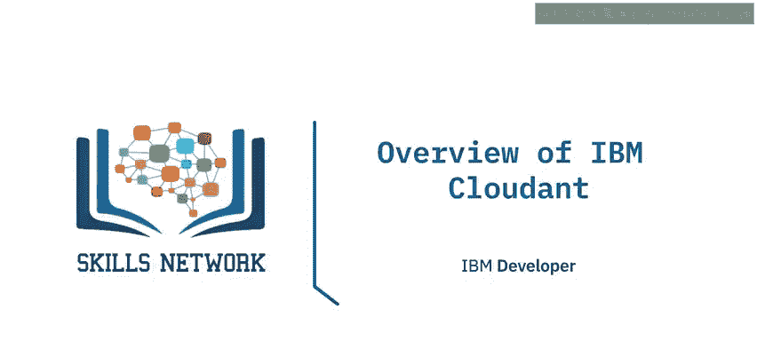

在本节课中，我们将学习IBM Cloudant的基本概念、核心特性以及如何访问它。IBM Cloudant是一个为现代应用设计的托管数据库服务。

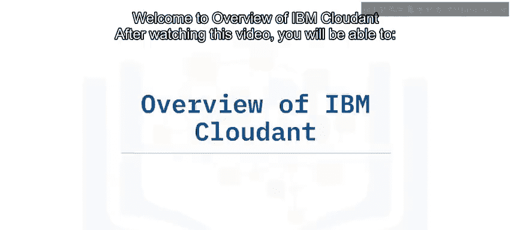

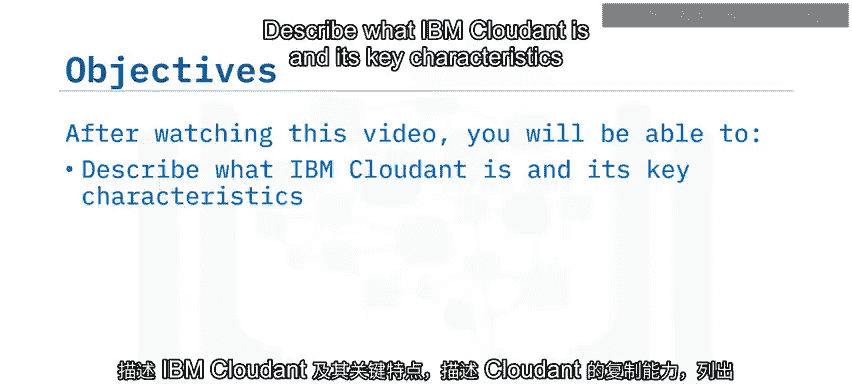

## 概述

IBM Cloudant是一个完全托管的数据库服务，也称为数据库即服务。它基于开源的Apache CouchDB构建，为混合云和多云应用提供数据层支持。

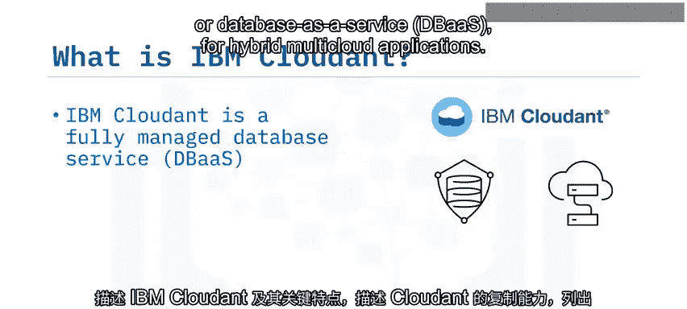

## 核心特性

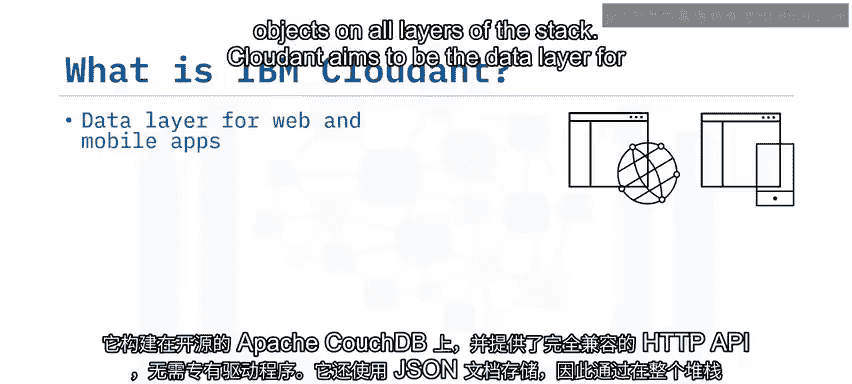

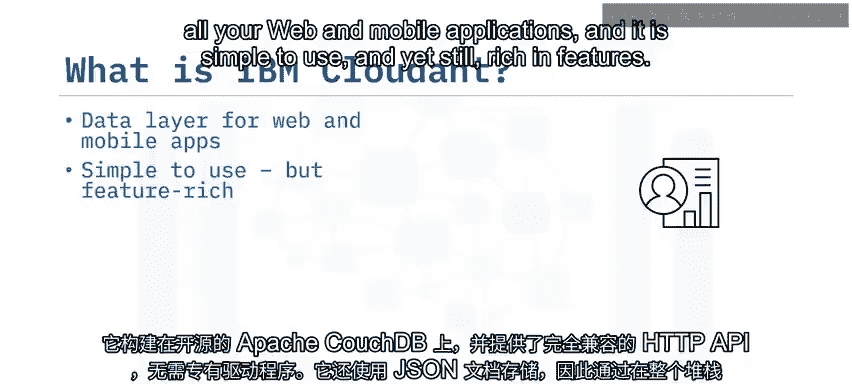

上一节我们介绍了Cloudant的基本定位，本节中我们来看看它的关键特性。

Cloudant旨在成为所有Web和移动应用的数据层，它使用简单但功能丰富。

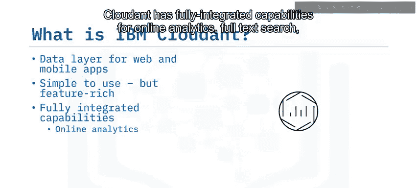

以下是Cloudant的一些核心能力：

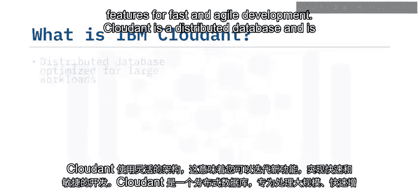

*   **内置高级功能**：Cloudant集成了在线分析、全文搜索、高级地理空间查询和复制功能，无需第三方集成。
*   **灵活模式**：Cloudant使用灵活的模式，这意味着您可以快速迭代新功能，实现敏捷开发。
*   **分布式与高性能**：Cloudant是一个分布式数据库，针对处理Web、移动、物联网和无服务器应用特有的大规模、快速增长的工作负载进行了优化。
*   **完全托管服务**：作为一项有服务等级协议保障的数据库即服务，它没有管理开销。IBM的专家提供全天候的安全托管、监控和维护。

## 复制与兼容性

了解了核心特性后，我们来看看Cloudant强大的数据同步与生态系统兼容性。

Cloudant的复制技术提供了降低可扩展性风险、成本和干扰的选项。其强大的复制协议和API与Apache CouchDB等开源生态系统兼容，也与主流移动和Web开发栈的开源库兼容。

由于Cloudant和CouchDB共享通用的复制协议，开发者可以轻松地将云端数据同步到本地的CouchDB实例。

## 其他关键能力

除了复制，Cloudant还提供其他关键能力以支持复杂应用场景。

以下是这些能力的简要说明：

*   **搜索**：Cloudant Search基于Apache Lucene实现，提供快速、简单的搜索功能。
*   **地理空间查询**：Cloudant Geospatial支持对编码的地理数据结构进行内置空间查询和地图可视化。
*   **离线优先**：结合Cloudant Sync的“离线优先”能力支持移动数据同步，允许用户离线使用本地存储的数据，之后再将数据同步到云端数据库。
*   **多语言支持**：您可以使用特定的语言库或封装器来开发应用，这些工具帮助您更便捷地使用API。

## 如何访问IBM Cloudant

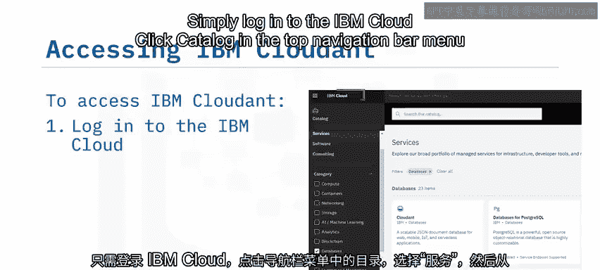

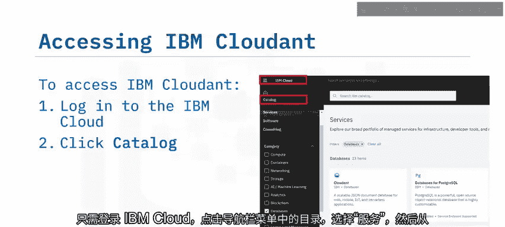

最后，我们来了解如何开始使用IBM Cloudant。

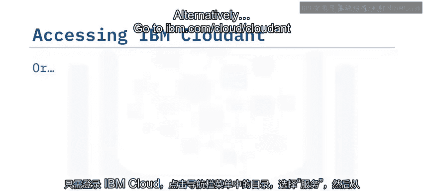

访问Cloudant托管服务非常简单。您只需登录IBM Cloud，在顶部导航栏点击“目录”，选择“服务”，然后从类别列表中选择“数据库”，最后在数据库服务列表中选择“Cloudant”。

或者，您也可以直接访问 `ibm.com/cloud/cloudant` 注册免费试用。此外，您还可以下载Cloudant进行本地安装。

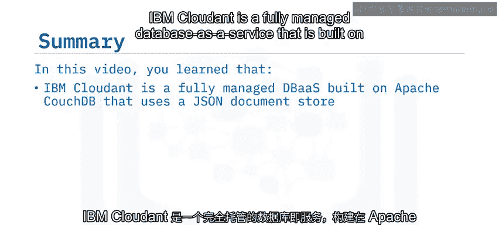

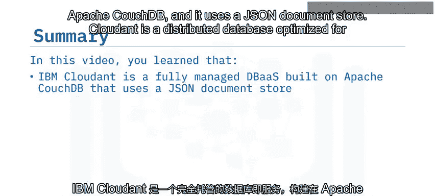

## 总结

本节课中我们一起学习了IBM Cloudant。它是一个基于Apache CouchDB构建的完全托管数据库即服务，使用JSON文档存储。作为一个分布式数据库，它针对Web、移动、物联网和无服务器应用的大规模工作负载进行了优化。

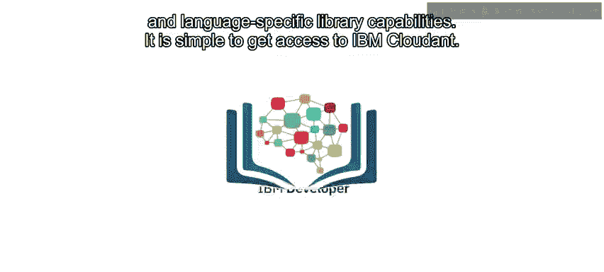

作为一项有SLA保障的DBaaS，它意味着没有管理开销，您的数据库被安全地托管在云端。Cloudant提供了强大的复制协议和API，与许多开源生态系统和库兼容。它提供了搜索、地理空间查询、离线移动访问以及多语言库支持等功能，并且非常易于访问和使用。