# 030：IBM Cloudant 架构与关键技术 🏗️💡


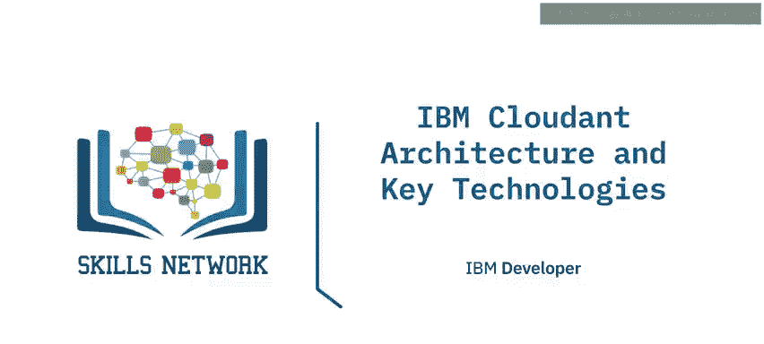

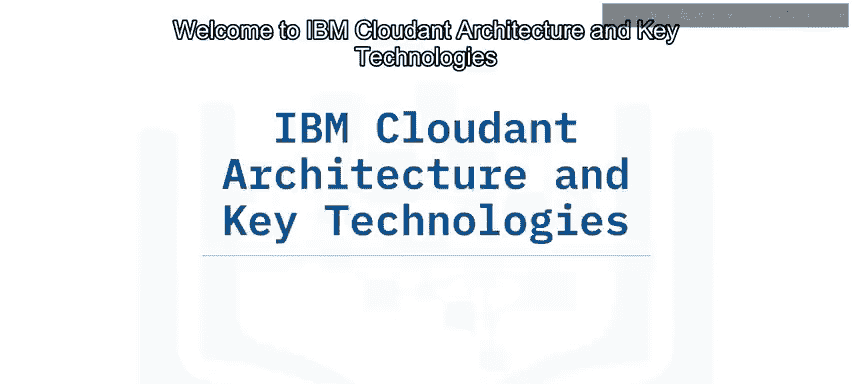

在本节课中，我们将学习IBM Cloudant的云架构及其提供的核心技术组件。我们将了解其全球数据部署、高可用性设计、离线同步能力以及内置的强大功能。

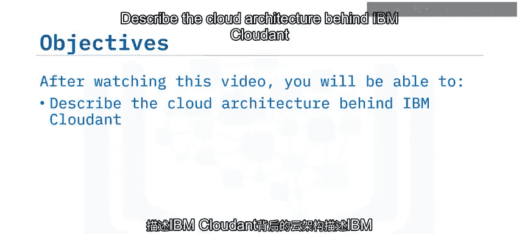

---

## 概述

IBM Cloudant是一个基于文档的NoSQL数据库服务。它提供了全球化的数据部署、高可用性架构以及多项关键技术，旨在支持现代Web和移动应用开发。

---

## IBM Cloudant的云架构 🌐

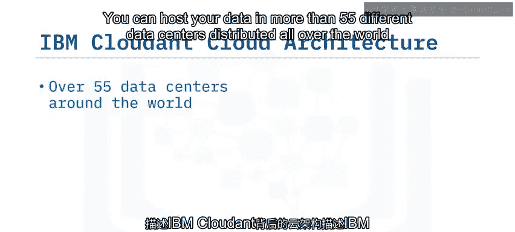

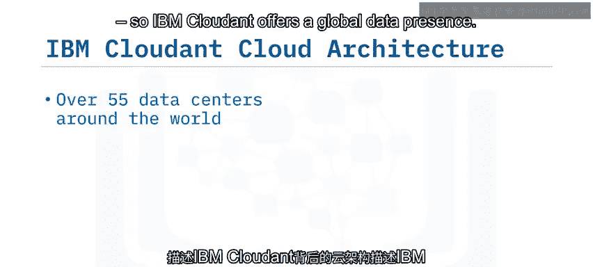

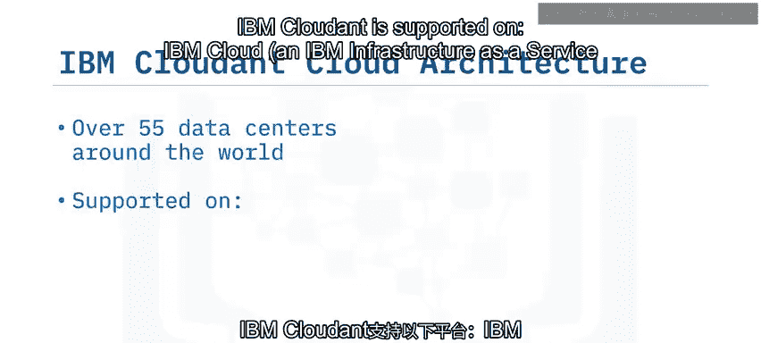

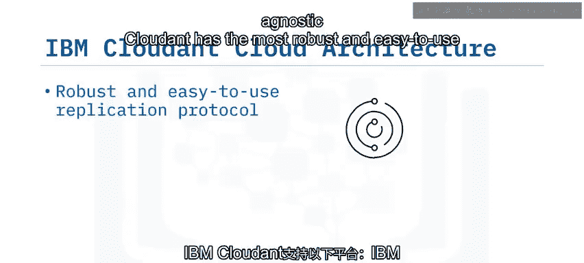

上一节我们介绍了NoSQL数据库的基本概念，本节中我们来看看IBM Cloudant背后的具体云架构。

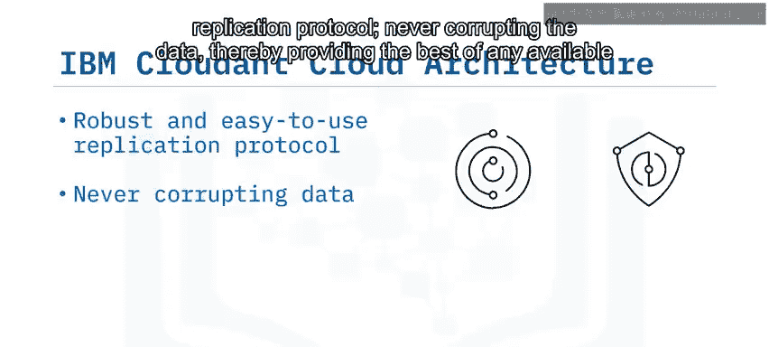

IBM Cloudant的架构设计旨在提供全球数据存在、高可用性和最优性能。

以下是其架构的关键特点：

*   **全球数据部署**：您可以将数据托管在全球超过55个不同的数据中心。
*   **云平台无关性**：Cloudant支持IBM Cloud、IBM基础设施即服务、Rackspace、Microsoft Azure和Amazon Web Services等多个云平台。
*   **数据复制与完整性**：Cloudant拥有稳健且易用的复制协议，确保数据永不损坏，并提供最佳的数据可用性。数据在数据中心之间复制，实现全球可用。
*   **集群与高可用性**：所有Cloudant实例都部署在跨越区域可用区的集群上，以增强持久性，且不向组织收取额外费用。如果一个数据中心离线，请求将被路由到另一个活跃的数据中心，从而提供高可用性、灾难恢复以及最优性能。
*   **智能请求路由**：用户请求根据网络延迟（ping时间）被路由到最快的数据中心，而不仅仅是地理上最近的数据中心。

---

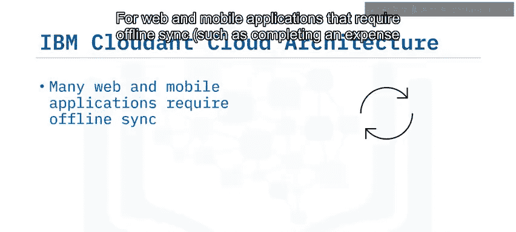


## 关键技术组件 ⚙️

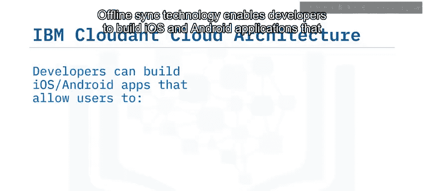

了解了其全球架构后，我们来看看IBM Cloudant提供的具体技术组件，这些组件使其成为一个强大的操作型数据存储。

### 作为操作型数据存储

Cloudant非常适合任何Web或移动应用程序。它是一个基于文档的NoSQL数据库，**并非**像Hadoop那样的数据仓库。

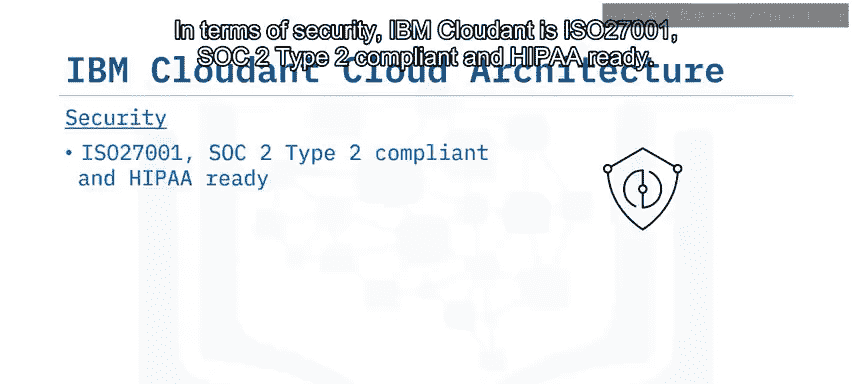

### HTTP API

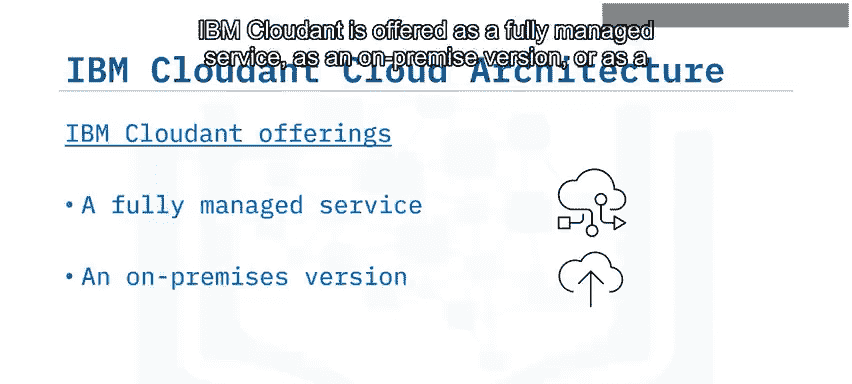

Cloudant使用一个简单且定义良好的HTTP API，其工作方式类似于RESTful Web服务。它旨在融入现代架构，并能无缝集成到面向服务的架构中，无需构建抽象层。您可以在您选择的云中部署数据库。

**代码示例：通过HTTP API交互**
您可以通过浏览器或`curl`命令与数据交互，返回JSON格式的数据。
```bash
curl https://<your-account>.cloudant.com/<database>/<document-id>
```

### 数据索引与处理

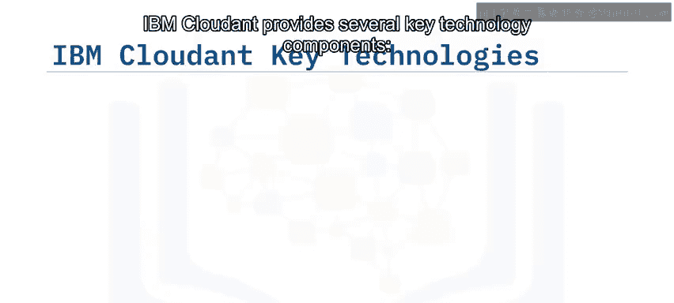

Cloudant提供了多种不同的方式来索引和处理数据。

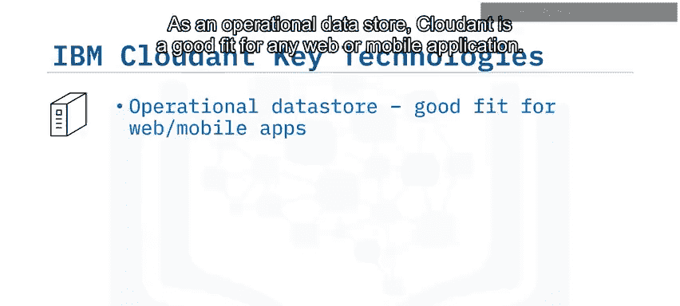

*   **MapReduce**：这是一种高效处理大型数据集的方式，非常适合进行实时分析。
*   **全文搜索**：搜索引擎功能非常受Web和移动应用开发者的欢迎。许多应用程序在底层进行异步调用，以对数据进行全文即席搜索。与其他需要集成第三方搜索引擎（如基于Lucene的Elasticsearch或Apache Solr）的数据库服务不同，Cloudant在数据库服务（包括本地部署版本）中完全内置了全文搜索功能。
*   **地理空间（Geospatial）**：此功能非常适合涉及石油、天然气或运输（例如卫星和运输车辆）的应用程序。

### 复制与同步

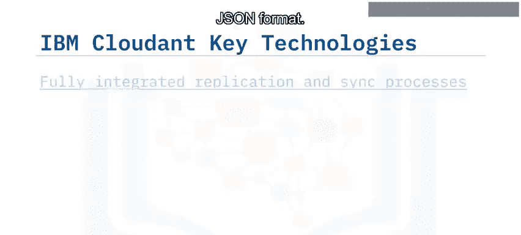

Cloudant拥有完全集成的复制和同步功能。对于需要离线同步的Web和移动应用程序（例如离线填写费用报告或销售订单），Cloudant使用与浏览器中现有通用库或Cloudant提供的库兼容的复制协议。离线同步技术使开发人员能够构建iOS和Android应用程序，允许用户连接互联网并复制数据以供离线使用，在离线时更新数据，并在重新上线时同步数据。

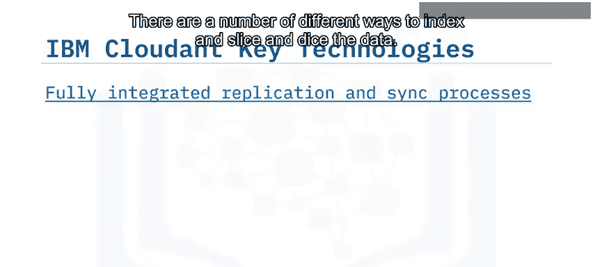

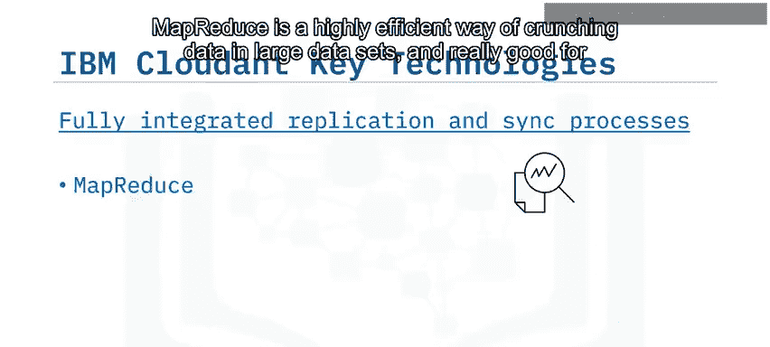

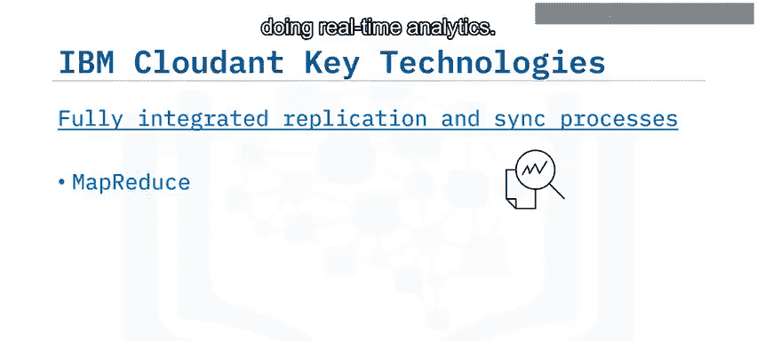

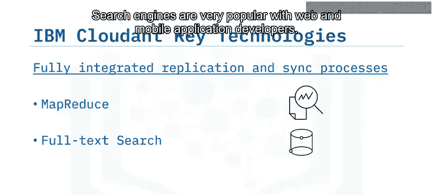

### 安全性 🔒

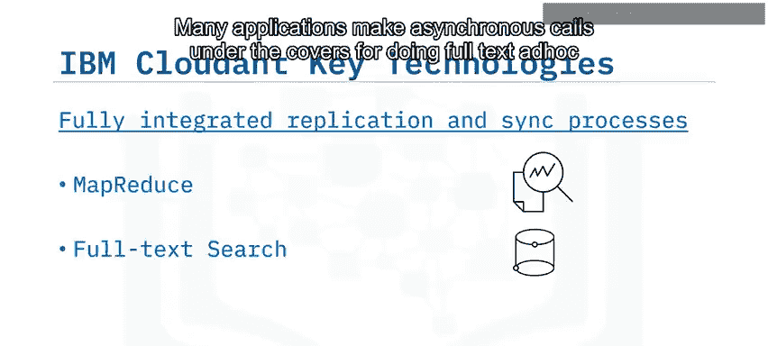

在安全性方面，IBM Cloudant符合ISO 27001、SOC2 Type2标准，并支持HIPAA。所有数据都经过加密，无论是静态数据还是在网络中传输的数据。此外，还通过IBM Key Protect提供可选的用户自定义加密密钥管理服务。该服务与IBM身份和访问管理集成，可在API级别进行精细的访问控制。

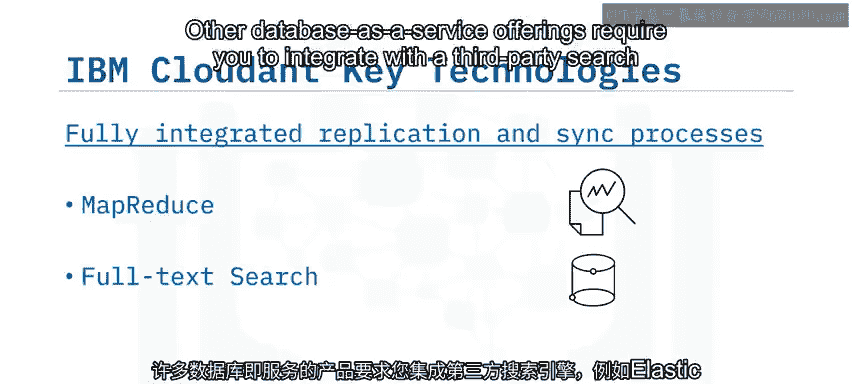

### 部署模式

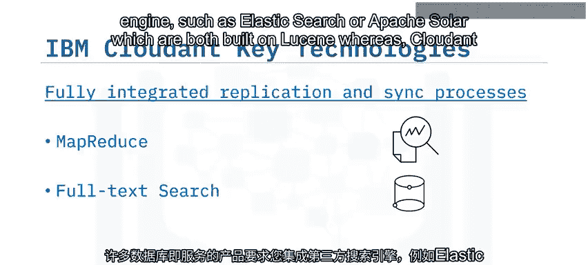

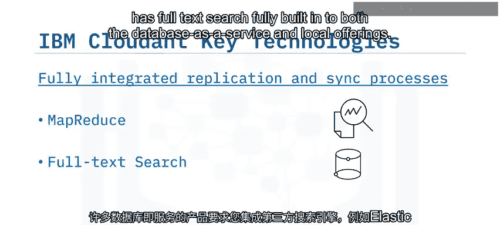

IBM Cloudant可以作为完全托管服务、本地部署版本或混合云部署提供。

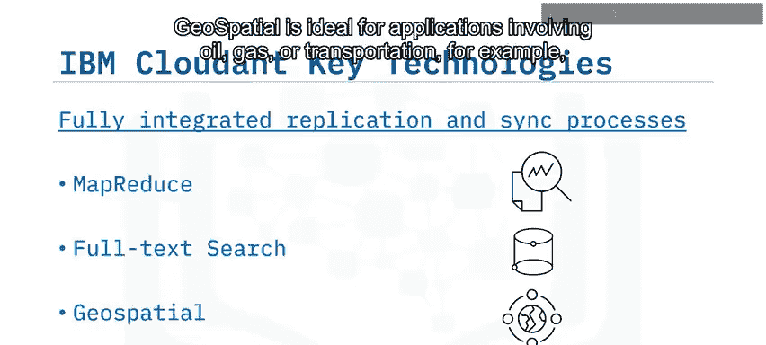

### 管理仪表板

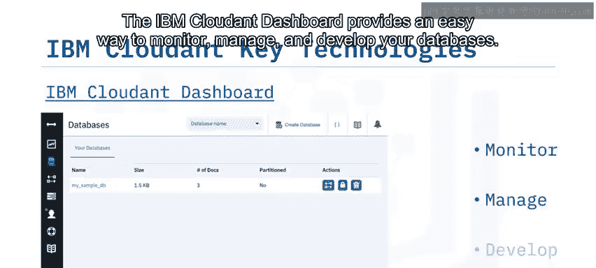

IBM Cloudant仪表板提供了一种简单的方法来监控、管理和开发您的数据库。

---

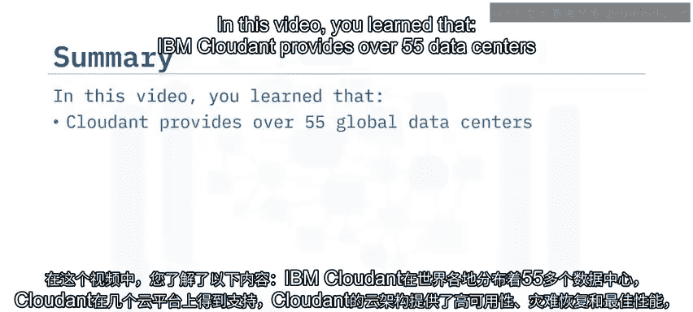

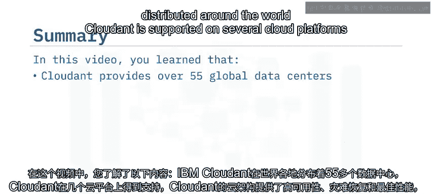

## 总结

本节课中，我们一起学习了IBM Cloudant的核心架构与关键技术。

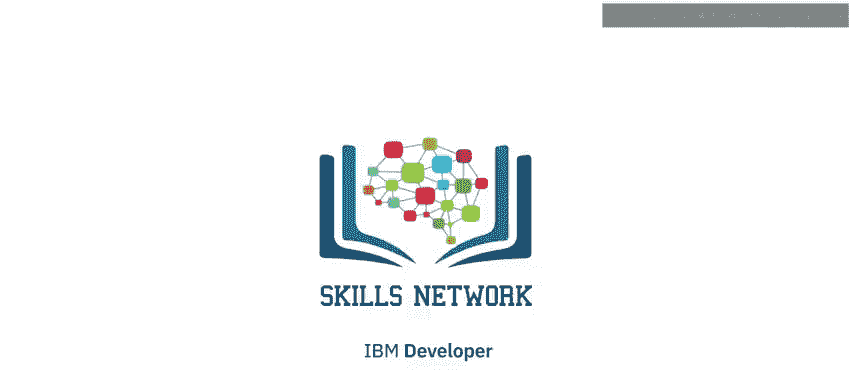

我们了解到：
1.  IBM Cloudant通过全球超过55个数据中心提供分布式数据服务。
2.  它支持多个云平台，其云架构提供了高可用性、灾难恢复和最优性能。
3.  Cloudant为Web和移动应用程序提供了离线同步能力。
4.  它可以作为完全托管服务、本地部署或混合云部署提供。
5.  Cloudant包含多个关键技术组件，如定义良好的HTTP API、MapReduce、全文搜索和地理空间功能，以及一个用于监控、管理和开发NoSQL数据库的集成仪表板。