# 031：Cloudant 优势与解决方案

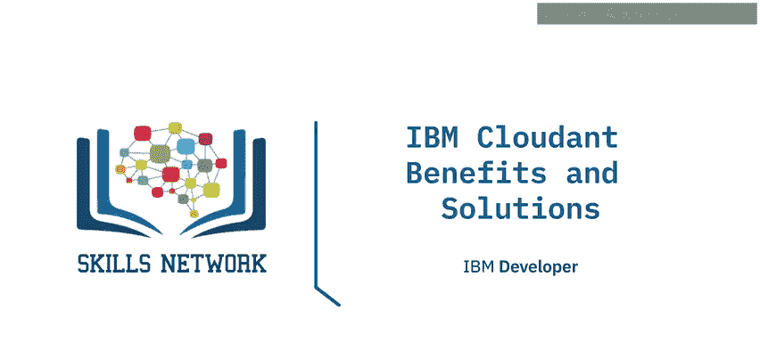

在本节课中，我们将学习IBM Cloudant的核心优势、它能解决的数据挑战以及典型的应用场景。学完本课后，你将能够描述IBM Cloudant的关键优势，解释它能应对的挑战，并了解其常见的用例。

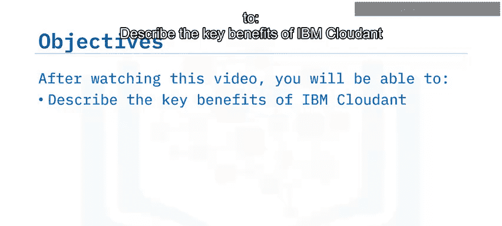

---

## 🚀 IBM Cloudant的关键优势

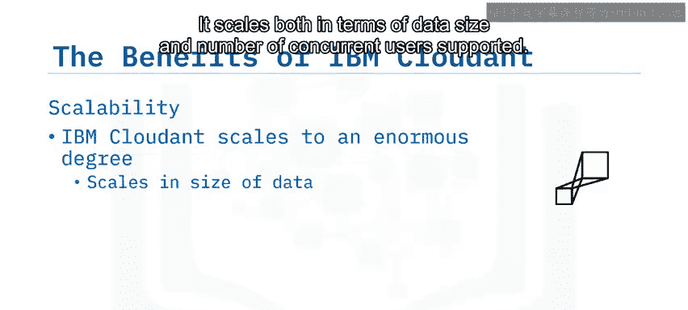

IBM Cloudant作为一个托管的NoSQL数据库服务，提供了多项关键优势，使其成为现代应用开发的理想选择。

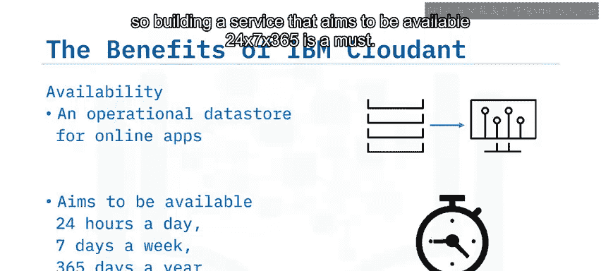

### 1. 卓越的可扩展性
Cloudant能够实现极高程度的扩展，无论是数据规模还是支持的并发用户数。它适用于初创公司处理1GB数据和10个并发用户的应用，也同样适用于拥有多个应用、存储PB级数据并支持2000万并发活跃用户的企业级组织。Cloudant允许根据需求灵活地向上或向下扩展。

### 2. 持续可用性
Cloudant是一个为在线应用设计的运营数据存储。构建一个旨在实现**365天、24/7**不间断可用的服务是必须的，而Cloudant正是为此而生。

### 3. 数据持久性与分区容错性
Cloudant致力于永不丢失数据。它通过在独立的物理节点上存储数据的多个副本来实现这一目标。为了满足最严格的高可用性和灾难恢复要求，Cloudant具备分区容错性，能够处理集群中的节点故障，甚至是整个数据中心的中断。

### 4. 在线升级与离线访问
Cloudant经过独特设计，可以在运行中进行补丁或升级，无需停机。集群可以在不使客户数据库离线的情况下完成升级。此外，它提供在线和离线访问功能，这对于在连接不稳定的场景（例如偏远地区或飞机上）中尤为理想。

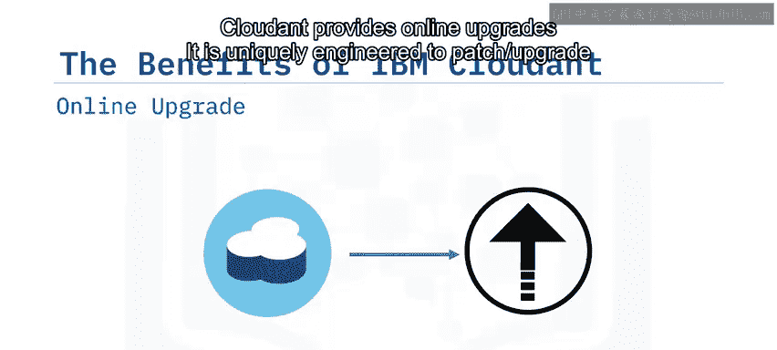

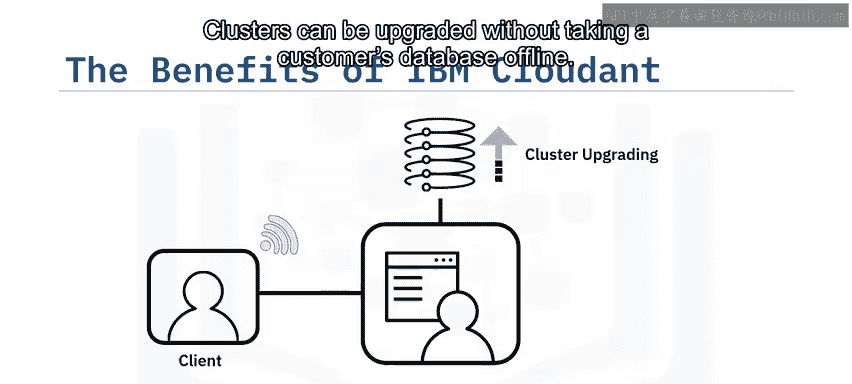

---

## 🛠️ Cloudant解决的数据挑战

许多客户依赖Cloudant来解决数据层的各种挑战。以下是它能够应对的几个核心问题：

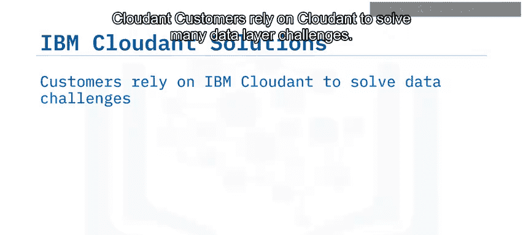

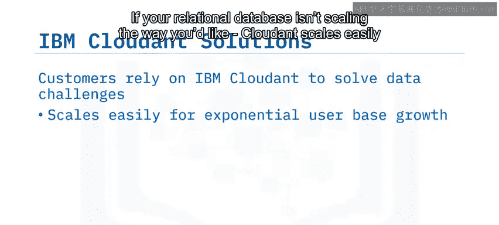

*   **关系型数据库扩展困难**：如果你的关系型数据库无法按预期扩展，Cloudant可以轻松应对指数级增长的用户群。
*   **自建数据库成本高昂**：在预算、时间和运维技能有限的情况下，自行开发和托管数据库被证明是一项挑战。Cloudant有助于降低这些成本。
*   **应用开发初期需求不明确**：有时你可能在尚未完全明确容量需求的情况下从头开始构建应用。Cloudant为应用开发提供了一种简单快捷的方式。

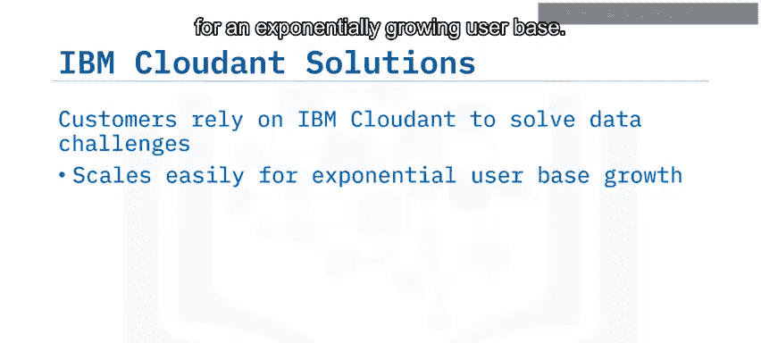

---

## 🗃️ Cloudant的文档数据库架构

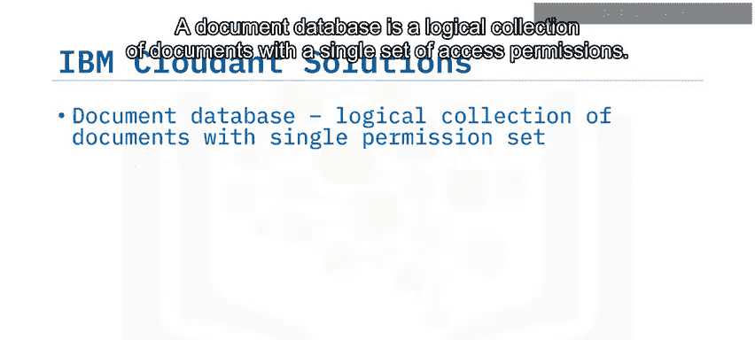

上一节我们了解了Cloudant能解决的挑战，本节中我们来看看它的核心数据模型。

Cloudant使用文档数据库。一个文档数据库是具有单一访问权限集的文档的逻辑集合。在Cloudant中，文档以流行的**JSON格式**存储，并采用灵活的Schema。

文档被组织到数据库中，主要有两个原因：
1.  **安全访问控制**：你可以在数据库级别应用访问角色（如读、写、管理、复制）。
2.  **查询效率**：你无法通过单个API调用跨数据库进行索引或查询。

你的集群可以容纳任意数量的数据库。

---

## ⚙️ Cloudant的集群与高可用性机制

了解了数据模型后，我们进一步探讨Cloudant如何通过集群架构实现高可用性。

当你注册Cloudant账户时，会有实际的物理服务器为你工作。Cloudant运行在由负载均衡器和数据库节点组成的服务器集群上。

以下是其核心工作机制：

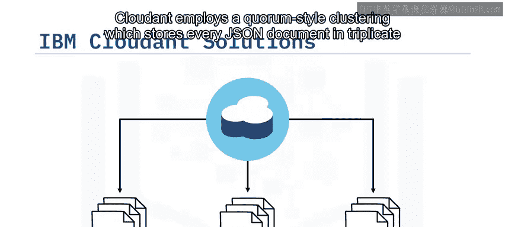

*   **水平可扩展与自动分片**：Cloudant是水平可扩展的，意味着你可以将数据库分布在集群中。它会自动将数据分片（`autoshards`）并均匀分布在集群节点上，无需像关系型数据存储那样手动分发数据。
*   **灵活的容量规划**：你可以从少量节点开始，随着数据增长，让Cloudant运行脚本来管理数据以保持其可用性。这意味着你无需提前进行大量容量规划，因为Cloudant可以轻松适应你不断增长的数据需求并保持性能。
*   **数据复制与仲裁集群**：数据在集群内的服务器之间复制以保持同步，无需管理干预。Cloudant采用**仲裁式集群**，将每个JSON文档存储三份副本，分别放在三个独立的物理节点上。
*   **负载均衡与故障恢复**：当你的应用读写数据时，Cloudant使用负载均衡器将读写请求均匀分布在集群中。因此，如果一个节点发生故障，数据仍然可以在另一个节点上可用。

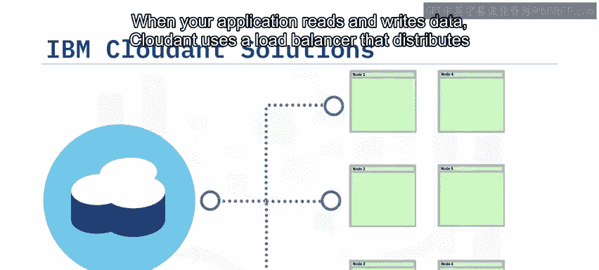

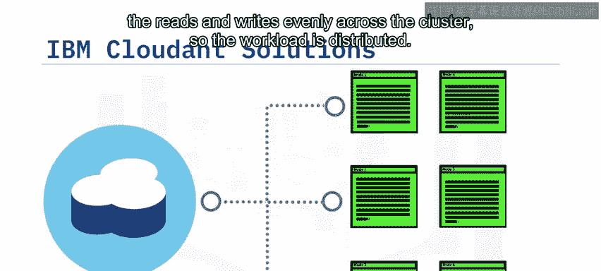

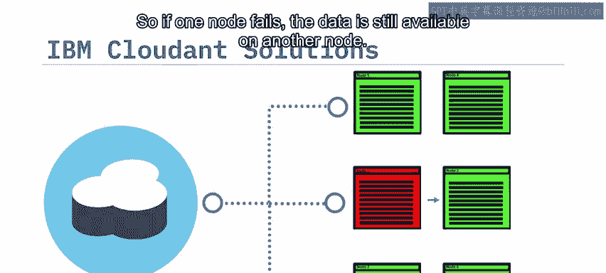

---

## 💡 Cloudant的典型用例

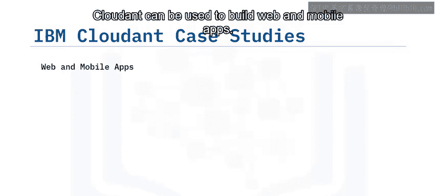

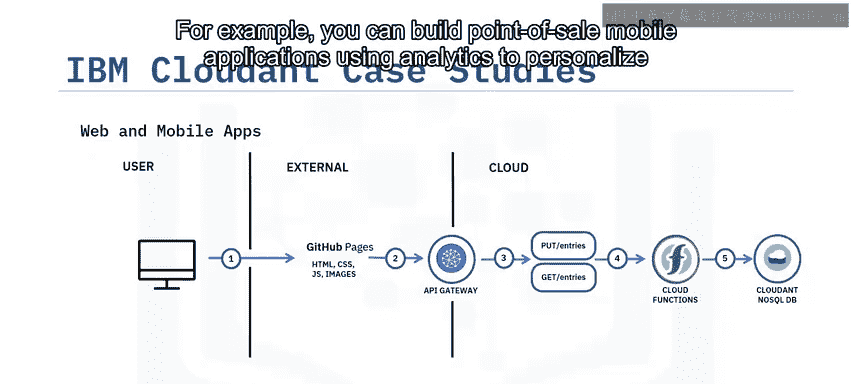

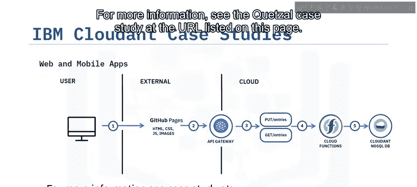

基于上述优势与架构，Cloudant在多个领域都有广泛应用。

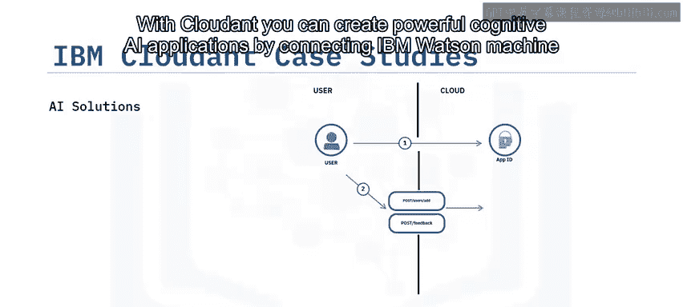

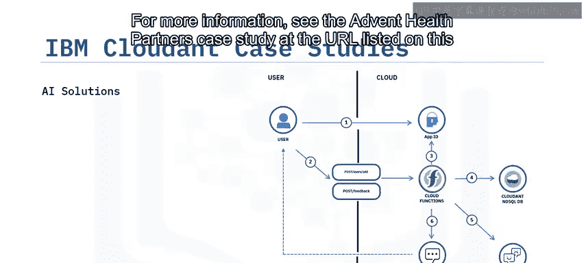

以下是几个典型的应用场景：

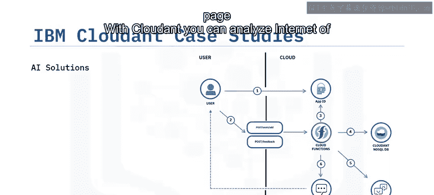

*   **构建Web和移动应用**：例如，可以使用分析功能构建销售点移动应用，以个性化购物体验。
*   **创建强大的认知AI应用**：通过将IBM Watson机器学习连接到存储在Cloudant中的数据来实现。
*   **分析物联网传感器数据**：利用Cloudant灵活的Schema来存储物联网传感器数据，以追踪端到端的货物运输并检测异常。

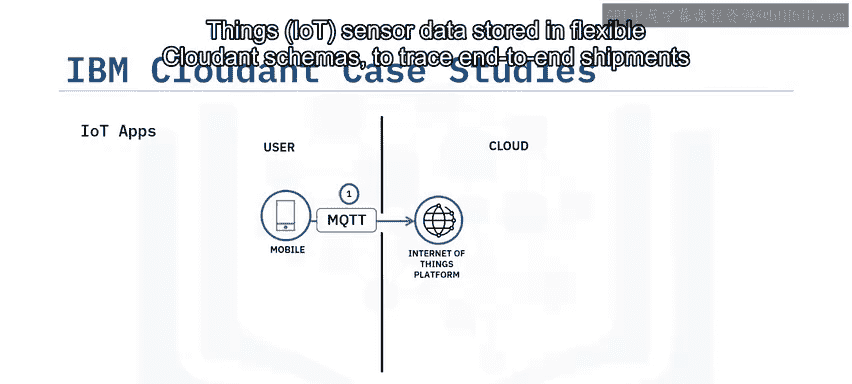

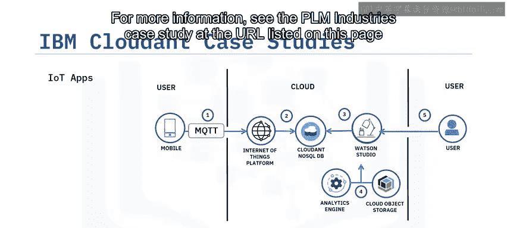

---

## 📝 课程总结

本节课中，我们一起学习了IBM Cloudant的核心知识。

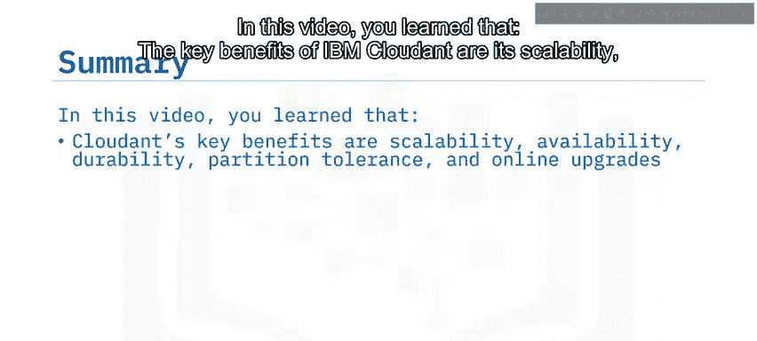

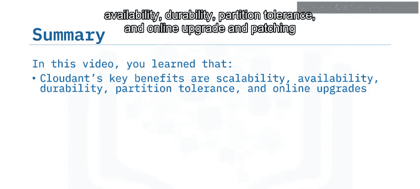

我们了解到IBM Cloudant的关键优势在于其**可扩展性、可用性、持久性、分区容错性以及在线升级和打补丁的能力**。它能解决指数级用户增长、成本上升以及内部开发、托管和管理数据库所需的时间和技能等数据挑战。Cloudant使用文档数据库来提升安全性和查询效率，并运行在云端的集群服务器上。其典型用例包括构建Web和移动应用、AI解决方案以及分析物联网传感器数据。