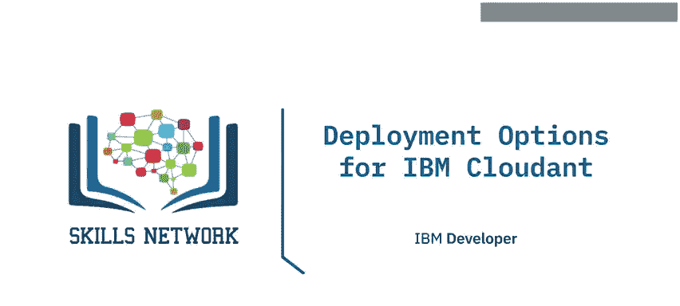
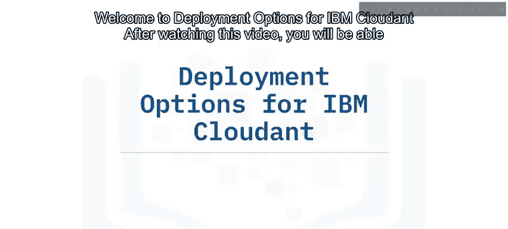
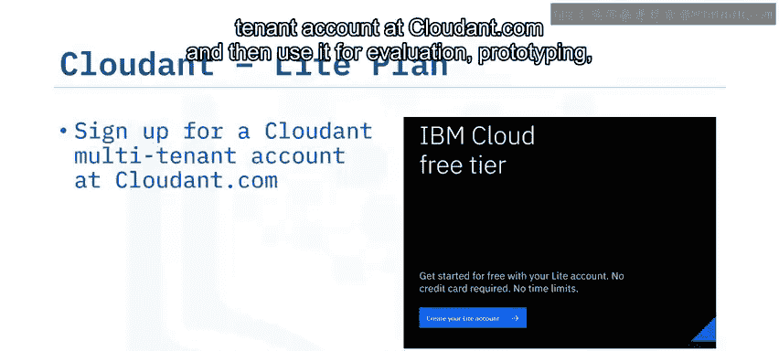
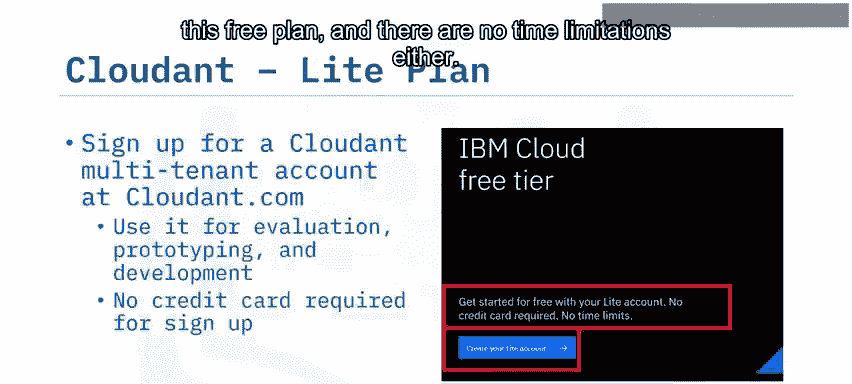
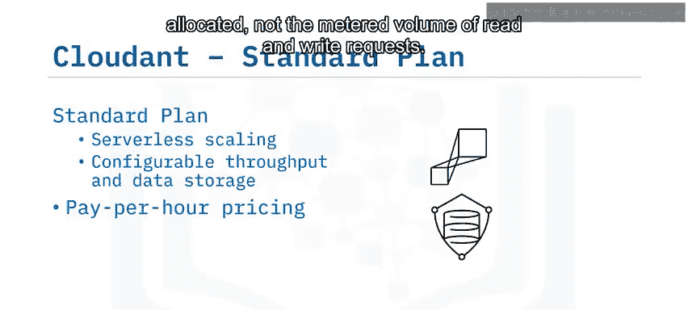
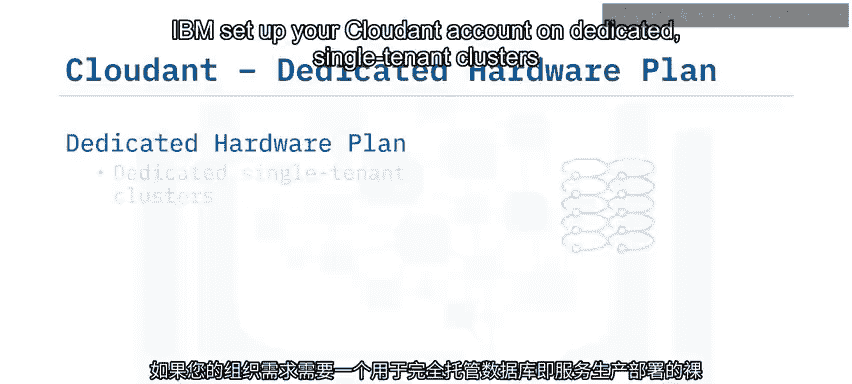
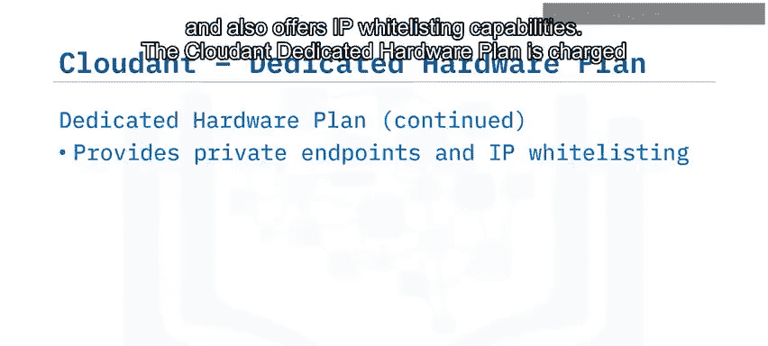

# 032：IBM Cloudant 部署选项详解

在本节课中，我们将学习IBM Cloudant数据库服务的不同部署方案。我们将详细介绍免费版、标准版和专用硬件版三种计划，帮助你根据不同的应用场景和需求，选择最合适的部署方式。

---

## 🆓 免费版计划

上一节我们了解了Cloudant的三种主要部署计划，本节中我们首先来看看免费版计划。

免费版计划，也称为“轻量版”计划，适用于评估、原型设计和开发阶段。注册此计划无需信用卡，且没有时间限制。

以下是免费版计划的核心特点：

*   **功能完整**：提供IBM Cloudant的全部功能，用于评估和开发。
*   **固定资源限制**：
    *   吞吐量容量固定为：每秒**20次读取**、每秒**10次写入**、每秒**5次全局查询**。
    *   单个JSON文档的最大尺寸限制为**1 MB**。
*   **服务保留策略**：如果您的轻量版环境连续**30天**处于非活动状态，相关服务将被删除。

---

## 💼 标准版计划

了解了适用于开发测试的免费版后，我们来看看面向生产环境的部署选项。如果您的组织需要一个完全托管且可配置的数据库即服务生产部署，可以选择Cloudant标准版计划。

标准版计划提供无服务器扩展的吞吐量和数据存储能力，您可以根据应用程序需求的变化进行配置。

以下是标准版计划的核心特点：

*   **弹性扩展**：您可以按需增加吞吐量块。每个块包含：
    *   每秒**100次读取**
    *   每秒**50次写入**
    *   每秒**5次全局查询**
*   **按小时计费**：
    *   费用基于**分配的吞吐量容量**（`provisioned_throughput_capacity`）计算，而非实际处理的读写请求量。
    *   包含**20 GB**的免费数据存储空间，超出部分按定义的每GB每小时费率计费（`additional_storage_cost_per_gb_per_hour`）。

---

## 🔒 专用硬件版计划

标准版计划提供了灵活的云上生产部署，但如果您的组织需求需要为完全托管的数据库即服务生产部署提供裸机专用环境，则应选择Cloudant专用硬件版计划。

专用硬件版计划是标准版计划的一个可选附加项，用于在其上运行一个或多个标准版实例。

以下是专用硬件版计划的核心特点：

*   **专属环境**：IBM在您选择的IBM Cloud、Rackspace、Amazon或Azure数据中心内，于专用的单租户集群上设置您的Cloudant账户。
*   **优势**：受益于硬件隔离、更高的安全性和更好的合规性。
*   **网络与安全**：
    *   除公共端点外，还包含**私有端点**。
    *   提供**IP白名单**功能。
*   **计费方式**：
    *   作为周期性月费收取，费用基于集群中的服务器数量（`monthly_fee_per_server`）。
    *   此固定费用**附加于**部署在其上的标准版实例的消费定价。
    *   采用每日按比例计费，并有**一个月的最低时长收费**。
*   **合规性**：该计划在所有IBM Cloud位置可用。位于美国的客户还可以选择符合**HIPAA**标准的配置，以提升合规性。

---

## 📝 课程总结

本节课中，我们一起学习了IBM Cloudant的三种主要云部署方案。

*   **免费版计划**适用于评估和开发环境，但提供的吞吐量容量和数据存储有限。
*   **标准版计划**在按小时计费的基础上，提供无服务器扩展的吞吐量和数据存储。定价基于分配的吞吐量容量和存储的数据量。
*   **专用硬件版计划**建立在专用的单租户集群上，是一个可选附加项，用于运行您的一个或多个标准版实例，提供一个隔离且安全的专用环境。

通过理解这些选项，您可以根据项目的具体阶段（开发、测试、生产）以及对性能、安全性和成本的要求，做出明智的部署决策。