# 034：在Cloudant中使用数据库

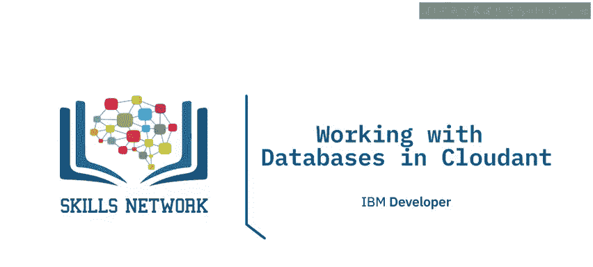

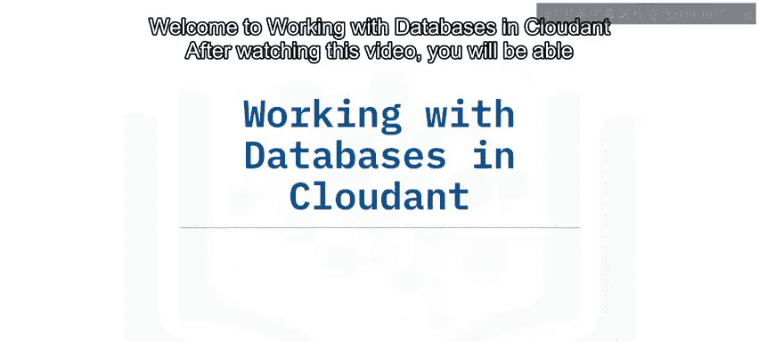

在本节课中，我们将学习如何在IBM Cloudant中创建和使用数据库。我们将了解分区数据库与非分区数据库的区别，掌握创建数据库的方法，并学习如何对Cloudant数据库中的文档进行插入、查看、查询、更新和删除操作。

## 🗂️ 数据库类型：分区与非分区

在IBM Cloudant中，您可以创建和使用两种类型的数据库：**非分区数据库**和**分区数据库**。

上一节我们介绍了课程概述，本节中我们来看看这两种数据库的核心区别。

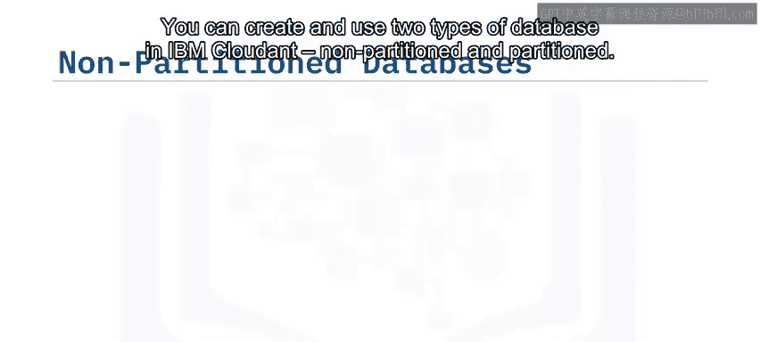

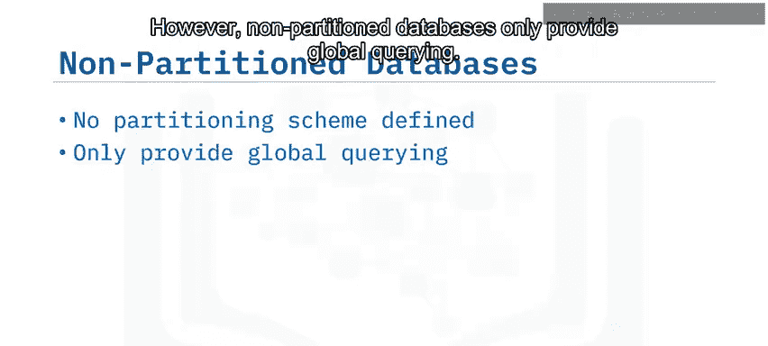

### 非分区数据库

非分区数据库是一种较早期的Cloudant数据库类型，也用于早期版本的IBM Cloudant和CouchDB。在这种数据库中，无需定义分区方案，因此使用起来相对简单。

然而，非分区数据库只支持**全局查询**。

在非分区数据库中，文档会根据其文档ID的转换结果，随机分布到不同的分片上。因此，文档ID与其最终所在的分片之间没有实际关联。实际上，具有相似文档ID的文档不太可能位于同一个分片上。

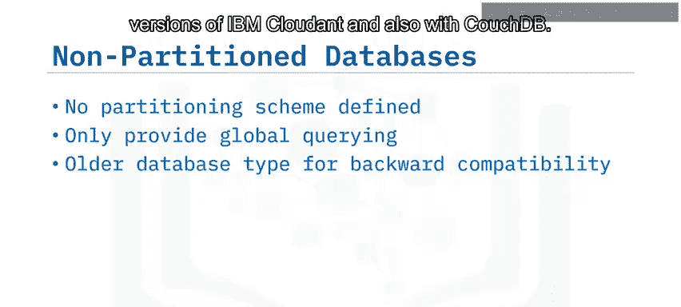

### 分区数据库

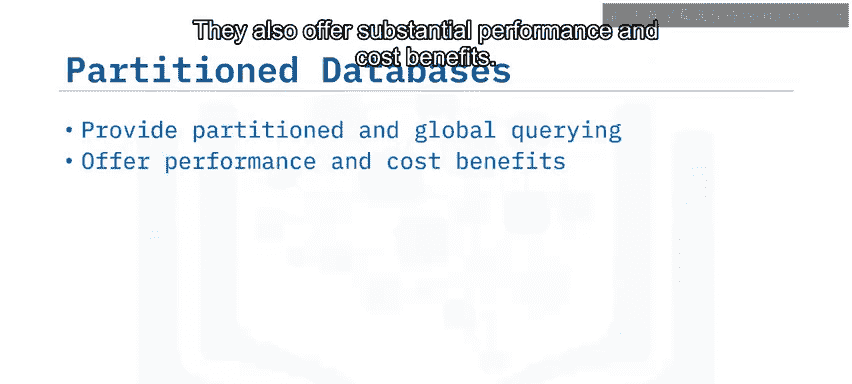

分区数据库则同时支持**分区查询**和**全局查询**，并能提供显著的性能和成本优势。

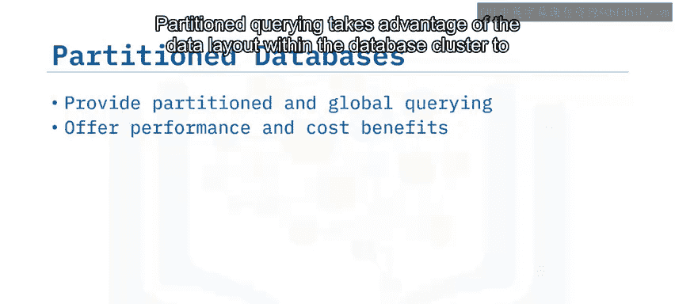

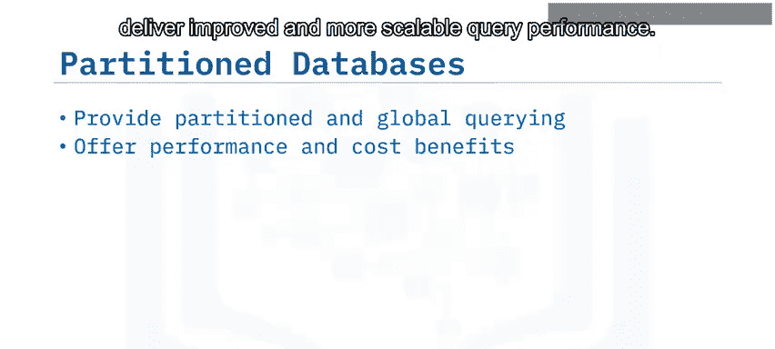

分区查询利用了数据库集群内的数据布局，从而提供更好、更具扩展性的查询性能。分区查询通常也比全局查询成本更低。

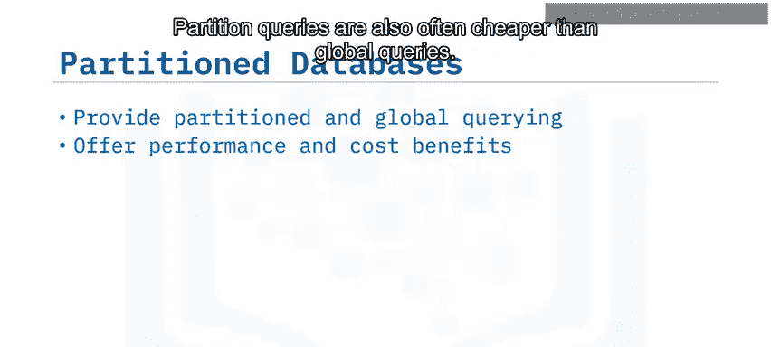

分区数据库是Cloudant中较新的数据库类型，但它要求您为数据指定逻辑分区。分区数据库中的每个文档都需要一个**分区键**。分区是文档的逻辑分组，所有文档都被分配到一个分区中，通常多个文档会共享相同的分区键。

如果您的数据模型允许对文档进行逻辑分区，强烈建议您使用分区数据库，以获得最佳的长期性能。

需要注意的是，**无法更改现有数据库的分区类型**。

## 🛠️ 创建数据库

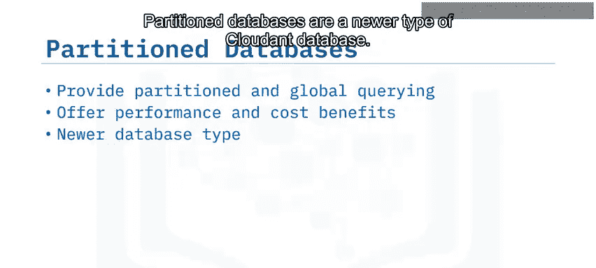

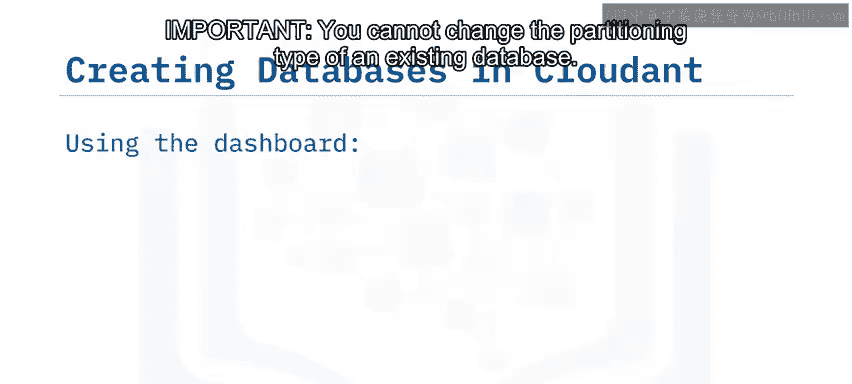

您可以在Cloudant仪表板的“数据库”选项卡中创建新数据库。

以下是创建数据库的步骤：
1.  选择创建新数据库。
2.  必须选择数据库是**分区**还是**非分区**。
3.  这是创建数据库前唯一需要配置的选项。

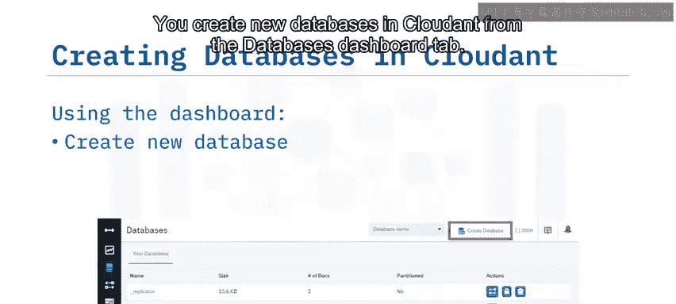

已创建的数据库会显示在数据库仪表板选项卡上。列表会显示名称信息、每个数据库的大小、每个数据库包含的文档数量以及数据库是否为分区数据库。

## 📄 Cloudant文档的特性

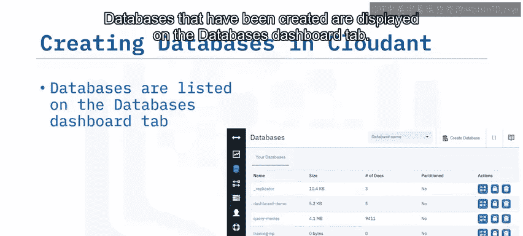

许多其他数据库系统将数据存储在表中，数据包含在行中，每行都有相同的固定列，并且每个表的模式是预定义的。需要仔细定义列名、数据类型、值约束以及与其他表的关系的列表。

但在Cloudant中，情况则大不相同。我们已经讨论过，Cloudant是一种使用JSON文档存储的文档数据库。因此，您的Cloudant实例拥有称为“数据库”的集合，而不是“表”，每个数据库将包含许多文档。

一个Cloudant文档必须是一个**JSON对象**，它必须以花括号 `{}` 开始和结束，并包含许多键值对属性。

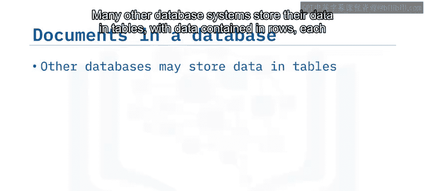

JSON对象必须小于1MB，并且可以包含任意数量的字符串、数字、布尔值、数组和嵌套对象。

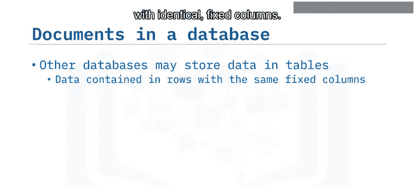

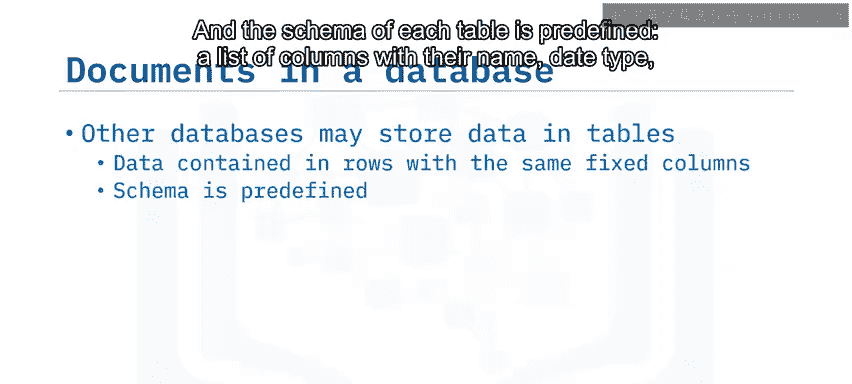

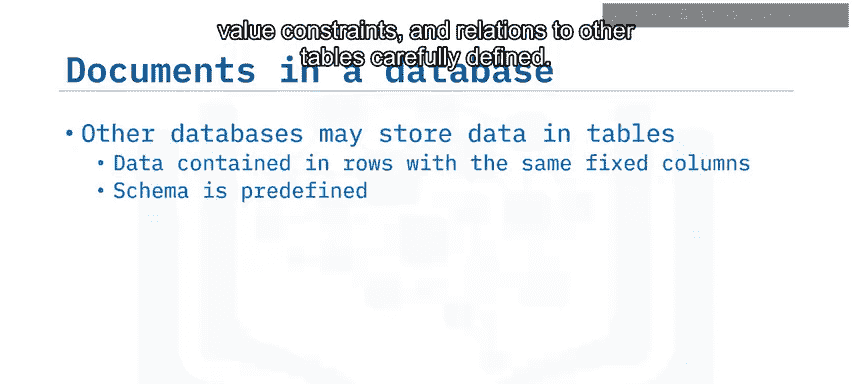

## 📝 文档的基本操作

上一节我们介绍了Cloudant文档的结构，本节中我们来看看如何对文档进行增删改查。

### 插入文档

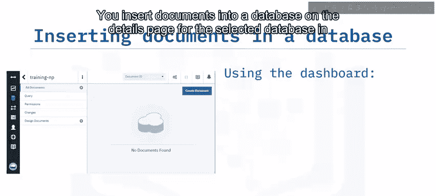

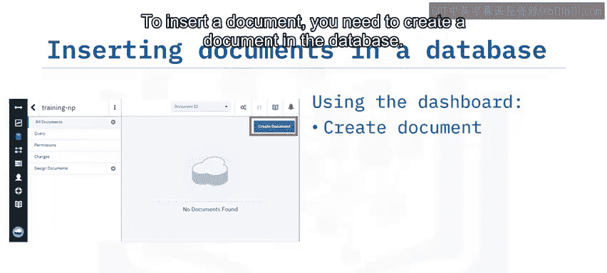

您可以在Cloudant仪表板中选定数据库的详细信息页面上，将文档插入数据库。

插入文档时，需要使用起始和结束花括号 `{}`，并且需要使用系统提供的 `_id` 或提供您自己的自定义 `_id`。Cloudant使用 `_id` 键来唯一标识一个文档，它相当于关系数据库中的主键。

然后，您可以通过在花括号之间手动输入或从其他来源粘贴来填充文档详细信息，最后创建文档以将其插入数据库。

### 查看文档

当您选择一个数据库时，可以通过三种不同的视图查看其中包含的文档。

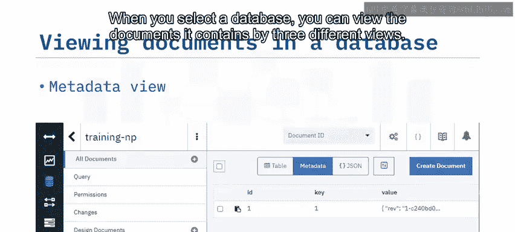

**元数据视图**：这是将文档插入数据库后的默认视图，此视图显示每个文档的ID、键和值信息。

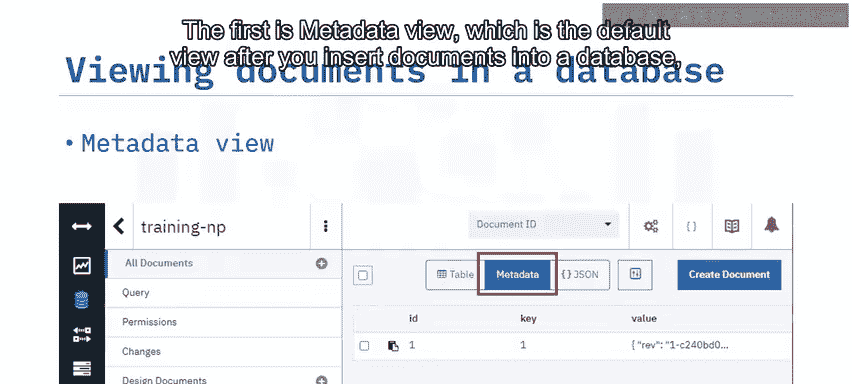

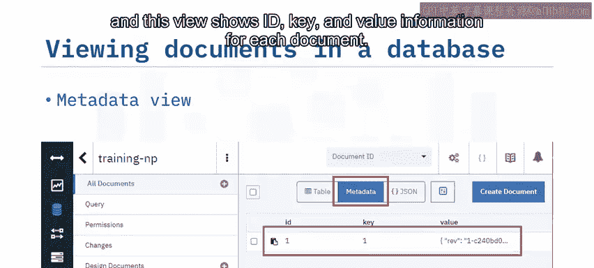

**表格视图**：显示数据库中每个文档的数据表信息。例如，在此示例中，我们可以看到ID、卧室数量、价格和平方英尺的表格数据。

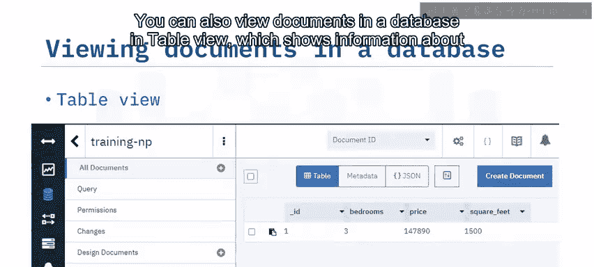

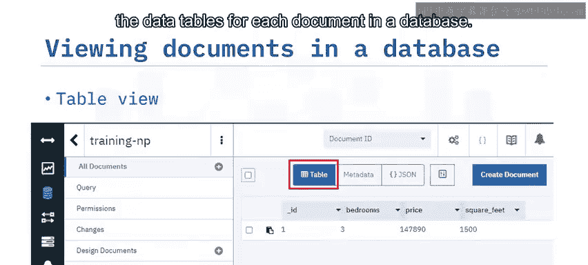

**JSON视图**：以JSON格式显示文档的内容。您也可以从这里编辑JSON文档。

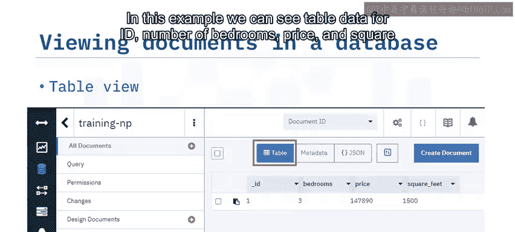

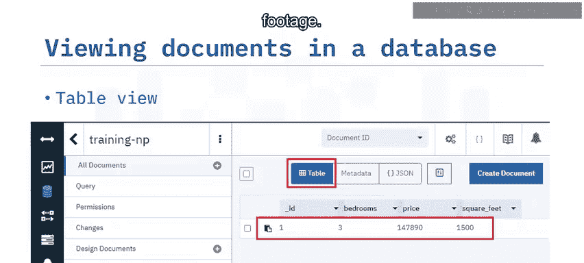

### 查询文档

您可以对数据库中的文档运行查询。在查询窗口中输入查询语句，然后运行查询即可。

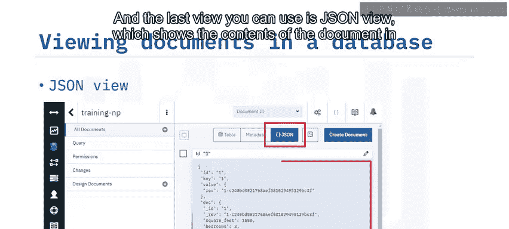

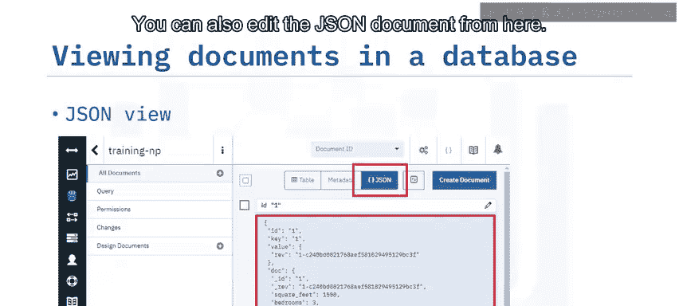

### 更新文档

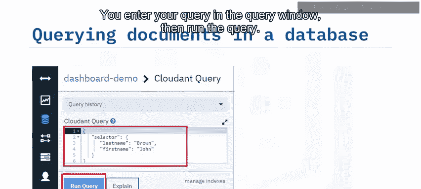

您可以更新数据库中文档的数据。只需选择一个文档，进行所需的更改，然后保存更改。

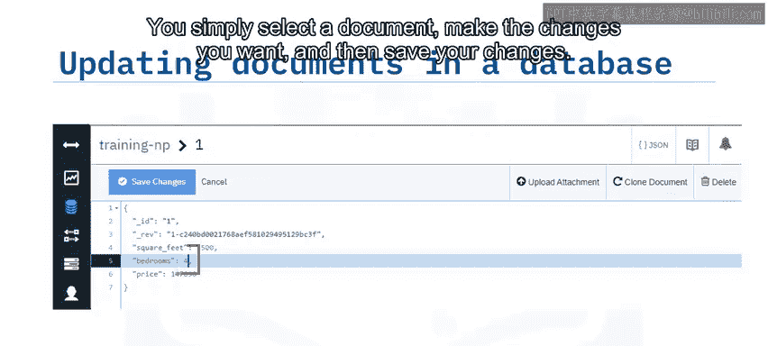

### 删除文档

您也可以使用Cloudant仪表板从数据库中删除文档。只需选择文档，将其删除，并确认删除操作即可。

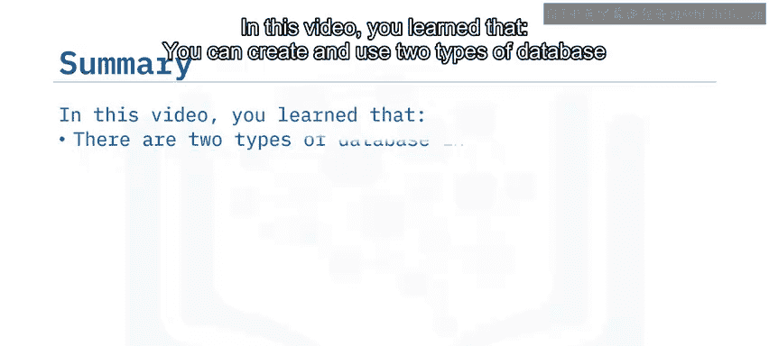

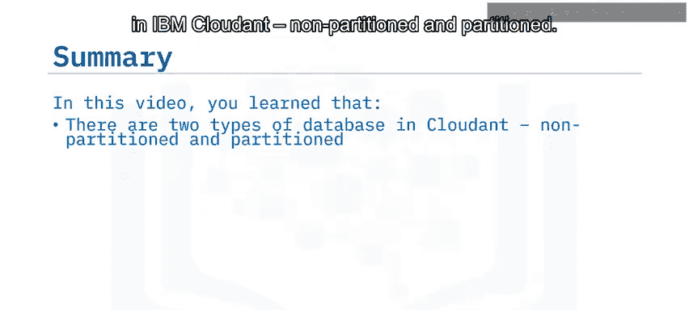

## 🎯 课程总结

本节课中，我们一起学习了在IBM Cloudant中使用数据库的核心知识。

我们了解到，在IBM Cloudant中可以创建和使用两种类型的数据库：**非分区数据库**和**分区数据库**。非分区数据库无需定义分区方案，但只提供全局查询。分区数据库则同时提供分区查询和全局查询，并能提供显著的性能和成本优势。数据库的分区类型在创建时设定。

Cloudant是一个使用JSON文档存储的文档数据库系统。您可以使用Cloudant仪表板创建数据库，并利用它来对数据库中的文档进行插入、查看、查询、更新和删除操作。