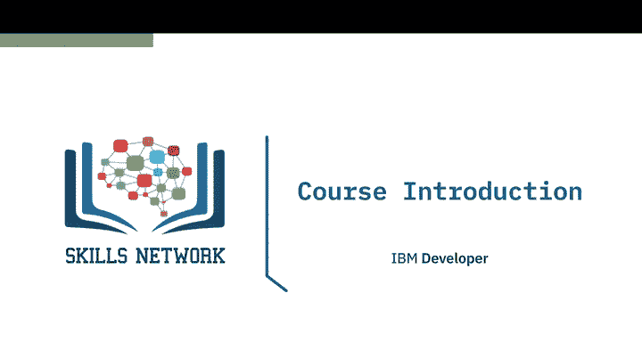
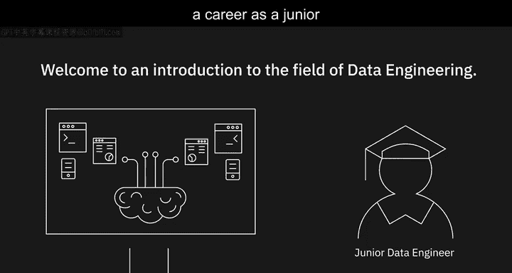
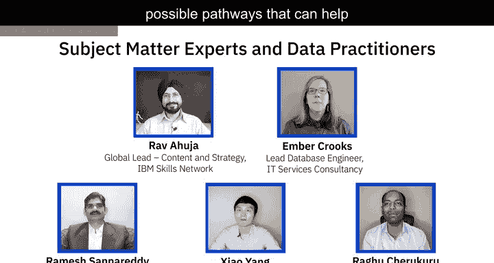
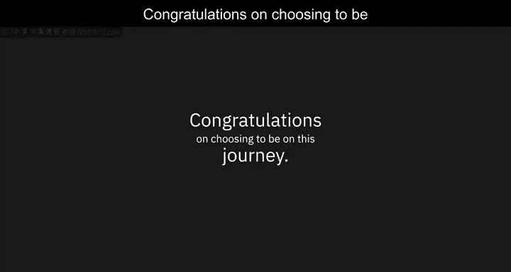
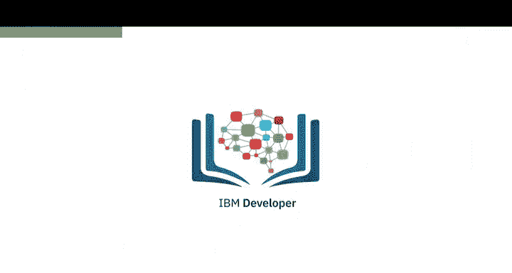

# 001：数据工程入门

在本课程中，我们将学习数据工程的基础概念、生态系统及其生命周期。数据工程是当今增长最快的技术职业之一，它专注于确保数据的准确性和可访问性，从而支持企业和组织做出关键决策。

---

## 🎯 数据工程的重要性

数据正以前所未有的速度增长，全球各地的企业、行业、机构和政府都在利用数据来指导未来决策。我们从数据中获取的价值主要取决于两点：**数据的准确性**和**在需要时高效访问所需数据的能力**。这正是数据工程师的核心职责。

根据2020年Dice科技职位报告，数据工程师是增长最快的技术职业，年增长率高达**50%**。

---

## 👥 适合人群

本课程适合所有希望成为数据工程师的学习者。无论你来自工程或计算机科学背景，还是非相关专业的毕业生，甚至是非毕业生但热爱编程的人，都可以通过本课程开启数据工程之旅。

如果你已经是数据领域的专业人士，对工程技术充满热情，或者是在技术岗位工作的专业人士，本课程将帮助你提升技能，并在这个领域获得更多机会。

---

## 📘 课程内容概述

本课程将介绍数据工程的核心概念、生态系统和生命周期。你将学习以下内容：

- **数据**与**数据存储库**
- **数据管道**与**数据集成平台**
- **大数据**基础
- 数据平台的**架构**
- 数据存储的**设计考量**
- 如何**提取、转换和清洗**数据，使其适用于分析
- 数据**安全、隐私与合规性**原则

---

## 🧠 专家分享

在课程的不同阶段，你将听到来自领域专家和实践者的分享。他们将分享专业知识，并为你提供成为数据工程师的可能路径建议。

以下是部分专家的介绍：

**Ravahucha**  
“我是一名计算机工程师，经过培训成为数据工程师，目前负责IBM Skills Network的内容与战略团队。”

**Amber Crooks**  
“我从事数据专业工作约20年。毕业后从IBM的DB2数据库管理员开始职业生涯，目前在一家专注于DevOps的组织担任首席数据库工程师。”

**Xo Yang**  
“我是Coursera的数据工程师。”

**Ragu Ckuru**  
“我在中西部一家大型零售商担任首席数据库管理员。”

---

## 🚀 开始学习

我们很高兴为你带来这门课程。祝贺你选择踏上这段学习之旅，祝你学习顺利！

---

## 📝 总结

在本课程中，我们一起探讨了数据工程的基本概念、其重要性以及适合学习的人群。我们还概述了课程的主要内容，并介绍了将在课程中分享经验的专家。数据工程是一个充满机遇的领域，掌握相关技能将帮助你在数据驱动的世界中脱颖而出。