# 002：现代数据生态系统

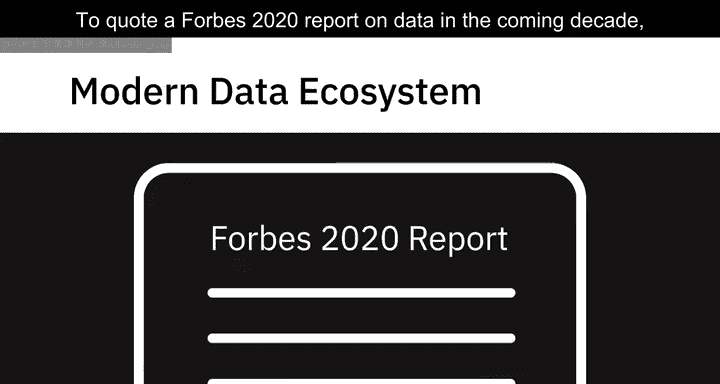

在本节课中，我们将要学习现代数据生态系统的构成、关键组成部分及其运作流程。我们将从数据来源开始，逐步了解数据如何被获取、处理并最终服务于各类用户，同时探讨新兴技术如何塑造这一生态系统。

---

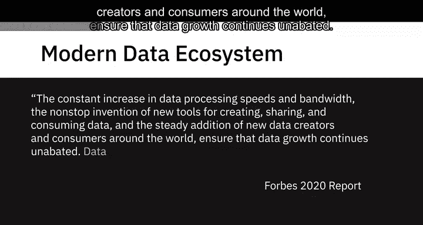

根据《福布斯》2020年关于未来十年数据的报告，数据处理速度和带宽的持续提升，以及不断涌现的用于创建、共享和消费数据的新工具，加上全球范围内新增的数据生产者和消费者，共同确保了数据的增长势头不减。

数据在持续的良性循环中催生出更多数据。

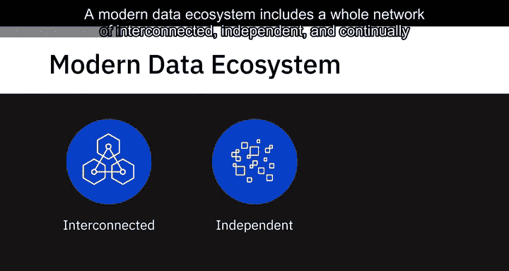

一个现代数据生态系统包含一个由相互连接、独立且持续演进的实体构成的完整网络。

它包括了需要从不同来源整合的数据，生成洞察所需的不同类型的分析及技能，积极协作并根据生成的洞察采取行动的利益相关者，以及按需存储、处理和传播数据的工具、应用程序和基础设施。

---

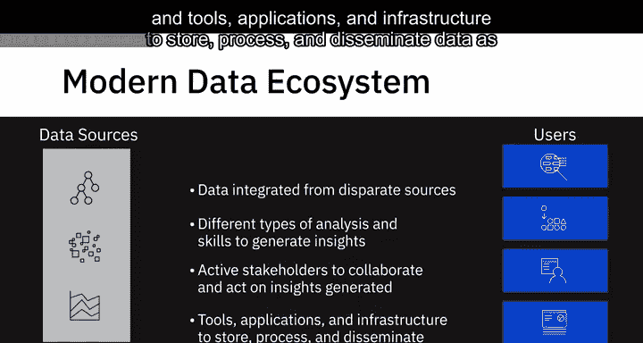

## 🌐 数据来源

上一节我们介绍了现代数据生态系统的整体概念，本节中我们来看看数据的来源。数据以各种结构化和非结构化数据集的形式存在。

以下是主要的数据来源类型：
*   文本、图像、视频
*   点击流、用户对话
*   社交媒体平台
*   物联网设备
*   流式传输数据的实时事件
*   遗留数据库
*   来自专业数据提供商和机构的数据

数据来源从未如此多样化和动态化。

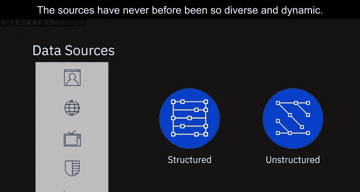

---

## 📥 数据获取与整合

当你面对如此多不同的数据源时，第一步是将数据从原始来源复制到数据存储库中。

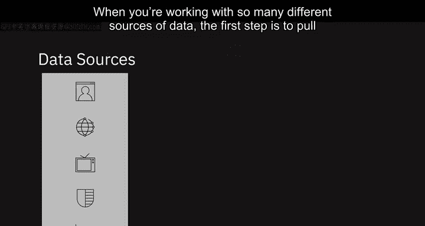

在此阶段，你的工作重点是获取所需的数据，处理数据格式、来源以及可以拉取这些数据的接口。

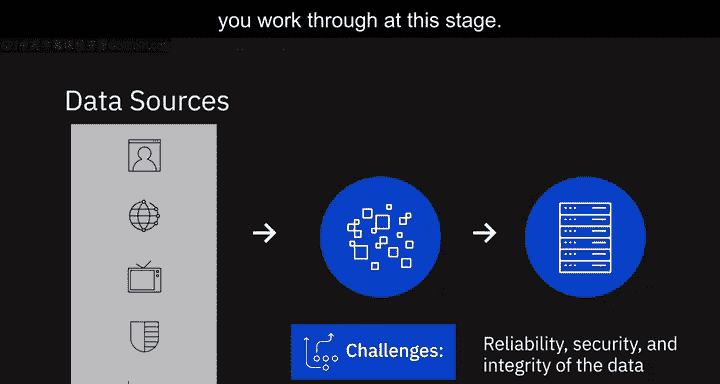

在此阶段需要应对的一些挑战包括：
*   所获取数据的**可靠性**
*   所获取数据的**安全性**
*   所获取数据的**完整性**

---

## 🧹 数据组织与治理

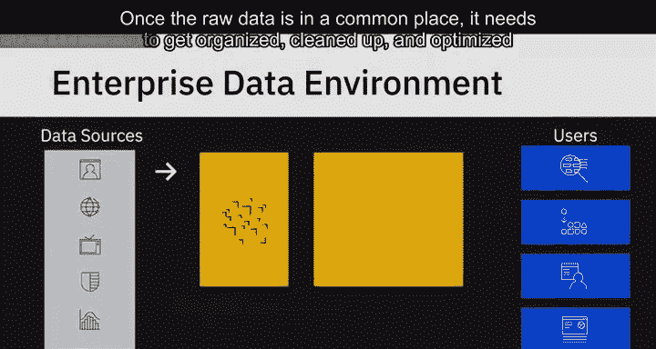

原始数据汇集到一处后，需要对其进行组织、清理和优化，以便最终用户访问。数据还需要符合组织内执行的合规性和标准。

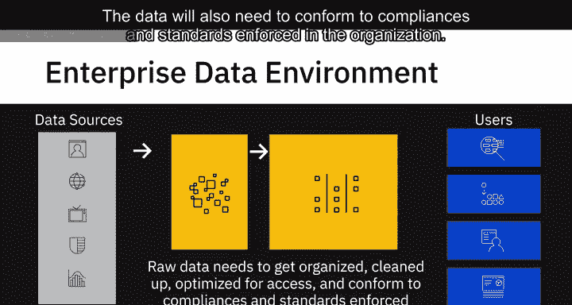

例如，遵守管理个人数据（如健康数据、生物识别数据或物联网设备中的家庭数据）存储和使用的准则。

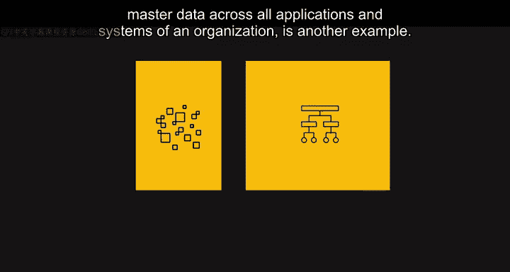

另一个例子是遵循组织内的主数据表，以确保主数据在组织所有应用和系统中的标准化。

此阶段的关键挑战可能涉及：
*   **数据管理**
*   使用能提供**高可用性**、**灵活性**、**可访问性**和**安全性**的数据存储库

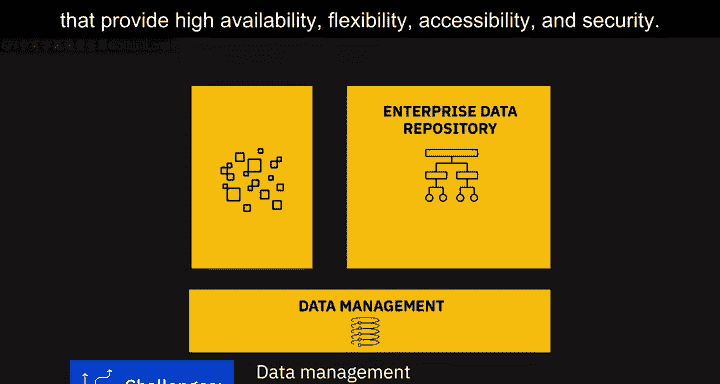

---

## 🚀 数据消费与应用

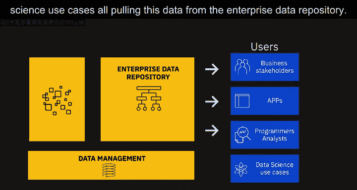

最后，我们的业务利益相关者、应用程序、程序员、分析师和数据科学用例都需要从企业数据存储库中提取这些数据。

此阶段的关键挑战可能包括：
*   能够根据用户特定需求将数据传递给最终用户的**接口**
*   能够根据用户特定需求将数据传递给最终用户的**API**
*   能够根据用户特定需求将数据传递给最终用户的**应用程序**

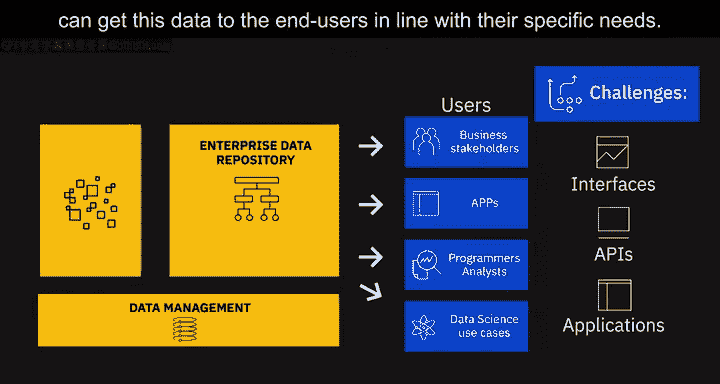

以下是不同用户的数据需求示例：
*   **数据分析师**可能需要原始数据进行处理。
*   **业务利益相关者**可能需要报告和仪表板。
*   **应用程序**可能需要自定义API来拉取这些数据。

---

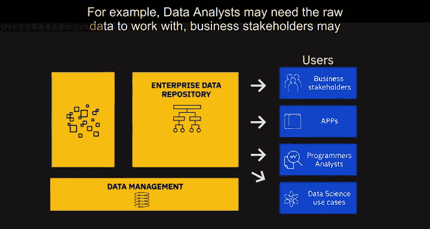

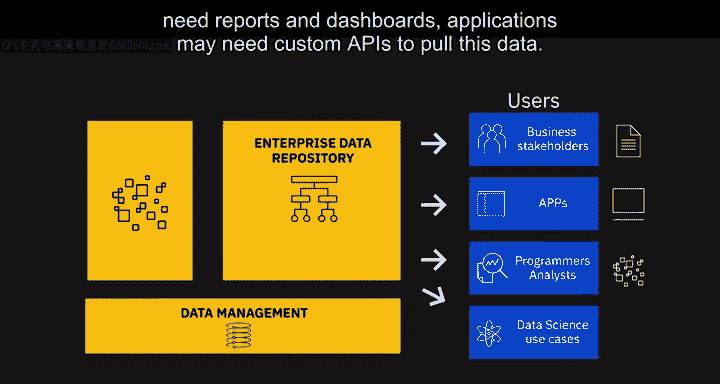

## ⚙️ 塑造生态系统的关键技术

必须注意到一些新兴技术正在塑造当今的数据生态系统及其可能性。

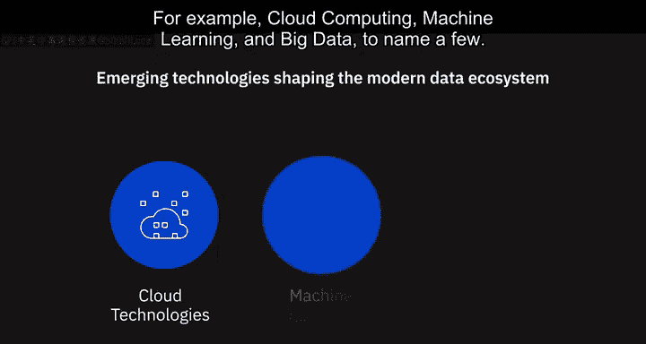

例如，**云计算**、**机器学习**和**大数据**等。

得益于云技术，当今每个企业都能获得：
*   **无限存储**
*   **高性能计算**
*   **开源技术**
*   **机器学习技术**
*   **最新的工具和库**

数据科学家通过在历史数据上训练机器学习算法来创建预测模型。

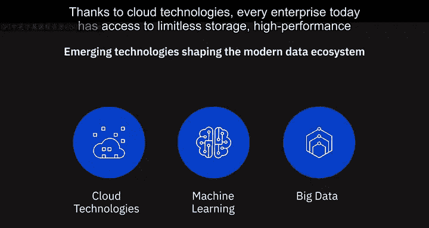

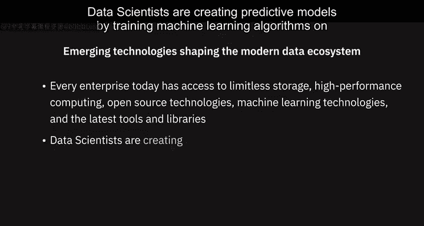

此外，关于**大数据**：今天我们处理的数据集如此庞大和多样，以至于传统工具和分析方法已不再足够，这为新工具、新技术以及新知识和洞察铺平了道路。我们将在本课程后续部分进一步学习大数据及其对商业决策的影响。

---

## 📝 总结

本节课中我们一起学习了现代数据生态系统的完整流程。我们从**多样化的数据来源**开始，了解了**数据获取与整合**阶段的挑战，探讨了**数据组织、清理与治理**的重要性，最后看到了数据如何被不同的**利益相关者和应用所消费**。同时，我们也认识到**云计算**、**机器学习**和**大数据**等关键技术正在持续推动这一生态系统的演进与发展。