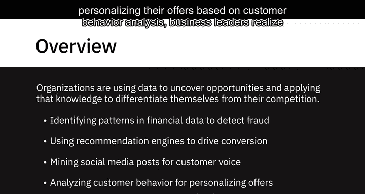
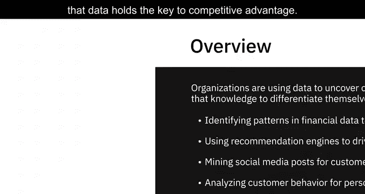
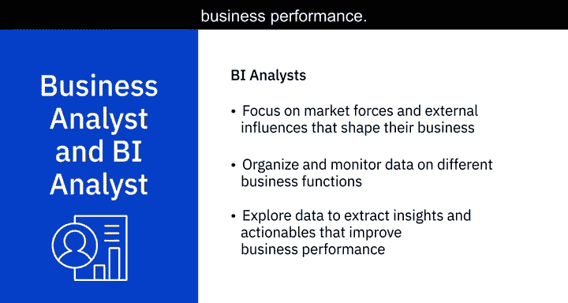
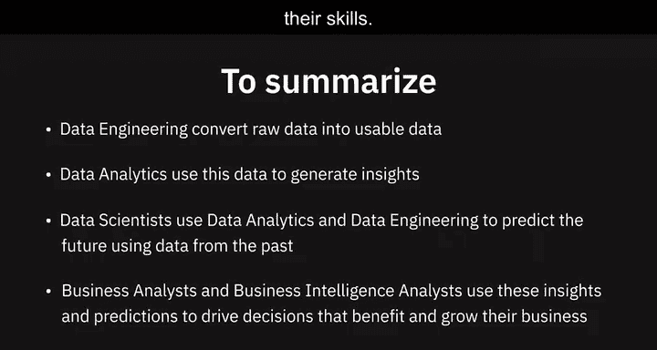

# 003：数据生态系统关键参与者

在本节课中，我们将学习数据生态系统中的关键角色及其职责。理解这些角色如何协作，是将数据转化为商业价值的基础。

如今，那些利用数据发现机遇、并应用这些知识实现差异化的组织，正引领着未来。无论是通过分析金融交易模式来检测欺诈，使用推荐引擎提升转化率，挖掘社交媒体帖子以了解客户心声，还是品牌根据客户行为分析提供个性化服务，商业领袖们都认识到，数据是获取竞争优势的关键。

要从数据中获取价值，需要大量不同的技能组合和扮演不同角色的人员。在本视频中，我们将探讨数据工程师、数据分析师、数据科学家、业务分析师和商业智能分析师在帮助组织利用海量数据并将其转化为可操作见解方面所扮演的角色。

## 👷‍♂️ 数据工程师

一切始于数据工程师。数据工程师是开发和维护数据架构，并使数据可用于业务运营和分析的人员。

数据工程师在数据生态系统内工作，负责：
*   从不同来源**提取、整合和组织**数据。
*   **清洗、转换和准备**数据。
*   **设计、存储和管理**数据仓库中的数据。

他们使数据能够以各种业务应用以及数据分析师、数据科学家等利益相关者可以使用的格式和系统进行访问。

一名数据工程师必须具备良好的编程知识、扎实的系统和技术架构知识，以及对关系型数据库和非关系型数据存储的深入理解。

## 📈 数据分析师

上一节我们介绍了数据工程师，他们为数据应用搭建了基础。本节中我们来看看数据分析师，他们是数据的翻译者。

简而言之，数据分析师将数据和数字翻译成通俗语言，以便组织做出决策。

以下是数据分析师的主要工作内容：
*   **检查和清洗**数据以获取见解。
*   **识别**相关性，**寻找**模式。
*   **应用**统计方法分析和挖掘数据。
*   **可视化**数据，以解释和呈现数据分析的结果。

分析师负责回答诸如以下问题：我们网站上的搜索功能，用户体验总体是好是坏？人们对我们的品牌重塑举措普遍看法如何？一种产品的销售与另一种产品的销售是否存在关联？

数据分析师需要熟练掌握电子表格、编写查询语句，以及使用统计工具创建图表和仪表板。现代数据分析师还需要具备一定的编程技能，同时需要强大的分析和叙事能力。

## 🔬 数据科学家

了解了数据分析师如何解读现状后，我们再来看看数据科学家如何预测未来。

数据科学家分析数据以获得可操作的见解，并构建机器学习或深度学习模型，这些模型基于历史数据进行训练，以创建预测模型。

数据科学家负责回答诸如以下问题：下个月我可能会获得多少新的社交媒体关注者？下一季度我可能有多少客户会流失到竞争对手那里？这笔金融交易对该客户来说是否异常？

数据科学家需要具备数学、统计学知识，并对编程语言、数据库和构建数据模型有相当的理解。他们还需要具备领域知识。

## 👔 业务分析师与商业智能分析师

除了上述技术角色，业务分析师和商业智能分析师则更侧重于商业决策。

业务分析师利用数据分析师和数据科学家的工作成果，研究对其业务的可能影响以及他们需要采取或建议的行动。商业智能分析师的工作类似，但他们的重点是影响其业务的市场力量和外部因素。

他们通过组织和监控不同业务职能的数据，并探索这些数据以提取能改善业务绩效的见解和可执行方案，来提供商业智能解决方案。

## 🎯 总结

本节课中我们一起学习了数据生态系统中的五个关键角色及其协作关系。

简单总结如下：
*   **数据工程**将原始数据转换为可用数据。
*   **数据分析**利用这些数据生成见解。
*   **数据科学家**使用数据分析和数据工程，基于过去的数据预测未来。
*   **业务分析师和商业智能分析师**利用这些见解和预测来推动有利于其业务增长和发展的决策。

有趣的是，数据专业人士从数据领域的一个角色开始职业生涯，然后通过补充技能过渡到数据生态系统内的另一个角色，这种情况并不少见。