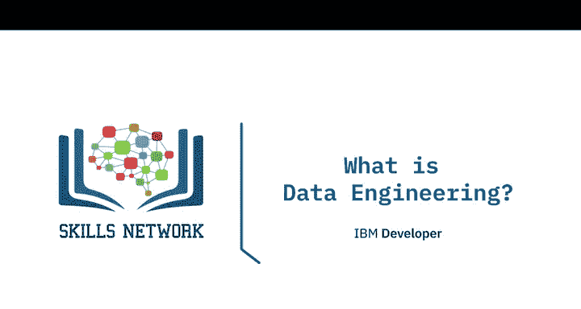
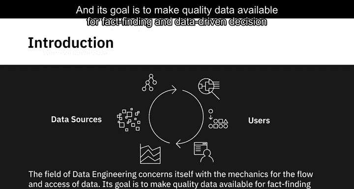
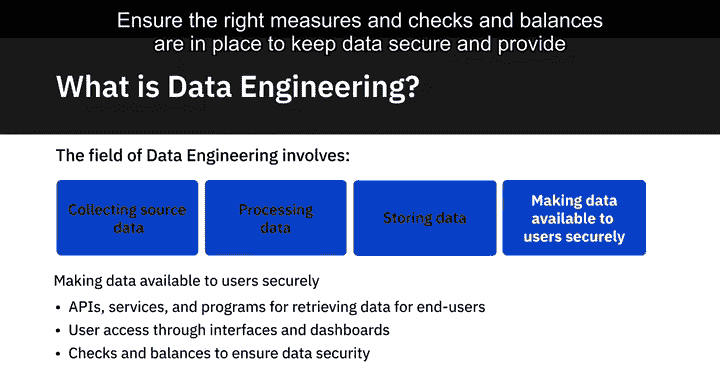
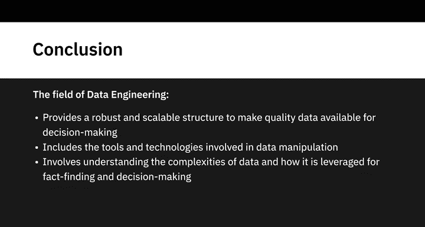

# 004：数据工程定义 📊

在本节课中，我们将深入探讨现代数据生态系统中数据工程的范围。我们将了解数据工程的核心任务、所需技能以及它在组织中的实际应用。

---

## 概述

数据工程的核心是处理数据的流动与访问机制，其目标是提供高质量数据，以支持基于事实和数据驱动的决策。随着数据量的增长，数据工程领域也从管理单一数据库扩展到处理广泛的数据源、结构和类型。

上一节我们介绍了数据工程的基本概念，本节中我们来看看数据工程的具体任务范围。

---

## 数据工程的核心任务

数据工程主要围绕四大任务展开：**收集源数据**、**处理数据**、**存储数据**和**安全地向用户提供数据**。

以下是每一项任务的详细说明：

### 1. 收集源数据
此任务涉及从不同来源提取、集成和组织数据，以收集所需的数据集。
*   **开发工具、工作流和流程**：帮助从多个来源获取数据。
*   **设计、构建和维护可扩展的数据架构**：用于存储数据。数据可以存储在数据库、数据仓库、数据湖或其他类型的数据存储库中。

### 2. 处理数据
此任务包括清洗、转换和准备数据，使其变得可用。
*   **实施和维护分布式系统**：用于大规模数据处理。
*   **设计数据管道**：用于将数据提取、转换并加载到数据存储库中。
*   **设计或实施解决方案**：用于验证和保障数据的质量、隐私和安全性。
*   **优化工具、系统和流程**：以提高性能、可靠性和可扩展性。
*   **确保数据符合所有法规和合规性指南**。

### 3. 存储数据
此任务旨在确保数据的可靠性和易于获取。
*   **架构或实施数据存储**：用于存放处理后的数据。
*   **确保系统可扩展**：同时考虑到数据和业务需求的不断演变。
*   **确保配备适当的工具和系统**：以处理数据隐私、安全合规、监控、备份和恢复。

### 4. 安全地向用户提供数据
此任务确保最终用户能够安全、有效地访问和使用数据。
*   **使用API、服务和程序**：根据定义的参数检索数据，供最终用户使用。
*   **开发报告和仪表板**：向用户展示数据，帮助他们从中获取洞察。
*   **建立正确的措施和制衡机制**：以保持数据安全，并为用户提供基于权限的访问。

---

## 数据工程是团队协作

需要强调的是，数据工程是一项团队运动。没有人被期望拥有数据工程广泛任务范围内所需的所有知识、技能和专业能力。

例如：
*   要架构任何数据管理系统（无论是用于收集源数据还是存储已处理、可供分析的数据），你需要具备架构师的技能。
*   要确保数据存储可用并优化使用，你需要具备数据库方面的专业知识。
*   同样，熟练掌握数据库工具、编程语言和分布式系统都属于数据工程的范畴，但它们可能需要不同的技能组合。

此外，并非所有团队和组织都需要建立端到端的数据工程实践。市场上有许多工具、应用程序和解决方案（包括本地部署和基于云的），可以根据个人需求进行评估和选用。

---

## 总结

本节课中，我们一起学习了数据工程如何运作，以提供一个健壮且可扩展的结构，从而为决策提供高质量数据。与其他数据专业相比，数据工程更侧重于数据操作所涉及的工具和技术，但它同样关乎理解数据的复杂性，以及如何最终利用数据进行事实发现和决策制定。