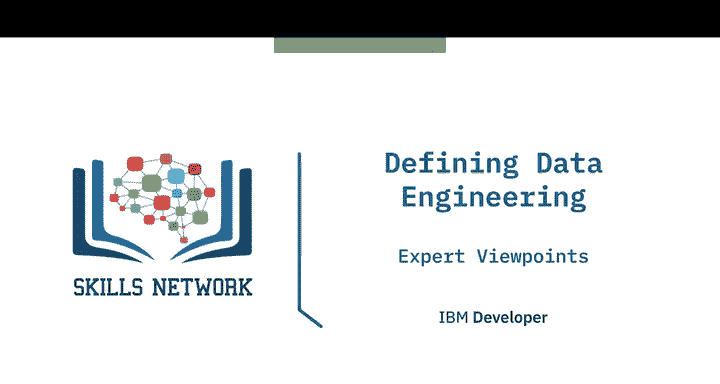
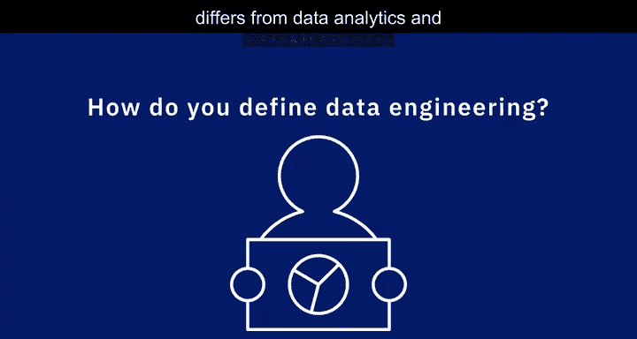

# 005：数据工程的定义视角

在本节课中，我们将聆听几位数据专业人士的分享，了解他们如何定义数据工程，以及数据工程与数据分析和数据科学有何不同。

---

## 🏗️ 什么是数据工程？

上一节我们了解了课程的整体目标，本节中我们来看看数据工程的具体定义。

数据工程的任务是**设计、构建和维护数据基础设施与平台**。这些数据基础设施可以包括数据库、大数据存储库，以及用于在这些系统之间转换和移动数据的**数据管道**。

因此，数据工程师是负责开发和优化数据系统，并使数据可用于分析的人。而数据分析师则是在这些系统中分析数据以生成报告和获取洞察的人。数据科学家则更进一步，对数据进行更深入的分析，并开发预测模型来解决更复杂的数据问题。

---

## 🔧 数据工程师的角色：数据的“管道工”

理解了基本定义后，我们来看看数据工程师的具体角色。

作为数据工程师，我们就像是数据的“管道工”。我们确保数据**高度可用**、**一致**、**安全**且**可恢复**。我们不会花太多时间直接处理或分析数据，而是专注于确保数据已准备就绪，供其他人完成这些工作。

很多时候，数据科学和数据分析会利用我们存储的数据。这也意味着我们需要与其他数据专业人士紧密合作，以确保数据符合他们的需求，并以真正有助于他们的方式提供。

---

## ⚙️ 数据工程的核心工作

明确了角色定位，接下来我们深入探讨数据工程的核心工作内容。

数据工程的核心是**设计、维护和优化系统**，以帮助企业和公司充分利用其数据。具体而言，它涉及选择正确的数据库、正确的存储系统、正确的云架构或云平台。这样，当我们把所有这些东西整合在一起时，组织内部的数据流是无缝的，数据可以以最少的努力和尽可能快的速度，在任何时间交付给任何需要的人。

在一个拥有最佳数据工程流程的理想组织中，任何被授权的人都可以在瞬间访问任何数据。

---

## 🔄 数据工程与数据分析/科学的区别与联系

现在我们已经了解了数据工程的工作，本节中我们来看看它与其他数据角色的关系。

如果你谈论数据分析师和数据科学家，他们的工作可以被视为上游工作。也就是说，在数据工程师完成工作并使数据可用之后，数据分析师和数据科学家才能利用这些数据进行分析并得出预测。

以下是数据工程与数据分析/科学的关键区别：

*   **数据工程师**：从多个来源提取和收集原始数据，对其进行转换，并以可用的形式存储。
*   **数据科学家/分析师**：在数据工程师准备的数据基础上进行分析，并试图从中获取洞察。

你可以将数据工程视为数据分析和数据科学的**前驱**。数据工程师充当**赋能者**，使数据分析师和数据科学家的数据项目变为现实。例如，他们可以帮助数据分析师和数据科学家选择正确的数据和工具，并通过构建所需的数据管道来满足他们的数据需求，从而帮助他们构建报告和执行统计分析。

---

## 📝 课程总结

在本节课中，我们一起学习了数据工程的定义和视角。我们了解到，数据工程专注于构建和维护可靠、高效的数据基础设施，是数据价值链的基石。它确保高质量的数据能够顺畅地流向数据分析师和数据科学家，从而支持有效的分析和决策。记住，数据工程师是幕后英雄，他们搭建的“管道”让数据的价值得以释放。