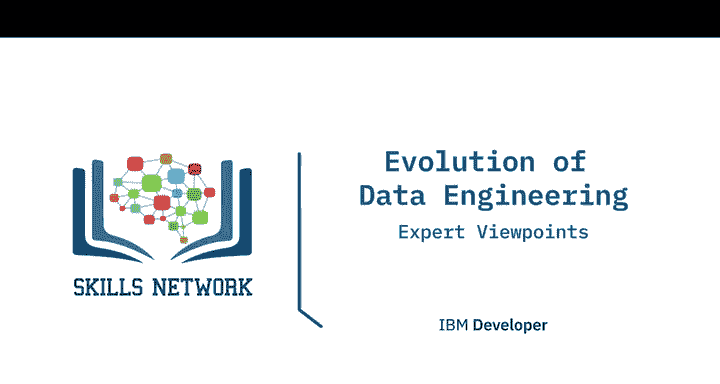
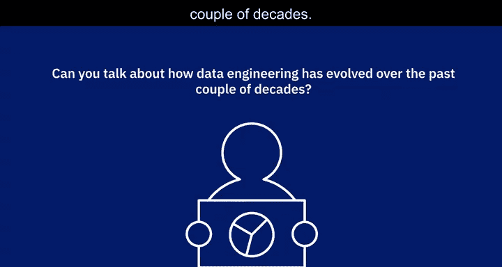
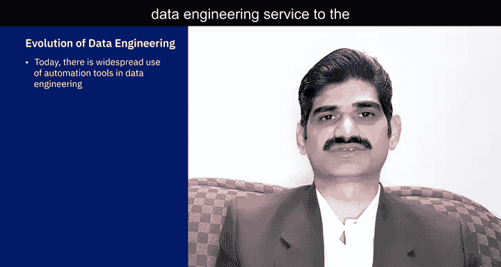
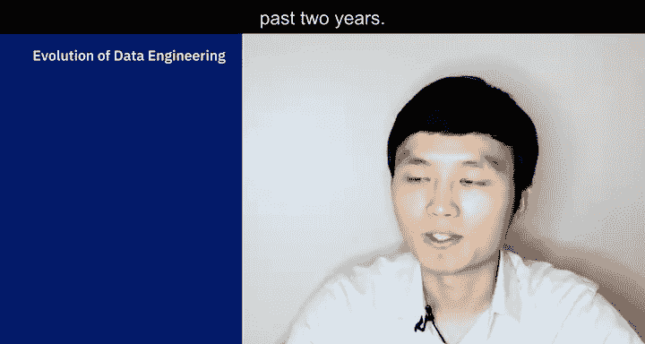
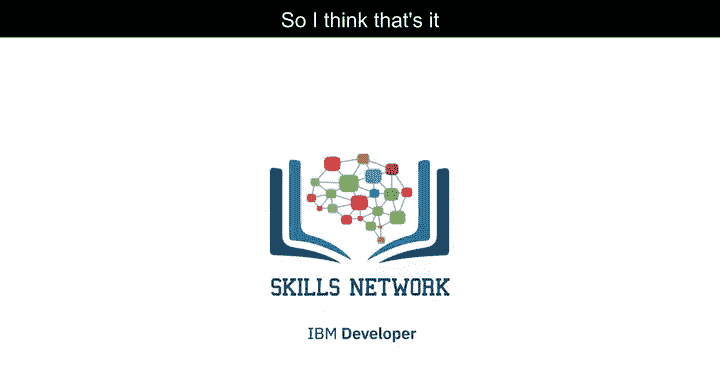

# 006：数据工程的演进视角

在本节课中，我们将聆听几位数据专业人士的分享，了解数据工程在过去二十年间是如何演变的。

## 🌍 数据工程领域的巨变

与二十年前相比，数据工程的生态系统或格局已截然不同，甚至可以说是面目全非。

以下是当今数据工程场景与二十年前的主要区别：

*   **数据规模**：我们今天处理的数据量，在二十年前是无法想象的。
*   **数据多样性**：我们今天处理着各种类型和格式的数据，其中许多在二十年前甚至不存在。
*   **数据库技术**：二十年前，我们并未讨论NoSQL数据库的概念，而今天我们使用多种NoSQL数据库。
*   **大数据概念**：二十年前，“大数据”闻所未闻，而今天它已成为许多企业和组织的标配。

## ⏱️ 期望与工作方式的转变

我看到的另一个主要区别是，对数据工程的期望值大幅提高了。如今，当一项任务交给数据工程师时，要求的周转时间要短得多。以前，我们可能需要几天时间来提出解决方案，而现在的期望是能在几小时内给出方案。

此外，今天的数据工程服务离不开自动化工具。我们需要大量自动化工具来确保能够交付数据工程服务。

## 🚀 技术演进与角色扩展

我大约在25年前进入这个领域，见证了巨大的技术演进，尤其是在数据和数据技术系统方面。

*   **云计算**：得益于云计算，数据基础设施现在可以作为服务提供。因此，今天的数据工程师需要从零开始搭建的工作大大减少。他们可以将更多时间花在有价值的事情上，而减少在系统设置和管理上的时间。
*   **数据存储**：当我刚开始从事数据工程时，主要涉及使用关系数据库和数据仓库。现在则出现了许多NoSQL数据库和其他类型的数据存储库。
*   **大数据革命**：围绕大数据发生了重大变革。今天的数据工程师需要知道如何使用多种不同的大数据处理系统和管道。
*   **技能广度**：虽然仍有专业细分，但我认为今天的数据工程师需要了解更广泛的工具和数据系统，以及如何有效地利用它们解决不同类型的数据问题。

## 🔄 从集中规划到协作对话

在过去的几十年里，我们处理数据的方式发生了非常显著的变化。我刚开始时，采用的是非常层级化的方法：由顶层的架构师、企业架构师或数据架构师来决定组织内如何存储数据。通常只支持两三个平台，我们就严格遵循这些明确定义的方案。

而在过去的20年里，逐渐过渡到了另一种情况：数据存储方式的需求越来越多地来自开发人员。开发人员有特定的需求，并以特定的方式存储数据。有趣的是，需求来自不同的方向，这稍微改变了我们的角色。

因此，我们现在要做的不是确保自己精通之前定义好的那两三个平台，而是需要接纳开发人员提出的各种不同需求和需要，并与他们合作，确保他们所做的选择适合长期的数据操作、数据使用以及安全可靠的数据存储。这更像是一个关于“事情如何发生”的对话，对数据工程师来说，也更像是一次学习探索——走出去，找出满足开发人员需求的最佳新方法，同时仍能构建组织真正需要的可靠、高可用且安全的数据平台。

## 📈 数据源的多样化驱动角色演变

在过去的几十年里，数据工程发生了巨大的演变。我15年前作为一名数据库管理员起步时，数据工程还不是那么热门的话题。虽然有数据工程师，但不像现在这样需求旺盛。

这背后的原因基本上是各种数据源的演变。例如，现在我们有了物联网相关数据，各种传感器信息被输入到这些数据源中，还有来自Twitter或天气API等的API数据流，万物互联。因此，对多样化数据源的需求也随之演变。

例如，我们长期拥有关系数据库（可能已有四五十年），现在我们有了列式存储（如Cassandra或HBase）、键值对数据库、用于大数据的Hadoop，以及文档存储（如MongoDB或Couchbase）。作为一名数据工程师，你需要熟悉所有这些类型的数据源。随着数据源的演进和数据多样性的增加，数据工程师的角色在过去几十年里发生了显著变化。

## 🛠️ 现代数据工程师的新要求

我只在数据工程领域工作了两年，所以只能分享我在过去两年中的学习和观察。

我认为，传统上数据工程师主要专注于数据库管理、ETL管道和数据可视化。然而，近年来，我看到了越来越多的需求，要求数据工程师理解分布式计算和DevOps，并实现机器学习模型等。

---

**本节课总结**

在本节课中，我们一起学习了数据工程在过去二十年的演进历程。我们了解到，数据工程领域在数据规模、多样性、技术栈（如NoSQL和云计算）以及工作期望（如更快的周转时间和自动化）方面都发生了根本性变化。数据工程师的角色已从专注于少数特定平台，转变为需要与开发人员广泛协作，并掌握包括大数据系统、分布式计算在内的更广泛技能。这种演变是由数据源的爆炸式增长和技术的快速进步共同驱动的。