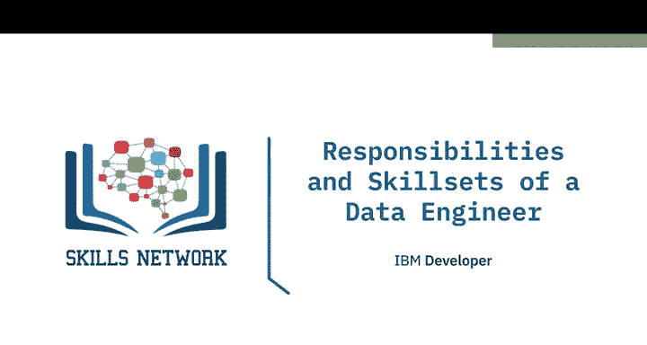
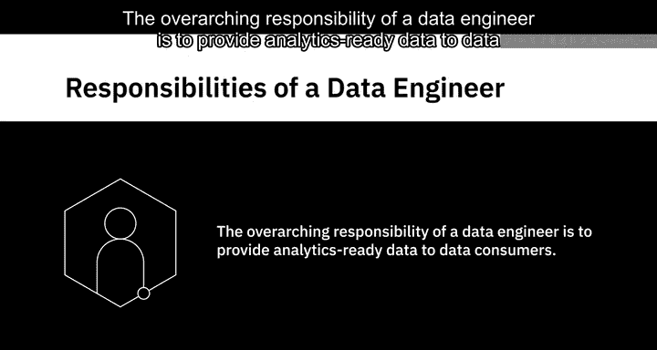
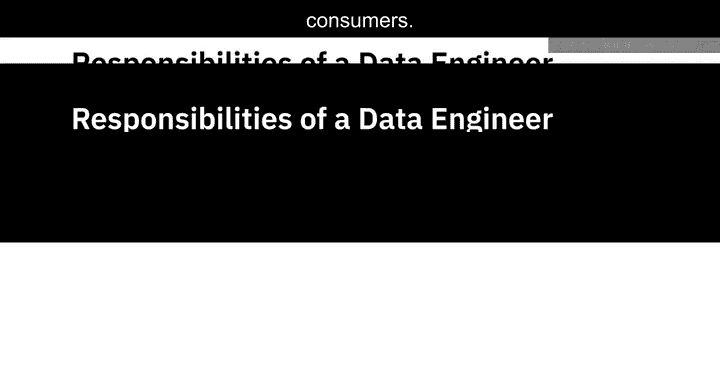
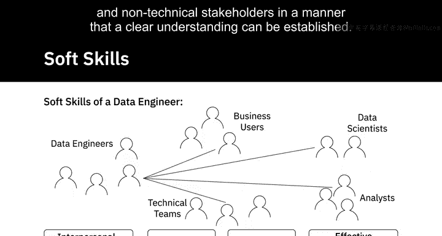
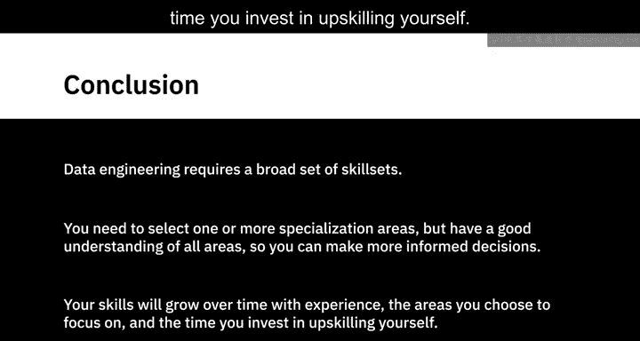
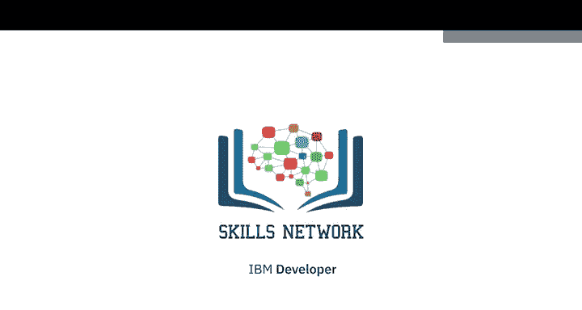

# 007：数据工程师的职责与技能 🛠️

在本节课中，我们将学习数据工程师的核心职责以及成为一名数据工程师所需具备的各项技能。数据工程师是数据生态系统中至关重要的角色，他们负责构建和维护数据基础设施，确保数据能够被高效、可靠地用于分析和决策。

## 概述

数据工程师的总体职责是向数据消费者提供“可用于分析的数据”。这意味着数据必须是准确、可靠、合规的，并且能够在消费者需要时被便捷地访问。

接下来，我们将详细探讨数据工程师的具体职责，并了解支撑这些职责所需的技术、职能和软技能。

## 数据工程师的核心职责

数据工程师的工作贯穿数据的整个生命周期。以下是他们的主要职责：

*   **提取、组织和集成数据**：从各种不同的数据源中提取数据，并进行组织和集成。
*   **准备用于分析和报告的数据**：通过转换和清洗数据，使其适合进行分析和生成报告。
*   **设计和管理数据管道**：设计和维护数据从源头到目标系统的完整流转路径。
*   **设置和管理基础设施**：搭建并管理用于数据摄取、处理和存储所需的基础设施。这包括：
    *   数据平台
    *   用于聚合源数据的数据存储
    *   用于大规模数据处理的分布式系统
    *   用于存储和分发“分析就绪”数据的数据仓库

## 数据工程师的技能组合

数据工程是软件工程和数据科学的交叉领域。要胜任这项工作，需要掌握多方面的技能。

### 技术技能

技术技能是数据工程师的基石。以下是关键的技术领域：

*   **操作系统知识**：熟悉如 Linux 和 Windows 等操作系统，包括常用的管理工具、系统实用程序和命令。
*   **基础设施组件知识**：了解虚拟机、网络以及负载均衡、应用性能监控等应用服务。同时，也需要熟悉亚马逊、谷歌、IBM 和微软等公司提供的云服务。
*   **数据库与数据仓库经验**：
    *   关系型数据库管理系统，如 IBM DB2、MySQL、Oracle Database 和 PostgreSQL。
    *   NoSQL 数据库，如 Redis、MongoDB、Cassandra 和 Neo4j。
    *   数据仓库，如 Oracle Exadata、IBM DB2 Warehouse on Cloud、IBM Netezza Performance Server 和 Amazon Redshift。
*   **数据管道熟练度**：熟练使用流行的数据管道解决方案，如 Apache Beam、Airflow 和 Dataflow。
*   **ETL 工具经验**：有使用 ETL 工具的经验，例如 IBM Infosphere Information Server、AWS Glue 和 Improvvado。
*   **数据查询与处理语言**：
    *   用于访问和操作数据库中数据的查询语言，如用于关系型数据库的 **SQL**，以及用于 NoSQL 数据库的类 SQL 查询语言。
    *   编程语言，如 **Python**、**R** 和 **Java**。
    *   脚本语言，如 Unix/Linux Shell 和 PowerShell。
*   **大数据处理工具**：熟悉 Hadoop、Hive 和 Spark 等大数据处理工具。

数据工程流程涉及多种不同的工具和技术。对同类技术有实际了解，有助于你在不同工具之间权衡利弊，并做出合适的推荐。

### 职能技能

除了日常使用的工具和技术，数据工程师还需要深刻理解数据科学家、分析师和业务用户如何利用“分析就绪”的数据。以下是一些重要的职能技能：

*   **将业务需求转化为技术规格**的能力。
*   **参与完整软件开发生命周期**的能力，包括构思、架构、设计、原型制作、测试、部署和监控。
*   对**数据在业务中潜在应用**的理解。
*   对**数据管理不善风险**的理解，这主要涵盖数据质量、隐私、安全性和合规性。

### 软技能

数据工程是一项团队运动。一个项目中可能有多位各有所长的数据工程师协作，并与分析师、数据科学家、业务用户及其他技术团队等数据消费者紧密互动。因此，人际交往能力、团队合作与协作精神对数据工程师至关重要。

作为一名数据工程师，你需要能够与技术和非技术利益相关者进行有效沟通，以确保双方都能清晰理解。

## 总结

本节课我们一起学习了数据工程师的职责和所需的技能组合。数据工程需要广泛的技能，没有一位数据工程师能精通所有领域。这意味着你基本上需要选择一个或多个专业方向，但同时要对所有领域有良好的理解，以便做出更明智的决策。

你的技能会随着经验、你选择专注的领域以及你在自我提升上投入的时间而不断增长。