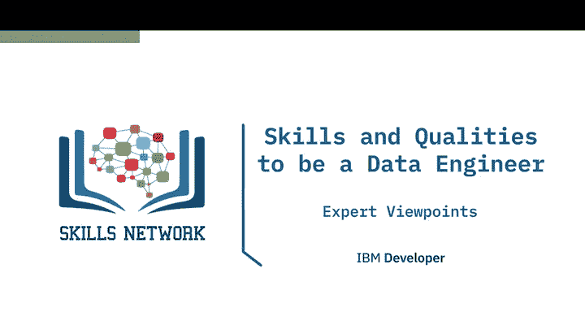
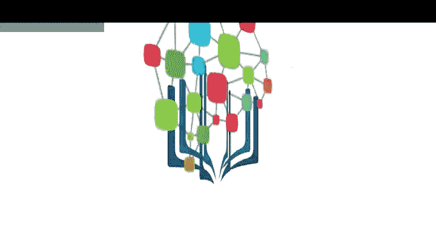

# 008：数据工程师的技能与素质视角

在本节课中，我们将学习成为一名成功的数据工程师所需具备的技术技能与软技能。课程内容分为两部分：第一部分聚焦于核心技术能力，第二部分探讨关键的个人素质与软技能。

---

## 🛠️ 第一部分：核心技术技能

上一部分我们了解了数据工程领域的概貌，本节中我们来看看数据工程师需要掌握哪些具体的技术技能。

数据工程是一项技术快速演进的领域。显然，你需要热爱数据，否则不应成为一名数据工程师。至于技术技能，它很大程度上取决于数据工程师需要完成的具体工作需求。

例如：
*   如果你在零售行业工作，可能需要一套技能组合，比如**关系型数据库**和**Cassandra**或**Google BigTable**这类架构相关知识，因为公司需要构建全年无休的应用程序，并使用**Kafka流**和**WebSphere MQ**等工具构建管道来处理交易数据的后台处理。
*   如果你在医疗保健行业工作，可能需要另一套不同的技能组合。
*   如果你在像Twitter或Facebook这样的社交媒体公司工作，则需要其他类型的技能组合。

因此，数据工程是一个非常广泛的领域，其技术要求因职位角色而异。

技术部分实际上是相对容易的，因为你可以学习新技术、摸索新事物。重要的是，你需要掌握数据结构和数据处理背后的基本理论。如果你不喜欢变化、不喜欢学习，那么数据工程可能不适合你。任何数据领域都存在大量变化，你必须愿意适应这些变化。

以下是成为一名数据工程师需要具备的一些核心技能：

*   **网络技能**：你需要具备良好的网络知识，包括局域网和广域网。
*   **存储理解**：你需要擅长理解不同类型的存储，包括本地存储和云存储。
*   **操作系统知识**：你需要对操作系统有非常深入的了解。
*   **数据库专家**：你应该成为数据库专家，既包括关系型数据库管理系统，也包括NoSQL数据库。
*   **编程能力**：编程知识非常有帮助，掌握任何一门语言，如**Java**、**C**或**Python**，都会是极大的加分项。
*   **自动化技能**：在当今的数据工程领域，自动化是一项非常重要的技术技能。

具体来说，数据工程师需要：

1.  **掌握编程语言与系统**：能够使用一种或多种编程语言，熟悉操作系统，并了解IT基础设施和架构。这包括计算机架构、云、虚拟机、容器以及不同类型的存储及其使用方法。
2.  **精通SQL与数据库**：需要非常熟练地掌握**SQL**，并对一种或多种数据库（包括关系型和NoSQL）具备实际工作知识。
3.  **了解数据工程生态系统**：虽然不是入门必需，但拥有对更广泛数据工程生态系统的知识和经验非常有用。这包括**ETL（提取、转换、加载）**、**数据管道**、**数据仓库**、**数据湖**以及其他大数据系统。

不同公司对数据工程师的要求各不相同，即使在同一家公司内，对每位工程师所需的技能也可能随着时间而变化。

但总的来说，我认为数据工程师必备的四项核心技术技能是：
1.  **SQL** 和 **数据建模**
2.  **ETL方法论**
3.  **编程技能**（如 **Python**）

---

## 🤝 第二部分：关键素质与软技能

上一节我们探讨了技术硬技能，本节中我们来听听数据专业人士对成功数据工程师所需素质和软技能的看法。

要成为一名成功的数据工程师，你需要享受解决问题和故障排除的过程。你需要擅长团队合作、协作和沟通。此外，拥有良好的逻辑思维和对编码的兴趣对数据工程师非常有用。

从非技术的角度来看，我们期望数据工程师是一个问题解决者，并希望他/她具备出色的沟通能力。因为数据工程师需要持续与多个团队协作，良好的沟通能力至关重要。

你应该充满好奇心，能够向业务用户和技术用户提出大量问题，然后利用这些答案中的知识，基于可靠的数据源构建稳健的数据管道。

我的观点一直是，无论是作为DBA还是数据工程师，最优秀的人都是注重细节的控制狂。这是因为处理数据涉及大量细节，真正适应并深入细节、确保不遗漏任何环节非常重要。之所以是“控制狂”，是因为我的数据环境就像我的孩子，有时我花在它上面的时间甚至和陪伴孩子一样多。因此，我需要掌控或了解决策过程，以及这些特定选择所带来的权衡。

最重要的技能是软技能。你需要能够与开发人员互动，能够向管理层捍卫你的选择，能够为你所做的决策及其细节、重要性以及为何需要以特定方式完成工作进行辩护。因此，这些能力，加上职业道德和学习热情，是最重要的。

好奇心、良好的沟通能力和学习的渴望，对数据工程师来说至关重要。

---

## 📝 总结

在本节课中，我们一起学习了成为一名成功数据工程师所需的两大方面能力。

**技术技能**是基础，包括对数据库（SQL/NoSQL）、编程（如Python）、数据建模、ETL流程、系统架构和自动化工具的掌握。这些技能因具体行业和职位而异，但核心是处理和理解数据的能力。

**软技能与个人素质**则决定了你能否高效地运用技术。这包括强大的**问题解决能力**、出色的**沟通与协作技巧**、**好奇心**、**注重细节**的严谨态度，以及持续**学习和适应变化**的热情与能力。

技术可以学习，但对数据的热情、解决问题的思维以及与人协作的软实力，共同构成了优秀数据工程师的完整画像。