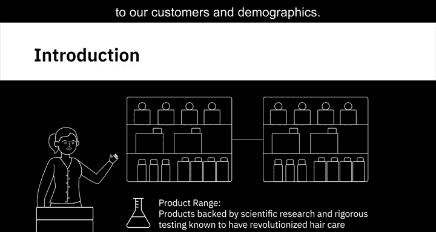
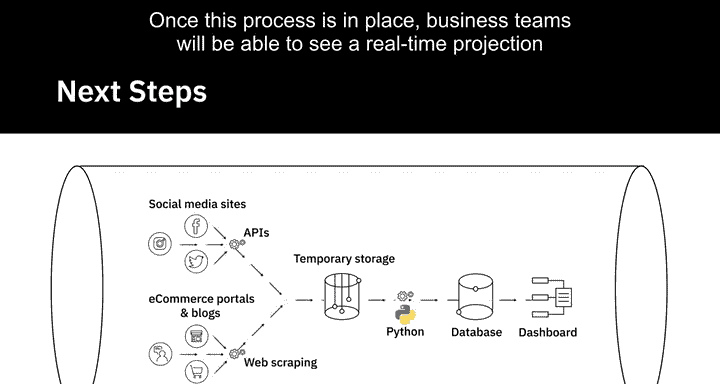

# 009：数据工程师的日常


在本节课中，我们将通过一个真实案例，了解数据工程师如何将数据科学家的原型转化为可运行的解决方案。我们将跟随一位数据工程师，看她如何从社交媒体收集数据、处理数据，并最终构建一个自动化的数据管道。

---

## 概述：一个洗发水新品发布的故事

我们的故事发生在一家跨国护发产品公司。公司即将推出一款新洗发水。在当今时代，社交媒体上的讨论会直接影响销售数据和品牌形象。因此，业务团队希望在产品发布第一天起，就能实时监控客户情绪。

数据科学家团队为此创建了一个仪表板原型，它使用情感分析算法和模拟数据来展示不同社交媒体和用户群体中的客户情绪得分。这个想法获得了认可，并交由业务团队实施。

接下来，数据工程师团队的任务就是将这个原型变为现实。

---

## 第一步：收集数据



上一节我们了解了业务需求，本节中我们来看看数据工程师如何开始工作。我的首要任务是将业务团队确定的所有社交媒体和在线来源的数据提取到公司的环境中。

以下是数据收集的具体步骤：

1.  **从社交媒体平台提取数据**：我首先从Twitter等平台，使用产品相关的话题标签，将推文和帖子提取到临时存储中。
2.  **从电商和博客收集数据**：接着，我转向电商门户和产品评测博客，收集与我们产品相关的数据，同样将其移至临时存储。这个活动被称为**网络爬取**。

收集到的数据格式多样，包括推文、帖子、评论、文章甚至表情包。

---

## 第二步：处理与转换数据

收集到所有必要数据后，我对其进行检查，以评估在将其加载到数据库之前需要进行哪些转换。

我们决定创建一个Python程序来处理数据并将其加载到数据库。数据处理的核心是**ETL**过程：

```python
# 伪代码示例：数据清洗与转换
def clean_and_transform(raw_data):
    cleaned_data = remove_duplicates(raw_data)
    transformed_data = standardize_format(cleaned_data)
    return transformed_data
```

我清理了数据，并将其转换为适合存入数据库的格式。这个数据库将是仪表板提取数据以生成报告的基础。

---

## 第三步：展示结果与构建自动化管道

现在，是时候向数据科学家展示成果了。结果完全符合他们的期望，这意味着工作完成得很好。

但工作并未就此结束。如果每次业务用户需要查看最新数据时，都必须向我们提出更新数据的请求，这种解决方案效率很低。理想情况下，他们应该能够实时了解客户情绪和品牌认知。

因此，我们的下一步行动是构建一个**数据管道**，能够持续地**提取**、**转换**和**加载**数据。

```python
# 伪代码示例：自动化数据管道
while True:
    new_data = extract_from_sources()
    processed_data = transform(new_data)
    load_to_database(processed_data)
    time.sleep(update_interval)
```

一旦这个流程建立起来，业务团队每次登录仪表板时，都能看到实时的数据投影。

---

## 总结

本节课中，我们一起学习了数据工程师在一个完整项目中的日常工作流程：

1.  **理解需求**：将业务目标（监控社交媒体情绪）转化为数据任务。
2.  **数据收集**：从多种来源（社交媒体、电商、博客）提取原始数据。
3.  **数据处理**：清洗、转换数据，使其适合存储和分析。
4.  **构建解决方案**：不仅实现一次性需求，更要设计可重复、自动化的**数据管道**，确保数据的持续更新和可用性。




通过这个案例，你可以看到数据工程师是连接数据源与数据应用（如仪表板）的关键桥梁，他们确保数据流可靠、高效，并能最终赋能业务决策。