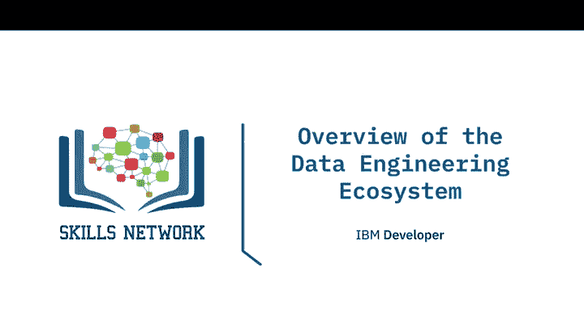
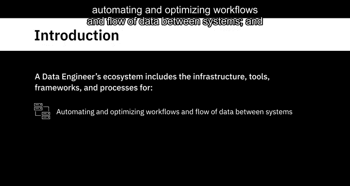
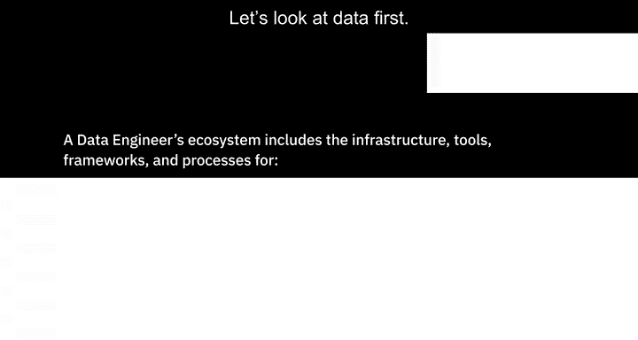
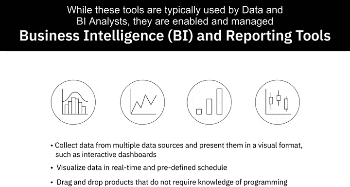
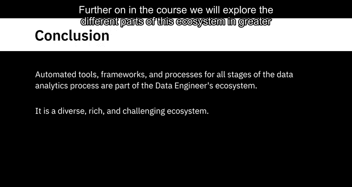
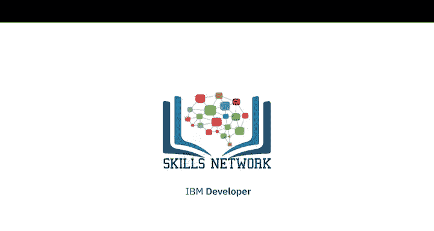

# 010：数据工程生态系统概览

在本节课中，我们将要学习数据工程师的生态系统。这个生态系统包含了从不同来源提取数据所需的基础设施、工具、框架和流程，涵盖了数据管道的架构与管理、数据的转换、集成与存储、工作流的自动化与优化，以及数据工程流程中所需应用程序的开发。

---

## 🗂️ 数据分类

首先，我们来看看数据。根据数据结构的明确程度，数据可以分为**结构化数据**、**半结构化数据**和**非结构化数据**。

*   **结构化数据**遵循严格的格式，可以整齐地组织成行和列。这类数据通常出现在数据库和电子表格中。
*   **半结构化数据**混合了具有一致特征的数据和不遵循严格结构的数据。例如，电子邮件包含发件人、收件人等结构化数据，也包含邮件正文这类非结构化数据。
*   **非结构化数据**是复杂且主要为定性信息的数据，无法简化为行和列。例如，照片、视频、文本文件、PDF和社交媒体内容。

数据的类型决定了可以收集和存储它的数据仓库类型，也决定了可用于查询或处理数据的工具。

---

## 🌐 数据来源与格式

数据来源广泛，格式多样。它们可以从各种数据源收集，包括关系型和非关系型数据库、API、网络服务、数据流、社交平台和传感器设备。

---

## 🗄️ 数据仓库

数据工程师的生态系统还包括数据仓库。数据仓库主要有两种类型：**事务型系统**和**分析型系统**。

*   **事务型系统**，也称为在线事务处理（OLTP）系统，旨在存储大量的日常运营数据，例如网上银行交易、ATM交易和航空订票。虽然OLTP数据库通常是关系型的，但也可以是非关系型的。
*   **分析型系统**，也称为在线分析处理（OLAP）系统，为执行复杂的数据分析而优化。这些系统包括关系型和非关系型数据库、数据仓库、数据集市、数据湖和大数据存储。

数据的类型、格式、来源和使用场景共同决定了哪种数据仓库最为理想。

---

## 🔄 数据集成与管道

一旦来自不同来源的数据被收集起来，就需要进行处理、清理和集成，以便用户可以通过接口访问。数据集成工具将来自不同来源的数据组合成一个统一的视图，供用户查询和操作。

这就引出了**数据管道**的概念。数据管道是一套覆盖数据从源系统到目标系统整个旅程的工具和流程。数据在管道内通过**提取、转换、加载（ETL）** 或**提取、加载、转换（ELT）** 等流程进行集成。

---

## 💻 编程与查询语言

该生态系统还包括各种语言，可分为**查询语言**、**编程语言**以及**Shell和脚本语言**。

从使用 **`SQL`** 查询和操作数据，到使用 **`Python`** 开发数据应用程序，再到编写Shell脚本以处理重复性操作任务，这些都是数据工程师工作台中的重要组成部分。

---

## 📈 商业智能与报告工具

商业智能（BI）和报告工具用于从多个数据源收集数据，并以可视化格式（如交互式仪表板）呈现。使用这些工具，您可以实时或按预定计划连接和可视化数据。这些通常是拖放式产品，不需要用户了解任何编程知识。虽然这些工具通常由数据和BI分析师使用，但它们由数据工程师启用和管理。

---

## 🛠️ 自动化工具与框架

数据分析过程所有阶段的自动化工具、框架和流程都是数据工程师生态系统的一部分。这是一个多样化、丰富且充满挑战的生态系统。在课程后续部分，我们将更详细地探讨这个生态系统的不同组成部分。

---

## 📝 总结

本节课中，我们一起学习了数据工程生态系统的核心组成部分。我们了解了数据的三种主要类型（结构化、半结构化、非结构化），认识了不同类型的数据仓库（事务型OLTP和分析型OLAP），并概述了数据集成、数据管道、关键编程语言以及BI工具在生态系统中的角色。这个生态系统为数据工程师提供了从数据收集到最终可视化的全套工具和框架。