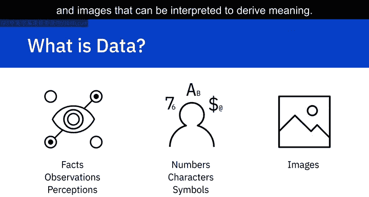
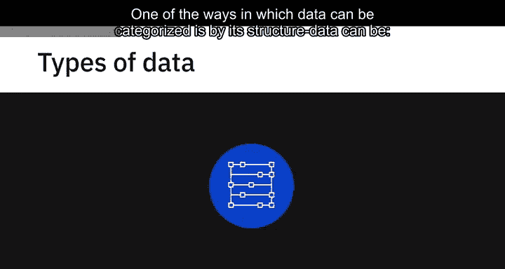
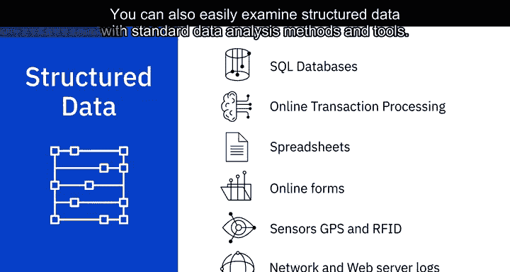
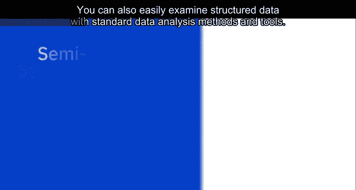
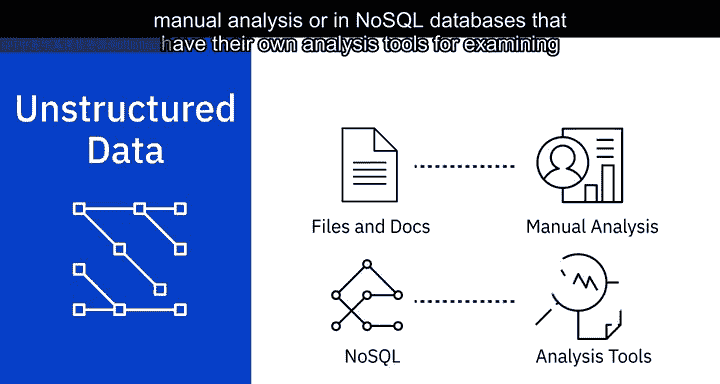
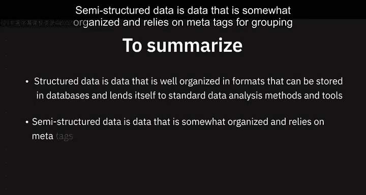
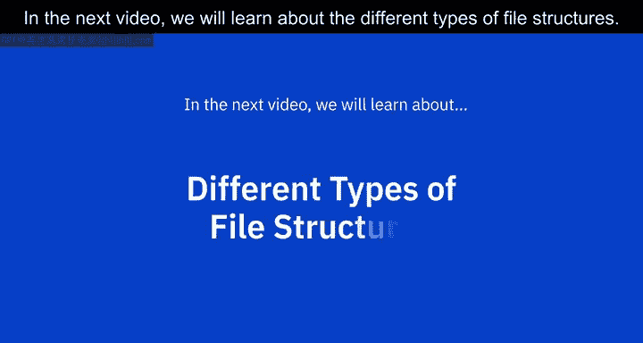

# 011：数据类型详解

在本节课中，我们将学习数据的基本分类方式——结构化、半结构化和非结构化数据。理解这些数据类型是数据工程的基础，有助于我们选择合适的技术和工具来存储、处理和分析数据。

---

## 概述：什么是数据？

数据是未经组织的信息，经过处理后变得有意义。数据包含事实、观察、感知、数字、字符、符号和图像，这些都可以被解释以获取含义。对数据进行分类的一种方式是依据其结构。数据可以分为**结构化数据**、**半结构化数据**和**非结构化数据**。

---

## 🏗️ 结构化数据

上一节我们介绍了数据的基本概念，本节中我们来看看第一种类型：结构化数据。

结构化数据具有明确定义的结构，或遵循特定的数据模型。它可以存储在定义良好的模式（如数据库）中，并且在许多情况下可以以**行和列**的表格形式表示。

结构化数据是客观的事实和数字，可以被收集、导出、存储和组织在典型的数据库中。

以下是结构化数据的一些来源：
*   SQL数据库
*   专注于业务交易的在线事务处理（OLTP）系统
*   电子表格，如Excel和Google Sheets
*   在线表单
*   传感器，如全球定位系统（GPS）和射频识别（RFID）标签
*   网络和Web服务器日志

您也可以使用标准的数据分析工具和方法轻松检查结构化数据。

---

## 🧩 半结构化数据

了解了具有固定模式的**结构化数据**后，我们来看看**半结构化数据**。它具有一定的组织性，但缺乏固定或严格的模式。

半结构化数据不能像数据库中那样以行和列的形式存储。它包含**标签**、**元素**或**元数据**，用于对数据进行分组并以层次结构进行组织。

以下是半结构化数据的一些来源：
*   电子邮件
*   XML和其他标记语言
*   二进制可执行文件
*   TCP/IP数据包
*   压缩文件（如ZIP）
*   来自不同来源的数据集成

XML和JSON允许用户定义标签和属性，以分层形式存储数据，并被广泛用于存储和交换半结构化数据。

---

## 🌌 非结构化数据

最后，我们探讨最灵活但也最具挑战性的一种数据类型：非结构化数据。

非结构化数据没有易于识别的结构，因此无法以行和列的形式组织到主流的关系型数据库中。它没有任何特定的格式、顺序、语义或规则。

非结构化数据可以处理来源的异构性，并具有多种商业智能和分析应用。

以下是非结构化数据的一些来源：
*   网页
*   社交媒体信息流
*   各种文件格式的图像，如JPEG、GIF、PNG
*   视频和音频文件
*   文档和PDF文件
*   PowerPoint演示文稿
*   媒体日志和调查问卷

非结构化数据可以存储在文件和文档（如Word文档）中供人工分析，也可以存储在拥有自己分析工具的NoSQL数据库中，用于检查此类数据。

---

## 📝 总结

本节课中我们一起学习了三种主要的数据类型：

*   **结构化数据**：组织良好，格式规范，可存储在数据库中，适用于标准的数据分析方法和工具。
*   **半结构化数据**：具有一定组织性，依赖元标签进行分组和层次化。
*   **非结构化数据**：没有以特定格式的行和列进行常规组织。

在下一个视频中，我们将学习不同类型的文件结构。