# 012：文件格式类型解析

在本节课中，我们将学习数据工程中常见的几种文件格式。理解这些格式的底层结构、优势与局限性，将帮助你为数据和性能需求选择最合适的格式。

我们将介绍以下标准文件格式：分隔文本文件、Microsoft Excel Open XML 电子表格（XLSX）、可扩展标记语言（XML）、便携式文档格式（PDF）以及 JavaScript 对象表示法（JSON）。

---

## 📄 分隔文本文件

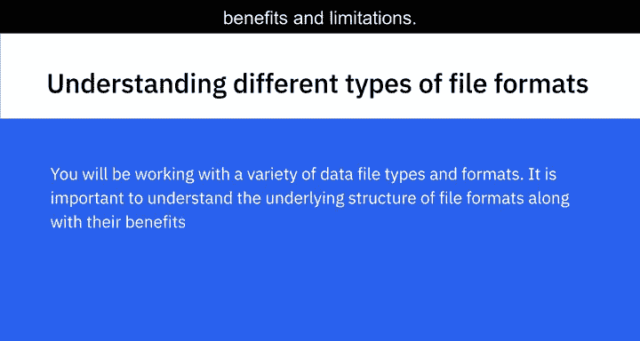

上一节我们概述了课程内容，本节中我们来看看第一种文件格式：分隔文本文件。

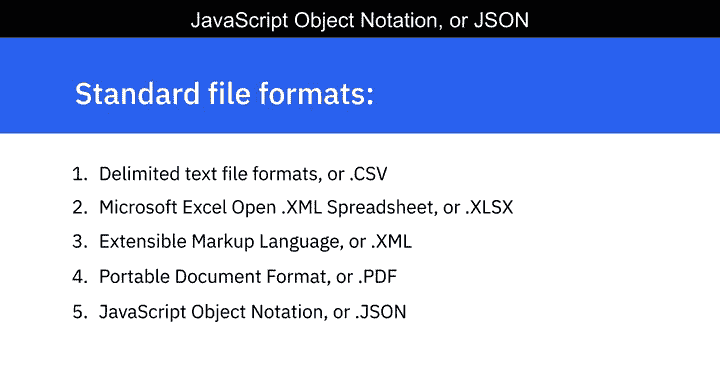

分隔文本文件是以文本形式存储数据的文件，其中每一行（或每一行记录）的值都由一个**分隔符**隔开。分隔符是一个或多个字符的序列，用于指定独立实体或值之间的边界。

任何字符都可以用作分隔符，但最常见的分隔符是**逗号**、**制表符**、**冒号**、**竖线**和**空格**。

以下是两种最常见的分隔文本文件类型：
*   **逗号分隔值（CSV）**：其分隔符是逗号。
*   **制表符分隔值（TSV）**：其分隔符是制表符。当文本数据本身包含字面逗号而无法用作分隔符时，TSV 可作为 CSV 格式的替代方案。

文本文件中的每一行都包含一组由分隔符分隔的值，代表一条记录。第一行通常作为列标题，每一列可以包含不同类型的数据（例如日期、字符串或整数）。

分隔文件允许字段值为任意长度，被视为提供直接信息模式的标准格式，几乎可以被所有现有应用程序处理。

---

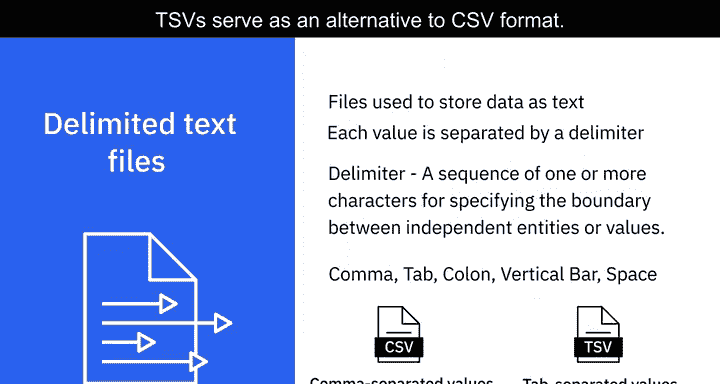

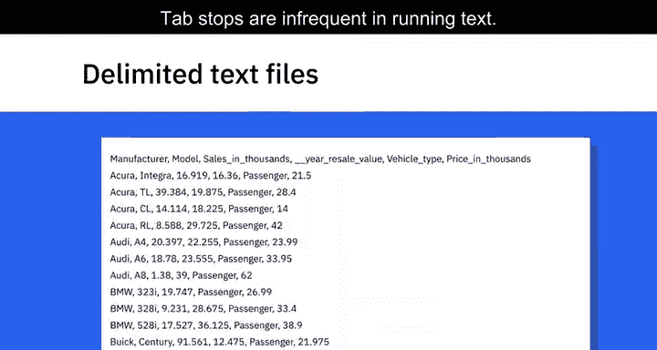

## 📊 Microsoft Excel Open XML 电子表格（XLSX）

了解了基础的文本格式后，我们来看看更结构化的电子表格格式。

Microsoft Excel Open XML 电子表格（XLSX）是一种属于电子表格文件格式的 Microsoft Excel 开放 XML 文件格式。它是一个基于 XML 的文件格式，由 Microsoft 创建。

一个 XLSX 文件（也称为工作簿）可以包含多个工作表。每个工作表都组织成行和列，其交叉点就是单元格，每个单元格包含数据。

XLSX 使用开放文件格式，这意味着大多数其他应用程序通常都可以访问它。它可以使用并保存 Excel 中的所有可用功能，并且也被认为是更安全的文件格式之一，因为它无法保存恶意代码。

---

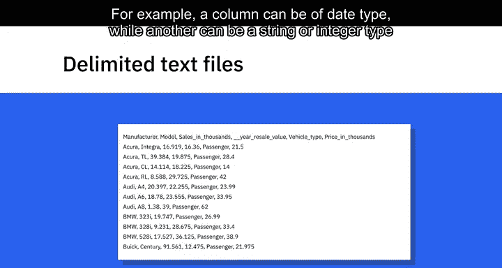

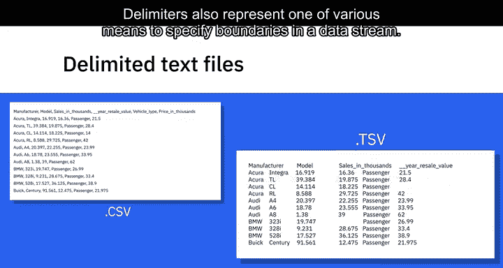

## 🏷️ 可扩展标记语言（XML）

上一节我们介绍了电子表格格式，本节中我们来看看另一种用于编码数据的标记语言。

可扩展标记语言（XML）是一种具有编码数据规则的标记语言。XML 文件格式对人类和机器都可读。它是一种为通过互联网发送信息而设计的自描述语言。

XML 在某些方面与 HTML 相似，但也有区别。例如，XML 不像 HTML 那样使用预定义的标签。

XML 独立于平台和编程语言，因此简化了不同系统之间的数据共享。

---

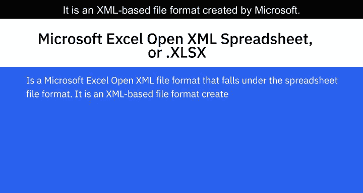

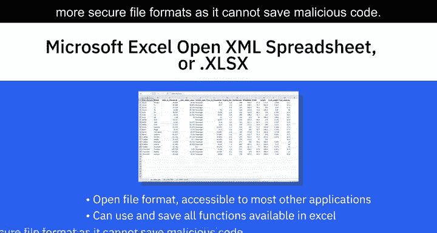

## 📑 便携式文档格式（PDF）

除了用于数据交换的格式，我们还需要了解一种用于文档呈现的通用格式。

便携式文档格式（PDF）是 Adobe 开发的一种文件格式，用于呈现独立于应用程序软件、硬件和操作系统的文档。这意味着它可以在任何设备上以相同的方式查看。

这种格式常用于法律和财务文件，也可用于填写数据，例如表单。

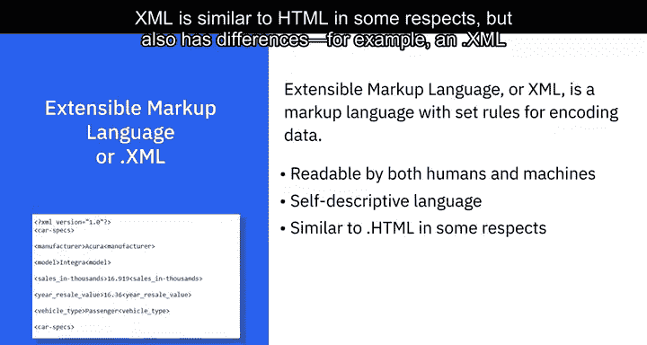

---

## 🔄 JavaScript 对象表示法（JSON）

最后，我们来看一种在现代网络应用中极其流行的数据交换格式。

JavaScript 对象表示法（JSON）是一种基于文本的开放标准，专为通过网络传输结构化数据而设计。该文件格式是一种独立于语言的数据格式，可以用任何编程语言读取。

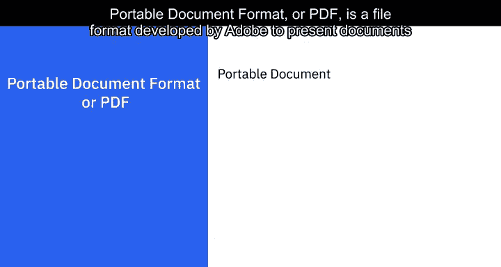

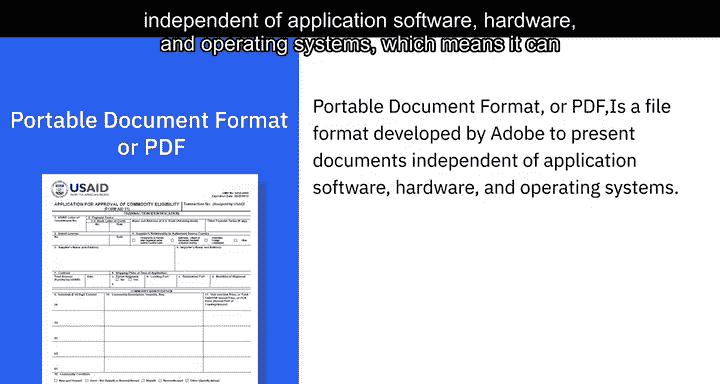

JSON 易于使用，与广泛的浏览器兼容，并被认为是共享任何大小和类型数据（甚至是音频和视频）的最佳工具之一。这也是许多 API 和 Web 服务器以 JSON 格式返回数据的原因之一。

---

## 📝 总结

本节课中，我们一起学习了数据工程中五种常见的文件格式：
1.  **分隔文本文件（如 CSV/TSV）**：使用特定字符分隔值的简单文本格式。
2.  **Microsoft Excel Open XML 电子表格（XLSX）**：基于 XML 的结构化电子表格格式。
3.  **可扩展标记语言（XML）**：用于编码和交换数据的自描述标记语言。
4.  **便携式文档格式（PDF）**：用于跨平台一致呈现文档的格式。
5.  **JavaScript 对象表示法（JSON）**：轻量级、语言无关的数据交换格式，广泛用于 Web 服务。

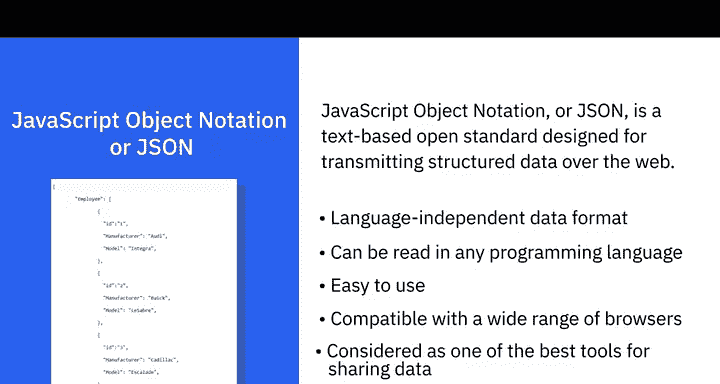

理解这些格式的特点将帮助你在实际工作中根据数据的使用场景、共享需求和性能要求做出恰当的选择。