# 013：数据来源详解

在本节课中，我们将学习数据工程中各种常见的数据来源。数据来源是数据管道的起点，理解它们的类型和特点对于构建高效的数据处理流程至关重要。

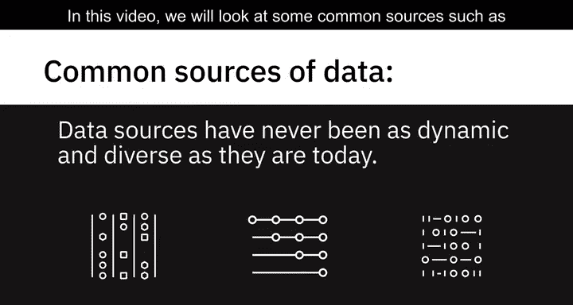

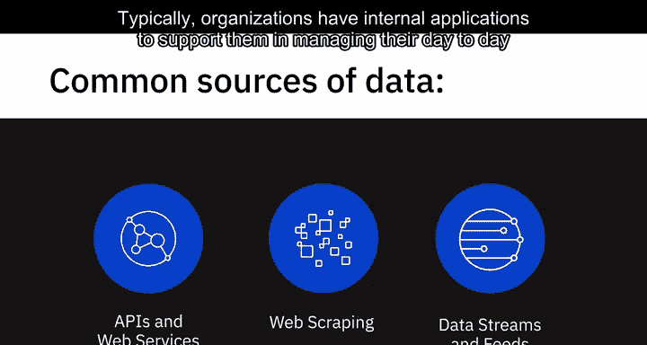

---

## 🏢 内部数据源

在之前的视频中我们提到，当今的数据来源比以往任何时候都更加动态和多样。本节中，我们来看看一些常见的数据源，例如关系数据库、平面文件、XML数据、API、Web服务、网络爬虫、数据流和订阅源。

通常，组织内部会使用各种应用程序来支持其日常业务活动、客户交易、人力资源活动和工作流程的管理。

这些系统使用关系数据库（如 **SQL Server**、**Oracle**、**MySQL** 和 **IBM DB2**）以结构化的方式存储数据。存储在数据库和数据仓库中的数据可以作为分析的数据源。

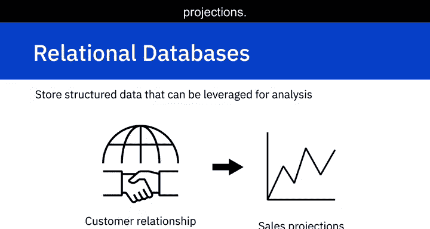

例如，来自零售交易系统的数据可用于分析不同地区的销售情况，而来自客户关系管理系统的数据可用于进行销售预测。

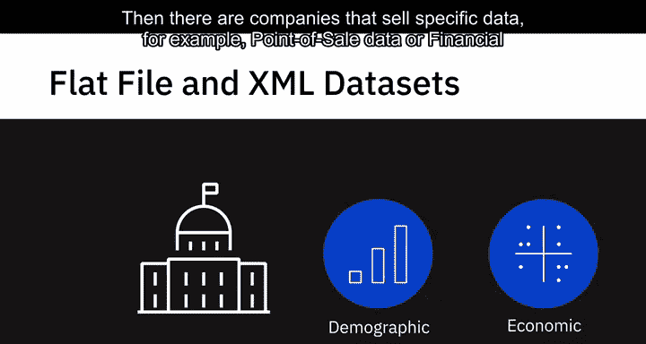

---

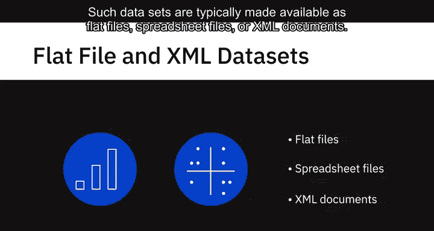

## 🌐 外部数据源

在组织外部，还存在其他公开或私有的可用数据集。

例如，政府机构会持续发布人口统计和经济数据集。此外，还有一些公司专门销售特定数据，例如销售点数据、金融数据或天气数据。

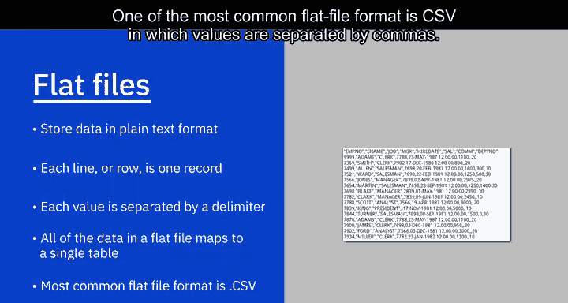

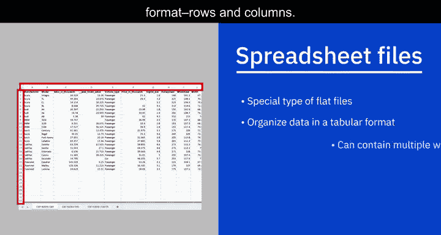

企业可以利用这些数据来制定战略、预测需求，并在分销或营销推广等方面做出决策。

这类数据集通常以平面文件、电子表格文件或XML文档的形式提供。

以下是几种常见的外部数据文件格式：

*   **平面文件**：以纯文本格式存储数据，每行一条记录，每个值由逗号、分号或制表符等分隔符分隔。平面文件中的数据映射到单个表，这与包含多个表的关系数据库不同。最常见的平面文件格式之一是 **CSV**（逗号分隔值文件）。
*   **电子表格文件**：一种特殊的平面文件，同样以表格格式（行和列）识别数据。但电子表格可以包含多个工作表，每个工作表可以映射到不同的表。虽然电子表格中的数据是纯文本，但文件可以以自定义格式存储，并包含格式、公式等附加信息。**Microsoft Excel**（存储为XLS或XLSX格式）可能是最常见的电子表格，其他还包括Google Sheets、Apple Numbers和Libre Office。
*   **XML文件**：包含使用标签标识或标记的数据值。与映射到单个表的平面文件数据不同，XML文件可以支持更复杂的数据结构，例如层次结构。XML的一些常见用途包括来自在线调查、银行对账单的数据集以及其他非结构化数据集。

---

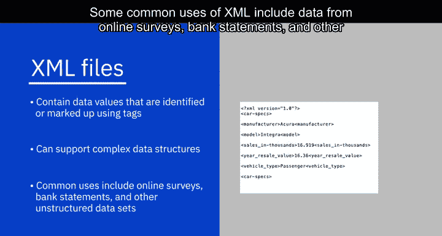

## 🔌 API与Web服务

许多数据提供商和网站提供API（应用程序编程接口）和Web服务，多个用户或应用程序可以与之交互，以获取数据进行处理或分析。

API和Web服务通常监听传入的请求（这些请求可以是来自用户的Web请求形式，也可以是来自应用程序的网络请求），并以纯文本、XML、HTML、JSON或媒体文件的形式返回数据。

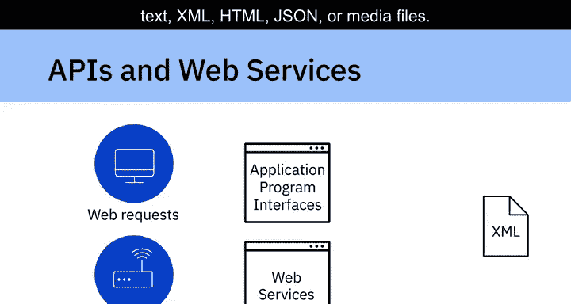

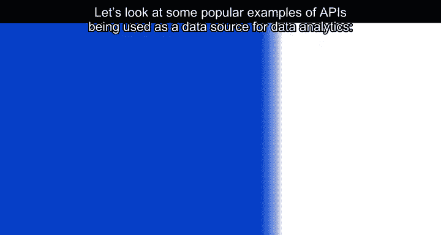

让我们看一些将API用作数据分析数据源的流行例子：

*   使用**Twitter**和**Facebook API**从推文和帖子中获取数据，用于执行意见挖掘或情感分析等任务，即总结对特定主题（如政府政策、产品、服务或总体客户满意度）的赞赏和批评数量。
*   **股市API**用于提取股票和商品价格、每股收益和历史价格等数据，用于交易和分析。
*   **数据查找和验证API**，这对数据分析师清理和准备数据非常有用，也可用于核心数据，例如检查邮政编码或区号属于哪个城市或州。
*   API还用于从组织内部和外部的数据库源中提取数据。

---

## 🕷️ 网络爬虫

网络爬虫用于从非结构化来源中提取相关数据，也称为屏幕抓取、网络采集和网络数据提取。网络爬虫使得根据定义的参数从网页下载特定数据成为可能。

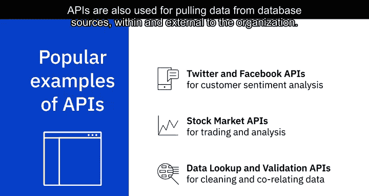

网络爬虫可以从网站中提取文本、联系信息、图像、视频、产品项目等内容。网络爬虫的一些常见用途包括：从零售商、制造商和电子商务网站收集产品详细信息以提供价格比较；通过公共数据源生成销售线索；从各种论坛和社区的帖子和作者中提取数据；以及为机器学习模型收集训练和测试数据集。

一些流行的网络爬虫工具包括 **Beautiful Soup**、**Scrapy**、**Pandas** 和 **Selenium**。

---

## 🌊 数据流与订阅源

数据流是另一种广泛使用的数据源，用于聚合来自仪器、物联网设备、应用程序、汽车GPS数据、计算机程序、网站和社交媒体帖子等来源的持续数据流。这些数据通常带有时间戳，也可能带有地理标签用于地理识别。

一些数据流及其利用方式包括：

*   用于金融交易的股票和市场行情数据流。
*   用于预测需求和供应链管理的零售交易流。
*   用于威胁检测的监控和视频流。
*   用于情感分析的社交媒体信息流。
*   用于监控工业或农业机械的传感器数据流。
*   用于监控网络性能和改进设计的网络点击流。
*   用于重新预订和重新安排航班的实时航班事件流。

一些用于处理数据流的流行应用程序包括 **Apache Kafka**、**Apache Spark Streaming** 和 **Apache Storm**。

**RSS**（真正简易聚合）订阅源是另一种流行的数据源，通常用于从在线论坛和新闻网站捕获持续更新的数据。

使用订阅源阅读器（一种将RSS文本文件转换为更新数据流的接口），更新内容会流式传输到用户设备。

---

## 📝 总结

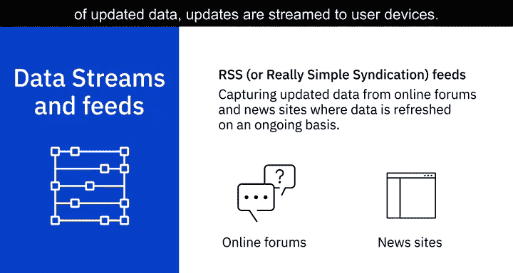

本节课中，我们一起学习了数据工程中多种多样的数据来源。我们从组织内部的关系数据库开始，探讨了外部的平面文件、电子表格和XML文档。接着，我们了解了如何通过API和Web服务以编程方式获取数据，以及如何使用网络爬虫从网页提取信息。最后，我们介绍了持续不断的数据流和RSS订阅源。理解这些数据源的特性和适用场景，是构建有效数据采集和集成流程的第一步。