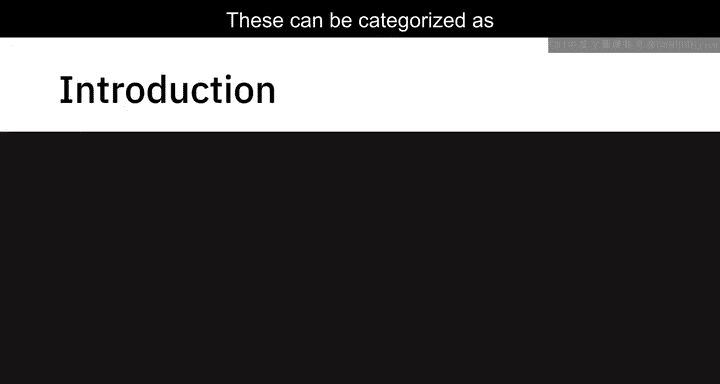
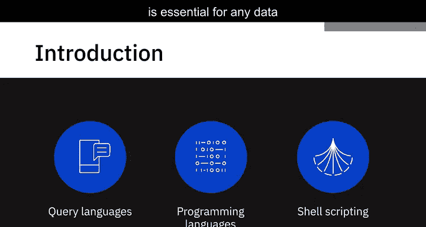
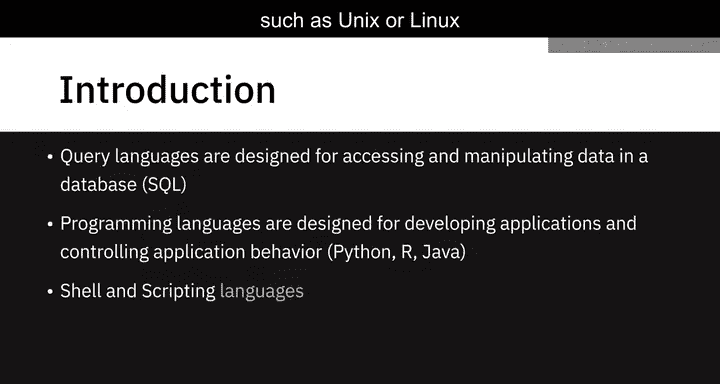
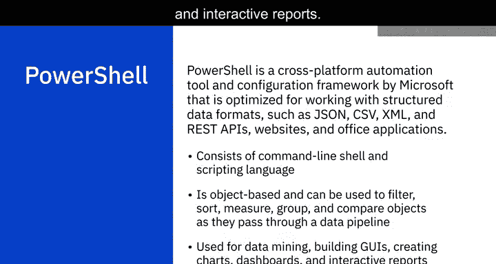

# 014：数据专业人员的编程语言

在本节课中，我们将学习与数据专业人员工作相关的一些编程语言。这些语言可以分为查询语言、编程语言和Shell脚本语言。对于任何数据专业人员而言，精通每个类别中的至少一种语言都至关重要。

## 🔍 查询语言

上一节我们介绍了语言分类，本节中我们来看看查询语言。简单来说，查询语言是为访问和操作数据库中的数据而设计的。例如，**SQL**。

## 💾 SQL：结构化查询语言

SQL是一种查询语言，主要用于（尽管不限于）访问和操作关系型数据库中的信息。使用SQL，我们可以编写一组指令来执行操作，例如在数据库中插入、更新和删除记录，创建新的数据库、表和视图，以及编写存储过程。这意味着你可以编写一组指令并稍后调用它们。

以下是使用SQL的一些优势：

*   **可移植性**：SQL可跨平台使用，独立于平台。
*   **广泛适用**：可用于查询各种数据库和数据存储库中的数据，尽管每个供应商可能有一些变体和特殊扩展。
*   **语法简单**：其语法类似于英语，允许开发者使用`SELECT`、`INSERT INTO`、`UPDATE`等基本关键字，以比其他一些编程语言更少的代码行编写程序。
*   **高效检索**：可以快速高效地检索大量数据。
*   **解释型系统**：SQL在解释器系统上运行，意味着代码编写后即可执行，使得原型设计快速简便。
*   **社区与文档**：由于其庞大的用户社区和多年来积累的大量文档，SQL是最流行的查询语言之一。它继续为全球所有用户提供一个统一的平台。

## 💻 编程语言

在了解了查询语言之后，我们转向编程语言。编程语言是为开发应用程序和控制应用程序行为而设计的。例如，**Python**、**R**和**Java**。

### 🐍 Python

Python是一种广泛使用的开源、通用、高级编程语言。与一些较旧的语言相比，其语法允许程序员用更少的代码行表达概念。

Python被认为是最容易学习的语言之一，拥有庞大的开发者社区，因为它注重简单性、可读性且学习曲线平缓。它是初学者的理想工具。它非常适合对海量数据执行高计算任务，否则这些任务可能极其耗时且繁琐。Python提供了如`NumPy`和`Pandas`这样的库，通过使用并行处理来简化任务。它内置了几乎所有常用概念的函数。

Python支持多种编程范式，如面向对象、命令式、函数式和过程式，使其适用于广泛的用例。

现在，让我们看看使Python成为当今世界上增长最快的编程语言之一的一些原因：

*   **易于学习**：使用Python，你可以用比其他语言更少的代码行完成任务。
*   **开源**：Python是免费的，并采用基于社区的开发模式。
*   **跨平台**：可在Windows和Linux环境中运行，并可移植到多个平台。
*   **社区支持**：拥有广泛的社区支持，提供了大量有用的分析库。
*   **丰富的库**：拥有多个用于数据操作、数据可视化、统计和数学的开源库。其庞大的库和功能还包括用于数据清理和分析的`Pandas`，用于统计分析的`NumPy`和`SciPy`，用于网络爬虫的`Beautiful Soup`和`Scrapy`，用于以条形图、直方图和饼图形式可视化数据的`Matplotlib`和`Seaborn`，以及用于图像处理的`OpenCV`。

### 📊 R

R是一种用于数据分析、数据可视化、机器学习和统计的开源编程语言和环境，广泛用于开发统计软件和执行数据分析。它尤其以创建引人注目的可视化效果而闻名，这使其在该领域相对于其他一些语言具有优势。

R的一些主要优点包括：

*   **开源与跨平台**：是一种开源、平台独立的编程语言。
*   **可配对性**：可以与包括Python在内的许多编程语言配对使用。
*   **高度可扩展**：意味着开发者可以通过定义新函数来持续添加功能。
*   **数据处理能力强**：便于处理结构化和非结构化数据，意味着它具有更全面的数据处理能力。
*   **强大的可视化库**：拥有如`ggplot2`和`Plotly`这样的库，为用户提供美观的图形绘图。
*   **报告与交互应用**：可以制作嵌入数据和脚本的报告，以及允许用户操作结果和数据的交互式Web应用程序。
*   **统计工具开发**：在开发统计工具方面，R在其他编程语言中占主导地位。

### ☕ Java

Java是一种面向对象、基于类且平台独立的编程语言，最初由Sun Microsystems开发。它是当今使用最多的顶级编程语言之一。

Java在数据分析的多个过程中都有应用，包括数据清理、数据导入导出、统计分析和数据可视化。事实上，大多数用于大数据的热门框架和工具通常都是用Java编写的，例如`Hadoop`、`Hive`和`Spark`。它非常适合对速度要求严格的项目。

## 🖥️ Shell与脚本语言

最后，我们来看看Shell和脚本语言。这类语言，如**Unix/Linux Shell**和**PowerShell**，非常适合重复且耗时的操作任务。

### 🐚 Unix/Linux Shell

Unix或Linux Shell脚本是为Unix Shell编写的计算机程序。它是一系列写在纯文本文件中的Unix命令，用于完成特定任务。

编写Shell脚本快速且简单。它对于重复性任务非常有用，这些任务如果一次键入一行命令来执行可能会非常耗时。

Shell脚本执行的典型操作包括：

*   文件操作
*   程序执行
*   系统管理任务，如磁盘备份和评估系统日志
*   复杂程序的安装脚本
*   执行例行备份
*   运行批处理任务

### ⚡ PowerShell

PowerShell是微软推出的跨平台自动化工具和配置框架，针对处理结构化数据格式（如JSON、CSV、XML和REST API）、网站和Office应用程序进行了优化。它由命令行Shell和脚本语言组成。

PowerShell基于对象，这使得在对象通过数据管道时，可以对它们进行过滤、排序、测量、分组、比较等多种操作。它也是数据挖掘、构建GUI、创建图表、仪表板和交互式报告的好工具。

## 📝 总结

本节课中，我们一起学习了数据专业人员常用的三类编程语言：查询语言（如**SQL**）、编程语言（如**Python**、**R**、**Java**）以及Shell脚本语言（如**Unix/Linux Shell**和**PowerShell**）。每种语言都有其特定的优势和适用场景，掌握这些工具是成为一名高效数据工程师的基础。