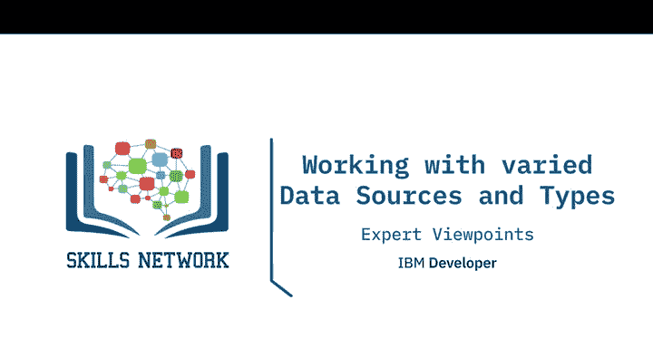
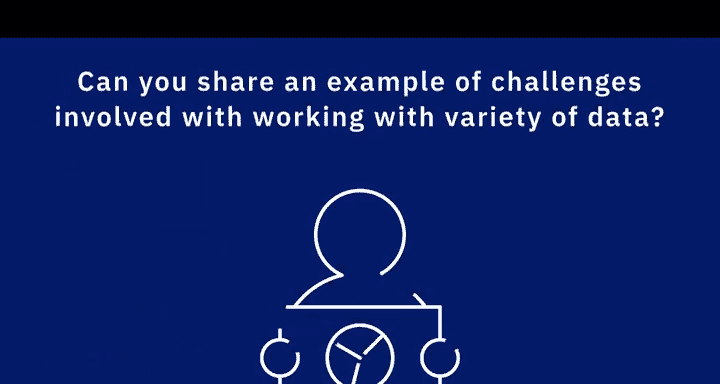
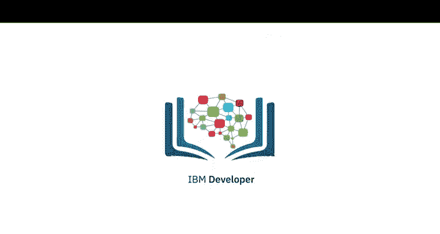

# 015：多源多类型数据处理视角

在本节课中，我们将聆听几位数据专业人士分享他们处理多种数据源和数据类型的经验。你将了解到数据可能以各种意想不到的方式出现，以及数据工程师如何应对这些挑战。

## 🔄 处理多种数据源的核心理念

上一节我们介绍了课程概述，本节中我们来看看数据专业人士对处理多源数据的核心看法。

一位专家提到：“我倾向于使用关系型数据库，因此花费大量时间使用SQL。我利用SQL的能力来处理数据迁移、数据结构化以及数据安全细节。但显然，这并不适用于所有场景。”

即使完全在关系型数据库环境中工作，数据迁移也常带来挑战，尤其是在不同供应商的数据库之间进行迁移时。版本差异是常见障碍，有时所需功能存在于比当前版本高两个级别的版本中，或者其工作方式与两个版本前不同。

**因此，处理多数据源的关键在于灵活性**，在于找到既能工作又能满足性能需求的函数或方法。一次性迁移数据通常并不困难（只要数据量在TB级以下），但以高性能的方式持续、稳定地迁移数据，则迫使我们评估多种不同的解决方案。

我们需要对新想法持开放态度，并寻找能满足需求的新解决方案。

## 🗄️ 关系型数据库与新兴数据类型的演变

上一节我们探讨了处理多源数据的灵活性，本节中我们来看看数据存储技术本身的演变。

另一位专家分享道：“我主要使用关系型数据库，它们极其灵活且经受住了时间考验。然而，随着日志、文档、XML、JSON等非结构化数据的演进，关系型数据库作为解决所有数据问题的声誉受到了严格审视。”

许多数据密集型应用（如物联网和社交媒体应用）开始寻找其他解决方案。例如，谷歌在2006年发布了一份名为“Google BigTable”的白皮书，这个想法迅速流行起来。Cassandra和HBase就源于与Google BigTable相同的架构模型，它们成为广泛流行的数据库，以解决一些关系型数据库未能解决的问题。

关系型数据库在处理某些重型数据密集型应用（如物联网、传感器数据、社交媒体数据）时有些吃力。这是因为驱动这些关系型数据库的B树数据结构，由于其随机读取和随机写入的特性，在重型写入应用下速度会变慢。

## 📊 数据工程师必须面对的数据多样性

处理多种数据是数据工程师工作中不可避免的一部分。你需要处理标准格式的数据，也需要处理专有格式的数据。

以下是数据工程师可能遇到的数据类型和来源：

*   **数据格式**：你需要处理如CSV、JSON、XML等标准格式，也可能需要处理专有格式。
*   **数据源**：数据可能来自关系型数据库、NoSQL数据库或大数据存储库。
*   **数据状态**：你需要处理静态数据、流数据或运动中的数据。

你可能无法从一开始就具备处理所有这些不同类型数据源的技能，但你需要具备在工作中学习的能力，并掌握项目所需的技能，以处理不同的数据集、数据格式和数据源。

## ⚙️ 不同数据格式的挑战与演进

当涉及具体的数据格式时，日志数据、XML数据、JSON数据等都各有其挑战。

以下是几种常见数据格式的特点：

*   **日志数据**：极具挑战性，因为它是非结构化的。你可能需要根据分析目标编写自定义工具来解析数据。
*   **XML**：大约十年前非常流行，特别是在Web应用的SOAP协议中。然而，Web开发人员和企业很快发现它可能非常消耗资源（尤其是内存），因为它有开始和结束标签。
*   **JSON**：随后登场，它去掉了结束标签，采用类似键值对的形式，节省了一些资源。现在它被广泛用作RESTful API的一部分。
*   **Apache Avro**：这类更新的数据格式因其存储数据的高效性而获得广泛欢迎。

## 🧩 实际案例：特殊字符带来的数据迁移挑战

理论知识需要结合实际案例来理解。让我们看一个具体的数据迁移挑战实例。

一个特定的情况是，我们需要将数据从DB2数据库转换到SQL Server数据库。这很有挑战性，因为这两种数据库期望的导入导出方式略有不同。数据本身尤其具有挑战性，项目中很多挑战可能正来源于数据本身。

在这个案例中，数据包含许多不同的字符。通常，我们会寻找一个字符作为分隔符（通常是逗号），以便用逗号分隔字段。但我们也必须考虑数据本身包含逗号的情况。

**核心问题在于：如何正确分隔这些数据？如何正确定义字段？**

在这个特定案例中，我们必须为不同的表使用不同的分隔符，因为我们能想到的每一个特殊字符都出现在其中一张表里。而那些没有被使用的特殊字符，有时是我们不能用于分隔的，比如退格字符。

---

**本节课总结**

在本节课中，我们一起学习了数据工程师在处理多源、多类型数据时的视角与挑战。我们了解到**灵活性**和**持续学习**是应对数据多样性的关键。从关系型数据库到NoSQL，从XML到JSON和Avro，数据生态在不断演进。实际工作中，数据迁移的挑战往往源于数据本身的复杂性，例如特殊字符的处理。掌握这些核心概念，将为你在数据工程领域的深入学习打下坚实基础。