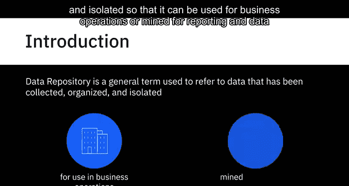
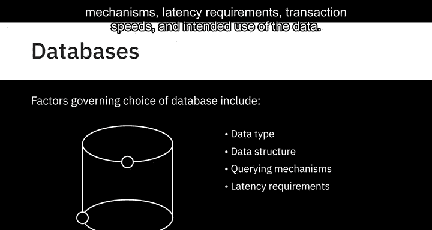
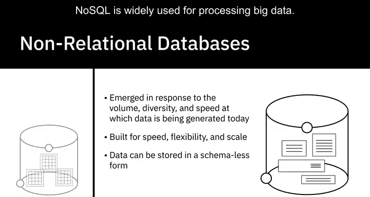
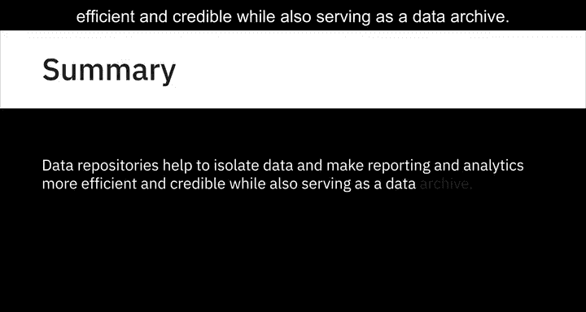

# 016：数据存储库概述 📚

在本节课中，我们将学习数据存储库的基本概念。数据存储库是数据工程领域的核心组成部分，它指的是为业务运营、报告和数据分析而收集、组织和隔离的数据集合。我们将探讨不同类型的存储库，包括数据库、数据仓库和大数据存储，并了解它们各自的特点和用途。

---

## 什么是数据存储库？🗃️

数据存储库是一个通用术语，指代那些被收集、组织并隔离起来，以便用于业务运营或进行报告和数据分析的数据。它可以是一个小型或大型的数据库基础设施，包含一个或多个用于收集、管理和存储数据的数据库。



在接下来的内容中，我们将概述您的数据可能驻留的不同类型的存储库，例如数据库、数据仓库和大数据存储，并在后续视频中更详细地探讨它们。

---

## 数据库：数据的基础存储单元 💾

上一节我们介绍了数据存储库的总体概念，本节中我们来看看其中最基本的一种类型：数据库。

数据库是为数据的输入、存储、搜索、检索和修改而设计的数据或信息集合。数据库管理系统（DBMS）是一组用于创建和维护数据库的程序。它允许您通过称为“查询”的功能来存储、修改和从数据库中提取信息。

例如，如果您想查找已闲置六个月或更长时间的客户，使用查询功能，数据库管理系统将从数据库中检索所有闲置六个月或更长时间客户的数据。

尽管数据库和DBMS含义不同，但这两个术语经常互换使用。

以下是影响数据库选择的几个因素：
*   **数据类型和结构**
*   **查询机制**
*   **延迟要求**
*   **事务处理速度**
*   **数据的预期用途**



---

## 关系型与非关系型数据库 🔄

上一节我们了解了数据库的基本功能，本节中我们将区分两种主要的数据库类型。

这里需要提及两种主要的数据库类型：关系型数据库和非关系型数据库。

**关系型数据库**，也称为RDBMS，其组织原则建立在平面文件之上。数据被组织成具有行和列的表格格式，遵循明确定义的结构和模式。然而，与平面文件不同，RDBMS针对涉及多个表和更大数据量的数据操作和查询进行了优化。结构化查询语言（SQL）是关系型数据库的标准查询语言。

**公式/代码示例：**
```sql
-- 一个简单的SQL查询示例，用于从“客户”表中选择数据
SELECT * FROM 客户 WHERE 最后活跃日期 < DATE_SUB(NOW(), INTERVAL 6 MONTH);
```

然后我们有**非关系型数据库**，也称为NoSQL或Not Only SQL。非关系型数据库的出现是为了应对当今数据生成的速度、多样性和体量，主要受到云计算、物联网和社交媒体普及发展的影响。非关系型数据库为速度、灵活性和可扩展性而构建，使得以无模式或自由形式的方式存储数据成为可能。NoSQL被广泛用于处理大数据。

---

## 数据仓库：集成的分析中心 🏢



了解了基础的数据存储单元后，我们来看看用于集成和分析的数据仓库。

数据仓库作为一个中央存储库，合并来自不同来源的信息，并通过提取、转换和加载过程（也称为ETL过程）将其整合到一个全面的数据库中，用于分析和商业智能。在较高层次上，ETL过程帮助您从不同的数据源提取数据，将数据转换为干净可用的状态，并将数据加载到企业的数据存储库中。

与数据仓库相关的概念还有数据集市和数据湖，我们将在后面介绍。数据集市和数据仓库在历史上一直是关系型的，因为许多传统的企业数据都驻留在RDBMS中。然而，随着NoSQL技术和新数据源的出现，非关系型数据存储库现在也被用于数据仓库。

---

## 大数据存储：应对海量数据 🌊

最后，我们来看另一类用于处理超大规模数据的数据存储库。

另一类数据存储库是**大数据存储**，它包括分布式的计算和存储基础设施，用于存储、扩展和处理非常大的数据集。

---

## 总结 📝

本节课中，我们一起学习了数据存储库的核心概念。总体而言，数据存储库有助于隔离数据，使报告和分析更加高效和可靠，同时也充当数据档案库。



我们首先定义了数据存储库，然后深入探讨了其具体类型：作为基础单元的数据库（包括关系型和非关系型），用于集成分析的数据仓库及其ETL过程，以及专为海量数据设计的大数据存储。理解这些不同类型的存储库及其适用场景，是构建有效数据工程解决方案的第一步。