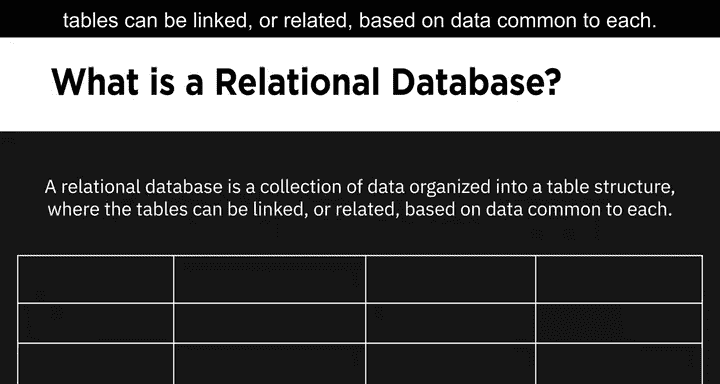
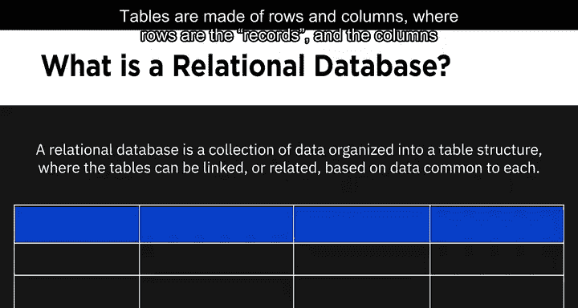
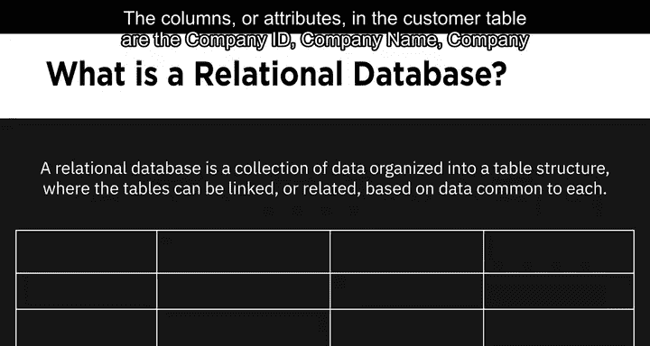
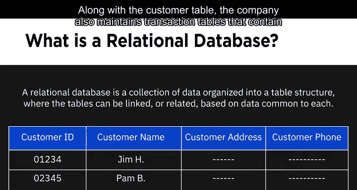
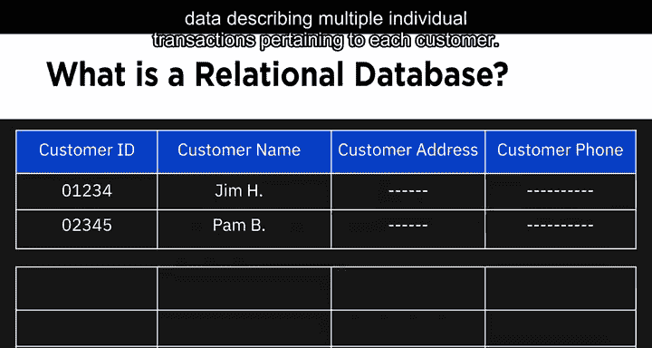
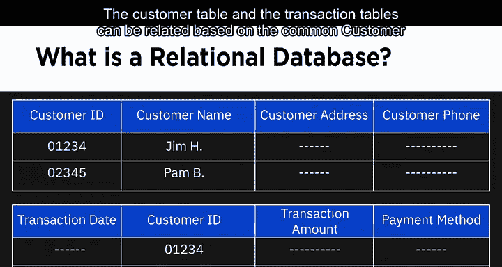
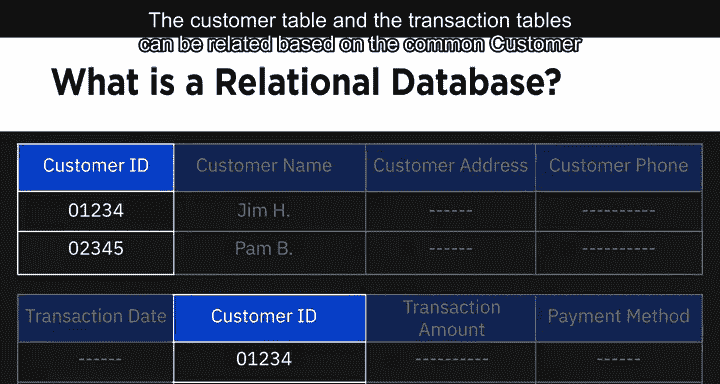
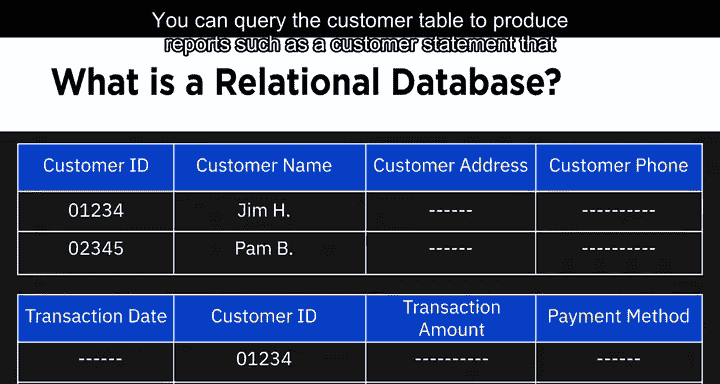
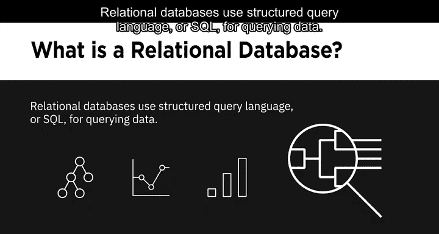
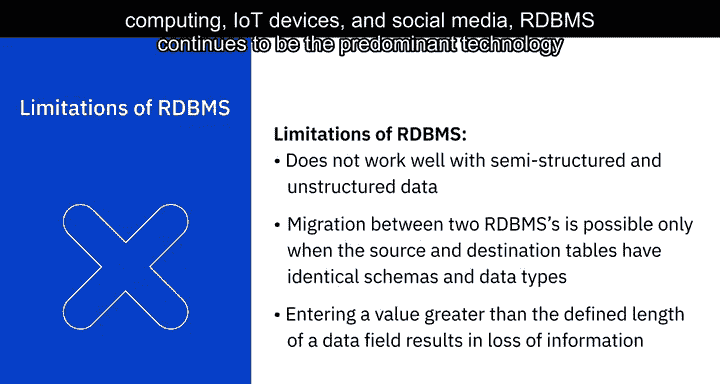

# 017：关系型数据库管理系统（RDBMS）详解

在本节课中，我们将学习关系型数据库管理系统（RDBMS）的核心概念、结构、优势、应用场景及其局限性。我们将通过简单的例子和清晰的解释，帮助你理解这一数据存储与管理的基础技术。

---

## 🏗️ 关系型数据库的结构

关系型数据库是一种将数据组织成表格结构的数据集合，这些表格可以基于彼此共有的数据进行链接或关联。

表格由行和列组成，其中行代表记录，列代表属性。

让我们以一家公司的客户表为例，该表维护着每位客户的数据。

客户表中的列或属性包括：客户ID、客户姓名、客户地址和客户主要电话。每一行则是一条客户记录。

---

## 🔗 表格的关联关系

现在，我们来理解“表格基于共有数据进行链接或关联”的含义。

除了客户表，该公司还维护着交易表，其中包含描述每位客户相关多笔独立交易的数据。

交易表的列可能包括：交易日期、客户ID、交易金额和支付方式。

客户表和交易表可以基于共有的客户ID字段进行关联。

你可以查询客户表以生成报告，例如一份汇总了特定时间段内所有交易的客户对账单。

这种基于共有数据关联表格的能力，使你能够通过单一查询，从一个或多个表格的数据中检索出一个全新的表格。它还允许你理解所有可用数据之间的关系，并获得新的见解以做出更好的决策。

关系型数据库使用结构化查询语言（SQL）来查询数据。我们将在本课程后续部分更详细地学习SQL。

---

## 📊 关系型数据库与平面文件的区别

关系型数据库建立在平面文件（如电子表格）的组织原则之上，数据按照定义良好的结构和模式组织成行和列。

但相似之处仅此而已。关系型数据库在设计上非常适合对大量数据进行优化的存储、检索和处理。

与行数和列数有限的电子表格不同，关系型数据库中的每个表都有唯一的行和列集合，并且可以在表之间定义关系，这最大限度地减少了数据冗余。

此外，你可以将数据库字段限制为特定的数据类型和值，这减少了不规则性，并带来了更高的一致性和数据完整性。

关系型数据库使用SQL查询数据，这使你能够处理数百万条记录并在几秒钟内检索大量数据。

此外，关系型数据库的安全架构提供了对数据的受控访问，并确保可以执行管理数据的标准和策略。

---

## 🌐 关系型数据库的类型与示例

关系型数据库的范围从小型桌面系统到大规模云基系统不等。

它们可以是开源且内部支持的、开源但有商业支持的，或者是商业闭源系统。

IBM DB2、Microsoft SQL Server、MySQL、Oracle Database 和 PostgreSQL 是一些流行的关系型数据库。

基于云的关系型数据库，也称为数据库即服务（DBaaS），正获得广泛使用，因为它们可以利用云提供的近乎无限的计算和存储能力。

一些流行的云关系型数据库包括 Amazon Relational Database Service (RDS)、Google Cloud SQL、IBM DB2 on Cloud、Oracle Cloud 和 SQL Azure。

---

## ✨ 关系型数据库的优势

RDBMS是一项成熟且文档完善的技术，易于学习并找到合格人才。

关系型数据库方法最显著的优势之一是其通过连接表来创建有意义信息的能力。

其他一些优势包括：

**灵活性**
使用SQL，你可以在数据库运行和查询进行时添加新列、添加新表、重命名关系并进行其他更改。

**减少冗余**
关系型数据库最大限度地减少了数据冗余。例如，客户的信息仅出现在客户表中的单个条目里，而与该客户相关的交易表则存储一个指向客户表的链接。

**易于备份和灾难恢复**
关系型数据库提供简单的导入和导出选项，使备份和恢复变得容易。导出操作可以在数据库运行时进行，使得故障恢复变得简单。基于云的关系型数据库进行持续镜像，这意味着恢复时的数据丢失可以控制在几秒甚至更短的时间内。

**支持ACID合规性**
ACID代表原子性、一致性、隔离性和持久性。ACID合规性意味着数据库中的数据保持准确和一致，即使发生故障，数据库事务也能被可靠地处理。

---

## 🎯 关系型数据库的应用场景

现在，我们来看看关系型数据库的一些应用场景。

**在线事务处理应用程序**
OLTP应用程序专注于以高速率运行的面向事务的任务。关系型数据库非常适合OLTP应用，因为它们可以容纳大量用户，支持插入、更新或删除少量数据的能力，并且也支持频繁的查询和更新以及快速的响应时间。

**数据仓库**
在数据仓库环境中，关系型数据库可以针对在线分析处理进行优化，其中历史数据被用于商业智能分析。

**物联网解决方案**
物联网解决方案需要速度以及从边缘设备收集和处理数据的能力，这需要轻量级的数据库解决方案。

---

## ⚠️ 关系型数据库的局限性

这引出了RDBMS的局限性。

RDBMS不能很好地处理半结构化或非结构化数据，因此不适合对此类数据进行广泛的分析。

在两个RDBMS系统之间进行迁移时，源表和目标表之间的模式和数据类型需要完全相同。

关系型数据库对数据字段的长度有限制，这意味着如果你尝试向一个字段输入超出其容量的信息，该信息将不会被存储。

---

## 📝 总结

尽管存在这些局限性，并且在大数据、云计算、物联网设备和社交媒体时代数据形态不断演变，RDBMS仍然是处理结构化数据的主导技术。

在本节课中，我们一起学习了关系型数据库管理系统的基本结构、工作原理、主要优势、常见应用场景以及其固有的局限性。理解RDBMS是构建数据工程知识体系的重要基石。