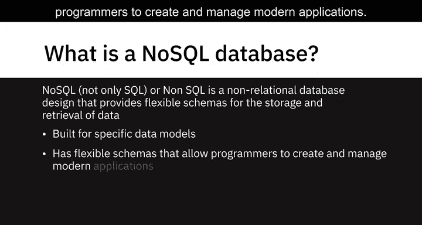
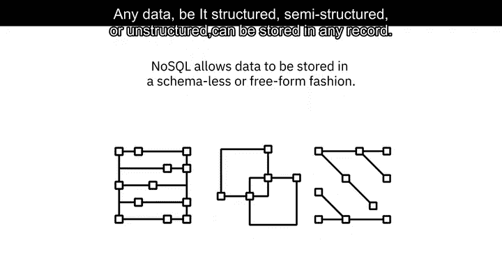
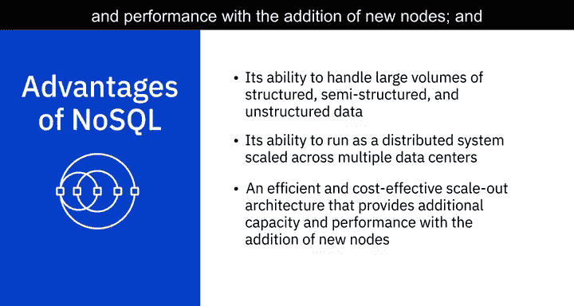
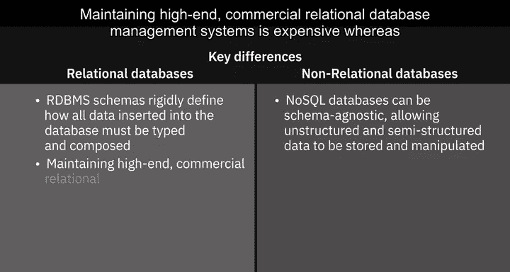

# 018：NoSQL数据库入门

在本节课中，我们将学习NoSQL数据库的基本概念、主要类型及其与传统关系型数据库的区别。NoSQL数据库因其在处理大规模、非结构化数据方面的优势，在现代数据工程中扮演着重要角色。

---

## 🧠 什么是NoSQL？

NoSQL代表“Not Only SQL”（不仅仅是SQL），有时也指“Non-SQL”（非SQL）。它是一种非关系型数据库设计，为数据的存储和检索提供了灵活的架构。

NoSQL数据库已存在多年，但直到云计算、大数据以及高流量Web和移动应用时代才变得更为流行。如今，人们选择NoSQL数据库是因为其在扩展性、性能和易用性方面的特性。

需要强调的是，“NoSQL”中的“No”是“Not Only”的缩写，而非否定词“不”。NoSQL数据库为特定的数据模型构建，并拥有灵活的架构，使程序员能够创建和管理现代应用程序。它们通常不使用具有固定架构的传统行列表数据库设计，并且一般不使用结构化查询语言（SQL）来查询数据，尽管有些可能支持SQL或类SQL接口。

NoSQL允许数据以无模式或自由形式存储。任何数据，无论是结构化、半结构化还是非结构化的，都可以存储在任何记录中。

---

## 🗂️ NoSQL数据库的四种主要类型

根据用于存储数据的模型，NoSQL数据库主要有四种常见类型：键值存储、文档型、列型和图型数据库。

上一节我们介绍了NoSQL的基本概念，本节中我们来看看它的具体类型。

以下是四种主要的NoSQL数据库类型及其特点：

*   **键值存储**
    *   在键值数据库中，数据以键值对的集合形式存储。键代表数据的属性，并且是唯一的标识符。键和值都可以是任何内容，从简单的整数或字符串到复杂的JSON文档。
    *   **适用场景**：存储用户会话数据、用户偏好设置、实时推荐和定向广告以及内存数据缓存。
    *   **局限性**：如果您需要根据特定的数据值进行查询、需要数据值之间的关系或需要多个唯一键，键值存储可能不是最佳选择。
    *   **知名示例**：`Redis`、`Memcached`、`DynamoDB`。

*   **文档型数据库**
    *   文档数据库将每条记录及其关联数据存储在单个文档中。它们支持对文档集合进行灵活的索引、强大的即席查询和分析。
    *   **适用场景**：电子商务平台、医疗记录存储、客户关系管理平台和分析平台。
    *   **局限性**：如果您需要运行复杂的搜索查询和涉及多个操作的事务，文档型数据库可能不是最佳选择。
    *   **知名示例**：`MongoDB`、`DocumentDB`、`CouchDB`、`Cloudant`。

*   **列型数据库**
    *   列型模型将数据存储在按数据列（而非行）分组的单元格中。通常一起访问的列的逻辑分组称为列族。例如，客户的姓名和个人资料信息很可能被一起访问，但他们的购买历史则不会，因此可以将客户姓名和个人资料信息数据分组到一个列族中。由于列数据库将对应于某一列的所有单元格作为连续的磁盘条目存储，因此访问和搜索数据变得非常快速。
    *   **适用场景**：需要大量写入请求的系统、存储时间序列数据、天气数据和物联网数据。
    *   **局限性**：如果您需要使用复杂查询或频繁更改查询模式，这可能不是最佳选择。
    *   **知名示例**：`Cassandra`、`HBase`。

*   **图型数据库**
    *   图型数据库使用图模型来表示和存储数据。它们对于可视化、分析和查找不同数据片段之间的连接特别有用。图中的圆圈是节点，它们包含数据。箭头代表关系。
    *   **适用场景**：处理包含大量互连关系的“连接数据”，例如社交网络、实时产品推荐、网络图、欺诈检测和访问管理。
    *   **局限性**：如果您需要处理大量事务，它可能不是最佳选择，因为图数据库未针对大容量分析查询进行优化。
    *   **知名示例**：`Neo4j`、`Cosmos DB`。

---

## ⚖️ NoSQL的优势与对比

NoSQL的出现是为了应对传统关系型数据库技术的局限性。其主要优势在于处理大量结构化、半结构化和非结构化数据的能力。

以下是NoSQL的一些其他优势：
*   能够作为分布式系统运行，跨多个数据中心扩展，从而利用云计算基础设施。
*   高效且经济高效的横向扩展架构，通过添加新节点来提供额外的容量和性能。
*   设计更简单，能更好地控制可用性。
*   改进的可扩展性，使您能够更加敏捷、灵活，并能更快地进行迭代。

为了总结关系型和非关系型数据库之间的关键区别，我们来看以下几点：

*   **架构**：RDBMS（关系型数据库管理系统）的架构严格定义了插入数据库的所有数据的类型和组成方式，而NoSQL数据库可以是模式无关的，允许存储和操作非结构化和半结构化数据。
*   **成本**：维护高端商业关系型数据库管理系统成本高昂，而NoSQL数据库专门为低成本商用硬件设计。
*   **事务**：与大多数NoSQL数据库不同，关系型数据库支持ACID（原子性、一致性、隔离性、持久性）合规性，这确保了事务的可靠性和故障恢复能力。
*   **成熟度**：RDBMS是一项成熟且有完善文档的技术，这意味着其风险或多或少是可预见的。相比之下，NoSQL是一项相对较新的技术。

尽管如此，NoSQL数据库已经站稳脚跟，并且越来越多地用于关键任务应用程序。

---

## 📝 课程总结

本节课中，我们一起学习了NoSQL数据库的核心概念。我们了解到NoSQL代表“不仅仅是SQL”，它提供了灵活的数据存储方案以应对现代应用的需求。我们详细探讨了四种主要的NoSQL数据库类型：**键值存储**、**文档型**、**列型**和**图型**数据库，并了解了它们各自的适用场景和局限性。最后，我们对比了NoSQL数据库与传统关系型数据库在架构、成本、事务支持和成熟度方面的关键区别。理解这些差异有助于我们在实际数据工程项目中做出合适的数据库技术选型。