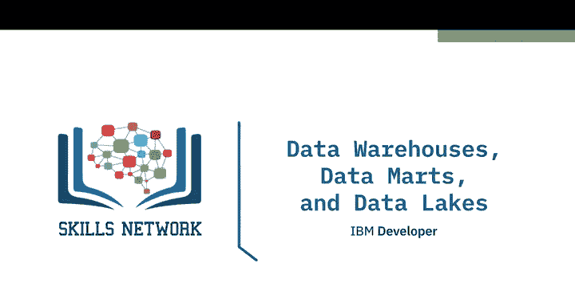
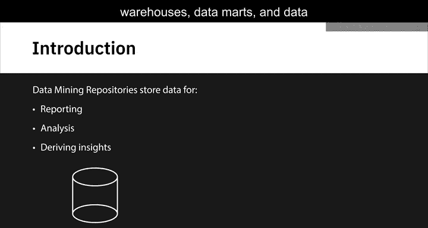
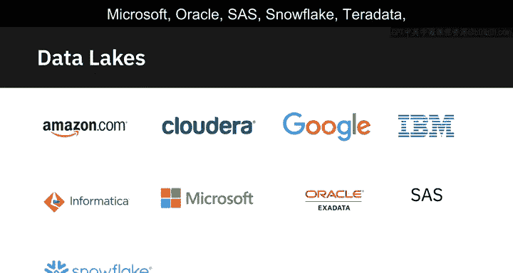
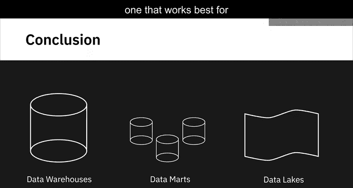
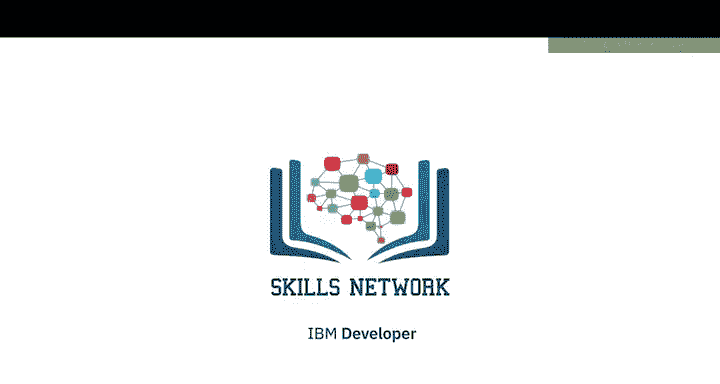

# 019：数据仓库、数据集市与数据湖 🏢

在本节课中，我们将学习三种核心的数据存储库：数据仓库、数据集市和数据湖。它们都旨在存储数据以支持报告、分析和洞察，但其用途、存储的数据类型以及数据访问方式各有不同。我们将逐一探讨它们的特点和应用场景。

## 🏛️ 数据仓库

上一节我们介绍了本课的主题，本节中我们来看看**数据仓库**。

数据仓库是一个集成了来自多个数据源的中央数据存储库。它作为**单一事实来源**，存储经过清洗、整合和分类的当前及历史数据。数据在加载到数据仓库时，已经为特定目的进行了建模和结构化，这意味着它已准备好用于分析。

传统上，数据仓库以存储来自交易系统和运营数据库（如CRM、ERP、HR和财务应用）的关系型数据而闻名。但随着NoSQL技术和新数据源的出现，非关系型数据存储库也开始用于数据仓库。

一个典型的数据仓库采用三层架构：
*   **底层**：包含数据服务器，这些服务器可以是关系型、非关系型或两者兼有，用于从不同来源提取数据。
*   **中间层**：由**OLAP服务器**构成。OLAP（联机分析处理）是一类软件，允许用户处理和分析来自多个数据库服务器的信息。
*   **顶层**：包括客户端前端层。此层包含用于查询、报告和分析数据的所有工具和应用程序。

随着数据量的快速增长和当今复杂的分析工具的出现，曾经部署在本地数据中心的数据仓库正在向云端迁移。与本地版本相比，基于云的数据仓库提供了一些优势，包括：
*   更低的成本
*   无限的存储和计算能力
*   按需付费的扩展模式
*   更快的灾难恢复

当组织拥有来自运营系统的大量数据，并且需要随时可用于报告和分析时，通常会选择数据仓库。

以下是一些常用的数据仓库产品：
*   Teradata企业数据仓库平台
*   Oracle Exadata
*   IBM Db2 Warehouse on Cloud
*   IBM Netezza Performance Server
*   Amazon Redshift
*   Google Cloud的BigQuery
*   Cloudera的企业数据中枢
*   Snowflake云数据仓库

## 🏪 数据集市

了解了作为中央存储库的数据仓库后，本节我们聚焦于更具体、更专注的**数据集市**。

数据集市是数据仓库的一个子集，专为特定的业务功能、目的或用户群体而构建。例如，组织中的销售或财务团队访问数据以进行季度报告和预测。

数据集市有三种基本类型：**依赖型**、**独立型**和**混合型**。

以下是每种类型的特点：
*   **依赖型数据集市**：是企业数据仓库的一个子部分。由于它只提供数据仓库中某个受限区域的分析能力，因此也提供了独立的安全性和性能。
*   **独立型数据集市**：创建自企业数据仓库以外的来源，例如内部运营系统或外部数据。
*   **混合型数据集市**：结合了来自数据仓库、运营系统和外部系统的输入。

区别还在于数据如何从源系统提取、需要应用哪些转换以及数据如何传输到集市中。例如，依赖型数据集市从企业数据仓库中提取数据，那里的数据已经过清洗和转换。而独立型数据集市需要对源数据执行转换过程，因为它直接来自运营系统和外部来源。

无论哪种类型，数据集市的目的都是：
*   向用户提供与他们最相关且及时的数据。
*   通过提供高效的响应时间来加速业务流程。
*   提供一种成本和时间高效的方式来进行数据驱动的决策。
*   改善最终用户响应时间。
*   提供安全的访问和控制。

## 🌊 数据湖

上一节我们讨论了为特定目的而构建的结构化存储，本节我们转向一种更灵活、更原始的存储范式——**数据湖**。

数据湖是一种可以以其原生格式存储大量**结构化**、**半结构化**和**非结构化**数据的数据存储库。数据仓库存储的是为特定需求而清洗、处理和转换过的数据。与之不同，在将数据加载到数据湖之前，你**无需**定义数据的结构和模式，甚至**无需**预先知道最终将用于分析数据的所有用例。

数据湖作为一个原始数据的存储库存在，数据以其从源端获取的原始格式存放，并根据需要进行分析的用例进行转换。但这并不意味着数据湖是一个可以不受治理地随意倾倒数据的地方。在数据湖中，数据会被适当地分类、保护和治理。

数据湖是一种独立于技术的参考架构。它结合了多种技术，共同为分析师和数据科学家提供敏捷的数据探索能力。

数据湖可以通过多种技术部署：
*   使用云对象存储，如Amazon S3。
*   使用用于处理大数据的大规模分布式系统，如Apache Hadoop。
*   也可以部署在不同的关系数据库管理系统上，以及能够存储海量数据的NoSQL数据存储库上。

数据湖提供了许多好处，例如：
*   **存储所有类型数据的能力**：包括非结构化数据（如文档、电子邮件、PDF）、半结构化数据（如JSON、XML、CSV和日志）以及来自关系数据库的结构化数据。
*   **根据存储容量灵活扩展的敏捷性**：可以从TB级扩展到PB级数据。
*   **节省定义结构、模式和转换的时间**：因为数据以其原始格式导入。
*   **以多种不同方式和更广泛用例重新利用数据的能力**。这一点非常有益，因为企业很难预见未来可能利用其数据的所有不同方式。

以下是一些提供数据湖技术、平台和参考架构的供应商：
*   Amazon, Cloudera, Google, IBM, Informatica, Microsoft, Oracle, SAS, Snowflake, Teradata, Zaloni

## 📝 总结

本节课中，我们一起学习了数据存储库（如数据仓库、数据集市和数据湖）的一些功能。虽然它们都有相似的目标，但需要根据用例和技术基础设施的上下文进行评估，以选择最适合组织需求的方案。数据仓库提供集成的、面向分析的结构化视图；数据集市为特定团队提供专注的、高性能的数据切片；而数据湖则以原始格式存储海量多样数据，为未来的探索和分析提供最大的灵活性。