# 020：可选数据湖仓解析 🏗️

在本节课中，我们将通过一个餐厅后厨的类比，来理解数据架构中的核心概念：数据湖、数据仓库以及新兴的数据湖仓。我们将探讨它们各自的特点、优势与挑战，并了解如何将它们结合以构建更高效的数据处理系统。

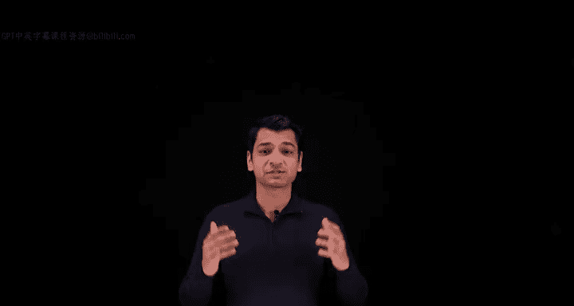

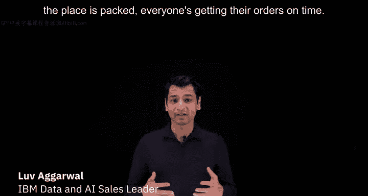

## 从餐厅后厨到数据架构 🍽️

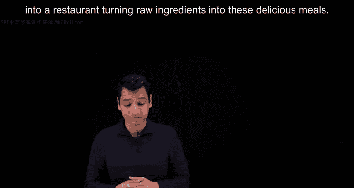

上周我在一家餐厅用餐，看到餐厅座无虚席，所有订单都准时上菜。这让我不禁思考，餐厅是如何将原始食材转化为美味佳肴的。这个过程与数据工程有着惊人的相似之处。

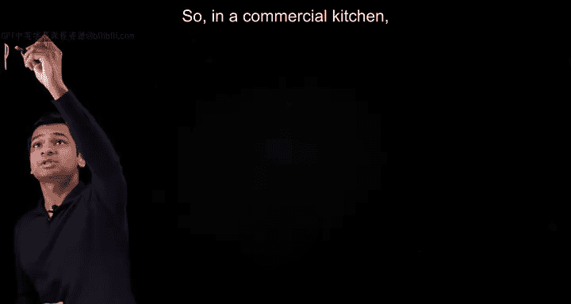

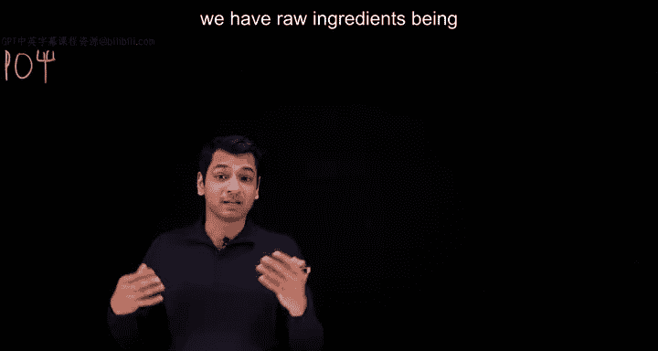

让我们花一分钟思考一下。在一个商业厨房中，卡车将原始食材运送到装卸平台。

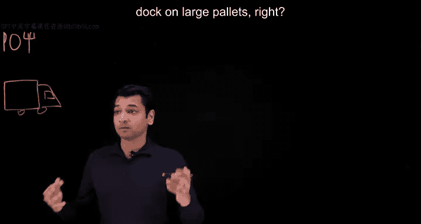

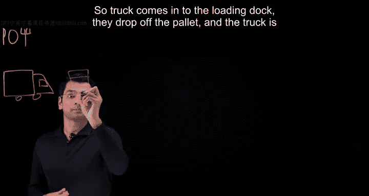

卡车来到装卸平台，卸下大托盘后，便继续上路为其他餐厅送货。

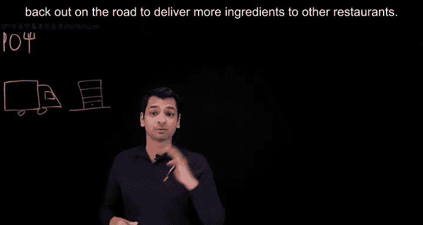

这是简单的部分。现在我们需要拆开托盘并处理这些食材。我们必须对托盘上的所有物品进行分类，并为所有食材贴上标签。

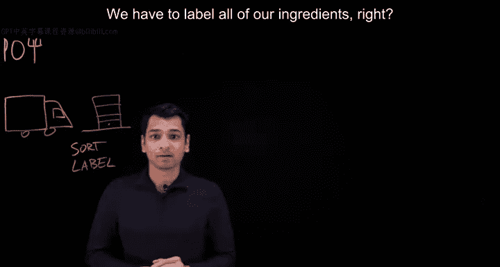

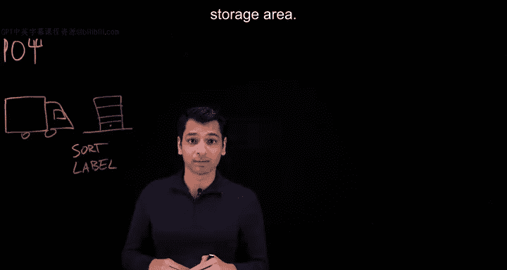

同时，我们必须确保每件物品都被送到正确的存储区域。

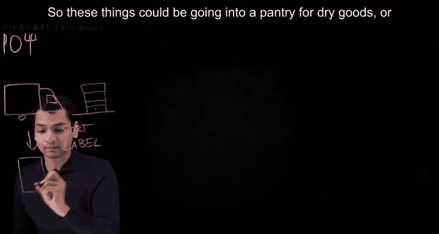

这些物品可能被放入储藏室存放干货。

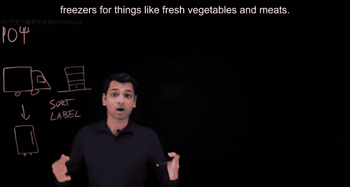

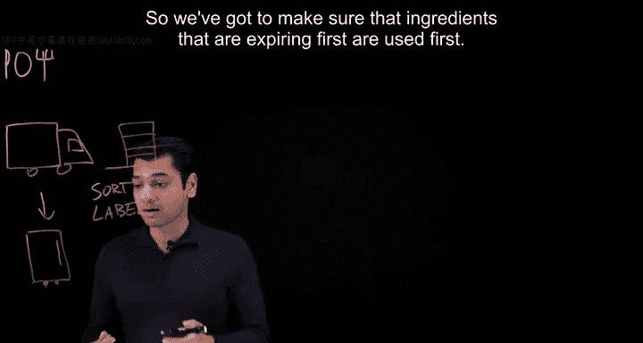

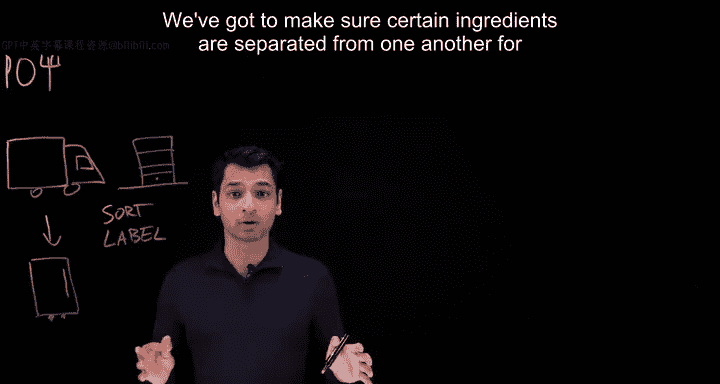

也可能被放入大型步入式冰箱和冰柜，用于存放新鲜蔬菜和肉类等。我们还需要组织这些存储区域。我们必须确保先到期的食材先被使用。出于防止交叉污染的考虑，必须确保某些食材彼此分开存放。

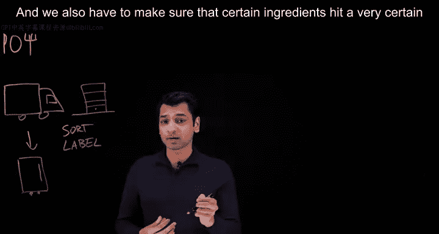

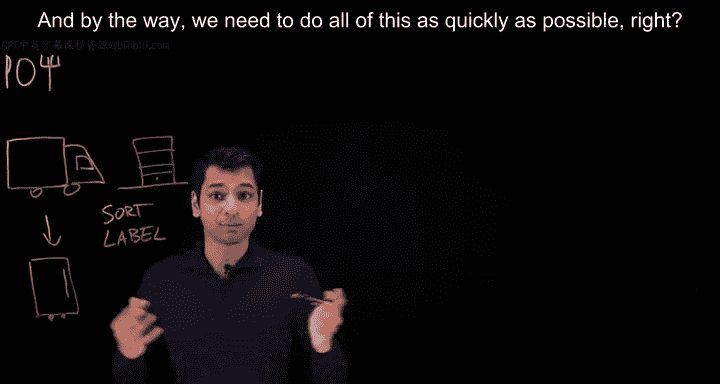

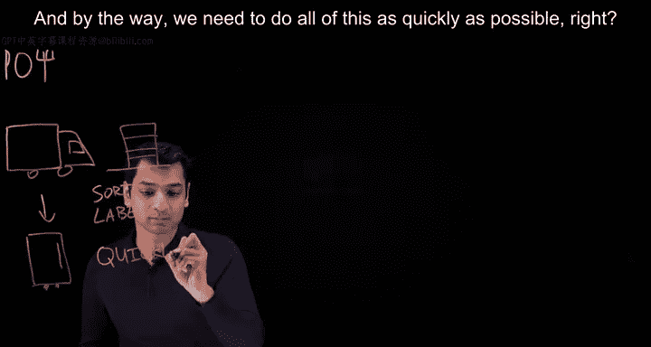

同时，为了食品安全，我们必须确保某些食材达到特定的温度。

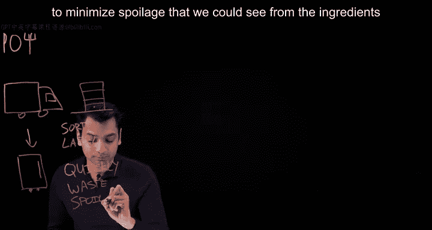

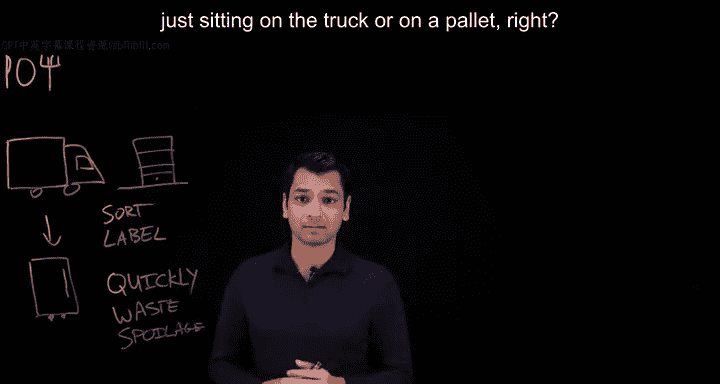

我们需要尽可能快地完成所有这些工作。

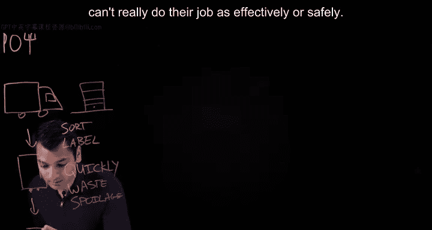

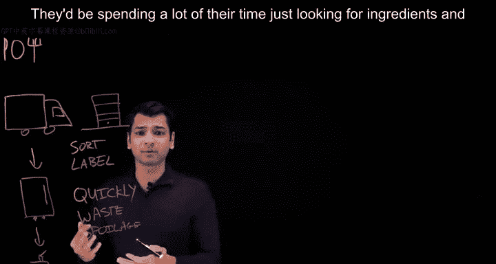

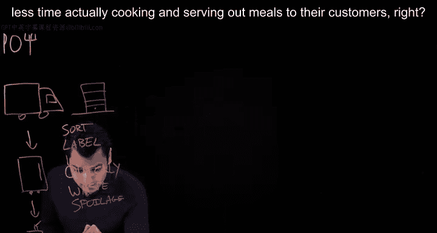

这是为了最大限度地减少食物浪费和食材在卡车或托盘上放置过久而造成的腐败。

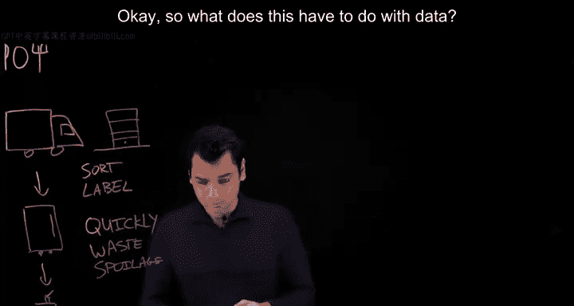

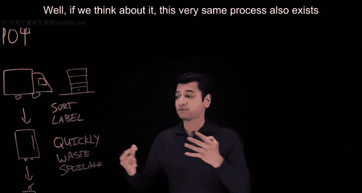

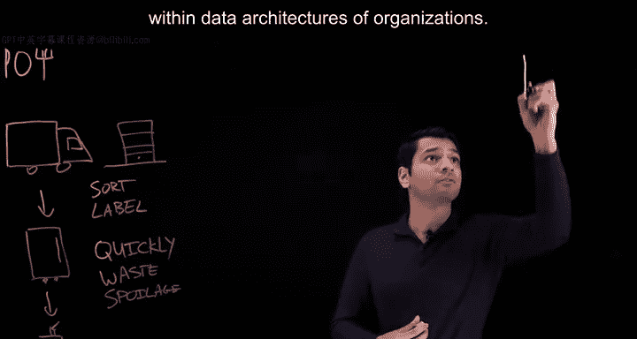

如果没有这个过程，厨房里的厨师就无法高效或安全地工作。

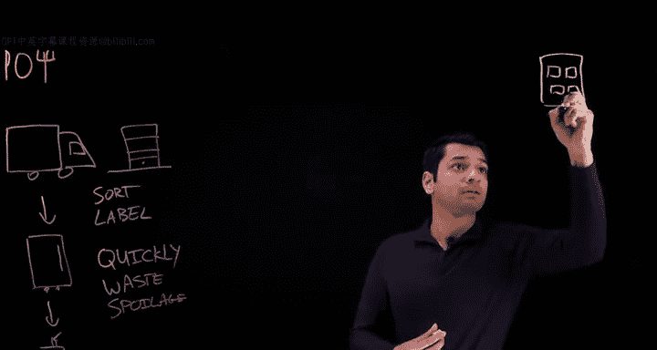

他们将花费大量时间寻找食材，而用于实际烹饪和为顾客上菜的时间则会减少。

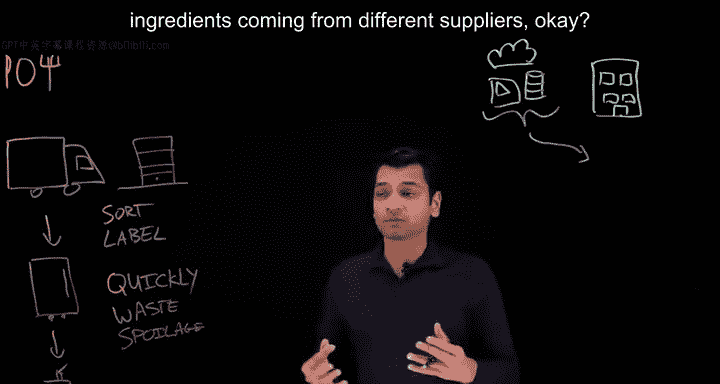

那么，这与数据有什么关系呢？😡

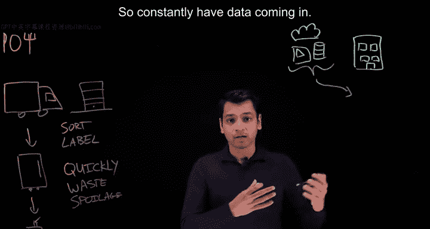

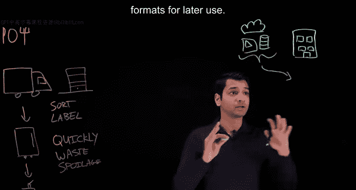

## 数据架构的类比 📊

如果我们仔细思考，会发现完全相同的过程也存在于组织的数据架构中。

组织会从不同来源接收各种数据，例如不同的云环境、不同的运营应用程序，甚至社交媒体数据。所有这些数据都涌入我们的组织，就像厨房从不同供应商那里接收食材一样。

数据不断涌入。我们需要一个快速的地方来存放所有不同类型、不同格式的数据以供后续使用。于是，我们有了**数据湖**。

这些数据湖让我们能够以低成本、快速的方式捕获原始的**结构化**、**非结构化**甚至**半结构化**数据。

就像在厨房里我们不会在装卸平台上做饭一样（当然，如果非要放个小烤架也不是不行），我们必须将这些数据从其原始状态组织和转换成业务想要生成的洞察和分析所需的形式。于是，我们有了**企业数据仓库**。

在数据仓库中，数据有时从数据湖加载，有时从运营应用程序等其他来源加载。数据经过优化和组织，以运行非常特定的分析任务。这可以是支持不同的商业智能工作负载，例如构建仪表板和报告，也可以是输入到其他分析工具中。

就像我们的储藏室和冰柜一样，仓库中的数据是经过清洗、组织、治理的，其完整性应该是可信的。

## 传统架构的挑战 ⚠️

那么，这种方法存在哪些挑战呢？正如我们所说，数据湖确实能以高性价比的方式捕获大量数据，但我们在**数据治理**和**数据质量**方面遇到了挑战。

很多时候，这些数据湖会变成“数据沼泽”。当存在大量重复、不准确或不完整的数据，导致资产难以跟踪和管理时，就会发生这种情况。试想一下，如果数据停滞不前会怎样？它会失去创造洞察的价值，就像餐厅里不使用的食材会随着时间的推移而变质一样。

数据湖在查询性能方面也存在挑战。因为它们并非为处理复杂的分析查询而构建和优化，有时很难直接从湖中获取洞察。

现在让我们看看数据仓库。它们在查询性能方面非常出色，但可能伴随着**高昂的成本**。就像那些大型冰柜运行成本可能很高一样，我们不能把所有东西都放进数据仓库。数据仓库可以更好地优化以维护数据治理和质量，但它们对半结构化和非结构化数据源的支持有限，而这些恰恰是进入我们组织增长最快的数据类型。

此外，对于某些需要最新数据的应用程序类型，数据仓库有时可能太慢，因为对数据进行排序、清洗和加载到仓库中需要时间。

## 解决方案：数据湖仓 🏠

那么，我们该怎么办？开发人员退后一步，说道：让我们结合数据湖和数据仓库的优点，创造一种称为**数据湖仓**的新技术。

这样，我们既获得了数据湖的**灵活性**和**成本效益**，又拥有了数据仓库的**性能**和**结构**。

我们将在未来的视频中更具体地讨论数据湖仓的架构。但从价值角度来看，湖仓让我们能够以低成本的方式存储来自爆炸性增长的新数据源的数据，然后利用内置的数据管理和治理层，使我们能够快速地为商业智能和高性能机器学习工作负载提供支持。

我们可以通过多种方式开始使用湖仓：可以现代化现有的数据湖，也可以补充我们的数据仓库以支持这些新型的AI和机器学习驱动的工作负载。这些也将在未来的视频中讨论。

## 总结 📝

本节课中，我们一起学习了数据工程中的核心存储架构。我们通过餐厅后厨的流程，类比了数据从原始状态到可用状态的转换过程。我们探讨了**数据湖**作为低成本、灵活的原始数据存储池，以及**数据仓库**作为高性能、结构化分析引擎的各自特点与局限。最后，我们介绍了结合两者优势的**数据湖仓**概念，它旨在提供统一的平台来处理多样化的数据并支持多种工作负载。

下次你在餐厅时，希望你思考一下盘中的菜肴是如何到达你面前的，以及食材从厨房到成为你盘中餐所经历的步骤。

谢谢观看。如果你喜欢这个视频并想看到更多类似内容，请点赞并订阅。如果你有任何问题，请在下方评论区留言。

