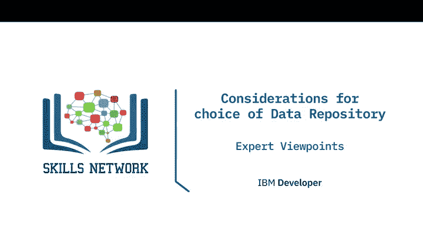
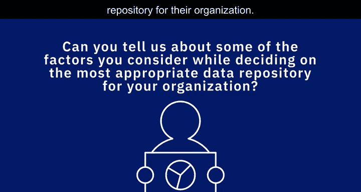

# 021：数据存储库选择考量视角

在本节课中，我们将学习如何为组织选择最合适的数据存储库。多位数据专家将分享他们在决策过程中考虑的关键因素。选择正确的数据库时，需要牢记多个考量点。

## 🎯 选择数据存储库的核心考量因素

上一节我们介绍了课程目标，本节中我们来看看选择数据存储库时需要评估的具体因素。以下是需要综合评估的几个核心维度：

*   **使用场景与数据类型**：需要明确存储库的用途。是用于存储**结构化信息**、**半结构化信息**还是**非结构化信息**？是否事先知晓数据的**模式（Schema）**？
*   **性能与数据状态**：是否存在性能要求？处理的是静态数据（Data at Rest）、流数据（Streaming Data）还是动态数据（Data in Motion）？
*   **安全与规模**：数据是否需要加密？处理的数据**量（Volume）** 有多大？是否需要大数据系统？存储要求是什么？
*   **访问与更新模式**：数据是否需要频繁更新和访问？还是仅需长期存储、用于备份目的？
*   **组织规范**：组织内部可能已为不同类型的任务制定了允许使用的数据库或数据存储库标准。

## 🔍 决策时的具体评估维度

在考虑了基本因素后，我们需要从更具体的维度进行评估。以下是选择数据存储库时需要深入分析的几个方面：

*   **容量与访问类型**：评估该存储库预期处理的容量类型。同时，分析所需的访问模式：是短间隔访问，还是在其上运行长时间查询？
*   **用途定位**：明确其主要用途是用于**事务处理（Transaction Processing）**、**分析（Analytics）**、**归档（Archival）** 还是**数据仓库（Data Warehousing）**。
*   **兼容性**：考察新的数据存储库与现有生态系统（包括编程语言、工具和流程）的兼容性如何。
*   **安全特性**：考虑该存储库提供的安全功能。
*   **可扩展性**：这是最重要的因素之一。当前的性能可能令人满意，但它是否具备足够的可扩展性，能否随着组织的发展而扩展？

## 🏢 企业实践与平台选择

了解了理论维度后，我们来看看实际企业环境中的选择策略。很少有组织只使用一种数据存储库。

在我的团队中，我们有一套首选的解决方案：一个首选的企业级关系型数据库、一个用于小型项目和微服务的首选开源关系型数据库，以及一个首选的非结构化数据源。这三者构成了我们的核心。

一个重要考量是思考组织内部现有或希望培养的技能，并评估各种解决方案的成本。例如，我们拥有DB2专家，因此企业级数据库选择是DB2。然而，对于开源数据库，我们根据发展方向的变化调整过几次选择。

如今，**托管平台**也带来了差异。选择不再仅仅是“使用IBM DB2还是Microsoft SQL Server”，而是“如果使用它们，我是否要在AWS RDS上部署？或许我应该考虑Amazon Aurora或Google的关系型数据库产品”。存在众多不同的选择需要考量。

## 💡 基于数据特性与规模的选择策略

最终，选择取决于几个根本问题。决策涉及数据应如何存储、如何检索以及存储在哪里，这些都是非常重要的问题。

我认为，**数据的结构**、**应用程序的性质**以及**数据注入数据库的量级**，这些因素共同决定了应选择的数据源类型。

在大多数情况下，一个**关系型数据库（Relational Database）** 就足够了。然而，也会存在边缘情况，像IBM DB2、Oracle或PostgreSQL这样的关系型数据库可能无法满足需求。

此时，需根据具体用例选择：

*   如果每天要摄入**吉字节（GB）或太字节（TB）** 级的数据，那么像**MongoDB**这样的文档存储或像**Cassandra**这样的宽列存储可能更适合。
*   如果试图构建产品推荐引擎，或展示社交媒体上不同人群的关系网络，那么像**Neo4j**或**Apache TinkerPop**这样的**图数据库（Graph Database）** 将是理想选择。
*   如果为了分析而挖掘**太字节（TB）或拍字节（PB）** 级的数据，采用**MapReduce**的**Hadoop**引擎会是一个很好的选择。

因此，这最终归结于**应用程序的性质**和**数据的量级与结构**。在为用例选择正确的数据库或数据源之前，必须充分理解这些。

## 📝 总结

本节课中，我们一起学习了为组织选择数据存储库时需要综合考量的多方面因素。从明确使用场景、数据类型、性能要求，到评估安全性、可扩展性及组织内部规范，每一步都至关重要。我们还探讨了企业实际决策中关于技能、成本及云平台选择的复杂性，并最终理解了如何根据数据的结构、应用的性质和数据量级来匹配最合适的数据库技术（如关系型、文档型、图数据库或大数据平台）。掌握这些考量视角，是成为一名合格数据工程师的基础。