# 022：ETL、ELT与数据管道

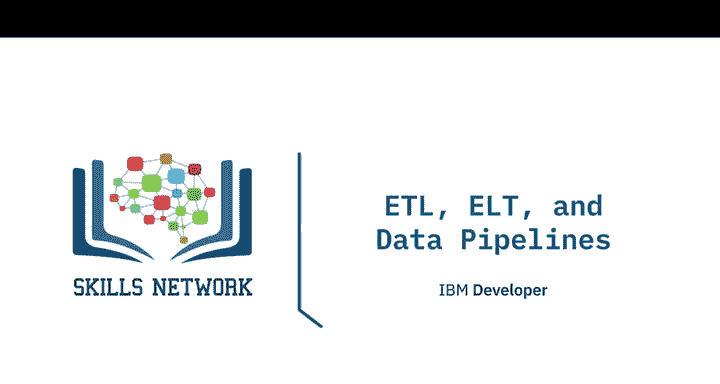

在本节课中，我们将学习数据从源系统移动到目标系统的不同工具和流程，包括ETL（提取、转换、加载）过程、ELT（提取、加载、转换）过程以及数据管道。

现在，我们来到从数据中获取价值的核心过程——提取、转换和加载过程，即ETL。ETL是将原始数据转换为可供分析的数据的方式。这是一个自动化过程，您从已识别的来源收集原始数据，提取与您的报告和分析需求相符的信息，清理、标准化并将该数据转换为在组织上下文中可用的格式，然后将其加载到数据存储库中。虽然ETL是一个通用过程，但实际工作在用途、效用和复杂性上可能大不相同。

**提取**是收集源位置数据以进行转换的步骤。数据提取可以通过**批处理**进行，这意味着源数据按预定时间间隔以大块形式从源移动到目标系统。批处理工具包括Stitch和Blendo。

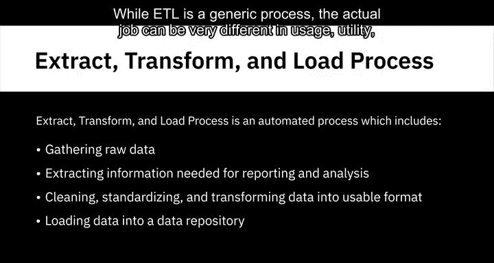

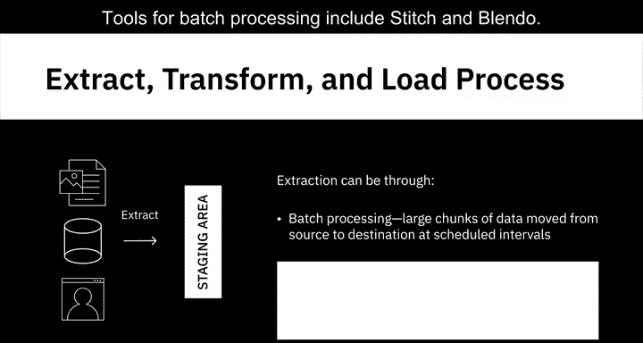

也可以通过**流处理**进行，这意味着源数据从源实时拉取，并在传输过程中、加载到数据存储库之前进行转换。流处理工具包括Apache Samza、Apache Storm和Apache Kafka。

**转换**涉及执行规则和函数，将原始数据转换为可用于分析的数据。例如：
*   使所有源数据的日期格式和度量单位保持一致。
*   删除重复数据。
*   过滤掉不需要的数据。
*   丰富数据，例如将全名拆分为名、中间名和姓。
*   建立跨表的关键关系。
*   应用业务规则和数据验证。

**加载**是将处理后的数据传输到目标系统或数据存储库的步骤。它可以是：
*   **初始加载**：即填充存储库中的所有数据。
*   **增量加载**：即根据需要定期应用持续的更新和修改。
*   **完全刷新**：即擦除一个或多个表的内容，并用新数据重新加载。

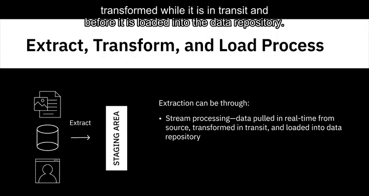

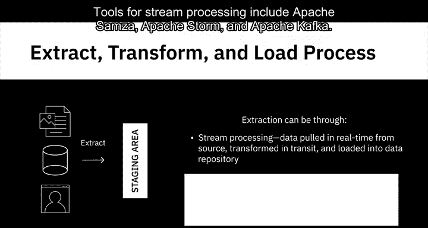

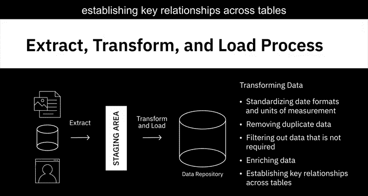

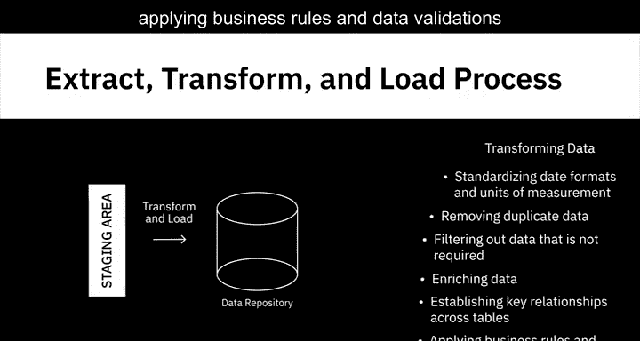

**加载验证**，包括对缺失值或空值的数据检查、服务器性能监控和加载失败监控，在此过程步骤中非常重要。密切关注加载失败并确保有正确的恢复机制至关重要。

ETL历史上一直用于大规模的批处理工作负载。然而，随着流式ETL工具的出现，它们也越来越多地用于实时流式事件数据。一些流行的ETL工具包括IBM InfoSphere Information Server、AWS Glue、IProva、Skyvia、Evo和Informatica PowerCenter。

---

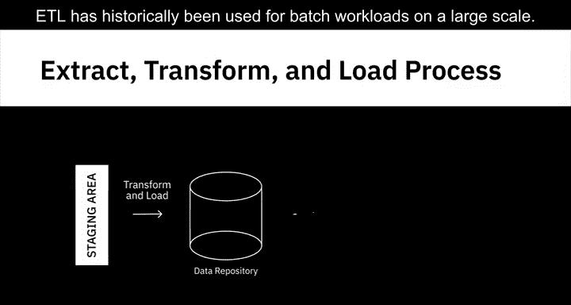

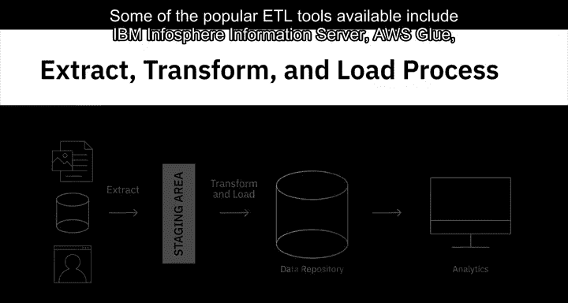

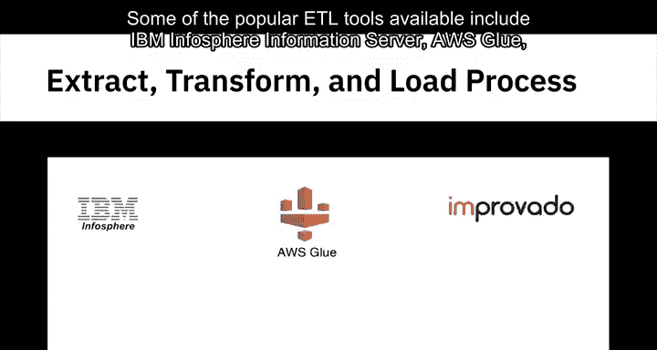

上一节我们介绍了传统的ETL过程，本节中我们来看看它的一个变体——提取、加载和转换过程，即ELT。

在ELT过程中，提取的数据首先加载到目标系统，然后在目标系统中应用转换。ELT管道的目的地系统很可能是数据湖，尽管也可以是数据仓库。ELT是一项由云技术驱动的相对较新的技术。

为什么需要ELT过程？ELT对于处理大量非结构化和非关系型数据集非常有用。它非常适合数据湖，在原始数据加载到数据湖后，才对数据应用转换。

ELT过程有几个优点：
*   由于原始数据直接交付到目标系统而非暂存环境，这缩短了提取和交付之间的周期。
*   与数据湖结合，允许您在数据可用时立即摄取大量原始数据。
*   与ETL过程相比，ELT为分析师和数据科学家进行探索性数据分析提供了更大的灵活性。
*   ELT仅转换特定分析所需的数据，因此可以用于多个用例。而在ETL过程中，如果数据仓库的数据结构不适合新的用例，可能需要修改整个结构。
*   ELT更适合处理大数据。

---

我们经常看到ETL、ELT和数据管道这些术语互换使用。虽然两者都将数据从源移动到目的地，但**数据管道**是一个更广泛的术语，它涵盖了将数据从一个系统移动到另一个系统的整个旅程，而ETL和ELT可能是其子集。

以下是数据管道的特点：
*   数据管道可以设计用于批处理、流数据以及批处理和流数据的组合。
*   在流数据的情况下，数据处理或转换以连续流的形式进行。这对于需要不断更新的数据特别有用，例如来自监控交通的传感器的数据。
*   数据管道是一个高性能系统，支持长时间运行的批处理查询和较小的交互式查询。
*   数据管道的目的地通常是数据湖，尽管数据也可能加载到不同的目标目的地，例如另一个应用程序或可视化工具。

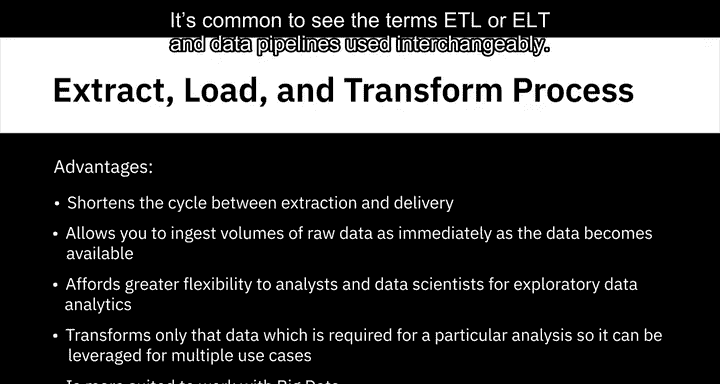

有许多可用的数据管道解决方案，其中最流行的包括Apache Beam、Airflow和Dataflow。

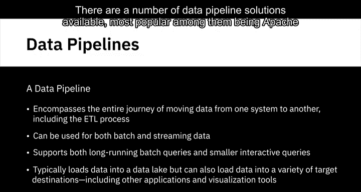

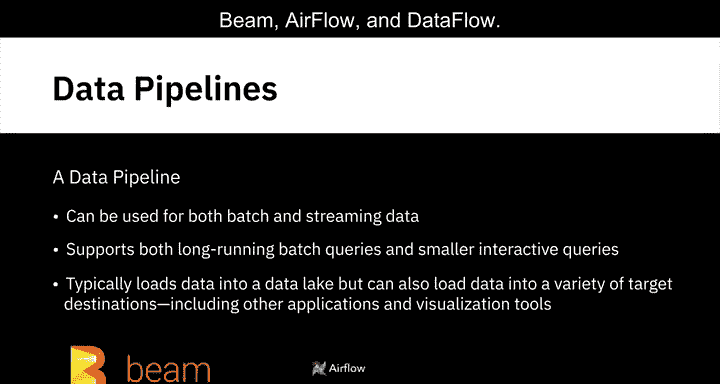

---

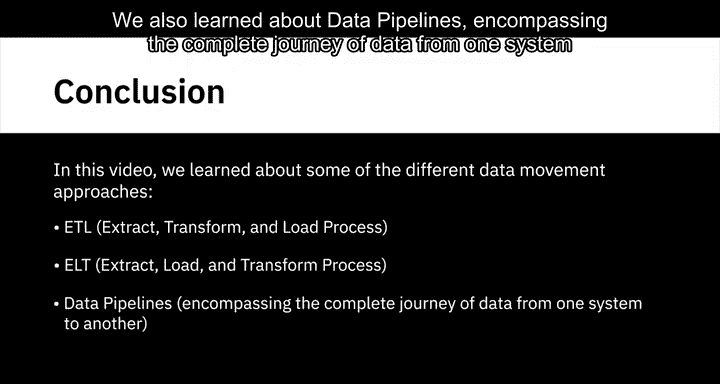

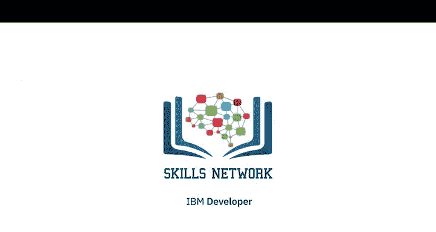

在本节课中，我们一起学习了不同的数据移动方法：ETL（提取、转换、加载）过程和ELT（提取、加载、转换）过程。我们还了解了数据管道，它涵盖了数据从一个系统到另一个系统的完整旅程。