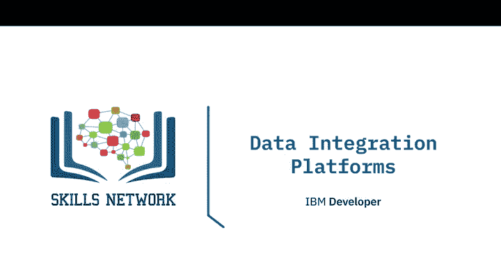
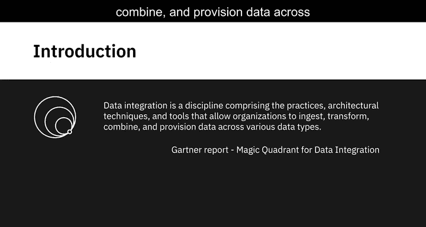
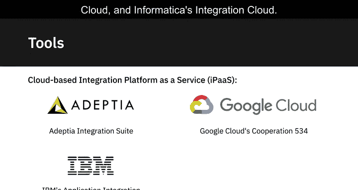
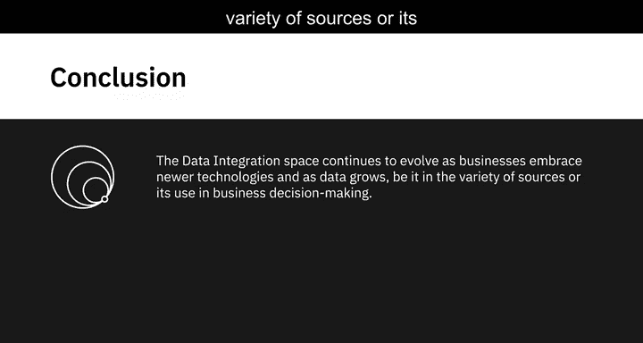
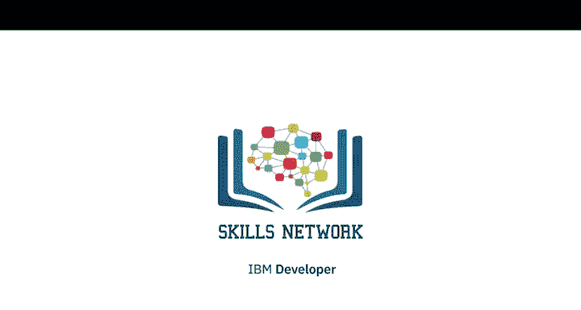

# 023：数据集成平台

在本节课中，我们将要学习数据集成平台的核心概念、功能以及市场上的主要工具。数据集成是数据工程中的关键环节，它负责将来自不同来源的数据整合起来，为分析和决策提供统一、可靠的数据视图。

---

Gartner将数据集成定义为一门学科，它包含了一系列实践、架构技术和工具，使组织能够跨多种数据类型进行数据摄取、转换、组合和供给。

该报告进一步解释，数据集成有多种使用场景，例如跨应用程序的数据一致性、主数据管理、企业间的数据共享，以及分析和数据科学领域的数据迁移与整合。

在数据科学和分析领域，数据集成包括从操作系统中访问、排队或提取数据，以逻辑或物理方式转换和合并提取的数据，进行数据质量管理和治理，并通过集成方法为分析目的交付数据。

例如，为了使客户数据可用于分析，你需要从销售、营销和财务等操作系统中提取单个客户的信息。然后，你需要提供合并数据的统一视图，以便你的用户可以从单一界面访问、查询和操作这些数据，从而进行统计分析、数据分析和可视化。

数据集成平台与ETL和数据管道有何关联？虽然数据集成将不同的数据组合成数据的统一视图，但数据管道涵盖了从源系统到目标系统的整个数据移动过程。从这个意义上说，你可以使用数据管道来执行数据集成，而ETL是数据集成中的一个过程。

数据集成没有单一的方法。然而，现代数据集成解决方案通常支持以下功能：

以下是现代数据集成平台的核心能力列表：

*   **丰富的预构建连接器目录**：帮助你连接并与各种数据源（如数据库、平面文件、社交媒体数据API、CRM和ERP应用程序）构建集成流程。
*   **开源架构**：提供更大的灵活性，避免供应商锁定。
*   **支持批处理和流处理**：既支持大规模数据的批处理，也支持连续数据流的处理，或两者兼而有之。
*   **与大数据源集成**：对大数据源的支持正日益成为选择集成平台决策的关键因素。
*   **附加功能**：例如，围绕数据质量和治理、合规性与安全性的特定需求。
*   **可移植性**：确保随着企业转向云模型，他们应该能够在任何地方运行其数据集成平台。
*   **云原生支持**：数据集成工具能够原生地在单一云、多云或混合云环境中工作。

市场上有许多可用的数据集成平台和工具，范围从商业现成工具到开源框架。

IBM提供了一系列针对各种企业集成场景的数据集成工具，例如InfoSphere Information Server、Cloud Pak for Data、IBM Cloud Pak for Integration、IBM Data Replication、IBM Data Virtualization Manager、IBM InfoSphere Information Server on Cloud和IBM InfoSphere DataStage。

Talend的数据集成工具包括Talend Data Fabric、Talend Cloud、Talend Data Catalog、Talend Data Management、Talend Big Data、Talend Data Services和Talend Open Studio。

SAP、Oracle、Denodo、SAS、Microsoft、Kuli和Tibco是其他一些提供数据集成工具和平台的供应商。

开源框架的例子包括Dell Boomi、Jitterbit和SnapLogic。

有大量供应商通过虚拟私有云或混合云提供基于云的集成平台即服务（iPaaS）作为托管服务，例如Adeptia Integration Suite、Google Cloud的Cloud Data Fusion、IBM的Application Integration Suite on Cloud和Informatica的Integration Cloud。

随着企业采用新技术以及数据的增长（无论是数据源的多样性还是其在业务决策中的使用），数据集成领域也在持续发展。

---

本节课中，我们一起学习了数据集成的定义、应用场景及其与ETL、数据管道的关系。我们详细探讨了现代数据集成平台应具备的关键能力，并概览了市场上主流的商业与开源工具。理解这些平台和工具是构建高效、可靠数据管道的基础。