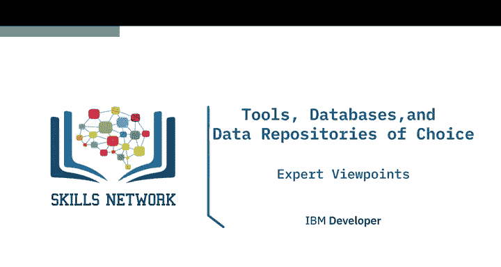
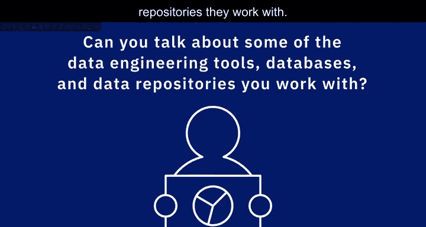
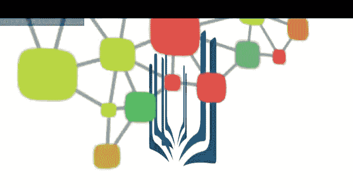

# 024：数据工程工具、数据库与存储库选择视角 🛠️💾

## 概述

在本节课中，我们将聆听数据工程领域的专业人士分享他们日常工作中使用的工具、数据库和数据存储库。数据工程生态系统非常庞大，从业者需要掌握多种技术来应对不同的数据处理需求。通过了解他们的实践经验，我们可以对数据工程的技术栈有一个更直观的认识。

## 数据工程生态系统概览

上一节我们了解了数据工程的基本概念，本节中我们来看看从业者实际使用的技术工具。数据工程生态系统非常庞大，从业者通常需要根据具体场景选择不同的工具。

一位从业者分享道，他们主要使用开源工具。以下是他们常用的技术栈：

*   **关系型数据库**：例如 **MySQL**。
*   **NoSQL数据库**：例如 **MongoDB**、**Cassandra**，以及图数据库 **Neo4j**。
*   **编程语言**：**Python** 几乎是不可或缺的。当感觉数据工程领域缺少某个功能时，他们首先会尝试用Python来实现，之后再观察是否有现成的产品可以替代。
*   **数据处理与编排工具**：使用 **Apache Airflow** 来创建数据管道；使用 **Spark** 进行大数据处理；使用 **Kafka** 处理流数据；使用 **Talend** 实现ETL功能。
*   **数据采集工具**：使用 **Beautiful Soup** 和 **Scrapy** 进行网络爬虫。
*   **云存储**：会考察多种云存储方案，用于数据归档和日常存储。

## 不同场景下的工具选择

在了解了广泛的技术栈后，我们来看看不同工作环境下的具体工具组合。工具的选择往往与公司背景和业务需求紧密相关。

另一位从业者对比了他在非营利组织和Coursera的工作经历：

*   **在非营利组织时**：主要使用 **SQL Server** 作为数据仓库，并配合 **SQL Server Integration Services (SSIS)** 以及 **WAAto** 工具进行数据集成。
*   **在Coursera时**：使用 **AWS Redshift** 作为数据仓库，使用 **AWS S3** 作为数据湖。他们最初使用内部工具构建和调度ETL流水线，但现在正转向使用开源的 **Apache Airflow** 进行数据编排。

## 数据工程师的多样化技能

数据工程师的角色要求掌握多样化的技能，以连接不同的数据源和处理流程。这不仅仅是使用单一工具，而是构建完整的解决方案。

一位工程师列举了他所接触的技术：

*   **数据库**：关系型数据库如 **IBM DB2**、**Push-a-SQL**、**Microsoft SQL Server**；NoSQL数据库如 **Cassandra** 和 **MongoDB**。
*   **流处理与复制技术**：使用 **WebPMQ** 进行数据复制；使用 **Kafka** 将事务数据移动到后台数据库进行批处理。
*   **数据移动工具**：使用 **SSIS** 构建数据移动包；使用名为 **NIFI** 的工具（现由Apache基金会维护，是一款优秀的开源项目）在异构数据源之间移动数据。
*   **自定义脚本与API**：编写 **Shell**、**Perl** 脚本以及 **Java API** 来在不同应用和供应商系统间移动数据。

## 持续学习与技能演进

技术领域日新月异，数据工程师必须具备持续学习的能力。掌握核心原理比死记硬背特定工具更为重要。

一位拥有丰富经验的从业者分享了他的历程：

*   **早期经历**：在IBM工作期间，大量使用 **IBM DB2** 数据库，后来甚至成为了该产品的产品经理。
*   **技能扩展**：随着职责变化，他学习了 **MySQL**、**PostgreSQL**，以及 **Hadoop** 和 **Spark** 等大数据系统。
*   **核心建议**：数据工程是一个不断发展的领域，从业者需要成为终身学习者，不断掌握工作所需的新技能。只要**扎实掌握数据基础原理**，就能快速适应新技术。

## 企业级技术栈实践

最后，我们来看一个企业级环境下的完整技术栈示例，这涵盖了从数据库到开发运维的各个环节。

一位专注于中端平台的数据专家介绍：

*   **核心数据库**：主要产品是运行在Linux、Unix和Windows上的 **IBM DB2**，他认为这在关系型数据库领域是一个很好的选择。
*   **云服务**：深度使用 **AWS** 产品，例如在RDS上使用 **Microsoft SQL Server** 和 **MariaDB**。
*   **开发与运维工具**：以下工具对于管理数据库和工作流至关重要：
    *   **版本控制**：**GitHub** 或 **Git**，这在任何DevOps组织中都不可或缺。
    *   **自动化服务器**：**Jenkins**，用于启动容器、执行维护任务和管理代码部署。
    *   **数据库版本管理**：**Liquibase**，这是一个优秀的工具，结合容器使用，可以轻松管理数据库模式变更。

## 总结

本节课中，我们一起学习了数据工程专业人士在实际工作中使用的各种工具、数据库和存储库。我们看到，数据工程的技术栈非常多样化，涵盖了从传统的RDBMS到现代的NoSQL、大数据处理框架、数据编排工具以及云服务。关键在于理解数据基础原理，并保持持续学习的心态，这样才能在快速发展的技术浪潮中灵活选用合适的工具来解决实际问题。