# 025：大数据基础

在本节课中，我们将要学习大数据的基本概念及其核心特征。我们将了解大数据如何定义，以及它为何在当今数字世界中至关重要。

---

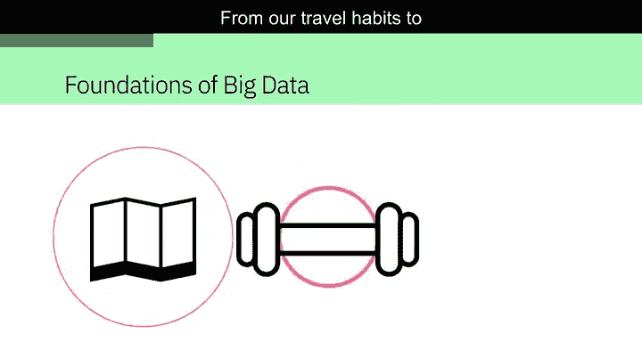

在这个数字世界中，每个人的行为都会留下痕迹，从出行习惯到健身锻炼和娱乐活动。我们日常交互的联网设备数量日益增多，它们记录着关于我们的海量数据。

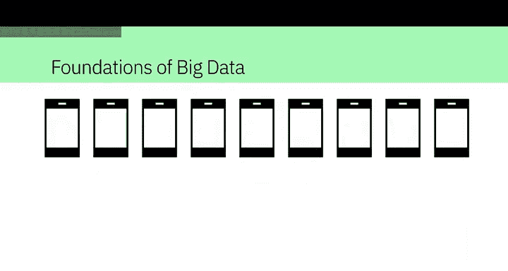


这种现象甚至有一个专门的名称：**大数据**。安永（Ernst & Young）提供了以下定义：大数据指的是由人、工具和机器产生的动态、庞大且多样化的数据量。它需要新颖、创新且可扩展的技术来收集、存储和分析这些海量数据，以获取与消费者、风险、利润、绩效、生产力管理以及提升股东价值相关的实时商业洞察。

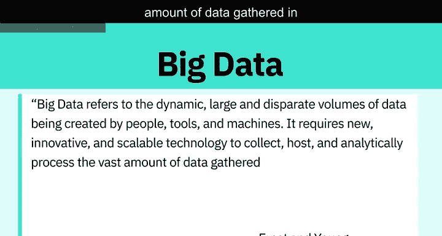

虽然大数据没有唯一的定义，但在不同的定义中存在一些共同的要素。

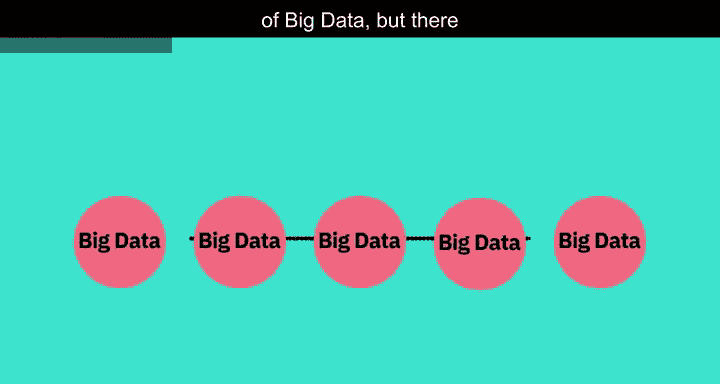


这些要素包括：**速度（Velocity）、体量（Volume）、多样性（Variety）、真实性（Veracity）和价值（Value）**。

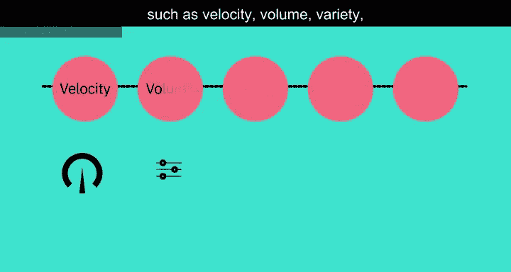


它们被称为大数据的 **5V** 特征。


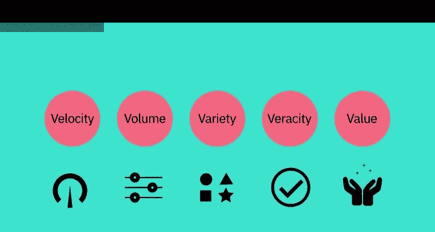


---

## 🚀 速度（Velocity）


上一节我们介绍了大数据的5V特征，本节中我们来看看第一个“V”：速度。

**速度** 指的是数据积累的速率。数据正以极快的速度生成，这个过程永不停止。


近实时或实时的流处理技术，以及本地和基于云的技术，都可以非常快速地处理信息。


---

## 📈 体量（Volume）

了解了数据生成的速度后，接下来我们关注数据的规模。

**体量** 指的是数据的规模或存储数据量的增长。


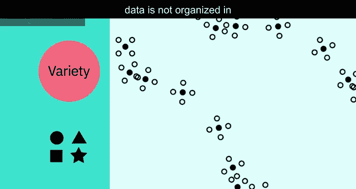

以下是驱动数据体量增长的主要因素：
*   数据源的增加。
*   更高分辨率的传感器。
*   可扩展的基础设施。


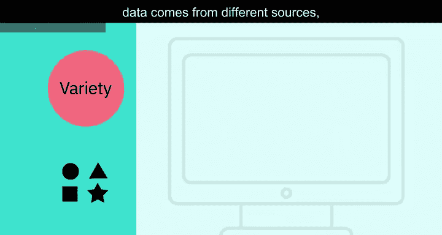

---

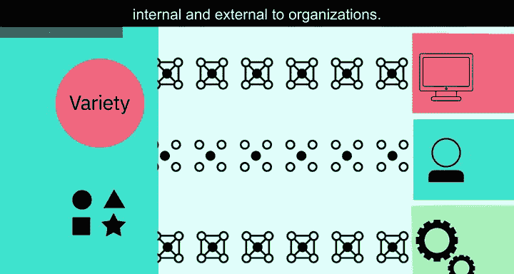

## 🎭 多样性（Variety）

数据不仅有庞大的体量，其形式也多种多样。这就是我们要讨论的多样性。

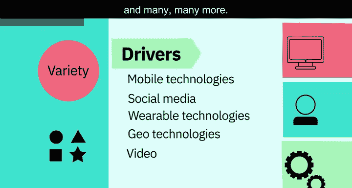

**多样性** 指的是数据的多样性。**结构化数据** 能整齐地放入行、列和关系型数据库中，而**非结构化数据** 则没有预定义的组织方式，例如推文、博客文章、图片、数字和视频。多样性也反映了数据来源的广泛性，包括机器、人和流程，既有组织内部的，也有外部的。


以下是驱动数据多样性的技术：
*   移动技术
*   社交媒体
*   可穿戴技术
*   地理空间技术
*   视频技术
*   以及许多其他技术


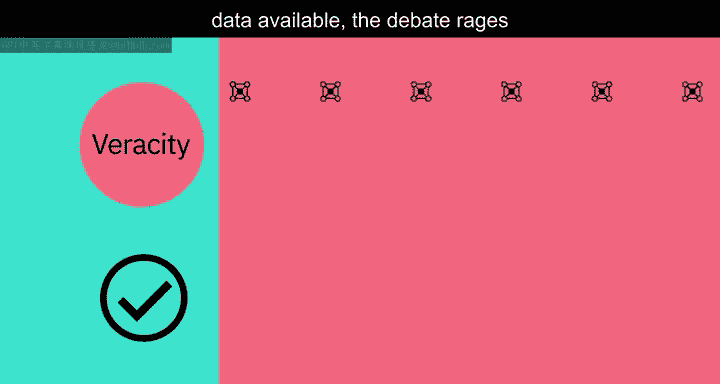

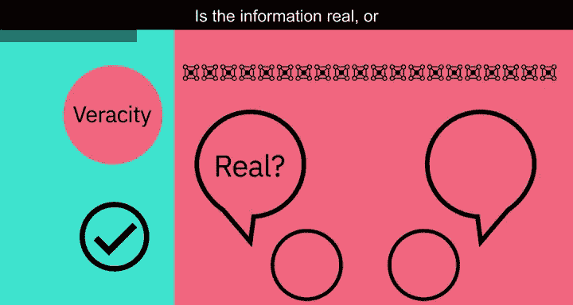

---

## ✅ 真实性（Veracity）

面对如此多样和庞大的数据，确保其质量至关重要。这就引出了真实性的概念。

**真实性** 指的是数据的质量和来源，以及其与事实和准确性的符合程度。其属性包括一致性、完整性、准确性和明确性。

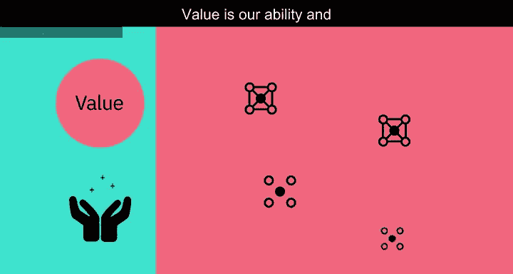


驱动对真实性需求的因素包括成本，以及对海量数据可追溯性的需求。在数字时代，关于数据准确性的争论非常激烈：信息是真实的还是虚假的？


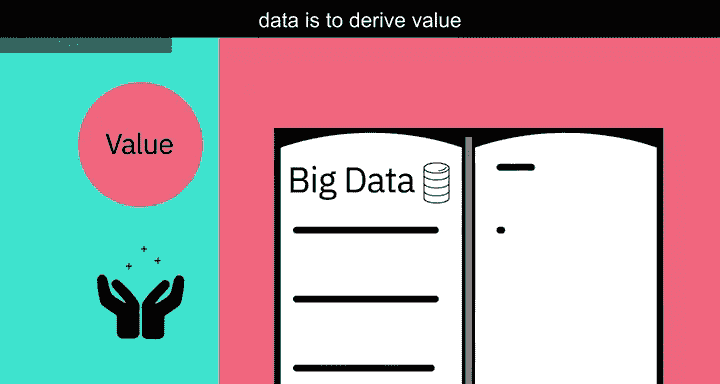


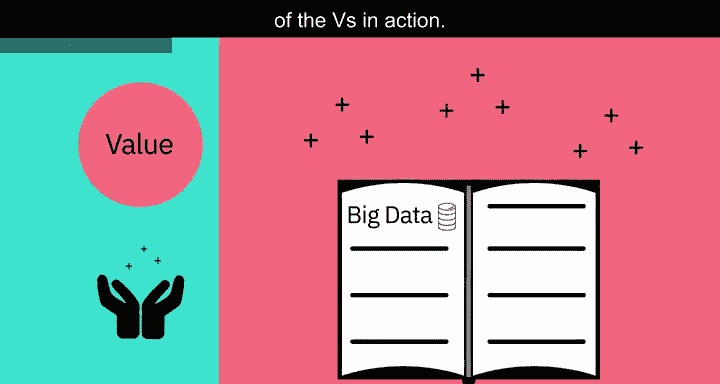

---

## 💎 价值（Value）

处理大数据的最终目的是从中提取价值。这就是最后一个“V”。


**价值** 指的是我们将数据转化为价值的能力和需求。价值不仅仅是利润，它还可能带来医疗或社会效益，以及客户、员工或个人满意度。人们投入时间理解大数据的主要原因就是为了从中获取价值。


---

## 🔍 5V特征实例

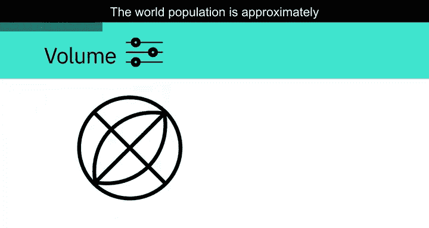

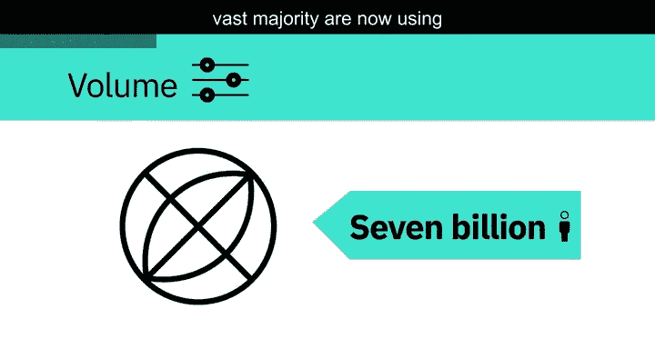

现在，让我们看一些5V特征在现实中的具体例子。

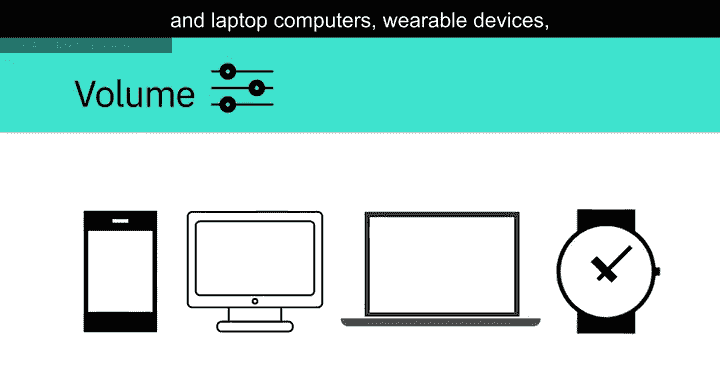


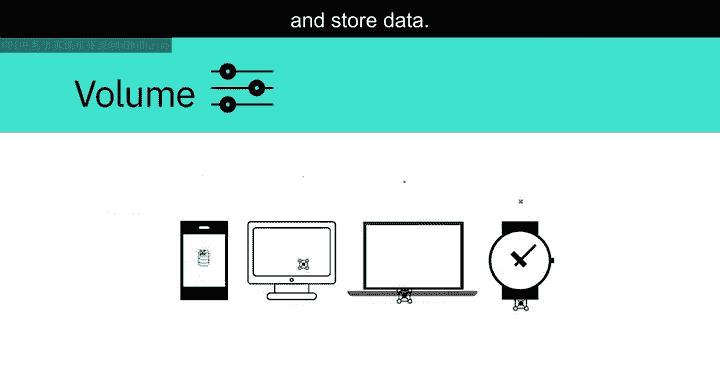

*   **速度**：每分钟都有数小时的视频被上传到YouTube，这就在不断生成数据。试想一下，数据在数小时、数天和数年内积累的速度有多快。


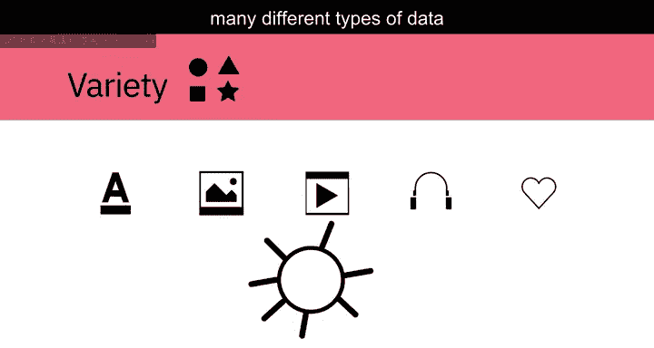

*   **体量**：世界人口约70亿，其中绝大多数人正在使用数字设备，如手机、台式电脑、笔记本电脑、可穿戴设备等。这些设备每天生成、捕获和存储的数据量约为 **2.5 艾字节（2.5 quintillion bytes）**，相当于1000万张蓝光DVD的容量。

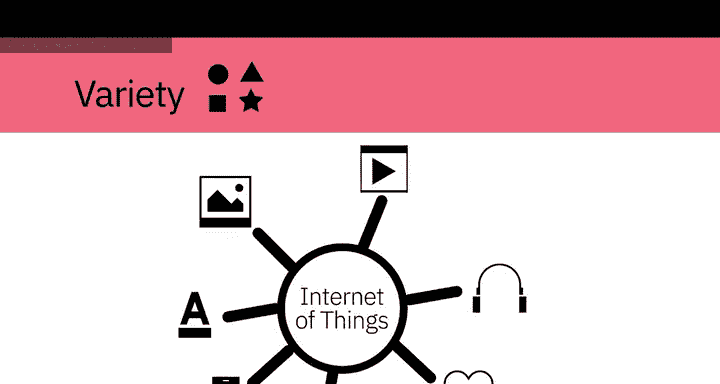


*   **多样性**：让我们想想不同类型的数据：文本、图片、电影、声音、来自可穿戴设备的健康数据，以及来自物联网设备的各种数据。


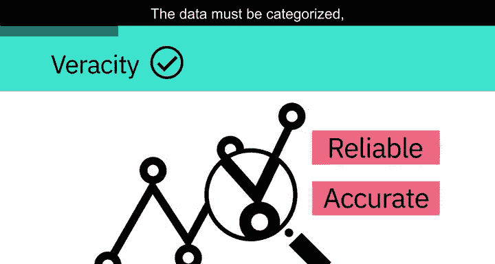

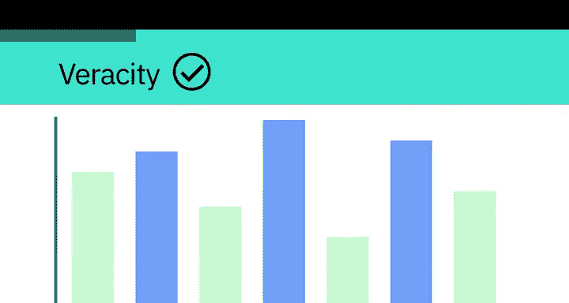

*   **真实性**：约80%的数据被认为是非结构化的。我们必须设计出方法来产生可靠且准确的洞察。这些数据必须被分类、分析和可视化。


---

## 🛠️ 大数据处理技术

面对这些挑战，数据科学家需要借助专门的工具从大数据中获取洞察。

收集的数据规模如此之大，意味着使用传统的数据分析工具是不可行的。然而，利用分布式计算能力的替代工具可以克服这个问题。例如 **Apache Spark、Hadoop及其生态系统** 提供了跨分布式计算资源提取、加载、分析和处理数据的方法，从而提供新的洞察和知识。

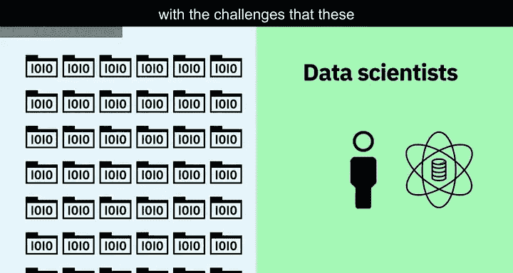

```python
# 示例：大数据处理框架
# Apache Spark, Hadoop 等工具用于处理海量、高速、多样的数据集
processing_frameworks = [“Apache Spark”, “Hadoop Ecosystem”]
```


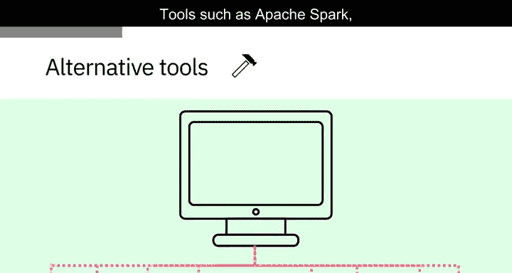


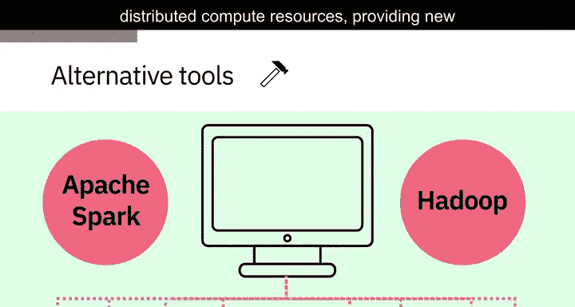


这为组织提供了更多与其客户连接的方式，并丰富了它们所提供的服务。

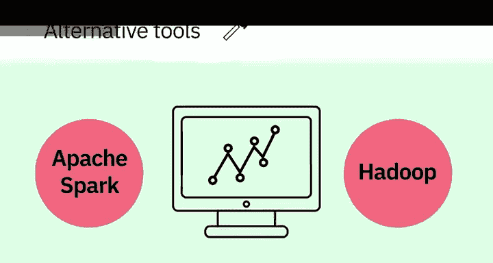


所以，下次当你戴上智能手表、解锁智能手机或追踪你的锻炼时，请记住：你的数据正在开启一段旅程，它可能通过大数据分析环游世界，然后再回到你身边。

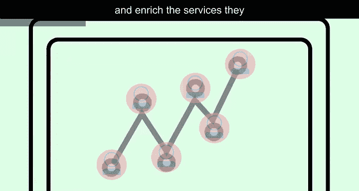


---


## 📝 总结


本节课中，我们一起学习了大数据的基础知识。我们了解了大数据由 **速度（Velocity）、体量（Volume）、多样性（Variety）、真实性（Veracity）和价值（Value）** 这五个核心特征定义，并探讨了每个特征的含义、驱动因素和现实例子。最后，我们认识到处理如此规模的数据需要像 Apache Spark 和 Hadoop 这样的分布式计算工具。理解这些概念是迈入数据工程领域的重要第一步。