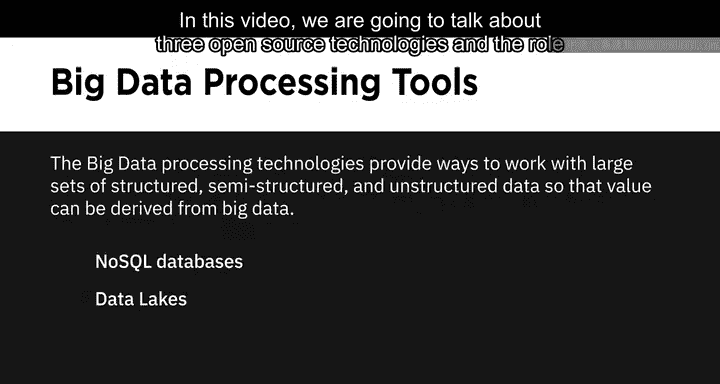
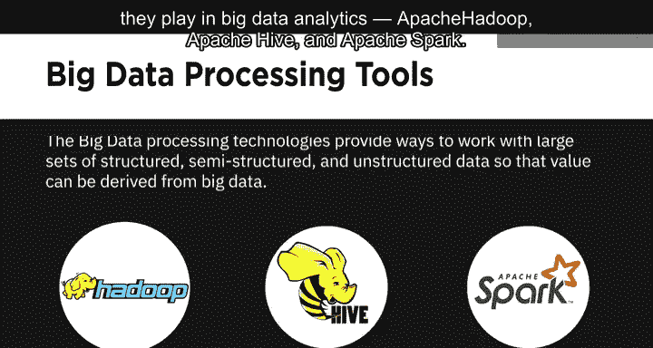
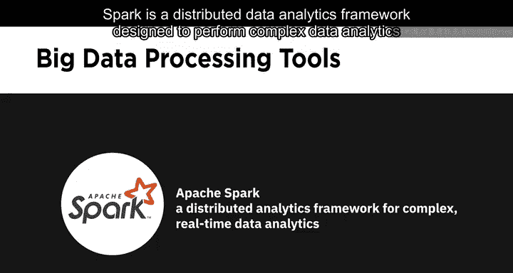
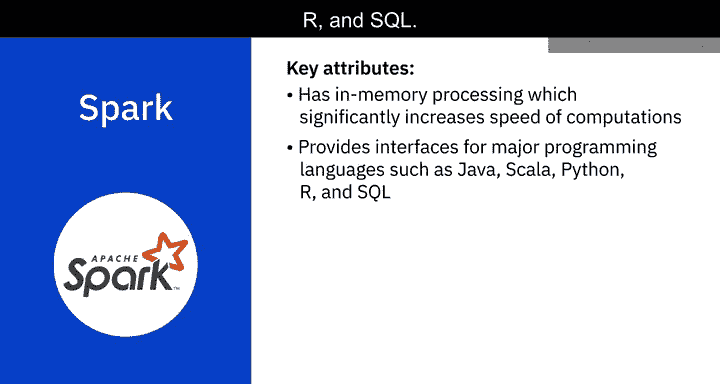

# 026：大数据处理工具（Hadoop、HDFS、Hive、Spark）

在本节课中，我们将学习三种核心的开源大数据处理技术：Apache Hadoop、Apache Hive和Apache Spark。我们将探讨它们各自的功能、架构特点以及在大数据分析生态系统中的角色。

大数据处理技术提供了处理大规模结构化、半结构化和非结构化数据集的方法，从而能够从大数据中提取价值。

在之前的课程中，我们讨论了NoSQL数据库和数据湖等技术。本节我们将聚焦于三个开源技术及其在大数据分析中的作用。

## 🗂️ Apache Hadoop：分布式存储与处理框架

Apache Hadoop是一个工具集合，它提供了大数据的分布式存储和处理能力。

Hadoop是一个基于Java的开源框架，它允许在计算机集群上对大型数据集进行分布式存储和处理。在Hadoop分布式系统中，一个节点就是一台单独的计算机，而节点的集合则构成了一个集群。Hadoop可以从单节点扩展到任意数量的节点，每个节点都提供本地存储和计算能力。

Hadoop为存储数据提供了一个可靠、可扩展且经济高效的解决方案，并且对数据格式没有要求。

使用Hadoop，你可以整合新兴的数据格式，例如流式音频、视频、社交媒体情绪和点击流数据，以及传统数据仓库中不常使用的结构化、半结构化和非结构化数据。它能为所有利益相关者提供近乎实时的自助服务访问。通过整合整个组织的数据，并将“冷数据”（即不频繁使用的数据）迁移到基于Hadoop的系统中，可以优化和简化企业数据仓库的成本。

## 💾 HDFS：Hadoop分布式文件系统

Hadoop的四个主要组件之一是Hadoop分布式文件系统，即HDFS。它是一个为大数据设计的存储系统，运行在通过网络连接的多台商用硬件上。

HDFS通过将文件分区存储到多个节点上来提供可扩展且可靠的大数据存储。它将大文件分割存储在多台计算机上，允许对它们进行并行访问。因此，计算可以在存储数据的每个节点上并行运行。它还在不同的节点上复制文件块以防止数据丢失，使其具备容错能力。

让我们通过一个例子来理解这一点。假设有一个包含全美国电话号码的文件。姓氏以A开头的人的电话号码可能存储在服务器1上，B开头的存储在服务器2上，依此类推。在Hadoop中，这个电话簿的片段将被存储在集群中，以重建整个电话簿。你的程序将需要来自集群中每个服务器的数据块。

HDFS默认还会将这些较小的数据块复制到另外两个服务器上，确保在服务器故障时数据仍然可用。

除了更高的可用性，这还带来了多重好处。它允许Hadoop集群将工作分解成更小的块，并在集群中的所有服务器上运行这些作业，从而实现更好的可扩展性。

最后，你还能获得**数据本地性**的优势，即将计算任务移动到数据所在的节点附近执行的过程。这在处理大型数据集时至关重要，因为它能最大限度地减少网络拥塞并提高吞吐量。

使用HDFS的其他一些好处包括：
*   **硬件故障快速恢复**：因为HDFS被设计为能够检测故障并自动恢复。
*   **支持流式数据访问**：因为HDFS支持高数据吞吐率。
*   **容纳大型数据集**：因为HDFS可以在单个集群中扩展到数百个节点或计算机。
*   **可移植性**：因为HDFS可以跨多个硬件平台移植，并与各种底层操作系统兼容。

## 🐝 Apache Hive：基于Hadoop的数据仓库

上一节我们介绍了Hadoop的存储核心HDFS，现在让我们看看构建在其之上的数据查询工具。

Hive是一个开源的数据仓库软件，用于读取、写入和管理直接存储在HDFS或其他数据存储系统（如Apache HBase）中的大型数据集文件。

Hadoop适用于长时间的顺序扫描，而Hive基于Hadoop，因此查询具有很高的延迟。这意味着Hive不太适合需要非常快速响应的应用程序。

此外，Hive是基于读操作优化的，因此不适合通常涉及大量写操作的事务处理。

Hive更适合数据仓库任务，如ETL（提取、转换、加载）、报告和数据分析。它包含的工具使得通过SQL轻松访问数据成为可能。

## ⚡ Apache Spark：通用数据处理引擎

Hive解决了在Hadoop上进行SQL查询的问题，但对于需要更高速度和更复杂计算的任务，我们需要更强大的工具。

Apache Spark是一个通用的数据处理引擎，旨在为广泛的应用程序提取和处理海量数据，包括交互式分析、流处理、机器学习、数据集成和ETL。

它利用**内存处理**来显著提高计算速度，只有在内存受限时才将数据溢出到磁盘。

Spark支持多种主流编程语言的接口，如Java、Scala、Python、R和SQL。它可以使用其独立的集群技术运行，也可以在其他基础设施（如Hadoop）之上运行。它能够访问多种数据源的数据，包括HDFS和Hive，这使得它具有高度的通用性。

能够快速处理流数据并实时执行复杂分析是Apache Spark的关键用例。

---

**本节课总结**

在本节课中，我们一起学习了三种核心的大数据处理工具：
1.  **Apache Hadoop**：提供了分布式存储（HDFS）和处理大数据的底层框架，以其可扩展性和容错性著称。
2.  **Apache Hive**：构建在Hadoop之上的数据仓库软件，允许用户使用SQL语言对存储在HDFS中的大数据进行查询和分析，适用于批处理和数据仓库任务。
3.  **Apache Spark**：一个快速、通用的内存计算引擎，支持流处理、机器学习等复杂分析，弥补了Hadoop在实时性方面的不足。

这三者共同构成了一个强大而灵活的大数据处理生态系统，Hadoop负责可靠的存储，Hive提供友好的查询接口，而Spark则带来高速的计算能力。