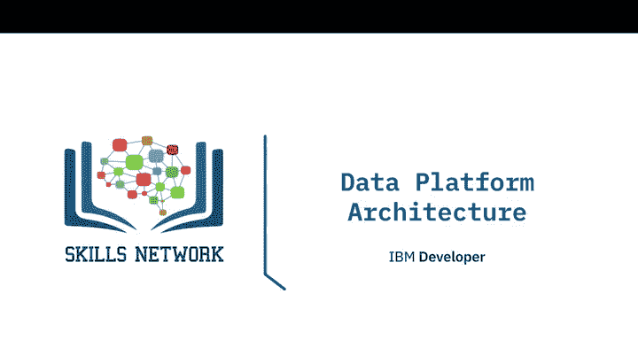
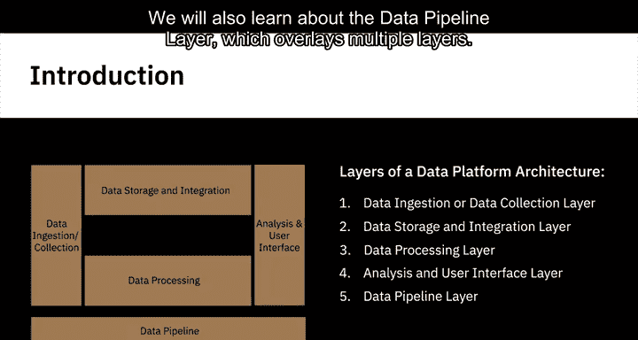
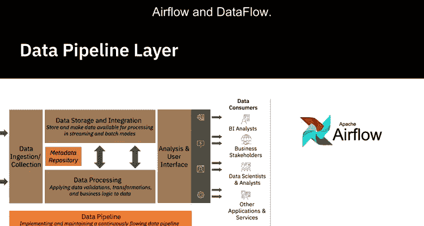
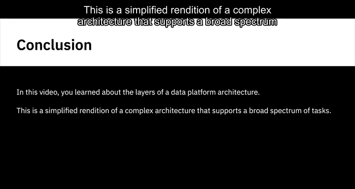
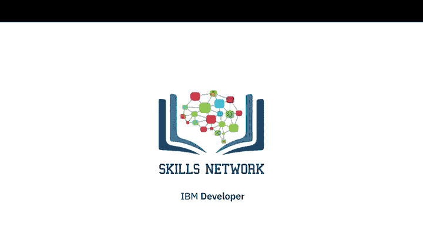

# 028：数据平台架构设计

在本节课中，我们将学习数据平台架构的各个层次。一个层次代表数据平台中执行特定任务的功能组件。我们将探讨的层次包括数据摄取（或数据收集）层、数据存储与集成层、数据处理层以及分析与用户界面层。我们还将了解跨越多个层次的数据管道层。

---

## 🚀 数据收集层

数据收集层负责连接到源系统，并将数据从这些系统引入数据平台。该层执行以下关键任务：

*   连接到数据源。
*   以流式、批处理或两种模式将数据从数据源传输到数据平台。
*   在元数据存储库中维护有关所收集数据的信息，例如一个批次摄入了多少数据、数据源及其他描述性信息。

以下是用于数据摄取的一些工具，它们支持批处理和流式两种模式：**Google Cloud Dataflow**、**IBM Streams**、**IBM Streaming Analytics on Cloud**、**Amazon Kinesis** 和 **Apache Kafka**。

---

## 💾 数据存储与集成层

数据一旦被摄取，就需要进行存储和集成。数据平台中的存储与集成层需要存储数据以供处理和长期使用，对提取的数据进行逻辑或物理上的转换与合并，并使数据可用于流式和批处理模式的处理。

存储层需要可靠、可扩展、高性能且成本效益高。

一些流行的关系型数据库包括：**IBM DB2**、**Microsoft SQL Server**、**MySQL**、**Oracle Database** 和 **PostgreSQL**。近年来，基于云的关系型数据库（也称为数据库即服务）也广受欢迎，例如 **IBM DB2 on Cloud**、**Amazon Relational Database Service (RDS)**、**Google Cloud SQL** 和 **SQL Azure**。

在云上的 NoSQL 或非关系型数据库系统中，我们有 **IBM Cloudant**、**Redis**、**MongoDB**、**Cassandra** 和 **Neo4j**。

集成工具包括 **IBM 的 Cloud Pak for Data** 和 **Cloud Pak for Integration**、**Talend**、**Data Fabric** 和 **Open Studio**。开源工具如 **Dell Boomi** 和 **SnapLogic** 也是非常流行的集成工具。此外，还有许多供应商提供基于云的集成平台即服务，例如 **Adaptive Integration Suite**、**Google Cloud Data Fusion**、**IBM 的 Application Integration Suite on Cloud** 和 **Informatica 的 Integration Cloud**。

---

## ⚙️ 数据处理层

上一节我们介绍了数据的存储与集成，本节中我们来看看数据的处理。数据验证、转换以及将业务逻辑应用于数据，是这一层需要完成的部分工作。

处理层应能够从存储中以批处理或流式模式读取数据并应用转换，支持流行的查询工具和编程语言，能够扩展以满足不断增长的数据集的处理需求，并为分析师和数据科学家提供在数据平台中处理数据的方式。

以下是该层发生的一些转换任务：

*   **结构化**：本质上是改变数据形式和模式的操作。这种改变可能很简单，如改变记录内字段的顺序；也可能很复杂，如使用连接和联合将字段组合成复杂的结构。
*   **规范化**：侧重于清理数据库中未使用的数据，减少冗余和不一致性。
*   **反规范化**：将来自多个表的数据合并到一个表中，以便更高效地进行报告和分析查询。
*   **数据清洗**：修复数据中的不规则之处，为下游应用和使用提供可信的数据。

根据数据大小、结构和工具的特定功能，有多种工具可用于执行这些数据转换，例如 **电子表格**、**OpenRefine**、**Google Data Prep**、**Watson Studio**、**RapidMiner** 和 **Trifacta Wrangler**。**Python** 和 **R** 也提供了许多专门为处理数据而创建的库和包。

需要注意的是，存储和处理并不总是在独立的层中进行。例如，在关系型数据库中，存储和处理可以在同一层中发生；而在大数据系统中，数据可以先存储在 **Hadoop 分布式文件系统 (HDFS)** 中，然后在像 **Spark** 这样的数据处理引擎中进行处理。此外，数据处理层也可以位于数据存储层之前，在数据加载或存储到数据库之前应用转换。

---

## 📈 分析与用户界面层

分析与用户界面层将处理后的数据交付给数据消费者。数据消费者可以包括：

*   商业智能分析师和业务利益相关者，他们通过交互式可视化表示（如仪表板和分析报告）来消费这些数据。
*   数据科学家和数据分析师，他们为特定用例进一步处理这些数据。
*   其他可能需要这些数据作为输入以供进一步使用的应用程序和服务。

分析与用户界面层需要支持查询工具和编程语言，例如：

*   用于查询关系型数据库的 **SQL**，以及用于非关系型数据库的类 SQL 查询工具，如用于 Cassandra 的 **CQL**。
*   编程语言，如 **Python**、**R** 和 **Java**。
*   可用于对数据进行在线和离线处理报告的 **API**。
*   可以实时从存储中消费数据以供其他应用程序和服务使用的 **API**。
*   仪表板和商业智能应用程序，例如 **IBM Cognos Analytics**、**Tableau**、**Jupyter Notebooks**、**Python 和 R 库** 以及 **Microsoft Power BI**。

---

## 🔄 数据管道层

覆盖数据摄取、数据存储与集成以及数据处理层的是数据管道层，它配备了提取、转换和加载工具。该层负责实现和维护一个持续流动的数据管道。

有多种数据管道解决方案可用，其中最流行的是 **Apache Airflow** 和 **Dataflow**。

---

## 🎯 总结

本节课中，我们一起学习了数据平台架构的各个层次。这是一个简化版本，描绘了支持广泛任务的复杂架构。我们了解了从数据收集、存储集成、处理到最终分析与呈现的完整流程，以及贯穿其中的数据管道层。理解这些层次有助于我们构建和维护高效、可靠的数据平台。