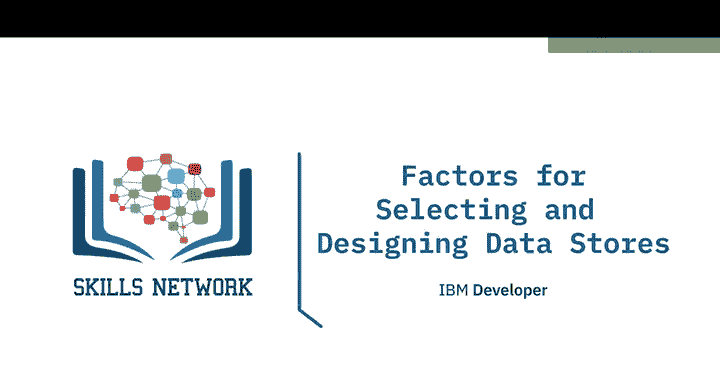
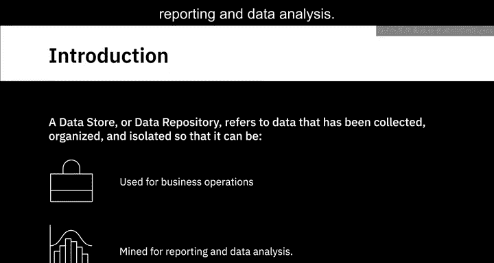
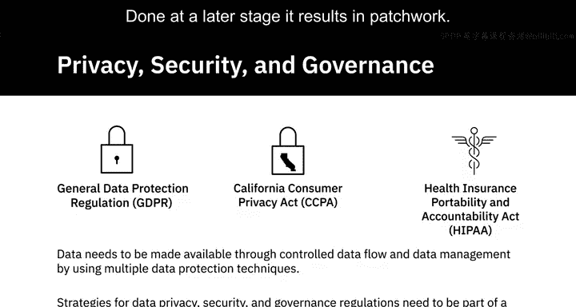
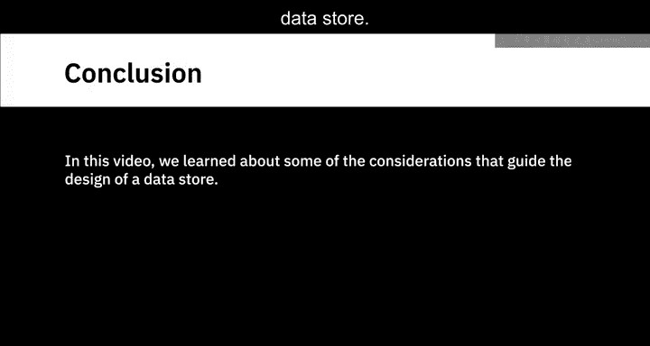

# 029：数据存储选型与设计要素

在本节课中，我们将学习如何为数据工程系统选择和设计合适的数据存储。我们将探讨数据存储的核心概念、不同类型、设计时的关键考量因素，以及如何根据业务需求做出最佳决策。

---

## 🗄️ 什么是数据存储？

数据存储或数据仓库是一个通用术语，指代那些已被收集、组织并隔离的数据，以便用于业务运营，或用于报告和数据分析。

一个数据仓库可以是数据库、数据仓库、数据集市、大数据存储或数据湖。一个设计良好的数据存储对于构建一个可扩展且能在高工作负载下稳定运行的系统至关重要。

---

## 🎯 数据存储设计的主要考量因素

在本视频中，我们将探讨设计数据存储时的一些主要考量因素，例如您想要存储的数据类型、数据量、数据的预期用途、存储考量，以及您组织的隐私、安全和治理需求。

---

## 🗂️ 数据类型与数据库选择

有多种类型的数据库，选择正确的一个是设计数据库的关键部分。数据库本质上是一个为数据的输入、存储、搜索、检索和修改而设计的数据集合。

根据数据类型，数据库主要可以分为两种方式：关系型和非关系型。

### 关系型数据库
关系型数据库（RDBMS）最适合用于**结构化数据**。这类数据具有明确定义的模式，可以组织成表格格式。

### 非关系型数据库
非关系型数据库（NoSQL）最适合用于**半结构化和非结构化数据**，这些数据是无模式的自由格式数据。

根据数据类型和您希望如何查询数据，非关系型数据库有四种不同类型：键值型、文档型、列型和图型。

例如，如果您希望运行复杂的搜索查询和多操作事务，那么文档型数据库可能不是您的最佳选择。

同样，如果您需要处理高容量事务，您不会选择图型数据库，因为图型数据库并未针对大规模分析查询进行优化。

---

## 📊 数据量与存储规模

设计数据存储时的另一个重要考量因素是数据量或规模。

当您需要以原始格式存储来自源头的大量原始数据时，**数据湖**将是您的合适选择。使用数据湖，您可以大规模存储关系型和非关系型数据，而无需定义数据结构和模式。

或者，当您处理**大数据**时——即不仅数据量大，而且类型多样、处理速度快，需要分布式处理以进行快速分析——那么**大数据存储库**将是您会探索的一个选项。大数据存储将大文件分割到多台计算机上，允许并行访问它们。计算在存储数据的每个节点上并行运行。

---

## 🛠️ 数据的预期用途

您打算如何使用收集到的数据，也是选择和设计数据存储时的一个重要考量因素。

事务数量、更新频率、对数据执行的操作类型、响应时间以及备份和恢复要求，所有这些都需要在数据存储的设计中得到考虑。

无论您是需要使用数据存储来记录高容量的事务数据，还是为了分析目的执行复杂的查询，您的处理和存储需求都会有所不同。

*   **事务型系统**：用于捕获高容量事务的系统，需要为高频率的读、写和更新操作而设计。
*   **分析型系统**：另一方面，需要对从事务型系统聚合的大量历史数据应用复杂查询。它们需要更快的复杂查询响应时间。

基于数据的使用方式，模式设计、索引和分区策略在系统性能中扮演着重要角色。

数据的预期用途也驱动着**可扩展性**作为设计考量因素。数据存储的可扩展性是其处理数据量、工作负载和用户增长的能力。

---

## 🔧 数据库规范化

在数据库设计阶段，**规范化**是另一个重要的考量因素。规范化是在数据库中高效组织数据的过程。如果操作得当，它有助于优化存储空间的使用，使数据库维护更容易，并提供更快的数据访问速度。

规范化对于处理事务数据的系统很重要，但对于为处理分析查询而设计的系统，规范化可能会导致性能问题。

---

## 💾 存储角度的关键设计考量

现在，我们将从存储的角度来看一些关键的设计考量。这些是数据的**性能、可用性、完整性和可恢复性**。

*   **性能参数**包括吞吐量和延迟。即从存储中读取和写入信息的速率，以及访问存储中特定位置所需的时间。
*   **可用性**：您的存储解决方案必须能让您在需要时毫无例外地访问数据。不应有任何停机时间。
*   **完整性**：您的数据必须安全，免受损坏、丢失和外部攻击。
*   **可恢复性**：您的存储解决方案应确保在发生故障和自然灾害时能够恢复数据。

---

## 🔒 数据隐私、安全与治理

一个安全的数据策略是一个分层的方法，它包括访问控制、多区域加密、数据管理和监控系统。

诸如GDPR、CCPA和HIPAA等法规限制了对个人和敏感数据的所有权、使用和管理。需要通过使用多种数据保护技术，通过受控的数据流和数据管理来提供数据访问。这是数据存储设计的一个重要部分。

数据隐私、安全和治理的策略需要从一开始就成为数据存储设计的一部分。如果在后期进行，会导致拼凑式的解决方案。

---

## 📝 总结

在本节课中，我们一起学习了指导数据存储设计的一些考量因素。我们探讨了如何根据数据类型（关系型 vs. 非关系型）、数据量（数据湖 vs. 大数据存储）、数据的预期用途（事务型 vs. 分析型）以及存储性能、安全性和治理需求来选择和设计合适的数据存储解决方案。理解这些要素是构建高效、可靠且安全的数据工程系统的基石。