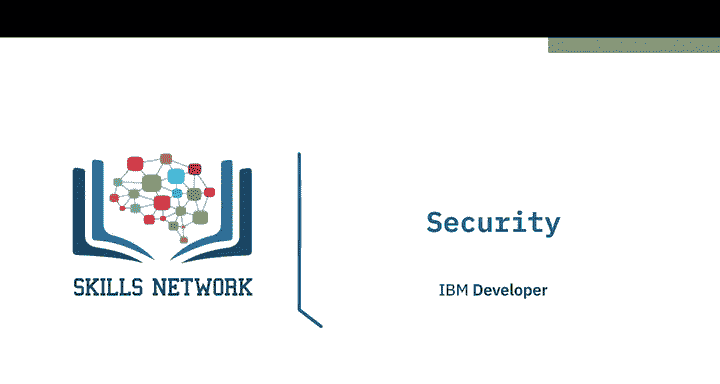
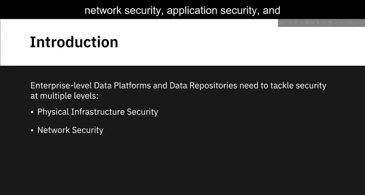
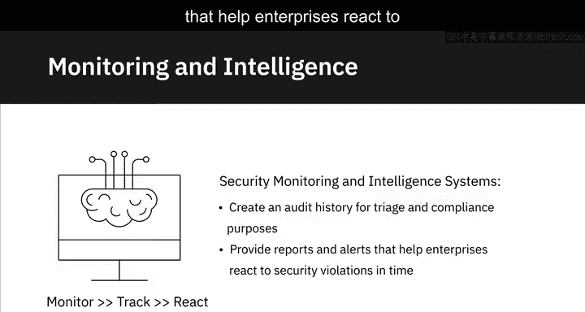
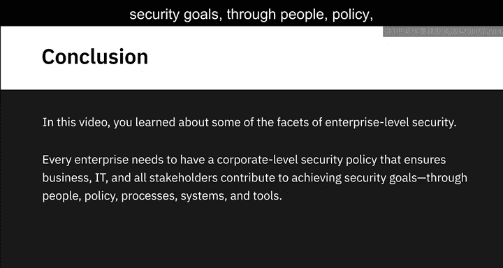
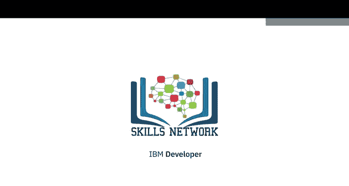

# 030：数据平台安全 🔒

在本节课中，我们将学习企业级数据平台和数据存储库需要应对的多层次安全问题。我们将探讨安全性的不同层面，包括物理基础设施安全、网络安全、应用安全和数据安全，并了解构成有效信息安全策略的核心原则。

---

## 信息安全的核心：CIA三要素 🛡️

在深入探讨各个安全层面之前，我们首先需要理解一个普遍适用于所有安全领域的核心框架，即CIA三要素。它构成了制定有效信息安全策略的三大基石。

以下是CIA三要素的具体内容：
*   **保密性**：通过控制未经授权的访问来确保信息安全。
*   **完整性**：通过验证资源是可信且未被篡改的来确保数据准确可靠。
*   **可用性**：通过确保授权用户在需要时能够访问资源来保障服务的连续性。

CIA三要素适用于所有安全层面，无论是基础设施、网络、应用还是数据安全。

---

## 安全的四个层面 🔐

上一节我们介绍了信息安全的通用框架，本节中我们来看看企业数据平台安全具体包含的四个不同层面或维度。

### 1. 物理基础设施安全

物理基础设施安全是IT系统安全的关键组成部分，涉及承载系统的物理设施的安全。对于云计算而言，这延伸到了云服务提供商的基础设施和设施安全。

以下是确保物理基础设施安全的一些措施：
*   基于身份验证的设施周界访问控制，以及对出入口进行全天候监控。
*   采用来自独立公用事业提供商的多路电源馈电，并配备专用发电机和UPS电池备份。
*   管理设施内温度和湿度的加热与冷却机制。
*   在选择设施地点时考虑环境威胁。例如，基础设施设施从不设在洪泛区或地震多发区，而是设在地震 resistant 结构中。
*   在此类设施中还安装多级雷电保护和接地系统。

### 2. 网络安全

网络安全对于保护互连系统和数据的安全至关重要。网络安全解决方案旨在防止未经授权的访问和攻击。

以下是常见的网络安全解决方案：
*   **防火墙**：防止对连接到互联网的私有网络进行未经授权的访问。
*   **网络访问控制**：通过仅允许授权设备连接网络来确保端点安全。例如，公司网络可能不允许装有过期服务包的设备连接。
*   **网络分段**：在网络内创建隔离区或虚拟局域网，以便根据不同资产所需的安全级别将资产隔离到单独的隔离区中。
*   **安全协议**：确保攻击者无法在数据传输过程中窃取数据。
*   **入侵检测与防御系统**：检查传入流量中的入侵企图和漏洞。

### 3. 应用安全

应用安全对于保护客户数据隐私和确保应用程序快速响应至关重要。安全需要构建在应用程序的基础中，以防止其他应用程序和服务引入漏洞。

您可以通过遵循以下安全工程实践来确保应用程序安全：
*   **威胁建模**：识别与应用程序相关的相对弱点和攻击模式。
*   **安全设计**：减轻风险。
*   **安全编码指南和实践**：防止漏洞。
*   **安全测试**：在应用程序部署前修复问题，并验证其不存在已知的安全问题。

### 4. 数据安全

数据安全是我们要探讨的最后一个，也是与数据工程最直接相关的层面。数据要么处于静态存储中，要么在系统、应用程序、服务和工作负载之间传输。无论是静态还是动态，数据都需要受到保护。

数据安全的主要控制措施之一是通过身份验证和授权系统来启用数据访问。
*   **身份验证系统**验证您的身份，通常使用密码、令牌、生物识别技术或这些方式的组合来实现。
*   **授权**确保用户根据其角色和分配给该角色的权限来访问信息。

**静态数据**包括文件、对象和存储。这类数据物理存储于数据库、数据仓库、磁带、异地备份或移动设备中。组织可以使用加密来应对静态数据面临的威胁。加密可以保护信息免遭泄露，即使信息丢失或被截获。

从一个地方移动到另一个地方的数据，例如通过互联网传输时，被称为**动态数据**。通常使用HTTPS、SSL和TLS等加密方法来保护动态数据。

在本课程后续内容中，您将了解更多关于数据生命周期的不同阶段、数据可能面临的漏洞以及有助于在整个生命周期中端到端保护数据的安全功能。

---

## 监控与响应 🚨

仅仅建立安全措施是不够的，主动监控和及时响应安全违规行为至关重要。为此，您需要在整个企业范围内实现安全流程和工具的端到端可见性与集成。

安全监控和智能系统为事件分类和合规目的创建完整的审计历史记录，并提供报告和警报，帮助企业及时对安全违规行为做出反应。

---

## 总结 📝

本节课中，我们一起学习了企业级数据平台安全的多个层面。您了解了构成信息安全基石的CIA三要素，并深入探讨了物理基础设施、网络、应用和数据这四个具体的安全维度。最后，我们强调了主动监控和集成响应的重要性。每个企业都需要制定企业级安全策略，确保业务、IT和所有利益相关者通过人员、政策、流程、系统和工具共同实现安全目标。