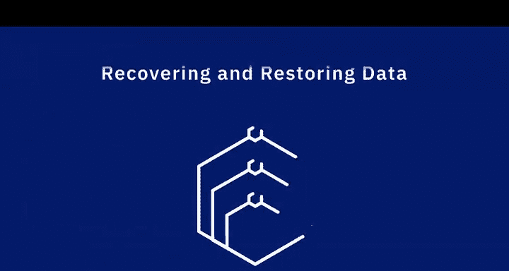

# 031：数据安全的重要性视角

在本节课中，我们将聆听几位数据专业人士的分享，探讨数据安全在数据工程领域中的核心地位。数据安全不仅是技术问题，更是关乎企业存续的战略要务。

---

## 🛡️ 数据安全的根本重要性

如果数据不安全，从长远来看，数据的其他任何方面都无关紧要。许多公司都曾遭遇严重的数据泄露事件。虽然如今这未必会让企业彻底倒闭，但这在一定程度上取决于组织的规模。

对于规模较小的组织，一旦失去对自身数据的访问权限，这很可能成为一个导致公司终结的问题。我们常常未能充分理解数据安全的重要性，总想着“上线后再加固”或“临上线前再加固”。但实际上，数据安全必须贯穿于每一个环节。

数据安全的重要性再怎么强调都不为过。几年前，《经济学人》杂志曾发表文章指出，世界上最有价值的资源不再是石油，而是数据。因此，数据是组织拥有的最宝贵资源，必须得到妥善的保护与保障。未能做到这一点，可能会带来灾难性的后果。

---

## 🔐 超越技术的组织责任

数据安全、治理与合规性，不仅仅是数据工程师需要担心的事情。它必须成为数据架构乃至整个组织流程的重要组成部分，组织的每个部分都需要持续关注这些事项。

我们必须确保，当存在独立的生产环境和非生产环境时，生产数据不会被“脱敏”不当而流入低级环境。绝对存在通过这种方式发生的数据泄露。我们必须思考并确保，只有真正需要访问生产数据的人才能获得相应权限。

---

## 👥 权限管理与内部威胁

关键在于理解你所使用工具的安全级别和角色设置，并确保每个用户仅获得完成其工作所需的最低权限。正是当我们赋予人们过多访问权限时，才真正为数据泄露和安全问题打开了大门。

事实上，对数据的威胁更可能来自组织内部，而非外部。想象外部人员入侵可能很刺激，但最常见的威胁往往源自内部。我们在数据行业听到的许多事件，例如药房人员访问名人处方信息，都属于此类。我们必须非常小心地保护数据。

---

## 💎 数据作为新时代的自然资源

数据是当今的自然资源。在大数据世界，数据就是石油，是我们的新自然资源。因此，我们的职责是确保这些有价值数据的金融属性得到保护，并确保我们的组织不会因为数据泄露而登上新闻头条，甚至更糟——因数据泄露而倒闭。

---

## 💾 数据恢复与硬件安全

我认为数据安全的一部分，是恢复数据的能力以及在特定硬件故障时进行恢复的能力。对我而言，这也是安全的一部分。因为如果我们因硬件故障而丢失数据，那就意味着我们无法访问数据，这在我看来就是数据安全的一部分。

---

## 📝 本节总结

本节课中，我们一起学习了数据安全的多个关键视角。我们认识到，数据安全是数据工程的基石，需要从组织战略、权限管理、风险认知（尤其是内部威胁）以及灾难恢复等多个层面进行综合考量。保护数据就是保护组织最核心的资产与未来。