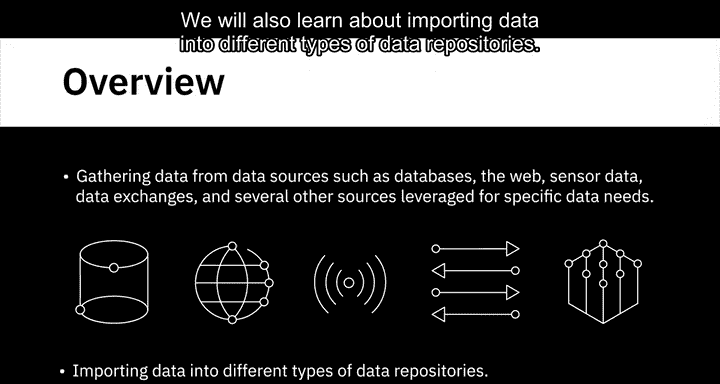
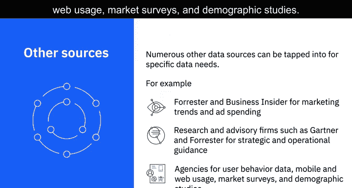
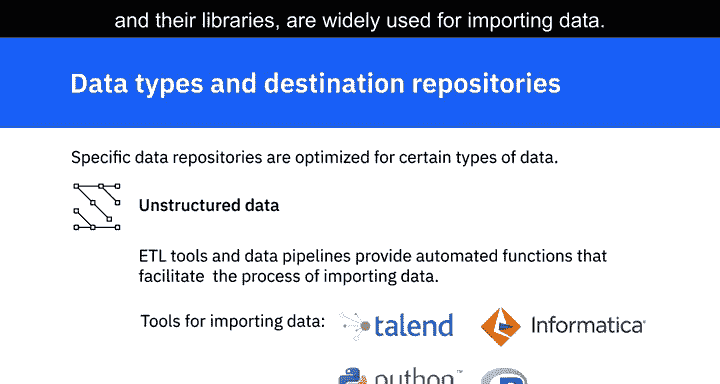

# 032：数据收集与导入方法

在本节课中，我们将学习从各种数据源收集数据的不同方法与工具，以及如何将数据导入到不同类型的数据存储库中。我们将涵盖从数据库、网络、传感器到数据交换平台等多种数据源的访问方式，并探讨针对不同数据类型的存储策略。

---



## 🔍 数据收集方法

上一节我们概述了数据工程的基本概念，本节中我们来看看具体有哪些方法可以从数据源中收集数据。

### 结构化查询语言（SQL）

SQL是一种用于从关系型数据库中提取信息的查询语言。它提供简单的命令来指定需要从数据库的哪个表中检索什么数据，可以对具有匹配值的记录进行分组，控制查询结果的显示顺序，并限制查询返回的结果数量等。

**核心公式/代码示例：**
```sql
SELECT column1, column2 FROM table_name WHERE condition GROUP BY column1 ORDER BY column2 LIMIT 10;
```

非关系型数据库也可以使用SQL或类SQL查询工具进行查询。一些非关系型数据库拥有自己的查询工具，例如Cassandra的CQL和Neo4j的GraphQL。

### 应用程序编程接口（API）

API也广泛用于从各种数据源提取数据。需要数据的应用程序可以调用API来访问包含数据的端点。这些端点可以包括数据库、Web服务和数据市场。API也用于数据验证，例如，数据分析师可以使用API来验证邮政编码。

### 网络爬虫

网络爬虫，也称为屏幕抓取或网络采集，用于根据定义的参数从网页下载特定数据。网络爬虫可用于从网站提取文本、联系信息、图像、视频、播客和产品项目等数据。

### RSS源

RSS源是另一种数据源，通常用于从在线论坛和新闻网站捕获持续更新的数据。

### 数据流

数据流是一种流行的数据源，用于聚合来自仪器、物联网设备、应用程序以及汽车GPS数据等的持续数据流。数据流和源也用于从社交媒体网站和交互式平台提取数据。

### 数据交换平台

数据交换平台允许数据提供者和数据消费者之间交换数据。数据交换有一套明确定义的交换标准、协议和格式。这些平台不仅促进数据交换，还确保维护安全性和治理。它们提供数据许可工作流、个人信息的去标识化和保护、法律框架以及隔离的分析环境。

以下是流行的数据交换平台示例：
*   AWS Data Exchange
*   CrunchBase
*   Lotame
*   Snowflake

### 其他专业数据源

许多其他数据源可以满足特定的数据需求。例如，对于营销趋势和广告支出，像Forrester和Business Insider这样的研究公司以提供可靠数据而闻名。像Gartner和Forrester这样的研究和咨询公司是战略和运营指导方面广泛信赖的来源。同样，在用户行为数据、移动和网络使用情况、市场调查和人口统计研究领域也有许多值得信赖的机构。

---

## 🗃️ 数据导入与存储库



在从各种数据源识别和收集数据之后，需要将其加载或导入到数据存储库中，然后才能进行整理、挖掘和分析。导入过程涉及合并来自不同来源的数据，以提供统一的视图和单一接口，通过该接口可以查询和操作数据。根据数据类型、数据量和目标存储库的类型，您可能需要不同的工具和方法。

上一节我们介绍了收集数据的方法，本节我们探讨如何将数据导入到合适的存储库中。

### 关系型数据库

特定的数据存储库针对某些类型的数据进行了优化。关系型数据库存储具有明确定义模式的结构化数据。如果您使用关系型数据库作为目标系统，您将只能存储结构化数据，例如来自OLTP系统、电子表格、在线表单、传感器、网络和Web日志的数据。结构化数据也可以存储在NoSQL数据库中。

### 半结构化数据

半结构化数据具有一些组织属性，但没有严格的模式，例如来自电子邮件、XML、ZIP文件、二进制可执行文件以及TCP/IP协议的数据。

半结构化数据可以存储在NoSQL集群中。XML和JSON通常用于存储和交换半结构化数据。JSON也是Web服务的首选数据类型。

### 非结构化数据

非结构化数据是没有结构且无法组织成模式的数据，例如来自网页、社交媒体源、图像、视频、文档、媒体日志和调查的数据。NoSQL数据库和数据湖为存储和操作大量非结构化数据提供了很好的选择。数据湖可以容纳所有数据类型和模式。

### 导入工具

ETL工具和数据管道提供了促进数据导入过程的自动化功能。例如Talend和Informatica等工具，以及Python和R等编程语言及其库，都广泛用于导入数据。

---

## 📝 总结



本节课中我们一起学习了数据工程中数据收集与导入的核心方法。我们探讨了使用SQL、API、网络爬虫、数据流和数据交换平台从不同来源收集数据的多种途径。接着，我们了解了如何根据数据的结构（结构化、半结构化、非结构化）将其导入到关系型数据库、NoSQL数据库或数据湖等合适的存储库中，并简要介绍了ETL工具和编程语言在自动化导入过程中的作用。掌握这些方法是构建有效数据管道的第一步。