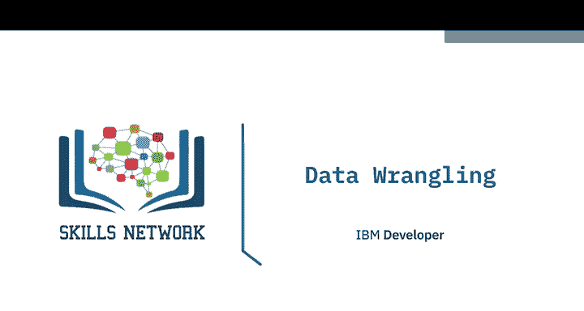
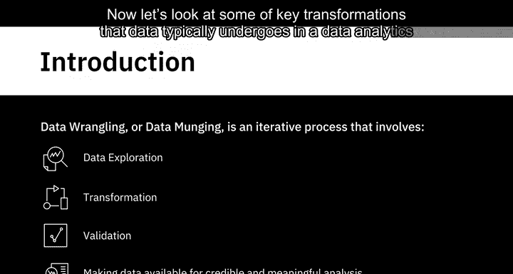
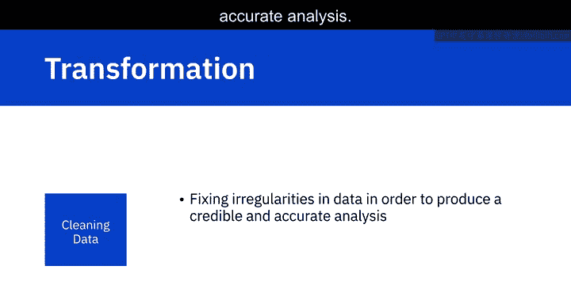
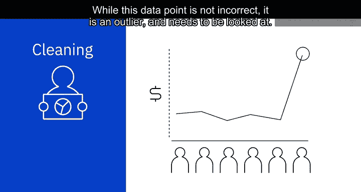
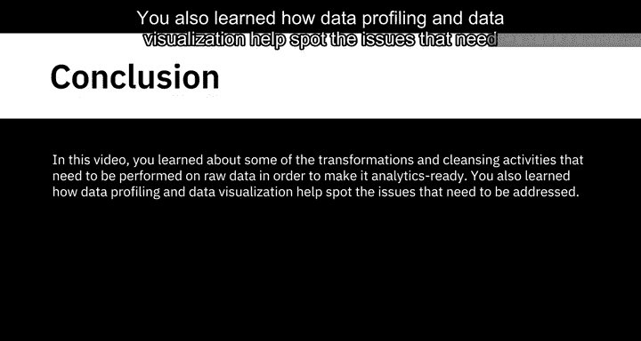

# 033：数据清洗

在本节课中，我们将学习如何将原始数据转化为可用于分析的数据。这个过程被称为数据清洗或数据整理，它包含一系列转换和清理活动，以确保数据的可信度和分析价值。

原始数据必须经过一系列转换和清理活动，才能成为可用于分析的数据。数据整理，也称为数据清洗，是一个迭代过程，涉及数据探索、转换、验证，并使数据可用于可信且有意义的分析。它包括广泛的转换和清理活动，我们将在本视频中学习其中一部分。

现在，让我们看看在数据分析场景中，数据通常经历的一些关键转换。

## 🔧 数据转换：结构化

上一节我们介绍了数据清洗的整体概念，本节中我们来看看第一种关键转换任务：结构化。这个任务包括改变数据形式和模式的操作。输入的数据可能具有多种格式。例如，一些数据可能来自关系数据库，而另一些数据可能来自Web API。为了合并它们，你需要改变数据的形式或模式。

这种改变可能很简单，比如改变记录或数据集中字段的顺序；也可能很复杂，比如将字段组合成复杂的结构。

以下是两种最常见的用于合并数据的结构化转换：

*   **连接**：当两个表连接时，连接操作合并的是列。结果表中的每一行都包含来自两个表的列。
    *   **公式/代码表示**：`结果表 = 表A JOIN 表B ON 条件`
*   **联合**：联合操作合并的是行。来自第一个源表的数据行与来自第二个源表的数据行合并到一个表中。结果表中的每一行都来自其中一个源表。
    *   **公式/代码表示**：`结果表 = SELECT * FROM 表A UNION SELECT * FROM 表B`

转换还包括数据的规范化和反规范化。规范化侧重于清理数据库中未使用的数据，减少冗余和不一致性。例如，来自事务系统的数据，由于持续进行插入、更新和删除操作，通常是高度规范化的。反规范化用于将来自多个表的数据合并到一个表中，以便更快地进行查询。例如，来自事务系统的规范化数据通常在运行报告和分析查询之前进行反规范化。

## 🧹 数据转换：清洗

了解了如何结构化数据后，我们接下来关注清洗任务。清洗任务是修复数据中的不规则性，以产生可信且准确的分析结果。数据清洗工作流程的第一步是检测数据集中可能存在的不同类型的问题和错误。

你可以使用脚本和工具来定义特定的规则和约束，并根据这些规则验证数据。你也可以使用数据剖析和数据可视化工具进行检查。

数据剖析帮助你检查源数据，以了解数据的结构、内容和相互关系。它能发现异常和数据质量问题。例如，空白或空值、重复数据，或者某个字段的值是否在预期范围内。

使用统计方法可视化数据可以帮助你发现异常值。例如，绘制人口统计数据集的平均收入可以帮助你发现异常值。

这引出了实际的数据清洗环节。你应用于清洗数据集的技术将取决于具体用例和遇到的问题类型。

以下是几种更常见的数据问题及其处理方法：

*   **缺失值**：处理缺失值非常重要，因为它们可能导致意外或有偏差的结果。你可以选择过滤掉具有缺失值的记录，或者在你的用例需要该信息时，设法获取该信息。第三种方法是**插补**，即根据统计值计算缺失值。你选择的行动方案需要基于什么对你的用例最有利。
*   **重复数据**：数据集中重复的数据点需要被移除。
*   **无关数据**：不符合你用例上下文的数据可以被视为无关数据。例如，如果你正在分析某个人群分段的总体健康状况，他们的联系电话可能与你无关。
*   **数据类型转换**：这需要确保字段中的值以该字段的数据类型存储。例如，数字存储为数值数据类型，日期存储为日期数据类型。
*   **标准化**：你可能需要清理数据以使其标准化。例如，对于字符串，你可能希望所有值都是小写。同样，日期格式和度量单位也需要标准化。
*   **语法错误**：例如，字符串开头或结尾的空格或多余空格是需要纠正的语法错误。这也包括修复拼写错误或格式。例如，在某些记录中，州名以全称（如 New York）输入，而在另一些记录中以缩写（如 NY）输入。
*   **异常值**：数据集中与其他观测值差异极大的值。异常值可能正确也可能不正确。例如，当选民数据库中的年龄字段值为5时，你知道这是不正确的数据，需要纠正。现在，考虑一群人，他们的年收入在10万到20万美元之间，但其中一人年收入为100万美元。虽然这个数据点并非不正确，但它是一个异常值，需要仔细审视。

## 📝 总结

本节课中，我们一起学习了为了使原始数据可用于分析而需要执行的一些转换和清理活动。你了解了如何通过结构化和清洗任务来准备数据，并学习了数据剖析和数据可视化如何帮助发现需要解决的问题。掌握这些基础技能是成为数据工程师的关键一步。