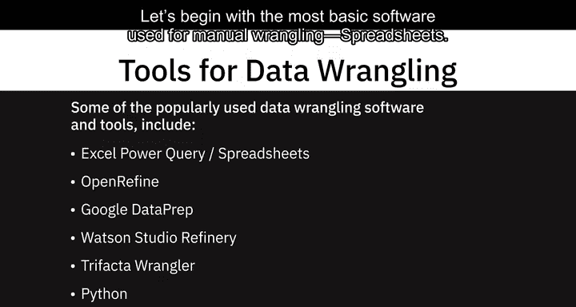
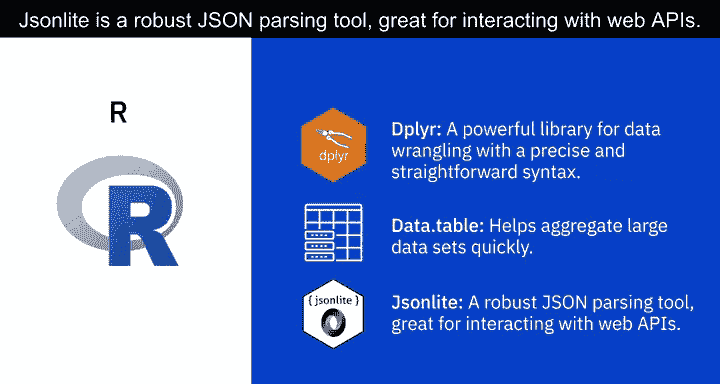
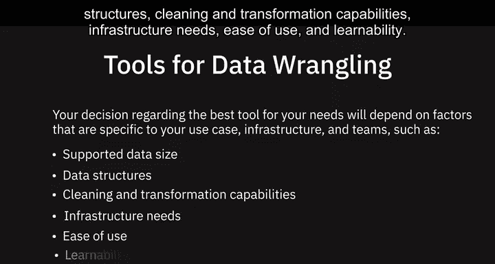

# 034：IBM数据工程专业证书第1课 - 数据清洗工具

在本节课中，我们将学习一些常用的数据清洗软件与工具。数据清洗是数据工程中至关重要的一步，它帮助我们将原始、杂乱的数据转化为干净、可用的格式，为后续分析做好准备。

---

## 🛠️ 常用数据清洗工具概览

上一节我们介绍了数据清洗的重要性，本节中我们来看看具体有哪些工具可以帮助我们完成这项任务。以下是几种广泛使用的数据清洗工具：

*   **电子表格软件**：例如 Microsoft Excel 和 Google Sheets。它们内置了丰富的功能和公式，可以帮助你识别问题、清理和转换数据。此外，还有插件（如 Microsoft Power Query for Excel 和 Google Sheets 的查询函数）支持从多种数据源导入数据，并按需进行清洗和转换。
*   **OpenRefine**：这是一款开源工具，支持导入和导出多种格式的数据（如 TSV、CSV、XLS、XML、JSON）。使用 OpenRefine，你可以清洗数据、转换数据格式，并通过网络服务和外部数据扩展数据集。它易于学习和使用，提供基于菜单的操作，无需记忆命令或语法。
*   **Google Data Prep**：这是一个智能的云数据服务，允许你以可视化方式探索、清理和准备结构化和非结构化数据以进行分析。它是一个完全托管的服务，意味着你无需安装或管理软件及基础设施。Data Prep 非常易于使用，它会根据你的每一步操作，建议理想的下一步，并能自动检测数据模式、数据类型和异常。
*   **Watson Studio Refinery**：通过 IBM Watson Studio 提供，允许你使用内置操作来发现、清理和转换数据。它将大量原始数据转化为可供分析使用的高质量信息。Data Refinery 支持将数据导出到多种数据源，能自动检测数据类型和分类，并自动执行适用的数据治理策略。
*   **Trifacta Wrangler**：这是一个基于云的交互式服务，用于清理和转换数据。它能处理混乱的真实世界数据，并将其清理和重排成数据表，然后可以导出到 Excel、Tableau 和 R 等工具。它以协作功能著称，允许多个团队成员同时工作。
*   **Python**：拥有庞大的库和包集合，提供强大的数据操作能力。以下是其中几个重要的库：
    *   **Jupyter Notebook**：一个广泛用于数据清洗与转换、统计建模和数据可视化的开源 Web 应用程序。
    *   **NumPy**：Python 提供的最基础的包，全称 Numerical Python。它快速、灵活、可互操作且易于使用。它支持大型多维数组和矩阵，并提供用于操作这些数组的高级数学函数。其核心数据结构是 `ndarray`。
    *   **Pandas**：专为快速简便的数据分析操作而设计。它允许通过简单的单行命令执行复杂操作，例如合并、连接和转换大量数据。使用 Pandas，可以防止因来自不同源的数据错位而导致的常见错误。其核心数据结构是 `DataFrame`。
*   **R**：也提供了一系列专门为处理杂乱数据而创建的库和包，例如 `dplyr`、`data.table` 和 `jsonlite`。使用这些库，你可以调查、操作和分析数据。
    *   **dplyr**：一个用于数据清洗的强大库，语法精确且直接。
    *   **data.table**：帮助你快速聚合大型数据集。
    *   **jsonlite**：一个强大的 JSON 解析工具，非常适合与 Web API 交互。

---

## ⚖️ 如何选择合适的数据清洗工具

了解了各种工具后，你可能会问：我应该选择哪一个？数据清洗工具具有不同的能力和维度。你选择最适合需求的工具，将取决于具体用例、基础设施和团队相关的因素。

以下是需要考虑的关键因素：

*   **支持的数据大小**：工具能高效处理的数据量级。
*   **支持的数据结构**：工具是否能处理结构化、半结构化或非结构化数据。
*   **清洗和转换能力**：工具提供的具体数据操作功能是否满足你的需求。
*   **基础设施需求**：是本地部署、云服务，还是完全托管。
*   **易用性和学习曲线**：工具是否易于上手和使用。

---

## 📝 课程总结

本节课中，我们一起学习了数据工程中常用的数据清洗工具。我们从基础的电子表格软件开始，介绍了 OpenRefine、Google Data Prep、Watson Studio Refinery、Trifacta Wrangler 等专用工具，并探讨了编程语言 Python 和 R 中强大的数据操作库。最后，我们讨论了如何根据数据大小、结构、功能需求、基础设施和易用性等因素来选择适合自己项目的工具。掌握这些工具将为你高效地进行数据预处理打下坚实基础。