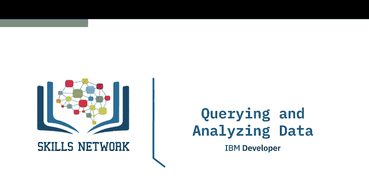
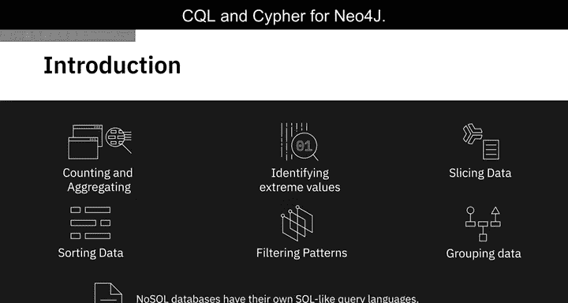
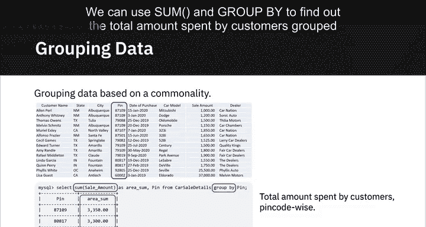
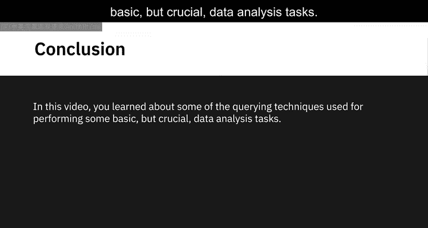
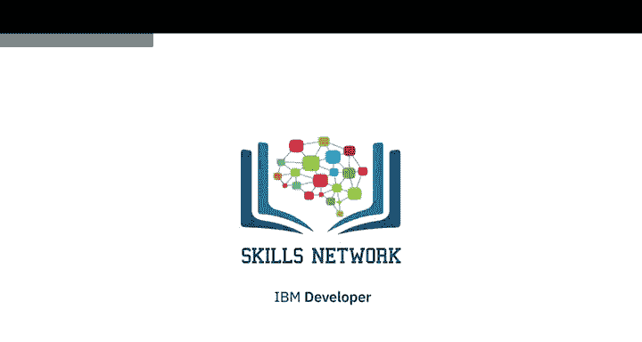

# 035：数据查询与分析



在本节课中，我们将学习如何使用查询语言访问数据库中的数据，以便更好地理解数据。我们将介绍几种基本的数据查询与分析技术，包括计数、聚合、识别极值、数据切片、排序、模式过滤和数据分组。这些技术虽然以SQL为例进行说明，但同样适用于其他查询语言和NoSQL数据库。

---

## 🔢 计数与聚合

上一节我们介绍了查询语言的基本作用，本节中我们来看看如何对数据集进行计数和聚合分析。计数和聚合函数能帮助我们快速了解数据的规模和分布情况。

以下是常用的计数与聚合函数：



*   **`COUNT()`**：计算数据集中的行数或记录数。例如，`SELECT COUNT(*) FROM customers;` 会返回客户表中的总记录数。
*   **`COUNT(DISTINCT column)`**：计算某列中唯一值的数量。例如，`SELECT COUNT(DISTINCT dealer) FROM sales;` 可以统计数据集中有多少个唯一的汽车经销商。
*   **`SUM(column)`**：计算数值列的总和。
*   **`AVG(column)`**：计算数值列的平均值。
*   **`STDDEV(column)`**：计算数值列的标准差，用于衡量数据的离散程度。标准差越大，数据分布越分散。

例如，在一个二手车销售数据集中，平均售价约为6000美元，但标准差超过11000美元。这表明售价分布非常广泛，存在远低于或远高于平均值的记录。

---

## 📈 识别极值与数据切片

了解了数据的整体情况后，我们常常需要关注其中的极端值或特定部分的数据。识别极值可以帮助我们发现数据中的高点与低点。

以下是识别极值的函数：

*   **`MAX(column)`**：返回某列中的最大值。例如，`SELECT MAX(amount) FROM sales;` 可以找出客户支付的最高金额。
*   **`MIN(column)`**：返回某列中的最小值。

数据切片则允许我们根据特定条件检索数据的子集。例如，我们可能只想查看居住在特定地区或消费金额在某个区间内的客户数据。这可以通过 `WHERE` 子句配合运算符实现。

```sql
SELECT * FROM sales
WHERE amount BETWEEN 1000 AND 2000
  AND region = 'North';
```

---

## 🔄 排序数据

对数据进行排序可以使其按某种有意义的顺序排列，从而更易于理解和分析。例如，如果我们想研究节日期间汽车销量是否上升，可以按购买日期对销售记录进行排序。

使用 `ORDER BY` 语句可以实现排序：

```sql
SELECT * FROM sales
ORDER BY purchase_date DESC; -- DESC表示降序，ASC表示升序
```

---

## 🎯 过滤模式

有时我们需要进行模糊匹配，而不是精确查找。`LIKE` 运算符允许我们根据模式来过滤数据，它比等号运算符更灵活。

例如，我们想筛选出某个地区（该地区邮政编码前三位固定，后两位变化）的所有购买记录。可以使用 `LIKE` 配合通配符 `%`（匹配任意多个字符）或 `_`（匹配单个字符）来实现。

```sql
SELECT * FROM customers
WHERE pin_code LIKE '123%'; -- 匹配所有以‘123’开头的邮政编码
```

---

## 👥 分组数据

分组是数据分析中的一个重要工具，它能将数据按指定列的值进行分类，然后对每个组进行聚合计算。这通过 `GROUP BY` 语句实现。

例如，我们想按邮政编码查看客户的总消费金额：

```sql
SELECT pin_code, SUM(amount) as total_spent
FROM sales
GROUP BY pin_code;
```

---



## 📝 总结





本节课中我们一起学习了几种基本但至关重要的数据查询与分析技术。我们了解了如何使用计数和聚合函数（如 `COUNT`, `SUM`, `AVG`, `STDDEV`）来获取数据的概览；学习了如何用 `MAX` 和 `MIN` 函数识别极值，以及如何使用 `WHERE` 子句进行数据切片。我们还探讨了通过 `ORDER BY` 对数据进行排序，利用 `LIKE` 运算符进行模式过滤，以及使用 `GROUP BY` 语句对数据进行分组分析。掌握这些技术是理解和分析数据库中数据的第一步。