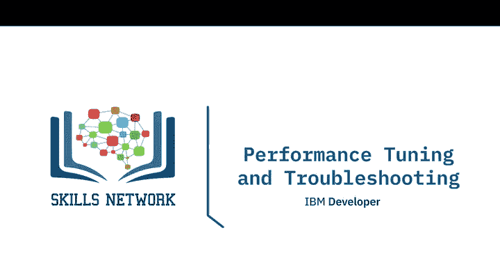
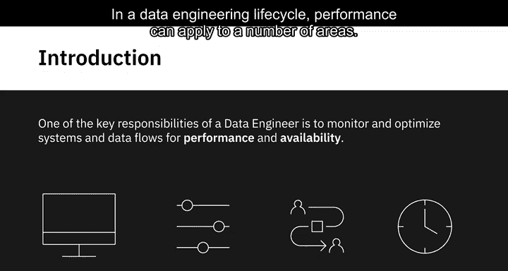
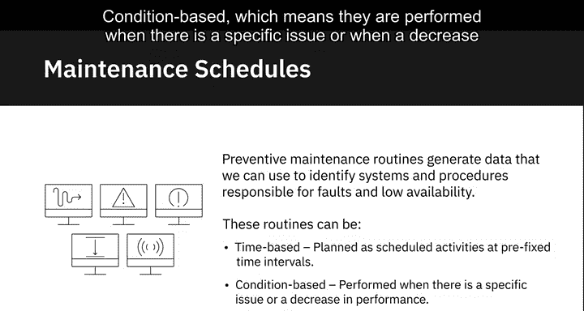
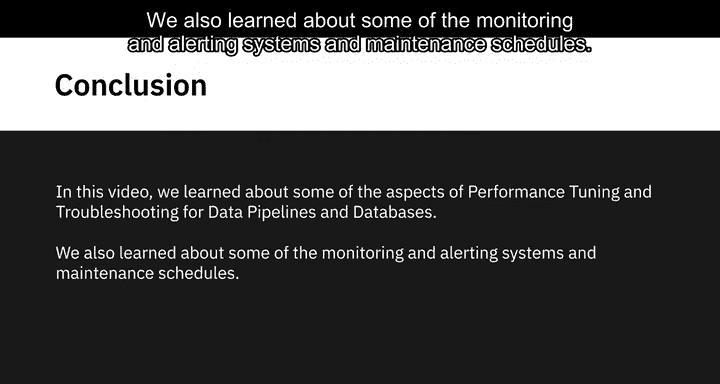
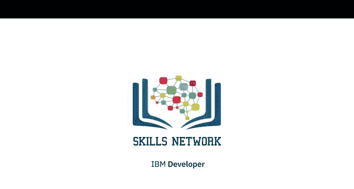

# 036：性能调优与故障排除

在本节课中，我们将学习数据工程师在数据工程生命周期中的一项核心职责：监控并优化系统和数据流的性能与可用性。性能问题可能出现在多个领域，本节我们将重点探讨数据管道和数据库的性能调优与故障排除方法。

---

## 🔍 数据管道的性能挑战

数据管道涵盖了数据从源头到目的地，流经多个系统、应用程序和过程的完整旅程。一个数据管道通常由复杂的工具组合运行，并可能面临多种性能威胁。

以下是数据管道常见的性能威胁类型：

*   **可扩展性**：面对不断增长的数据集和工作负载时，系统扩展能力不足。
*   **应用程序故障**：应用本身出现错误或崩溃。
*   **计划作业问题**：定时任务未按计划启动、等待依赖项，或任务未按正确顺序执行甚至完全未执行。
*   **工具不兼容性**：由于数据管道由处理不同任务的各种工具组成，工具间可能存在兼容性问题。

为了评估性能，我们需要定义明确的性能指标。

---

## 📈 数据管道的性能指标

当需要对数据管道进行基准测试或性能评估时，需要关注以下关键性能指标：

*   **延迟**：服务完成一个请求所需的时间。
*   **故障率**：服务发生故障的频率。
*   **资源利用率及利用模式**：系统资源（如CPU、内存）的使用情况。
*   **流量**：在给定时间段内接收到的用户请求数量。

---

## 🛠️ 数据管道故障排除步骤

那么，解决数据管道性能问题的最佳方式是什么？这取决于具体问题，但一般来说，可以遵循以下步骤：

1.  **收集信息**：尽可能多地收集关于事件的信息，最重要的是确认观察到的行为是否确实是一个问题。问题可能通过警报系统报告、用户反馈或在维护检查中被发现。
2.  **检查版本与变更**：检查是否使用了正确的软件和源代码版本。如果有最近的部署，检查变更内容并调查其与问题的潜在关联。
3.  **检查日志与指标**：在故障排除早期检查日志和指标，以隔离问题是与基础设施、数据、软件还是它们的组合相关。错误信息、日志以及故障发生时的网络负载、内存和CPU利用率对此有帮助。
4.  **复现问题**：如果日志无法帮助定位问题，则需要在测试环境中复现该问题。这可能是一个迭代且耗时的过程。
5.  **验证与修复**：一旦确定了根本原因假设，并通过一系列测试验证了该假设，就可以按照团队流程计划在生产环境中实施修复。

---

## 🗄️ 数据库性能调优

性能调优的另一个重要方面是优化数据库性能。我们首先需要了解数据库中需要监控的性能指标。

以下是关键的数据库性能指标：

*   **系统中断**：数据库服务不可用的时间。
*   **容量利用率**：存储、计算等资源的使用情况。
*   **应用程序减速**：因数据库响应慢导致的应用程序性能下降。
*   **查询性能**：单个查询的执行效率。
*   **冲突活动与查询**：多用户同时请求导致的资源竞争，以及批处理活动造成的资源限制。

接下来，我们看看数据库优化的一些最佳实践。

---

## 💡 数据库优化最佳实践

数据库优化涉及容量规划以及索引、分区、规范化等数据库设计活动。

以下是几项核心的优化实践：

*   **容量规划**：确定满足性能要求所需的最佳硬件和软件资源的过程，即使系统负载每日波动。容量规划也需考虑未来的增长需求。
*   **数据索引**：帮助快速定位数据，而无需搜索数据库中的每一行。它能在处理查询时最小化磁盘访问次数。其核心作用是加速数据检索。
    *   **公式/概念**：`CREATE INDEX index_name ON table_name (column_name);`
*   **数据分区**：将非常大的表分割成更小的独立表的过程。查询运行更快，因为它们只扫描数据的一小部分。分区还提高了数据可管理性。
    *   **公式/概念**：`PARTITION BY RANGE (column_name) (...);`
*   **数据规范化**：一种通过减少数据冗余引起的不一致性，以及减少对数据库进行更新、删除和插入操作时产生的异常，来设计数据库的技术。这影响了查询、清洗和分析操作的效率与速度。

---

## 📊 监控与学习系统

监控和学习系统帮助我们实时收集关于系统和应用程序的定量数据。在数据工程生命周期中，这些系统让我们能够洞察数据管道、平台、数据库、应用程序、工具、查询、计划作业等的性能。

让我们了解一些这类系统及其工作原理：

*   **数据库监控工具**：频繁抓取数据库性能指标的“快照”。这可以帮助您追踪问题真正开始发生的时间和方式，从而更有效地隔离并找到问题的根源。
*   **应用程序性能管理工具**：通过跟踪请求响应时间和错误信息来测量和监控应用程序性能。这些工具还跟踪每个进程所利用的资源量，有助于主动分配资源以提升应用性能。
*   **查询性能监控工具**：收集关于查询吞吐量、执行性能、资源利用率及利用模式的统计数据，以便更好地规划和分配资源。
*   **作业级运行时监控**：数据管道通常有运行时间很长的进程，这意味着在进程结束时才发现错误的代价很高。作业级监控将作业分解为一系列逻辑步骤，监控每个步骤的完成情况和完成时间。
*   **数据处理量监控**：监控流经数据管道的数据量，有助于评估工作负载的大小是否正在拖慢系统。

---

## 🧹 维护计划

另一项帮助系统在最佳水平运行的措施是执行维护例程。

预防性维护例程生成的数据可用于识别导致故障和低可用性的系统和流程。这些例程可以是：

*   **基于时间的**：计划为在固定时间间隔执行的定时活动。
*   **基于条件的**：在出现特定问题或注意到性能下降时执行。

---

## 📝 总结

本节课中，我们一起学习了数据管道和数据库性能调优与故障排除的多个方面。我们探讨了常见的性能威胁、关键指标、系统化的故障排除步骤，以及数据库优化的核心实践。此外，我们还了解了各种监控系统如何提供性能可见性，以及定期维护计划对于保持系统健康运行的重要性。掌握这些知识，是确保数据工程系统稳定、高效的基础。