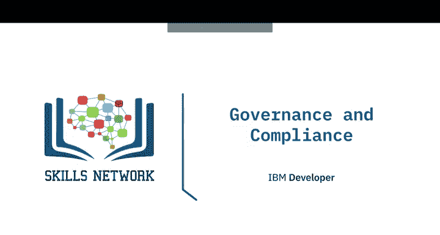
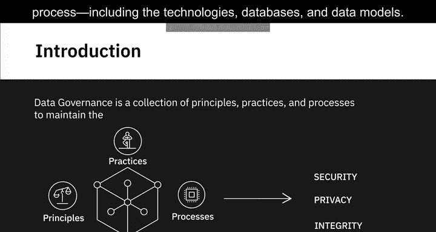
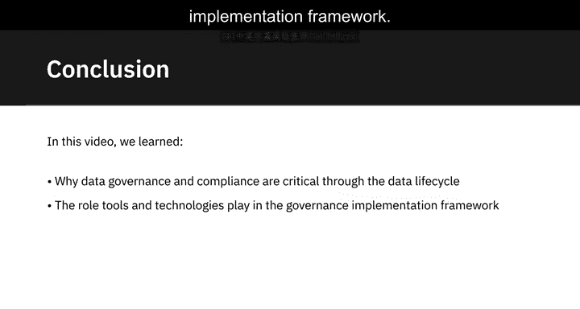
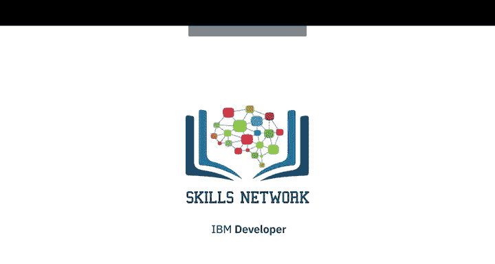

# 037：治理与合规

在本节课中，我们将学习数据治理与合规的基本概念。我们将了解数据治理的定义、相关法规的类型、合规的含义，以及数据生命周期各阶段的关键考量。最后，我们将探讨用于确保合规性的各种工具和技术控制措施。

---

## 什么是数据治理？

数据治理是一套用于在整个数据生命周期中维护数据**安全性、隐私性和完整性**的原则、实践和流程。

一个数据治理框架涵盖了组织数据管理流程的每个部分，包括技术、数据库和数据模型。

---

## 受法规保护的数据类型

上一节我们介绍了数据治理，本节中我们来看看法规旨在保护哪些类型的数据免遭滥用。

法规主要保护个人数据和敏感数据。这些数据可以追溯到个人、可用于识别个人身份，或包含可能对个人造成伤害的信息。例如，关于种族、性取向或遗传信息的数据。

以下是主要的法规类型：

*   **通用数据保护条例**：这是一项专门针对欧盟的法规。它保护欧盟公民在欧盟成员国内部交易中的个人数据和隐私。
*   **美国各州法规**：在美国，各州制定了各自的法规。例如，加利福尼亚州制定了《加州消费者隐私法案》，以更好地保护客户数据。
*   **行业特定法规**：这些法规管理敏感和个人数据的收集与使用。例如：
    *   在医疗保健领域，**HIPAA隐私规则**管理受保护健康信息的收集和披露。
    *   在零售领域，**PCI DSS标准**管理信用卡数据。
    *   在金融领域，**SOX法规**管理财务信息的处理和报告。

---

## 什么是合规？

合规涵盖了组织遵守法规并以合法、合乎道德的方式开展运营的流程和程序。

组织需要建立控制和检查机制，以遵守法规，并维护可验证的审计跟踪，以证明其对这些法规的遵守情况。

不遵守标准的后果可能很严重，可能导致经济处罚、损害公众形象，并导致客户和合作伙伴的信任丧失。

需要强调的是，合规不是一次性活动，而是一个持续的过程，需要人员、流程和技术的结合，并不断发展。

---

## 数据生命周期中的治理考量

治理法规要求企业在数据生命周期的每一步都明确其目的，并在行动中保持清晰和透明。

让我们通过一个典型的数据生命周期来更好地理解这一点，并了解每个阶段可能适用的一些考量。组织中的典型数据生命周期包括以下阶段：

以下是数据生命周期各阶段的关键考量：

*   **数据获取阶段**：需要确定需要收集哪些数据，以及获取这些数据的法律依据（合同和同意）。数据的预期用途应作为隐私政策发布，并在内部以及与数据被收集的个人进行沟通。还需要确定满足既定目的所需的数据量。例如，电子邮件地址是否满足您的目的，还是您也需要电话号码和邮政编码？
*   **数据处理阶段**：需要确定处理个人数据的细节，以及处理个人数据的法律依据，例如合同或同意。
*   **数据存储阶段**：需要确定数据将存储在何处，包括为防止内部和外部安全漏洞将采取的具体措施。
*   **数据共享阶段**：需要确定供应链中的哪些第三方供应商可能访问您收集的数据，以及如何通过合同让他们对您所负责的相同法规承担责任。
*   **数据保留和处置阶段**：需要确定在指定时间后保留和删除个人数据将遵循的政策和流程，以及如何确保在数据删除时，将其从所有位置（包括第三方系统）移除。

在上述每个阶段，您都需要维护个人数据获取、处理、存储、访问、保留和删除的可审计跟踪。

---

## 确保合规的工具与技术控制

现在，让我们看看通过不同工具和技术提供的一些控制措施，以确保遵守治理法规。

以下是用于确保合规的关键控制措施：

*   **身份验证与访问控制**：当今的平台提供分层身份验证流程，例如密码、令牌和生物识别技术的组合，以提供针对数据未经授权访问的全面保护。身份验证系统旨在验证您的身份。访问控制系统确保授权用户根据其用户组和角色访问资源（包括系统和数据）。例如，数据库具有角色和权限的概念，因此只有授权用户和应用程序才能访问特定对象，例如数据库中的表、行或列。
*   **加密与数据脱敏**：使用加密技术，数据被转换为编码格式，只有通过安全密钥解密后才能读取。数据加密可用于静态数据（存储在存储系统中时）和传输中的数据（通过浏览器、服务、应用程序和存储系统移动时）。数据脱敏为下游处理提供数据匿名化，并使用假名化。通过匿名化，表示层被抽象化，而无需更改数据库本身的数据。例如，在屏幕上显示时用符号替换字符。数据假名化是一种去标识化过程，其中个人身份信息被人工标识符替换，使得数据无法追溯到个人身份。例如，用名称字典中的随机值替换姓名。
*   **托管选项**：符合国际数据传输要求和限制的本地部署和云系统。
*   **监控与告警功能**：安全监控有助于主动监控、跟踪和应对跨基础设施、应用程序和平台的安全违规行为。监控系统还提供详细的审计报告，跟踪对数据的访问和其他操作。告警功能在安全漏洞发生时进行标记，以便可以立即触发补救措施。告警基于漏洞的严重性和紧急程度，这些在系统中是预定义的。
*   **数据擦除**：数据擦除是一种基于软件的永久清除系统中数据的方法，通过覆盖实现。这与简单的数据删除不同，因为删除的数据仍然可以恢复。

---

## 总结

本节课中，我们一起学习了为什么数据治理与合规在数据生命周期中至关重要且相辅相成，以及工具和技术在治理实施框架中所扮演的角色。我们探讨了数据治理的定义、保护的数据类型、合规的含义，并详细分析了数据生命周期各阶段的治理考量。最后，我们介绍了用于确保合规性的关键技术和控制措施，如身份验证、加密、监控和数据擦除。