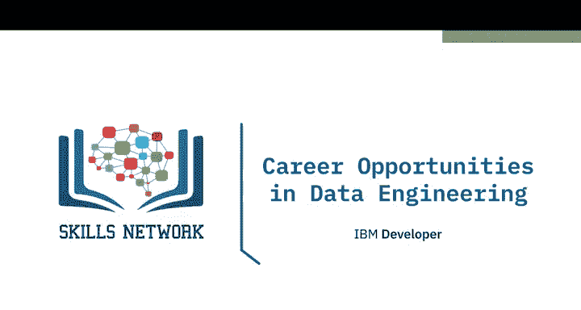
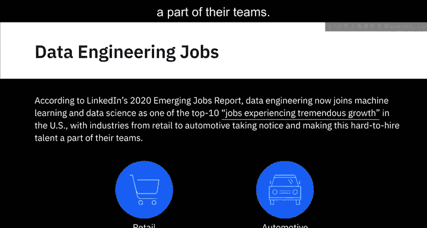
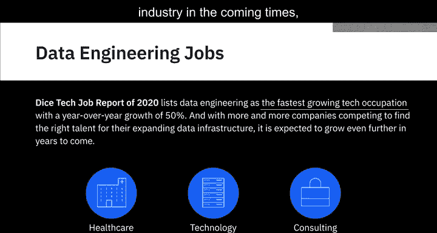
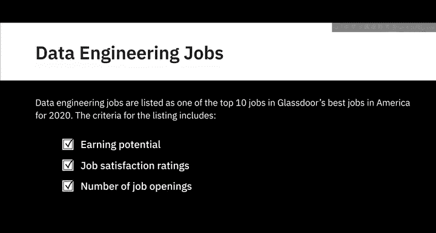
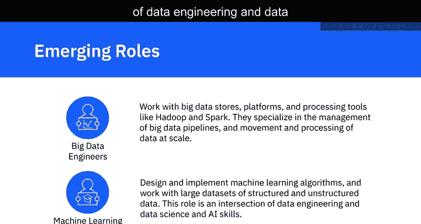
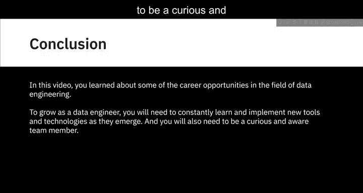
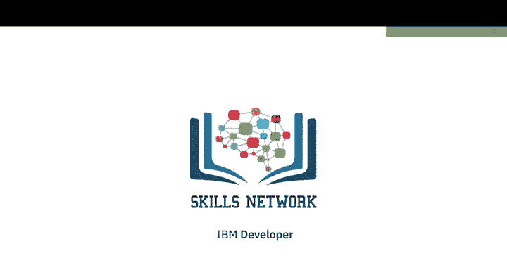

# 038：数据工程职业机会

在本节课中，我们将探讨数据工程领域的职业机会。首先，我们将从行业内的权威报告中了解这一就业市场的宏观情况。

---

## 就业市场宏观概览

根据LinkedIn的《2020年新兴就业报告》，数据工程师已与机器学习和数据科学家一同，成为美国增长最快的十大职业之一。从零售到汽车等各行各业都已注意到这一趋势，并将这类难以招聘的人才纳入团队。

Dice的《2020年科技就业报告》将数据工程师列为增长最快的技术职业，年增长率高达50%。随着越来越多的公司竞相为其不断扩展的数据基础设施寻找合适人才，预计未来几年这一需求将持续增长。报告进一步指出，医疗保健、技术和咨询是整体上对数据科学人才（包括数据工程师）需求最大的三个领域。但报告也强调，未来没有任何行业能完全不受这一领域的影响。

在Glassdoor的《2020年美国最佳工作》榜单中，数据工程师位列前十。该榜单的评选标准包括收入潜力、工作满意度评分以及职位空缺数量。

---

## 多样化的职位角色

数据工程领域提供了多样化的职位角色。职位名称可能比较灵活，不同公司的数据工程师角色可能略有不同。通常，组织内的数据工程角色会按专业领域进行划分，例如：数据架构、数据设计与架构、数据平台、数据管道与ETL、数据仓库以及大数据。

这些角色可能被统称为“数据工程师”，也可能有更具体的头衔，如：数据架构师、ETL工程师、数据仓库工程师和大数据工程师。例如，如果你的组织希望你专注于实施和管理基于云的数据湖，你的职位很可能是“数据湖工程师”。

然而，无论具体头衔如何，对于所有这些细分岗位，掌握操作系统、编程语言、数据库以及虚拟机、网络和应用服务等基础设施组件的知识，都是基本要求。同时，理解数据在业务中的潜在应用也同样重要。

你也可能有机会在一个小型团队或初创公司中，同时参与整个数据工程生命周期的各个阶段，尤其是在他们刚开始建立数据工程实践的初期。但随着实践的发展，一个多学科的工程团队将逐渐形成。

---

## 职业发展路径

如果你所在的组织已经建立了数据工程实践，那么你的职业道路很可能从助理或初级数据工程师开始，逐步晋升为数据工程师、高级数据工程师、数据工程主管和首席数据工程师。

晋升过程可能类似于在一个矩阵中导航。你不仅需要深化自己专业领域的技能，还需要拓展到数据工程的其他领域。例如，从数据架构师的角色出发，即使没有实践经验，也需要对数据仓库、数据湖、数据管道和ETL流程有功能性的理解。

数据工程师的成长不仅体现在你理解和掌握的工具与技术范围的扩大，还体现在你对数据工程生命周期整体图景的把握能力。你的沟通技巧、与不同技术和业务利益相关者协作的能力、运营或项目管理技能都需要持续进步，才能胜任领导职位。

作为领导者，你将承担更多责任，例如花更多时间将业务需求转化为技术规范，成为业务期望与技术团队开发成果之间的桥梁。你还需要评估并决定团队应该使用的工具和平台，并对确保数据质量、数据隐私和法规遵从性的系统、流程和工具的实施承担更大责任。

---

## 新兴角色

以下是该领域一些新兴的角色：

*   **大数据工程师**：他们与大数据存储、平台以及Hadoop和Spark等处理工具打交道，专注于大规模数据管道的管理以及数据的迁移和处理。
*   **机器学习工程师**：他们设计和实现机器学习算法，并处理大规模的结构化和非结构化数据集。这个角色是数据工程与数据科学及人工智能技能的交叉点。

---

## 总结

本节课中，我们一起学习了数据工程领域的一些职业机会。要成为一名不断成长的数据工程师，你需要持续学习和实施新兴的工具与技术，同时保持好奇心，并成为一名有团队意识的成员。