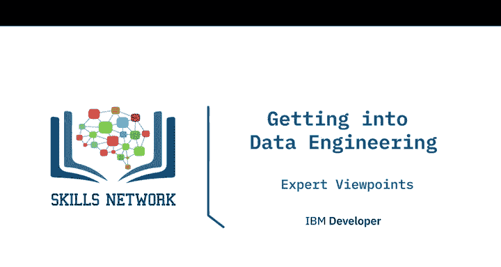
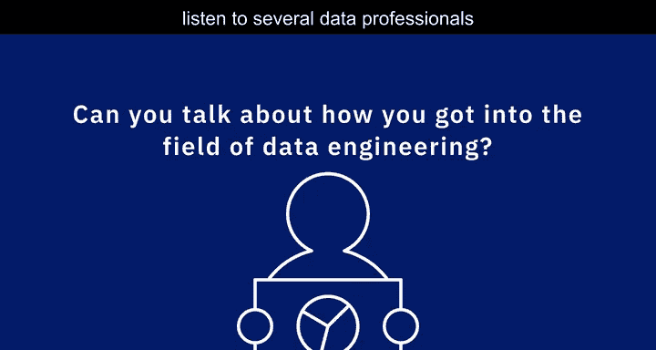
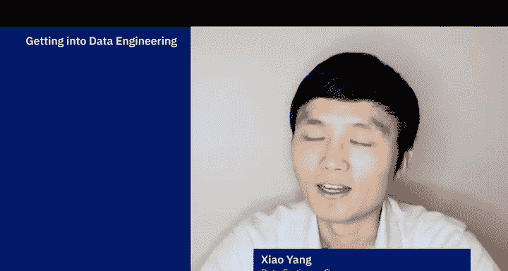
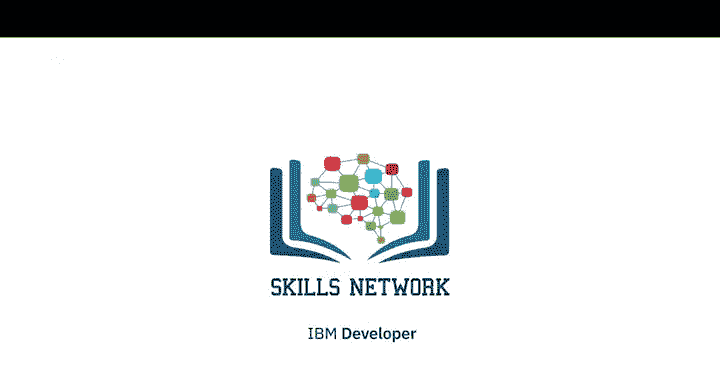

# 039：进入数据工程领域的视角 👁️

在本节课中，我们将聆听几位数据专业人士分享他们如何进入数据工程领域的故事。通过这些不同的职业路径，我们可以了解进入这个领域的多种可能性。

---

## 概述

本节视频汇集了多位数据工程师的个人经历。他们来自不同的背景，通过不同的方式进入了数据工程领域。他们的故事将帮助我们理解，成为一名数据工程师并没有单一固定的路径。

---

## 数据工程师的职业路径

上一节我们了解了数据工程的基本概念，本节中我们来看看几位从业者是如何开启他们的数据工程之旅的。他们的经历各不相同，但都指向了同一个充满活力的领域。

### 从数据库管理员（DBA）转型

第一位专业人士最初是一名专注于IBM DB2的数据库管理员（DBA）。他特别享受解决OLTP（联机事务处理）和OLAP（联机分析处理）数据库性能问题的过程。作为DBA，他有机会与Web应用开发人员、ETL开发人员、商业智能用户以及企业内其他团队进行互动。

随着业务需求的发展，对非DBMS工具和流程进行投资与研究的需求也随之增长。例如：
*   为了存储文档，他们采用了 **MongoDB**。
*   为了满足应用**7x24小时**高可用的需求，他们开始探索 **Cassandra**。
*   为了分析型数据库，他们开始探索 **Hadoop**，并搭建了独立的集群进行概念验证。

在探索并开始使用这些技术之后，他发现自己已经成为了一名数据工程师，而不再仅仅是DBA。

### 直接定位数据领域

第二位专业人士的入行方式有些不同。他认为进入数据工程通常有两种途径：从系统管理转向数据专业，或从开发转向数据专业。而他本人从大学毕业后，就立志成为一名DBA，并将此作为简历上的明确目标。他成功地在IBM找到了相关工作。

在两年内，他成长为一名合格的DBA。他指出，如今直接进入数据领域的机会可能更多。数据工程这类领域通常受益于其他领域的专业知识，例如系统运维经验或开发经验。了解系统管理的原则（如存储、网络影响）或了解开发人员、数据科学家对数据的需求，都是进入数据工程的有效途径。

他强调，数据工程绝对是一个可以从零开始的领域。无论你是否拥有大学学位，都需要对信息技术有基本的理解，并且最好能找到一位导师指引方向。导师可以帮助你明确学习重点。如今网络上有海量的学习资源，包括在线学位课程，为进入这个领域提供了前所未有的便利。

### 从实践与自学开始

第三位专业人士的起点是学生时期做一些简单的数据录入工作，这引发了他对数据处理及其力量的兴趣。尽管他拥有计算机工程学位，但这并未直接让他获得数据工程师的职位。

当时没有在线课程，他通过购买书籍来学习如何操作数据库。更重要的是，他通过创建数据库应用程序、参与志愿工作和自由职业来应用所学知识。这些实际的数据库工作技能和经验，最终帮助他获得了一份实习机会。

此后，他主要在工作中学习新技术，偶尔参加培训课程。如今，他主要通过观看YouTube视频和参加在线课程来了解新的数据技术。他认为这是一段有趣的旅程。

### 跨行业转型

第四位专业人士的经历展现了更大的跨度。大学毕业后，她先是在中学教了两年科学和地理，之后又在非营利教育机构做了三年的市场和招聘工作。接着，她进入研究生院学习非营利组织管理和信息系统，正是在这里，她对数据产生了兴趣。

毕业后，她加入了波士顿的一家教育非营利组织，成为一名商业智能分析师。这是她的第一份全职数据相关工作，学习曲线很陡峭，但她非常享受这个过程。工作一年半后，虽然仍热爱教育，她开始考虑在非营利部门之外尝试不同的方向。

于是，她开始寻找教育科技公司的机会，并向Coursera申请了数据科学家职位，但很快被拒绝了。幸运的是，当时的团队也在寻找数据工程师，他们认为她的背景有潜力，便主动联系她询问是否对该职位感兴趣。当时，数据工程对她来说是个新概念，她甚至不清楚数据工程与商业智能、数据科学之间的区别。但她抓住了机会，开始了面试流程，并幸运地获得了这份工作。2018年秋天，她从波士顿搬到湾区，开始了在Coursera的数据工程之旅。

---

## 总结

本节课中，我们一起学习了四位数据工程师进入该领域的独特视角。他们的故事表明，进入数据工程的路径是多样化的：可以从传统的DBA角色演进，可以直接以数据为目标开始职业生涯，可以通过自学和实践积累经验，甚至可以从完全不同的行业（如教育、非营利机构）成功转型。关键因素在于对数据的兴趣、持续学习的意愿、实践应用的能力，以及在可能的情况下寻求指导。这个领域对拥有不同背景和技能的人才持开放态度。