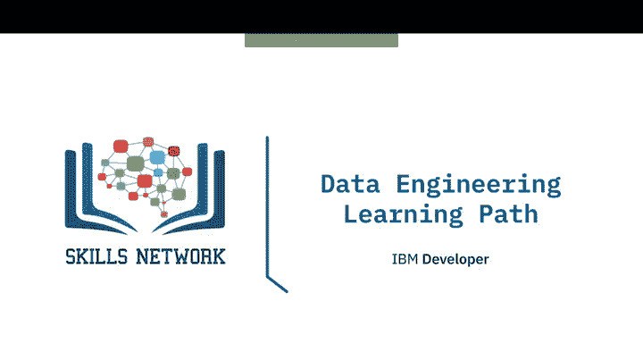
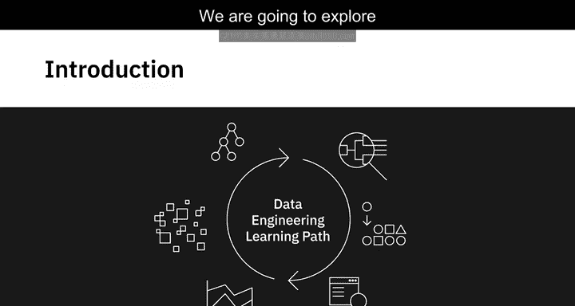
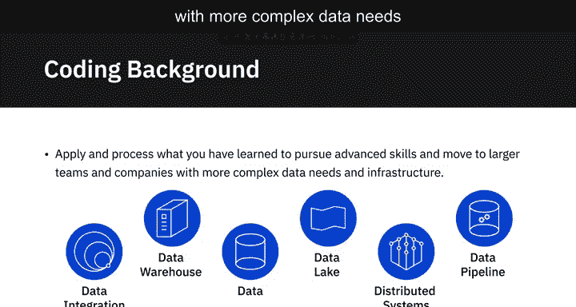
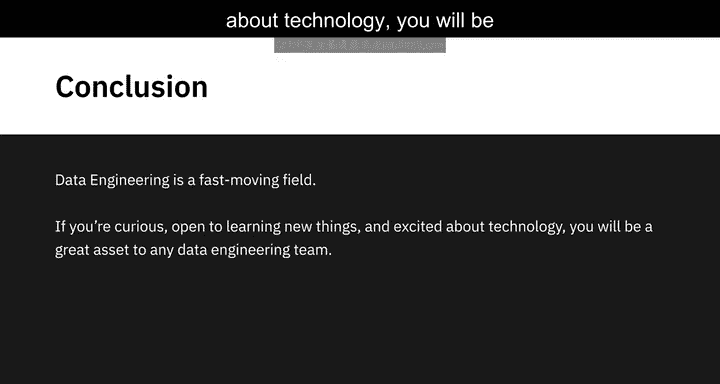

# 040：数据工程学习路径 📊

在本节课中，我们将探讨进入数据工程领域的多种学习路径。我们将分析不同背景的学习者如何规划自己的技能发展路线，并了解如何通过系统学习与实践项目来构建数据工程能力。

进入数据工程领域有多种路径可供探索。本视频将探讨其中一些主要路径。

## 学术路径与在线课程 🎓

上一节我们提到了数据工程领域的多样性，本节中我们来看看如何通过正规教育开启数据工程之旅。

数据工程是一个技术性很强的领域，拥有计算机科学或工程学学位能为你铺平道路。部分雇主确实会将学位作为入门级岗位的招聘标准。但同样真实的情况是，许多数据工程师，尤其是有一定编码背景的从业者，是通过自学成才的。

知名学习平台如Coursera、edX和Udacity提供了全面的在线课程与专业认证项目。这些课程的课程体系由该领域顶尖高校和科技公司设计并交付。

以下是这些课程的主要优势：

*   课程提供实践性作业和真实世界项目，帮助你建立进入该领域的信心。
*   完成课程后可获得专业认证，这些认证在当今就业市场受到认可和重视。

## 技能发展路径规划 🗺️

现在你已经对数据工程的子领域和技术技能的广度有了基本了解。因此，选择符合你当前技能水平和职业抱负的路径应该相对容易。

例如，在涉足数据工程的其他领域之前，你可以决定先从构建数据管道、分布式系统或数据架构方面的技能入手。明确短期和长期目标将有助于你为自己设计一条支持你整个旅程的学习路径。

## 跨领域转型路径 🔄

虽然进入这个领域有几种不同的方式，但你的技术能力将是你在这一职业中的主要支柱，同时还需要对数据在业务中的范围和应用有广泛理解。

如果你不是相关专业毕业生，或者想提升技能或转行，你也可以借助专业认证和其他学习资源来获取数据工程技能。

以下是两种常见的转型背景：

*   **技术相关岗位转型**：例如，你目前可能是IT支持专家、软件测试员、程序员或从事任何其他技术岗位，可以通过技能提升来获得数据工程技能。
*   **数据相关岗位深化**：你也可以是统计学家、数据分析师、商业智能分析师或其他类型的数据专业人士，通过技能重塑进入数据工程领域。

## 从基础到实践 🛠️

如果你对编码有基本的熟悉度，可以培养一些能让你入门的基础技术技能。

以下是入门阶段可以掌握的核心技能示例：

*   **编程与查询语言**：例如 `Python`、`SQL`、`Java` 或 `Scala`。
*   **操作系统与数据库**：学习在不同操作系统（如Linux）上工作，并操作各类数据库（如 `MySQL`、`PostgreSQL`）。

掌握其中一些技能后，你可以获得入门级工作，或者创建一些可以添加到作品集的项目，然后再开始追求更高级的技能。实际项目经验对于巩固你在这个领域的理解至关重要。

随着你在应用和处理所学知识方面获得经验，你可以转向拥有更复杂数据需求和基础设施的更大团队和公司。

## 持续学习与职业心态 🔄

数据工程是一个快速发展的领域。如果你充满好奇心、乐于学习新事物并对技术感到兴奋，你将成为任何数据工程团队的宝贵资产。

本节课中我们一起学习了进入数据工程领域的多种路径。我们了解到，无论是通过学术学位、在线认证课程，还是从现有技术或数据岗位转型，关键在于构建扎实的技术基础，并通过实践项目不断巩固和深化理解。明确的目标规划、持续学习的能力以及对技术的热情，是在这个快速发展的领域取得成功的重要因素。