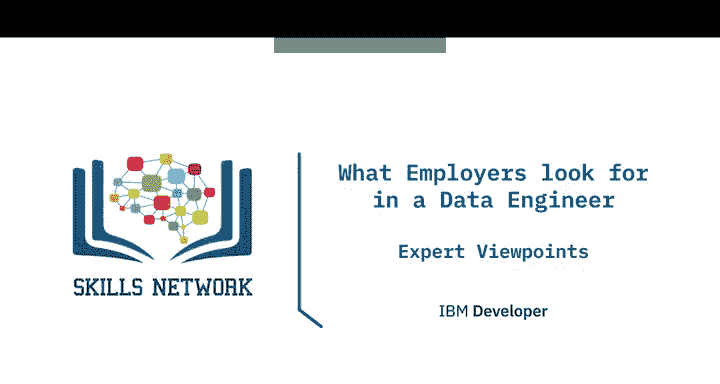
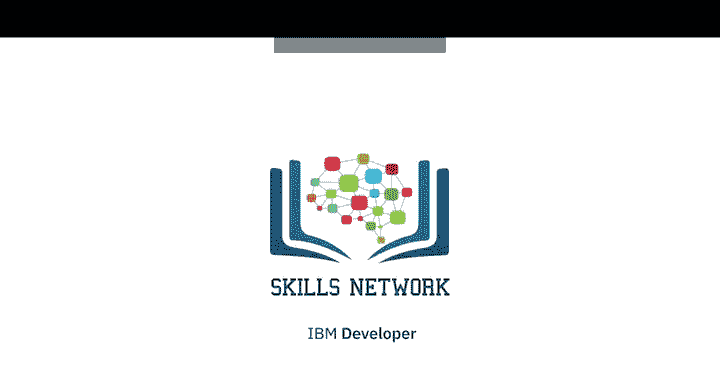

# 041：雇主对数据工程师的要求视角

在本节课中，我们将聆听几位数据专业人士的分享，了解雇主在招聘数据工程师时通常看重哪些技能和素质。通过他们的视角，我们可以更清晰地规划自己的学习和发展路径。

---

## 🎯 概述：雇主的多维度要求

雇主对数据工程师的要求并非单一标准，而是根据具体职位和公司需求有所变化。总体而言，他们既关注技术能力的广度与深度，也重视软技能和个人特质。

上一节我们介绍了课程的整体背景，本节中我们来看看几位行业专家具体阐述了哪些关键要求。

---

## 🔧 技术能力：广度与深度并存

雇主通常期望数据工程师接触过多种数据相关技术。不同职位侧重点不同：有的角色要求熟悉多种数据源，包括关系型数据库、NoSQL数据库、内存数据库或键值存储；有的则更看重数据移动流程方面的深厚经验，即能够从各类数据源（如RDBMS、NoSQL数据库）提取数据，甚至通过API从社交媒体获取数据并加载到数据湖或数据仓库中。

以下是雇主普遍关注的核心技术领域：

*   **数据库与数据模型**：精通RDBMS和NoSQL数据库，具备Schema设计能力。
*   **数据处理**：能够构建和维护ETL/ELT流程。其核心公式可表示为：`数据源 -> 抽取(Extract) -> 转换(Transform) -> 加载(Load) -> 目标存储`。
*   **数据流与格式**：有处理流数据的能力，并能处理多种数据格式（如JSON、Parquet、CSV）。
*   **数据获取**：掌握通过API进行数据采集或网络爬虫的技能。
*   **编程与查询**：熟练掌握SQL、数据建模、ETL方法论以及Python等编程语言被视为基础必备技能。
*   **数据分析与自动化**：具备基本的数据分析技能，并且重要的是，能够将工作中的常规任务自动化。

---

## 💡 软技能与思维模式

除了硬性技术指标，雇主同样高度重视候选人的软技能和内在特质。当招聘数据领域人才时，雇主会寻找具备以下素质的人：

以下是关键的软技能要求：

*   **好奇心与解决问题能力**：不满足于被动接受数据，能主动提出深入问题以明确方向。例如，当被问到“数据库变慢了，你怎么办？”时，雇主希望看到候选人通过提问来系统性定位问题根源（如网络、查询、硬件等），而非直接给出某个具体优化答案。
*   **沟通与协作能力**：数据工作绝非孤军奋战，需要与团队内外多方人员有效互动。清晰表达和阐述自己工作的能力至关重要。
*   **责任心与职业操守**：拥有强烈的责任感，对自己负责的工作和产出负责。
*   **持续学习热情**：对学习充满热情，能够通过课程、博客、项目等多种方式主动深入学习该领域。
*   **团队契合度**：评估候选人是否具备良好的团队合作技能，能否与组织文化相匹配。

---

## 🏢 公司规模与职位层级的影响

具体要求会因公司规模和职位层级而异。在大公司，数据工程师可能只需专注于特定领域，例如专门构建ETL管道；而在初创公司，工程师则可能需要身兼数职，因此雇主会期望其拥有更广泛的技能。

对于初级职位，雇主更看重对技术的普遍理解能力和软技能，而非某项特定精深技术。他们会关注候选人如何学习该领域，例如上过什么课程、阅读什么博客。对于高级职位，则会针对具体的业务需求，寻找拥有特定精深技术专长的人才。

---

## 🚀 如何脱颖而出：超越证书

拥有合适的学历或专业证书是获得关注的良好起点，但仅此还不够。你需要能够证明自己具备所需的技术和软技能，并从众多候选人中脱颖而出。

以下是一些让自己脱颖而出的方法：

*   **项目经验**：展示你完成过的相关项目。
*   **技术输出**：是否撰写过技术文章、进行过技术分享或制作过相关视频。
*   **技能演示**：在面试或简历中清晰展示你的沟通能力和技术理解。

---

## 📝 总结

本节课中，我们一起学习了雇主在招聘数据工程师时的多维评价标准。总结起来，一个成功的候选人需要**技术广度与深度结合**，掌握从数据存储、处理到获取的全栈技能；同时，**好奇心、解决问题能力、沟通协作和持续学习**等软技能与思维模式同样关键。此外，根据目标公司规模和职位层级调整技能展示重点，并通过实际项目和成果来证明自己的能力，是获得心仪职位的重要途径。