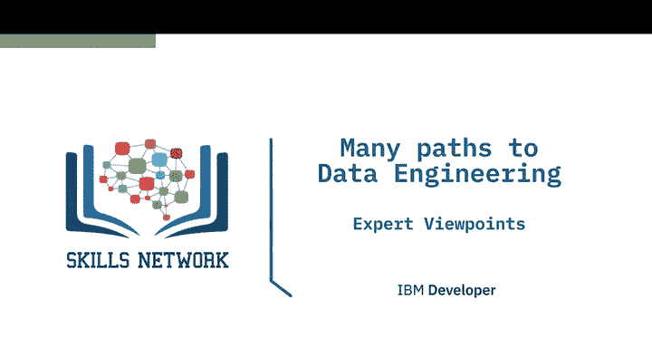
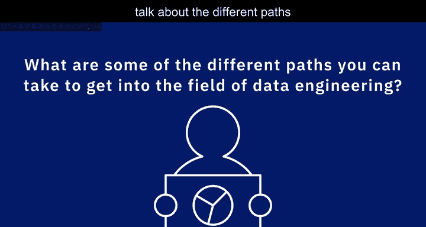
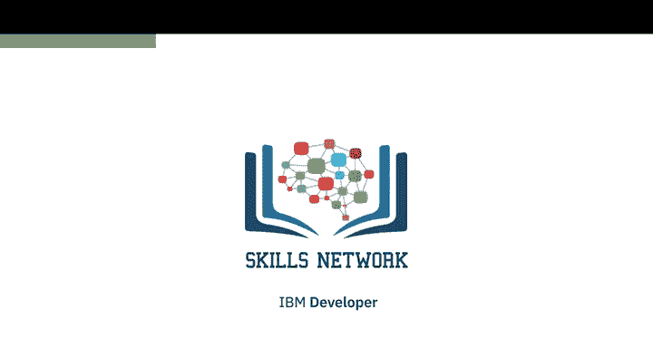

# 042：通往数据工程的多元路径

在本节课中，我们将聆听多位数据专业人士的分享，了解进入数据工程领域的多种不同途径。数据工程是一个新兴且多样化的领域，进入这个角色的路径并非唯一。

## 🎓 学术教育路径

上一节我们了解了课程的概述，本节中我们来看看进入数据工程领域的传统学术路径。

你可以从学院或大学获得软件工程或计算机科学等相关领域的学位，我就是通过这种方式入行的。但这个选择可能费用高昂，并且需要投入数年时间。即便如此，你可能仍需要在学校教授的知识之外补充技能，以满足实际工作的要求。

如果你已经拥有其他领域的学位，或者没有条件投入数年时间获取学位，可以选择更短期的文凭课程、线下训练营，或参加在线课程和证书项目。这些项目可以是兼职或全职的。

以下是选择合适项目时需要考虑的关键因素：
*   **成本**：评估课程的费用。
*   **时间**：确认完成课程所需的时间。
*   **声誉**：考察课程提供方是否具有良好声誉。
*   **内容**：确保课程内容是最新的。
*   **评价**：查看课程评价，并与已完成该课程的人交流。
*   **学习风格**：确保课程符合你的学习风格，例如，你是否有足够的动力进行在线自学，还是需要一定的指导。

## 🔄 职业转型路径

除了直接通过教育进入，从其他相关职业转型是另一条常见路径。数据工程师可以从多种现有角色转型而来。

以下是几种常见的转型起点：
*   **系统管理员**：这是一个很好的起点。你可以先精通一种操作系统和数据库，然后转型为数据工程师。
*   **数据库管理员**：你离成为数据工程师仅一步之遥。
*   **自动化工程师**：如果你擅长自动化手动任务，可以从这条路径转向数据工程。
*   **数据分析师**：你已经对数据有很多了解，这也是成为数据工程师的良好起点。
*   **程序员**：即使是一名程序员，也可以转型为数据工程师。

一位专业人士分享了他的观察：“你可以从DBA（数据库管理员）开始，然后过渡到数据工程，这对我和我的一些同事来说效果很好。我能想到的另一条自然过渡到数据工程的路径是从软件开发轨道转型。”

## 💡 核心技能与背景

无论选择哪条路径，掌握核心技能是成功的关键。底线是，数据工程师应该非常熟悉数据库、不同类型的数据源和数据格式，并利用这些知识来构建数据管道。

除了这些技术技能，学术背景也能提供助力。另一位专家指出：“从技术轨道来看，我认为如果你有计算机科学和数学背景，将会对你大有帮助，它会缩短你成为一名优秀数据工程师的时间。”

## 🌈 路径的多样性

整个数据工程领域非常新，并且正如前面提到的，不同公司对数据工程师的要求也不同。这基本上意味着有很多不同的方式和路径可以进入数据工程领域。

路径的多样性在从业者背景上得到体现：
*   我有几位同事在大学学习了计算机科学，毕业后直接进入了数据工程领域。
*   我也有一些数据工程师朋友，他们曾经是软件工程师。
*   那些在进入数据工程领域之前一直展现技术背景的人固然常见，但这并非绝对必要。你也可以在没有计算机科学背景的情况下进入数据工程领域。

一位从业者以自己的经历为例：“我的经验就是一个很好的例子。我在非营利组织从事了多年非技术职位，没有很强的技术背景。但我从非营利组织的商业智能分析师做起，在那里磨练了我在SQL、数据挖掘和数据库方面的技能，然后通过Coursera进入了数据工程领域。”

另一位管理者总结了常见的来源：“我看到的进入数据工程的典型路径，要么来自系统工程师一侧，要么来自开发人员一侧。从服务台转型过来的我也比较欣赏，因为你能从那个方向来的人身上感受到他们的工作 ethic。但更常见的是，你会看到有人从开发人员或系统管理员起步。”

---

**本节课总结**

本节课中，我们一起学习了进入数据工程领域的多元路径。我们了解到，除了传统的计算机科学学位教育，还可以通过短期课程、证书项目，或从系统管理员、数据库管理员、数据分析师、程序员等相关职业成功转型。关键在于掌握数据库、数据管道构建等核心技能，并选择一条与个人背景、学习风格和职业目标相匹配的路径。数据工程领域充满机会，条条大路通罗马。