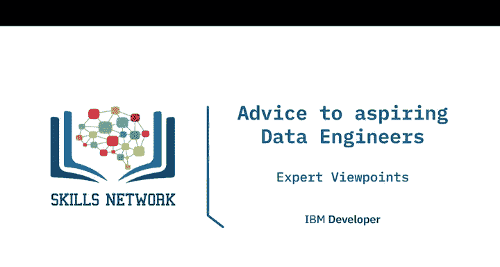
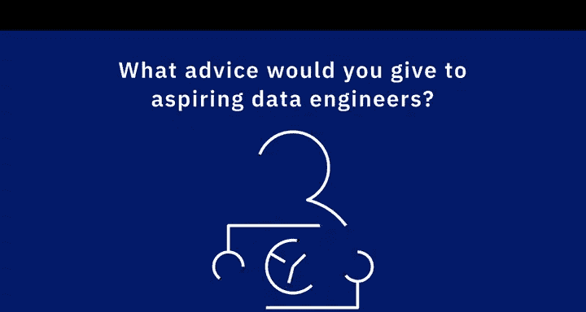
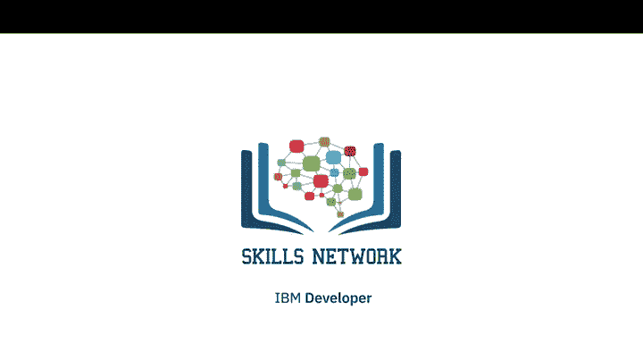

# 043：数据工程入门（IBM）🎯
## P43：给数据工程新手的建议

在本节课中，我们将聆听多位数据专业人士的分享，了解进入数据工程领域可以采取的不同路径。我们将整理他们的核心建议，帮助你构建扎实的基础并规划学习路线。

---

### 概述：数据工程师的成长路径

数据工程是一个快速发展的领域，掌握正确的学习方法和实践策略至关重要。本节将多位专家的建议归纳为几个核心方面，为你的学习之旅提供清晰指引。

---

### 1. 构建坚实基础 🧱

上一节我们介绍了课程的整体目标，本节中我们来看看如何为数据工程职业生涯打下坚实基础。专家们普遍认为，在追逐层出不穷的新技术之前，必须先掌握核心技能。

以下是构建基础的关键技能点：

*   **精通SQL与Python**：这是处理数据和实现自动化的两大基石。
*   **掌握数据建模与ETL方法**：理解如何设计和构建数据管道是数据工程师的核心职责。
*   **深入学习一种关系型数据库（RDBMS）**：选择一种你容易获取且感到舒适的RDBMS（如MySQL、PostgreSQL）并精通它。

### 2. 积累动手实践经验 🛠️

理论学习固然重要，但解决实际问题的能力更为关键。专家强调，获取实践经验并非一定要依赖全职工作或实习。

以下是获取实践经验的几种有效途径：

*   **利用开源工具进行个人项目**：数据工程领域有大量开源或免费工具，结合丰富的在线学习资料，你可以自主搭建项目进行练习。
*   **主动创造实践机会**：例如，可以请经验丰富的同事尝试“破坏”你搭建的数据库，然后你负责排查和修复问题。这种模拟实战能让你快速积累经验。
*   **为生活中的事物构建数据库**：将学习应用于实际场景，解决真实问题。

### 3. 拓展技术广度与深度 📚

在打好基础并拥有一定实践经验后，你需要拓宽技术视野，以适应不同的数据场景。

以下是建议拓展学习的领域：

*   **掌握至少一种NoSQL数据库**：例如MongoDB、Cassandra、Neo4j或Redis，理解其适用场景。
*   **学习编程语言**：理想情况下，应掌握多种范式的语言。
    *   一种过程式语言（如Shell脚本、PL/SQL）。
    *   一种面向对象/通用语言（如**Java**或**Python**）。
    *   一种函数式编程语言（如Scala）。
*   **了解数据获取技术**：学习网页抓取（Web Scraping）和API的使用，这是与外部系统交互、获取数据的重要方式。

### 4. 分享知识与融入社区 🤝

技术成长不是孤立的旅程。分享所学不仅能巩固知识，还能建立个人品牌，连接行业人脉。

以下是参与社区和分享知识的方式：

*   **在GitHub上公开你的代码**：建立个人作品集。
*   **撰写技术文章或博客**：可以在LinkedIn、个人博客或技术社区（如“data geek blog”）上分享。即使你是初学者，你对某个新工具或特定问题的理解也可能对他人极具价值。
*   **参加本地技术聚会或线上社群**：不仅是为了学习，也是为了结识同行、交流见解。
*   **尝试制作教学视频或演示**：教是最好的学。通过向他人讲解，你能更深刻地理解知识。

### 5. 保持持续学习的心态 🔄

数据工程与其他技术领域一样，正在持续不断地快速演进。

请将学习作为终身习惯：
*   持续跟进新的技术和数据处理方法。
*   考取相关的专业认证和证书，证明你的技能。
*   专注于你喜爱且市场需求旺盛的技术，并深入钻研，展示你的专业能力。

---

### 总结

本节课中，我们一起学习了多位数据工程专家给新手的宝贵建议。核心要点包括：**构建SQL、Python和数据建模的坚实基础**；通过**个人项目和模拟实战积累动手经验**；拓展学习**NoSQL、多种编程语言及数据获取技术**以增加技术广度；积极通过**分享代码、写作和参与社区**来建立连接并巩固学习；最后，始终保持**好奇心和持续学习**的态度。数据工程师目前市场需求旺盛，遵循这些建议将能帮助你在求职和职业发展中脱颖而出。

祝愿你在成为数据工程师的旅程中取得成功！