# 001：Python数据工程项目课程介绍

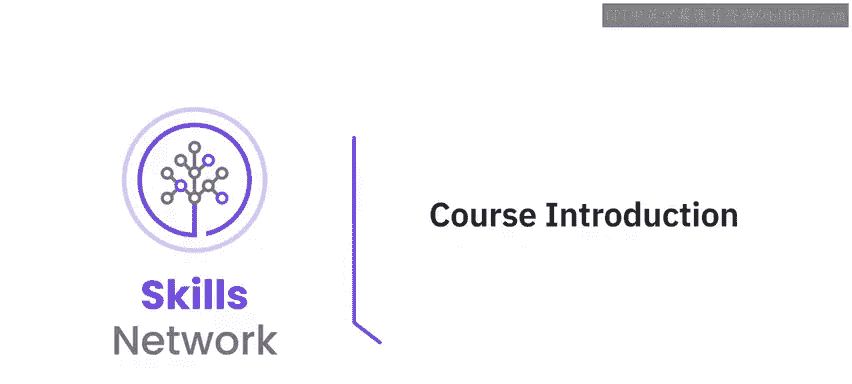

在本课程中，我们将通过一个真实世界的数据工程项目，学习如何使用Python进行数据工程的核心操作。课程将涵盖数据提取、转换、加载（ETL）的全过程，并指导你构建一个完整的ETL管道。

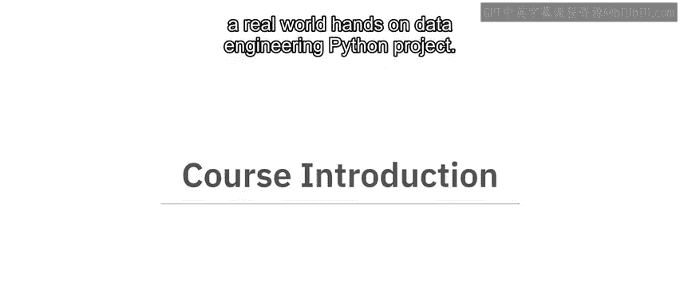

---

数据工程师是任何组织数据战略和规划的前线人员。数据工程任务，包括从源中提取数据、将其转换为所需格式以及加载以供进一步使用，是整个数据科学行业所依赖的基础操作。这也是数据工程师职位成为当今全球最受欢迎职位之一的主要原因。

在这个基于项目的课程中，你将扮演专业数据工程师的角色，处理真实世界的数据。你将使用Python，通过网络爬虫技术直接从网站获取所需数据，根据要求转换数据，并将其保存为本地文件和数据库中的表。你还将使用Python对数据表运行基本查询。

---

## 🎯 课程目标与适用人群

本课程面向具备基本编程知识、对Python有初步了解，并有意将其用于数据工程应用的任何人。

完成本课程后，你将能够：
*   通过读取数据文件、网络爬虫和使用API，从多个来源提取数据。
*   按要求转换数据。
*   将处理后的数据加载到所需格式或数据库中。
*   为访问和处理来自公共网站的数据，创建一个完整的**ETL管道**。
*   创建Python模块，运行单元测试并打包应用程序。

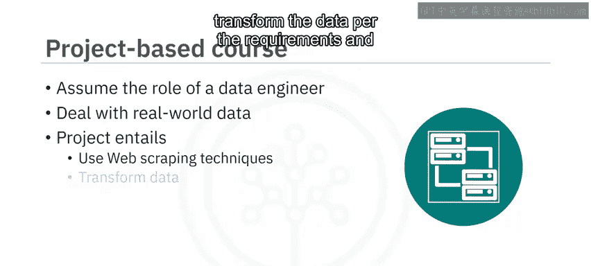

---

## 📚 课程模块概览

### 模块一：ETL与数据获取基础
上一节我们介绍了课程的整体目标，本节中我们来看看第一个模块的内容。

在模块一中，你将学习提取、转换和加载（ETL）操作的基础知识。你将使用网络爬虫技术和API从网页中提取所需信息。你还将学习使用Python访问数据库，并将处理后的信息作为表保存在数据库中。

以下是本模块的核心学习点：
*   **ETL操作基础**：理解数据工程的**提取（Extract）、转换（Transform）、加载（Load）** 流程。
*   **数据获取技术**：掌握使用 `requests`、`BeautifulSoup` 等库进行**网络爬虫**，以及使用 `requests` 库调用**API**。
*   **数据库交互**：学习使用 `sqlite3` 或 `SQLAlchemy` 等库连接数据库并执行操作。

### 模块二：构建ETL管道实战
在掌握了基础知识后，模块二将引导你将所学知识应用于实践。

在模块二中，你将运用前一模块的知识，开发一个功能性的ETL管道，用于获取和处理公共领域网站的数据。通过一个练习项目和一个计分项目，你将展示从不同网页链接为数据创建ETL管道的熟练程度。你需要提交项目作业供同伴互评。

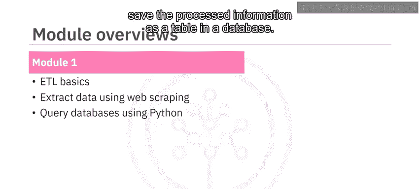

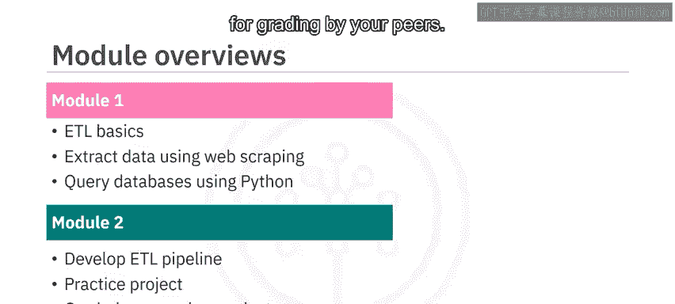

以下是本模块的核心任务：
*   **项目实践**：完成一个完整的ETL项目，代码结构可能如下所示：
    ```python
    # 示例：简化的ETL流程框架
    def extract_data(url):
        # 从URL提取数据
        pass
    def transform_data(raw_data):
        # 清洗和转换数据
        pass
    def load_data(clean_data, db_connection):
        # 将数据加载到数据库
        pass
    # 主ETL管道
    data = extract_data("http://example.com/data")
    processed_data = transform_data(data)
    load_data(processed_data, database)
    ```
*   **技能评估**：在计分项目中，综合运用爬虫、数据清洗和数据库操作技能。

### 模块三：代码开发与最佳实践
构建了可用的管道后，我们还需要确保代码的质量和可维护性。这就是模块三的重点。

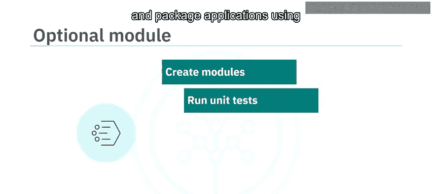

在模块三中，你将使用Python创建模块、运行单元测试并打包应用程序。你还将学习Python的理想编码实践并运行静态代码分析。

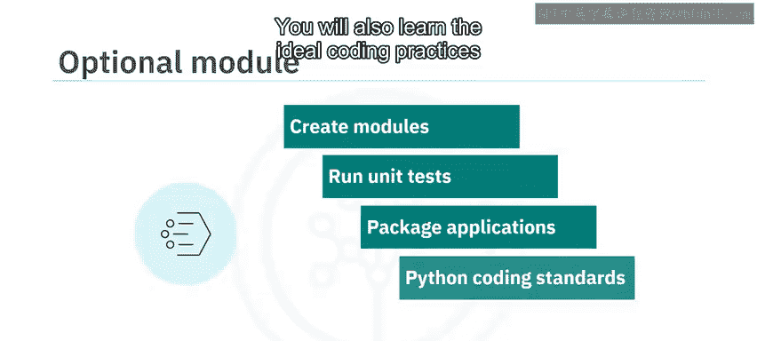

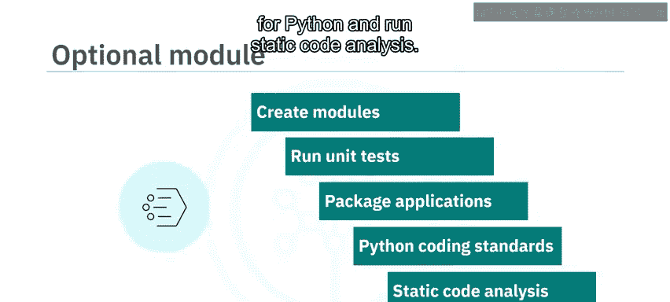

以下是本模块的核心学习点：
*   **模块化开发**：将代码组织成可重用的模块。
*   **质量保证**：使用 `unittest` 或 `pytest` 框架编写和运行**单元测试**。
*   **应用打包**：学习使用 `setuptools` 打包Python应用。
*   **代码规范**：遵循PEP 8等编码规范，并使用工具（如 `pylint` 或 `flake8`）进行**静态代码分析**。

---

## 💡 学习建议

课程内容非常丰富。为了从中获得最大收益，请确保观看每个视频，通过每个测验检查学习成果，并完成所有动手实验。如果你在任何课程材料上遇到困难，请随时在讨论论坛中联系我们。

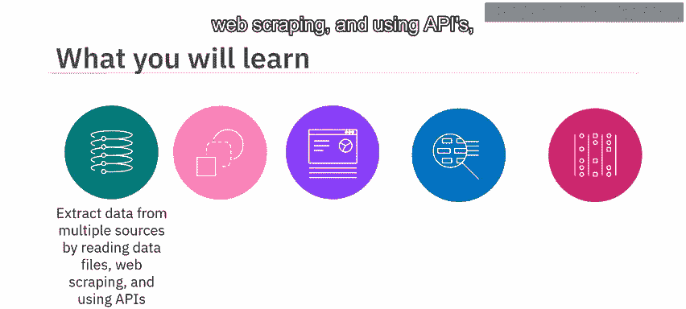

---

## 🏁 总结

本节课中，我们一起学习了《Python数据工程项目》课程的总体介绍。我们明确了数据工程师的角色和ETL流程的重要性，概述了三个核心模块的学习路径：从ETL基础与数据获取，到实战构建管道，再到代码开发与最佳实践。最后，我们列出了完成本课程后你将掌握的关键技能，并提供了成功的学习建议。

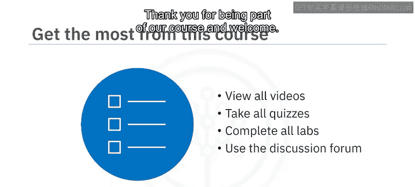

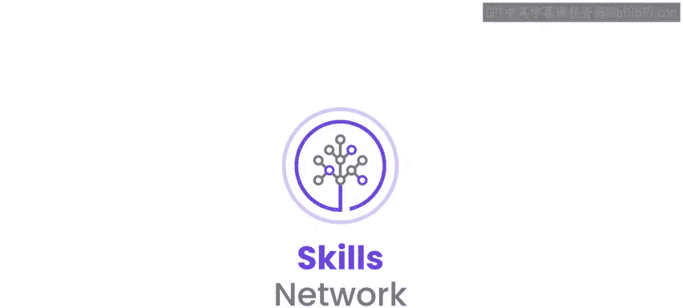

现在，你已经准备好开启这段实践之旅，亲手构建你的第一个数据工程管道了。祝你学习愉快！😊