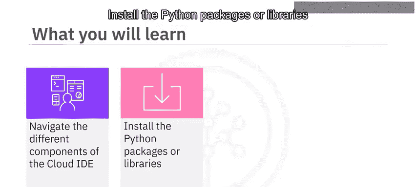
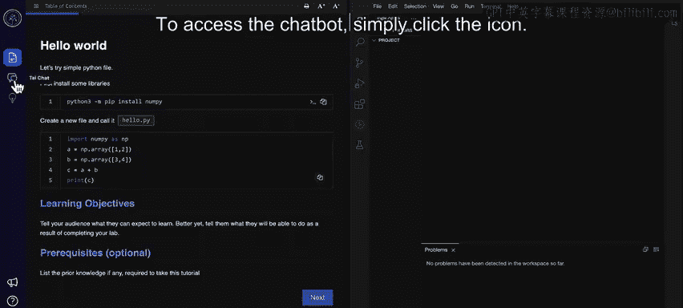
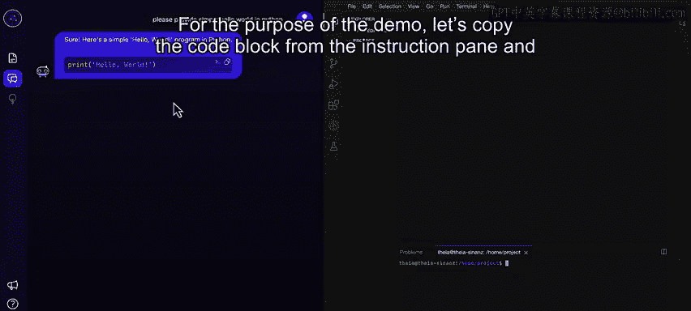
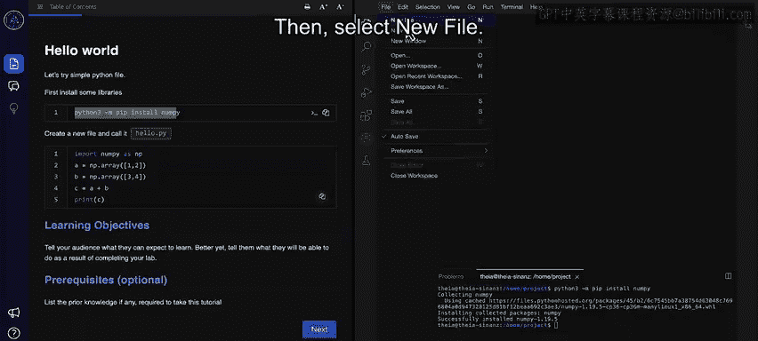
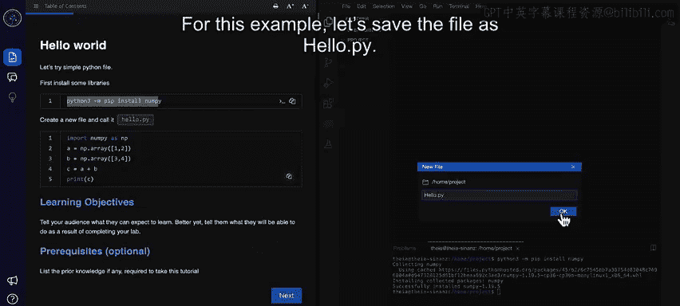
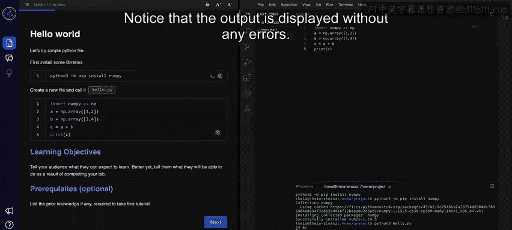

# 002：云端IDE工作演示 🚀

在本课程中，我们将学习如何使用IBM Skills Network团队提供的云端集成开发环境。这是一个无需在个人设备上安装任何软件，即可在浏览器中编写、运行、调试和执行代码的编程学习环境。

## 云端IDE界面概览 🖥️

打开云端IDE后，界面会显示两个主要窗格。

左侧窗格被称为**教学窗格**，用于显示完成项目所需遵循的指令。

右侧窗格则是一个**编程界面**，您可以在此编写和执行代码。请注意，此界面与流行的代码管理IDE——VS Code非常相似。

您可以调整教学窗格和代码窗格的大小。例如，通过拖动其边缘向左来缩小教学窗格，或向右拖动来扩大它。

您还可以根据个人偏好修改字体和字号。

如果教学窗格包含多个页面，您会看到“下一页”和“上一页”按钮，用于在页面间导航。您也可以预览教学页面。

注意教学窗格左上角的“目录”按钮，使用它可以在不同指令章节间导航。

## 使用AI教学助手聊天机器人 🤖

接下来，我们看看云端IDE上可用的AI教学助手聊天机器人。

IBM Skills Network团队提供了一个名为“TI”的AI教学助手聊天机器人，它能帮助您使用实验环境完成编码作业。TI的图标位于教学窗格的左侧。

要访问聊天机器人，只需点击该图标。

让我们尝试提问，例如：“请给我一个简单的Python代码。” 如您所见，代码会显示出来。您可以复制或执行这段代码。

## 编程界面详解 💻

现在，让我们深入了解IDE的编程界面。

编程界面包含多个组件，但您将频繁使用的两个标签页是：**编辑器标签页**（用于编写代码）和**终端标签页**（用于执行代码）。

在编程窗格中，还有一个**Skills Network工具箱**，它使您能够使用各种数据库管理环境、大数据工具、云工具、嵌入式AI库，并启动您构建的应用程序。

在开始编写代码之前，您需要在这个云端环境中安装所需的Python库或包。这个任务需要在终端标签页中完成。

要打开一个新终端，点击“终端”菜单，然后选择“新建终端”。为了演示，让我们从教学窗格复制代码块，并将其粘贴到终端中。

然后，按回车键执行命令。请注意，numpy库已成功安装。现在，您可以将这个库导入到您的代码中了。

## 创建并运行Python程序 🐍

现在，让我们在编程窗格中创建一个基础的Python程序。

点击“文件”，然后选择“新建文件”。新文件将在编辑器标签页中打开。在开始添加代码前保存文件是一个最佳实践。

由于我们正在编写Python代码，请将文件保存为以 `.py` 为扩展名的文件。从文件菜单中，点击“保存”或使用快捷键 `Ctrl+S`。当提示时，提供文件名。在此示例中，我们将文件保存为 `hello.py`。

下一步是添加代码。您可以在编辑器标签页中手动输入代码，或者如果教学窗格中有可用代码，可以将其复制并粘贴到您的文件中。

为了本次演示，让我们从教学窗格复制代码并粘贴到文件中。别忘了保存文件。

是时候执行代码了。让我们导航回终端标签页。

确保您位于存储程序文件的文件夹中。您可以通过输入 `python3` 后跟文件名来执行文件。对于此示例，命令是 `python3 hello.py`。

请注意，输出已显示且没有任何错误。

## 课程总结 📝

本次云端IDE演示到此结束。总结一下，云端IDE是一个类似于VS Code的编程环境，由IBM Skills Network提供，旨在用于学习和培养实践技能。

云端IDE有两个窗格：教学窗格和编程窗格。您可以使用教学窗格上的“目录”按钮在不同教学页面间导航。

编程窗格提供了用于编写代码的编辑器标签页和用于执行代码的终端标签页。您需要通过终端安装所需的库。

在实验过程中的任何时候，您都可以从教学窗格复制代码块，并将其粘贴到编辑器或终端标签页中。