# 003：提取、转换、加载（ETL）🧩


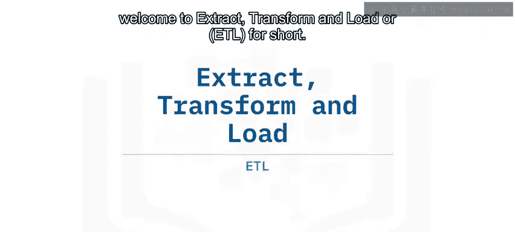

在本节课中，我们将学习**提取、转换、加载（ETL）** 过程。我们将定义ETL流程，解释其功能的正确顺序，并编写一个简单的ETL程序。

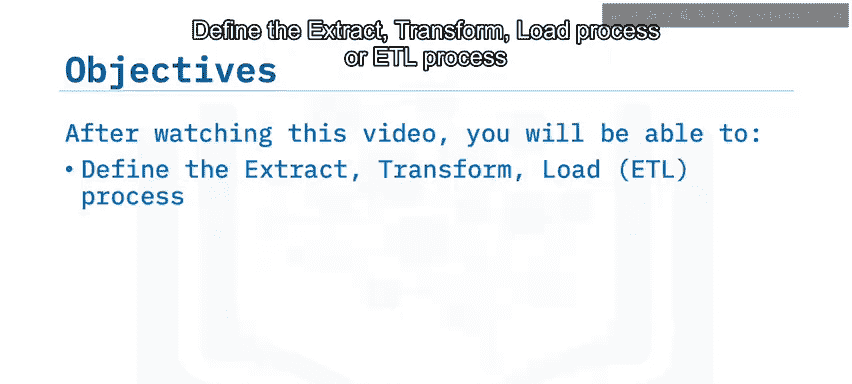

你是否曾想过，数据是如何从多个来源收集并合并成单一信息源的？这种数据收集方式称为**批处理**。今天，我们将探讨一种名为**提取、转换、加载（ETL）** 的批处理类型。

ETL正如其名所示。它是从多个来源和格式中提取大量数据，将其转换为特定格式，然后加载到数据库或目标文件中的过程。让我们用以下框图来表示ETL管道。


例如，假设你是一家初创公司的所有者，该公司开发了一个人工智能，利用身高和体重预测某人是否有患糖尿病的风险。你的部分数据是CSV格式，另一部分数据是JSON文件。你需要将所有数据提取到一个文件中，以便人工智能读取。你的数据是英制单位，但人工智能使用公制单位，因此你必须转换它。人工智能只读取一个大型CSV文件中的数据，因此你需要将数据加载为CSV格式。

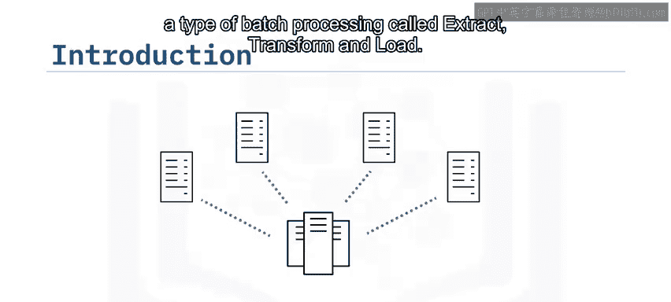

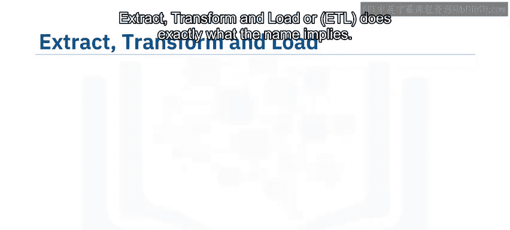

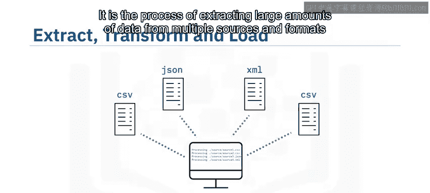

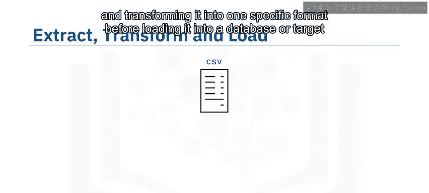

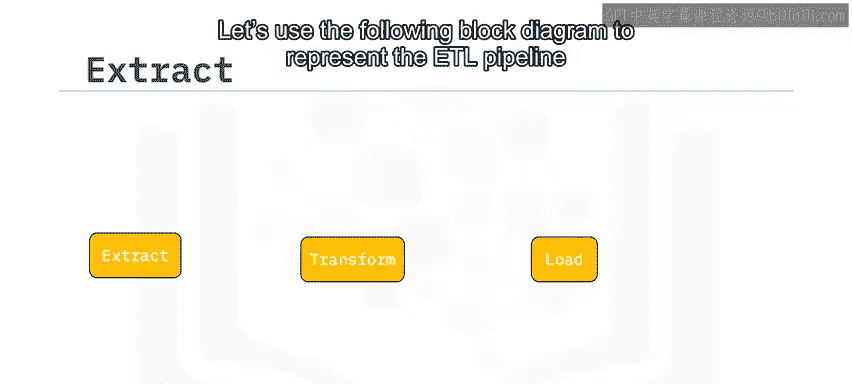

让我们用Python实现以下ETL过程。首先，我们将通过一些简单示例查看提取步骤。但在讨论提取函数之前，让我们先讨论其组成部分函数。

以下是`glob`模块中的`glob`函数。输入是文件扩展名，输出是具有该特定扩展名的文件列表。

考虑JSON和CSV文件列表。输入是`glob`文件扩展名，前面带有星号和点号。输出是CSV文件列表，我们可以对JSON文件执行相同操作。

我们可以编写一个函数来提取包含姓名、身高和体重的CSV文件。输入是CSV文件的文件名，结果是一个数据框。我们可以对JSON格式执行相同操作。输入是JSON文件的文件名，输出是一个数据框。请查看实验部分以获取更多示例。

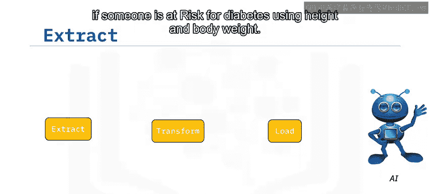

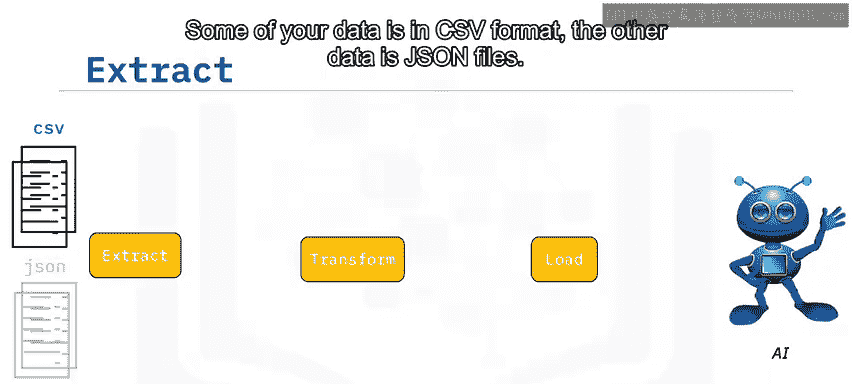

## 🔍 提取函数

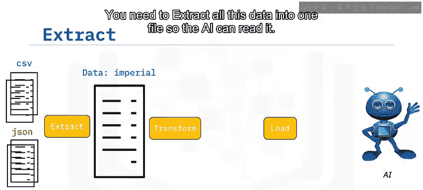

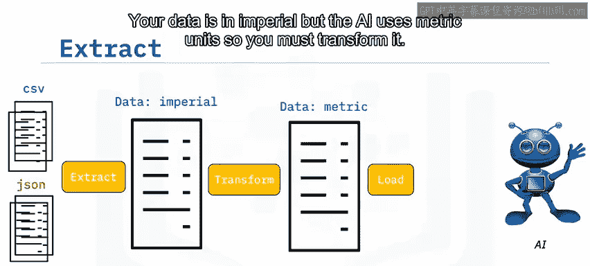

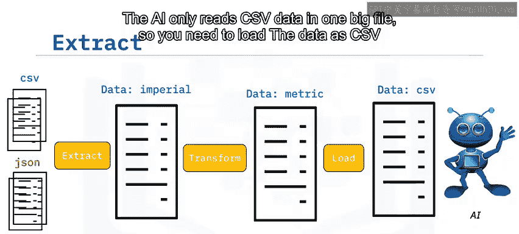


提取函数将从多个来源批量提取大量数据。我们创建一个空数据框。

```python
extracted_data = pd.DataFrame(columns=['name','height','weight'])
```

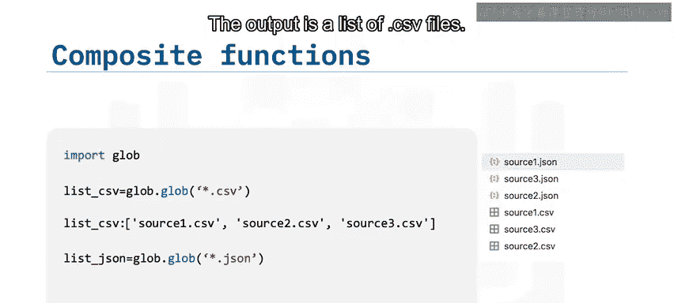

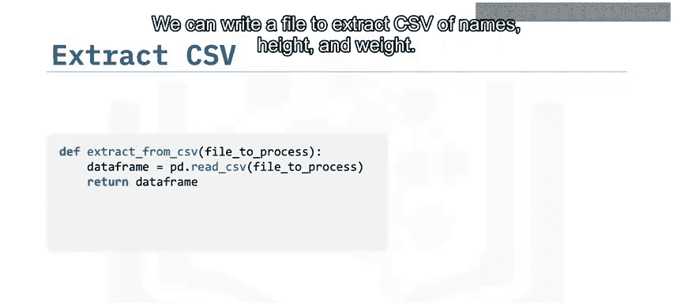

结果是一个分配了列名的空数据框。

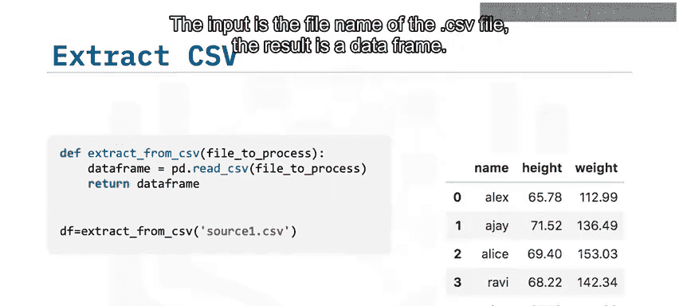

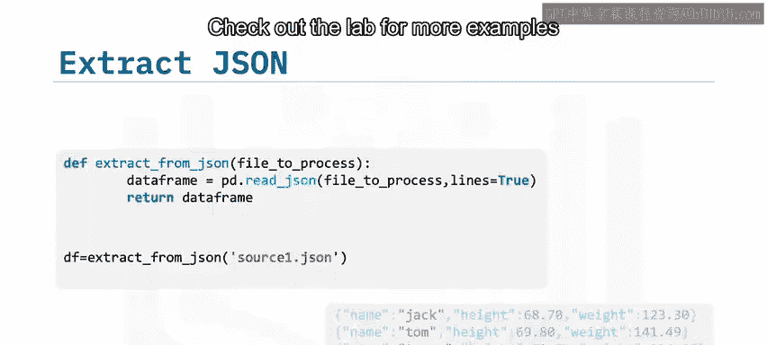

让我们看看提取CSV文件的过程。

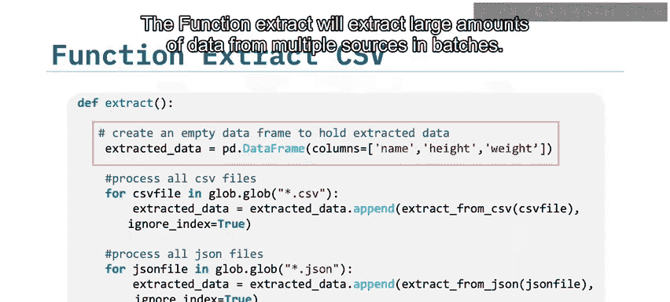

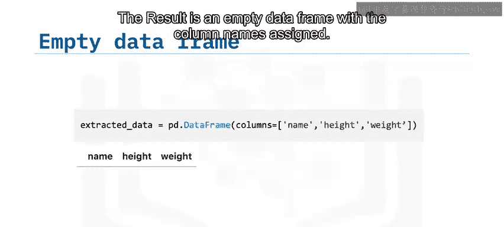

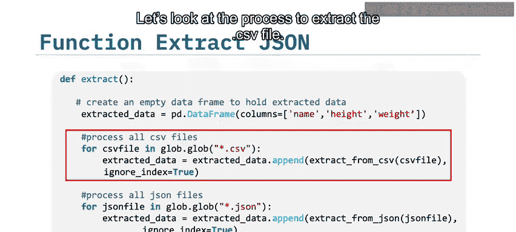

我们首先添加一个循环来查找所有CSV文件。这可以通过添加`glob`函数轻松实现。添加此函数后，它将查找并加载所有CSV文件名。在循环的每次迭代中，CSV文件被追加到数据框中。第一次迭代将被追加，然后是第二次迭代，从而生成提取的数据列表。我们稍后将回顾参数`ignore_index=True`。

这段代码将JSON文件追加到数据框中。让我们看看参数`ignore_index`如何设置索引顺序。每列都按追加到数据框的顺序设置索引。我们将查看输出提取的数据。

如果我们没有将参数`ignore_index`设置为`True`，那么数据框`extracted_data`的索引将与原始文件的行号相同。如果我们确实将`ignore_index`设置为`True`，那么每行的顺序将与行追加到数据框的顺序相同。

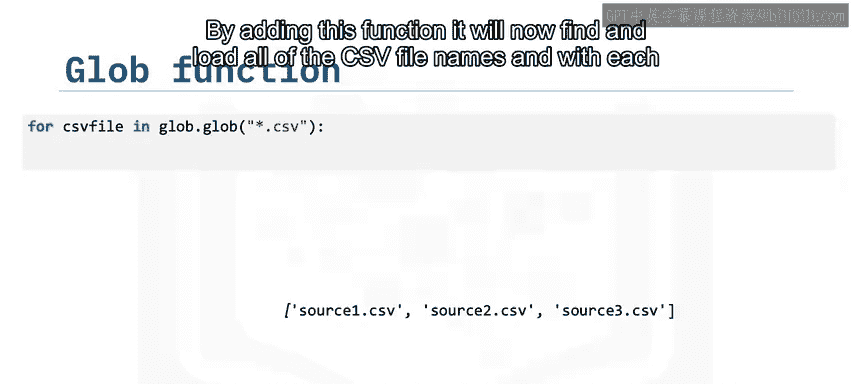


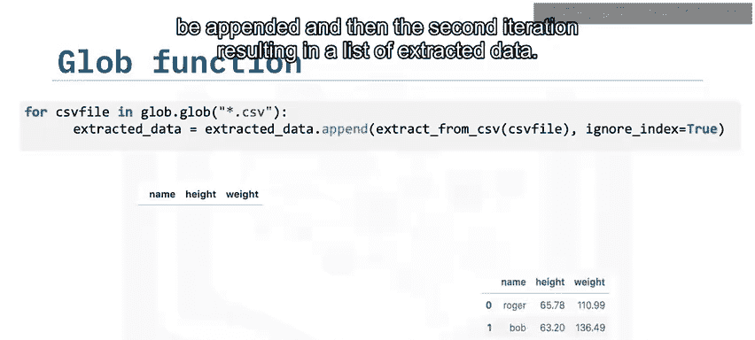

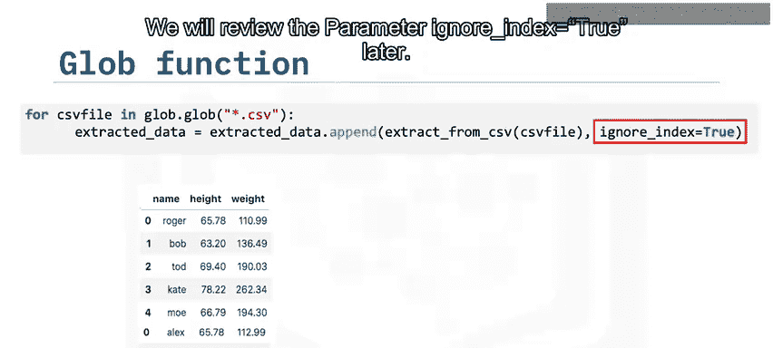

## 🔄 转换函数

既然我们已经收集了数据，流程的下一步就是转换它。此函数将列`height`从英寸转换为毫米，列`pounds`转换为千克，并在变量`data`中返回输出。让我们仔细看看。

在输入数据框中，列`height`以英尺为单位。我们对列应用以下操作，将其转换为米并四舍五入到两位小数。

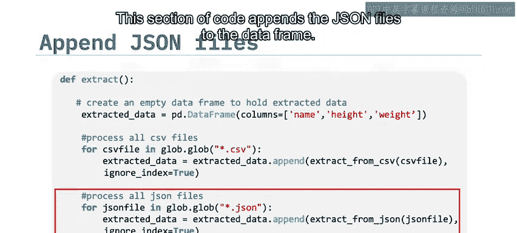


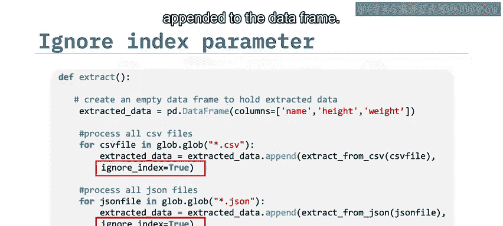

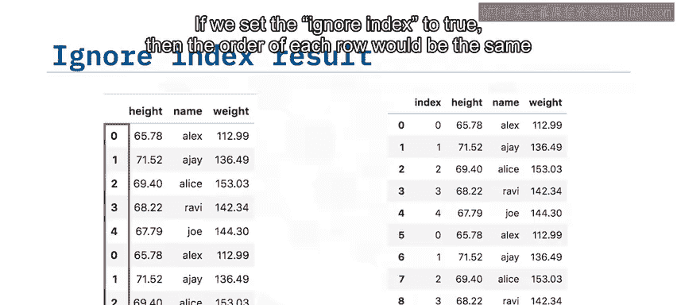

```python
data['height'] = round(data['height'] * 0.0254, 2)
```

结果数据框列`height`现在以米为单位，我们可以对体重执行相同操作。


## 📤 加载和日志记录

现在我们已经收集并定义了数据，是时候将其加载到目标文件中了。在这种情况下，我们将pandas数据框保存为CSV文件。


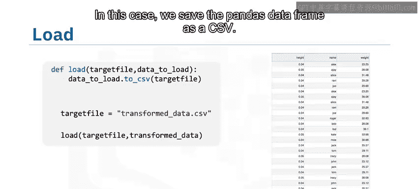

```python
data.to_csv(targetfile, index=False)
```

我们已经完成了从多个来源提取、转换和加载数据，并将其最终化为一个目标文件的过程。在完成任务之前，我们需要创建一个日志条目。为此，我们将创建一个日志记录函数。

首先创建一个名为`timestamp_format`的变量，它确定时间和日期的格式。接下来是`now`变量，它将通过调用`datetime`捕获当前时间。添加此内容后，导入了`datetime`以使其正常工作。然后，我们通过打开文件并将信息写入文件来汇总这些信息，加上`'a'`后，所有写入的数据都将追加到现有信息中。

通过创建这种类型的条目，我们能够为流程的每个部分附加时间戳，记录其开始和完成的时间。


## 🚀 运行ETL流程


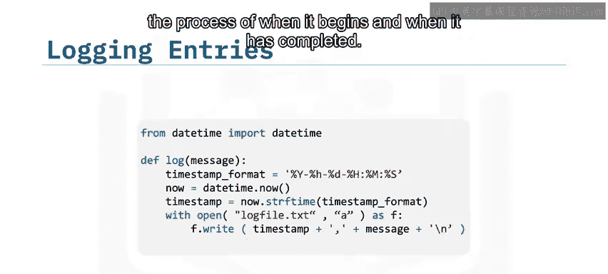

现在我们已经定义了在选定数据上运行ETL流程所需的所有代码，最后需要做的就是调用所有函数。我们首先调用`extract_data`函数。


```python
extracted_data = extract()
```

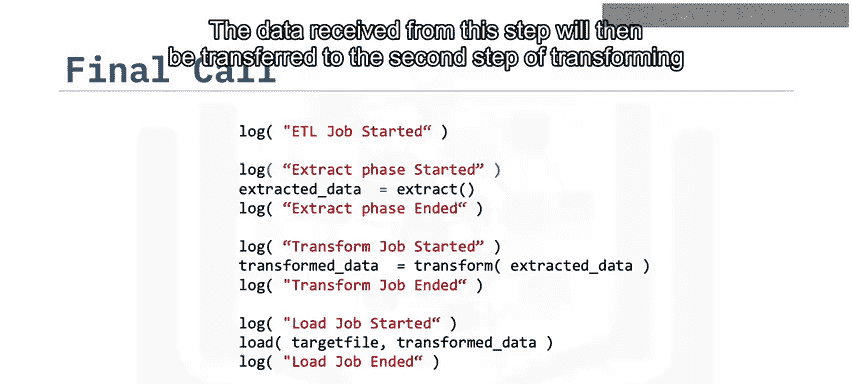

从此步骤接收的数据将转移到转换数据的第二步。完成后，数据将加载到目标文件中。此外，请注意，在每一步之前和之后，都添加了开始和完成的日期和时间。

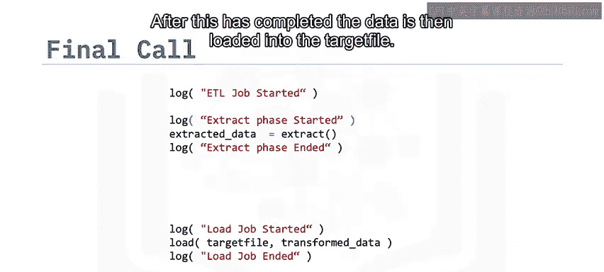

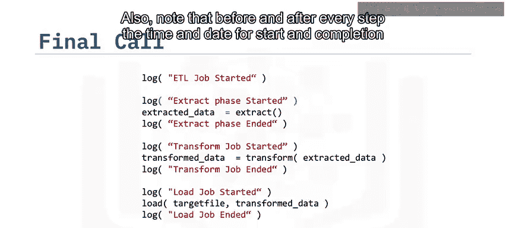

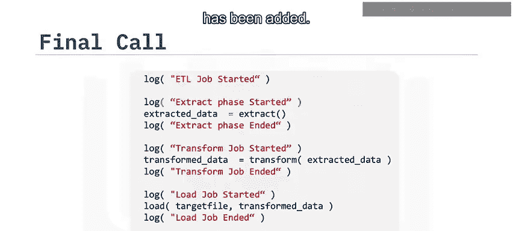

## 📝 总结

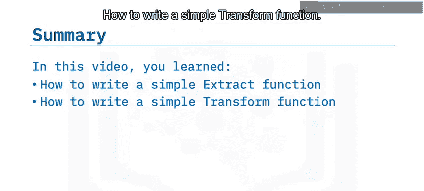


在本视频中，你学习了如何编写一个简单的提取函数、一个简单的转换函数、一个简单的加载函数以及一个简单的日志记录函数。请查看实验部分以获取更多信息。